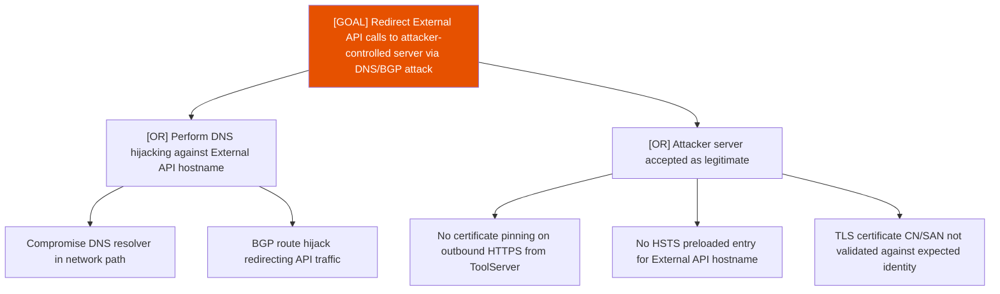

# Attack Tree: S-8 — External API

**Risk Level**: High
**Component**: External API
**Threat**: DNS hijacking/BGP redirect of External API calls to attacker-controlled server

```mermaid
graph TD
    Goal["[GOAL] Redirect External API calls to attacker-controlled server via DNS/BGP attack"]
    Goal --> A["[OR] Perform DNS hijacking against External API hostname"]
    A --> A1["Compromise DNS resolver in network path"]
    A --> A2["BGP route hijack redirecting API traffic"]
    Goal --> B["[OR] Attacker server accepted as legitimate"]
    B --> B1["No certificate pinning on outbound HTTPS from ToolServer"]
    B --> B2["No HSTS preloaded entry for External API hostname"]
    B --> B3["TLS certificate CN/SAN not validated against expected identity"]
    classDef high fill:#e65100,color:#fff
    class Goal high
```
