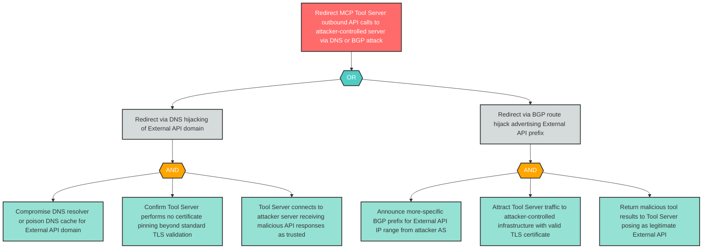

# Attack Tree: S-8 — DNS Hijacking or BGP Attack Redirects External API Calls to Attacker Server

**Finding ID**: S-8
**Risk Level**: High
**Component**: External API
**Delta Status**: UNCHANGED

```mermaid
flowchart TD
    S8_root["Redirect MCP Tool Server outbound API calls to attacker-controlled server via DNS or BGP attack"]
    S8_or1{{"OR"}}
    S8_sub1["Redirect via DNS hijacking of External API domain"]
    S8_sub2["Redirect via BGP route hijack advertising External API prefix"]
    S8_and1{{"AND"}}
    S8_leaf1["Compromise DNS resolver or poison DNS cache for External API domain"]
    S8_leaf2["Confirm Tool Server performs no certificate pinning beyond standard TLS validation"]
    S8_leaf3["Tool Server connects to attacker server receiving malicious API responses as trusted"]
    S8_and2{{"AND"}}
    S8_leaf4["Announce more-specific BGP prefix for External API IP range from attacker AS"]
    S8_leaf5["Attract Tool Server traffic to attacker-controlled infrastructure with valid TLS certificate"]
    S8_leaf6["Return malicious tool results to Tool Server posing as legitimate External API"]

    S8_root --> S8_or1
    S8_or1 --> S8_sub1
    S8_or1 --> S8_sub2
    S8_sub1 --> S8_and1
    S8_and1 --> S8_leaf1
    S8_and1 --> S8_leaf2
    S8_and1 --> S8_leaf3
    S8_sub2 --> S8_and2
    S8_and2 --> S8_leaf4
    S8_and2 --> S8_leaf5
    S8_and2 --> S8_leaf6

    classDef goal fill:#ff6b6b,stroke:#333,stroke-width:2px,color:#fff
    classDef andGate fill:#ffa500,stroke:#333,stroke-width:2px,color:#fff
    classDef orGate fill:#4ecdc4,stroke:#333,stroke-width:2px,color:#fff
    classDef subGoal fill:#d5dbdb,stroke:#333,stroke-width:2px,color:#333
    classDef leaf fill:#95e1d3,stroke:#333,stroke-width:2px,color:#333

    class S8_root goal
    class S8_or1 orGate
    class S8_and1,S8_and2 andGate
    class S8_sub1,S8_sub2 subGoal
    class S8_leaf1,S8_leaf2,S8_leaf3,S8_leaf4,S8_leaf5,S8_leaf6 leaf
```
