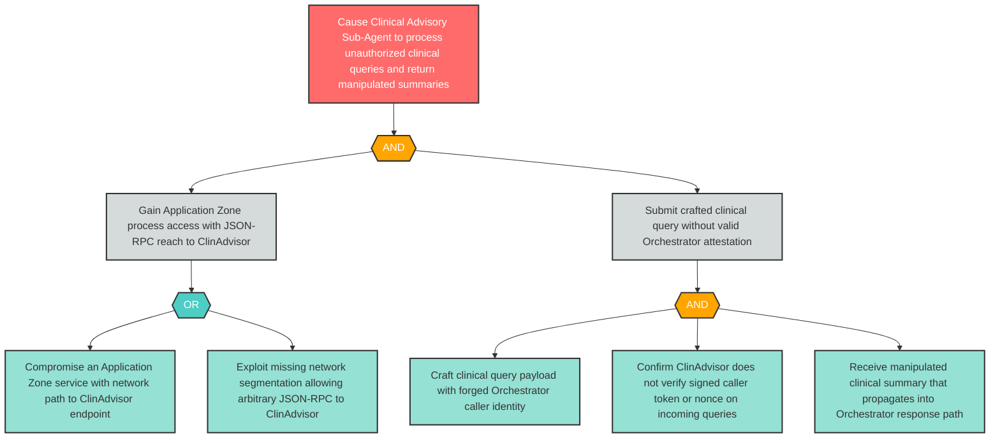

# Attack Tree: S-9 — Rogue Process Injects Crafted Clinical Queries Impersonating Orchestrator

**Finding ID**: S-9
**Risk Level**: Critical
**Component**: Clinical Advisory Sub-Agent
**Delta Status**: UNCHANGED

