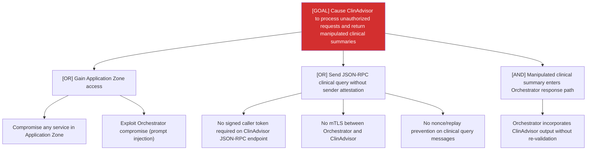

# Attack Tree: S-9 — Clinical Advisory Sub-Agent

**Risk Level**: Critical
**Component**: Clinical Advisory Sub-Agent
**Threat**: Rogue process injects crafted clinical queries impersonating Orchestrator

