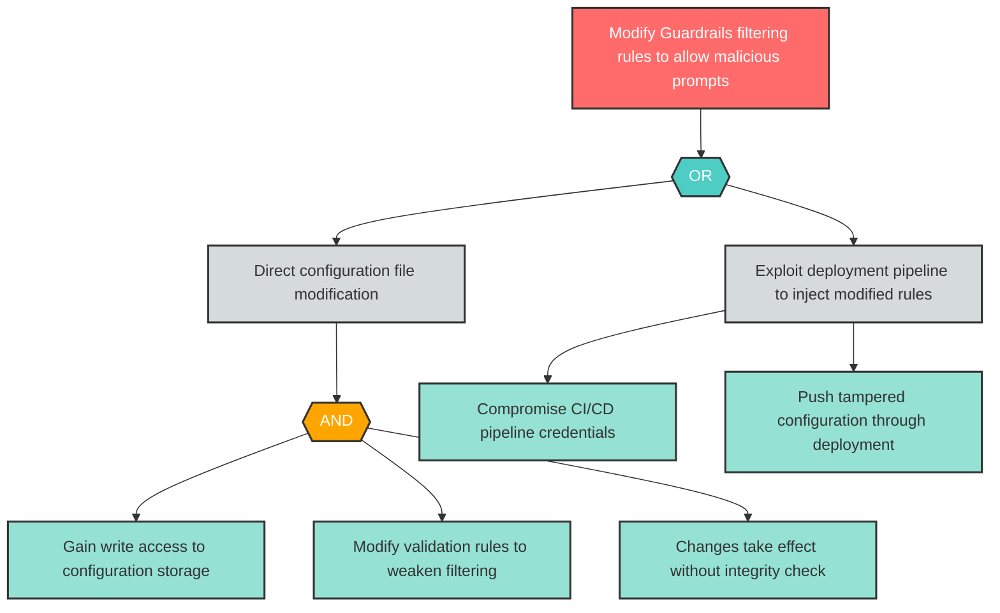

# Attack Tree: T-1 -- Guardrails Configuration Tampering

| Field | Value |
|-------|-------|
| Finding ID | T-1 |
| Component | Guardrails Service |
| Risk Level | High |
| Threat | Guardrails Configuration Tampering |
| Correlation | None |

