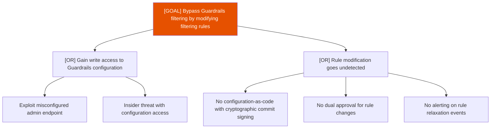

# Attack Tree: T-1 — Guardrails Service

**Risk Level**: High
**Component**: Guardrails Service
**Threat**: Filtering rule modification allows blocked prompts through

```mermaid
graph TD
    Goal["[GOAL] Bypass Guardrails filtering by modifying filtering rules"]
    Goal --> A["[OR] Gain write access to Guardrails configuration"]
    A --> A1["Exploit misconfigured admin endpoint"]
    A --> A2["Insider threat with configuration access"]
    Goal --> B["[OR] Rule modification goes undetected"]
    B --> B1["No configuration-as-code with cryptographic commit signing"]
    B --> B2["No dual approval for rule changes"]
    B --> B3["No alerting on rule relaxation events"]
    classDef high fill:#e65100,color:#fff
    class Goal high
```
