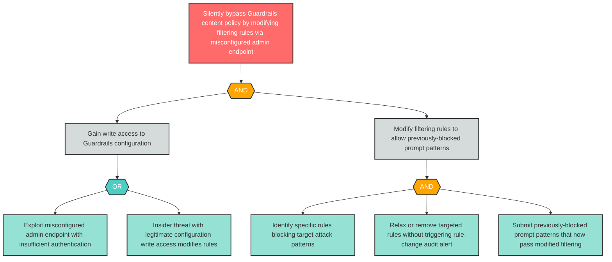

# Attack Tree: T-1 — Guardrails Filtering Rules Modified to Allow Blocked Prompt Patterns

**Finding ID**: T-1
**Risk Level**: High
**Component**: Guardrails Service
**Delta Status**: UNCHANGED

```mermaid
flowchart TD
    T1_root["Silently bypass Guardrails content policy by modifying filtering rules via misconfigured admin endpoint"]
    T1_and1{{"AND"}}
    T1_sub1["Gain write access to Guardrails configuration"]
    T1_sub2["Modify filtering rules to allow previously-blocked prompt patterns"]
    T1_or1{{"OR"}}
    T1_leaf1["Exploit misconfigured admin endpoint with insufficient authentication"]
    T1_leaf2["Insider threat with legitimate configuration write access modifies rules"]
    T1_and2{{"AND"}}
    T1_leaf3["Identify specific rules blocking target attack patterns"]
    T1_leaf4["Relax or remove targeted rules without triggering rule-change audit alert"]
    T1_leaf5["Submit previously-blocked prompt patterns that now pass modified filtering"]

    T1_root --> T1_and1
    T1_and1 --> T1_sub1
    T1_and1 --> T1_sub2
    T1_sub1 --> T1_or1
    T1_or1 --> T1_leaf1
    T1_or1 --> T1_leaf2
    T1_sub2 --> T1_and2
    T1_and2 --> T1_leaf3
    T1_and2 --> T1_leaf4
    T1_and2 --> T1_leaf5

    classDef goal fill:#ff6b6b,stroke:#333,stroke-width:2px,color:#fff
    classDef andGate fill:#ffa500,stroke:#333,stroke-width:2px,color:#fff
    classDef orGate fill:#4ecdc4,stroke:#333,stroke-width:2px,color:#fff
    classDef subGoal fill:#d5dbdb,stroke:#333,stroke-width:2px,color:#333
    classDef leaf fill:#95e1d3,stroke:#333,stroke-width:2px,color:#333

    class T1_root goal
    class T1_and1,T1_and2 andGate
    class T1_or1 orGate
    class T1_sub1,T1_sub2 subGoal
    class T1_leaf1,T1_leaf2,T1_leaf3,T1_leaf4,T1_leaf5 leaf
```
