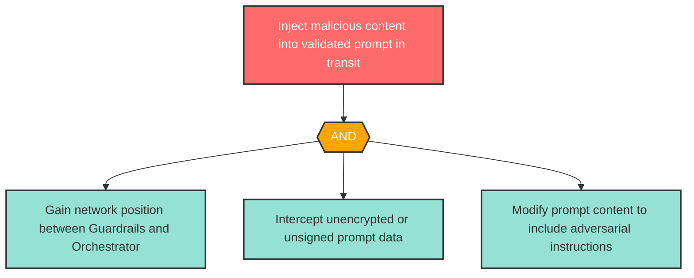

# Attack Tree: T-2 -- Prompt Tampering in Transit

| Field | Value |
|-------|-------|
| Finding ID | T-2 |
| Component | LLM Agent Orchestrator |
| Risk Level | High |
| Threat | Prompt Tampering in Transit |
| Correlation | None |

