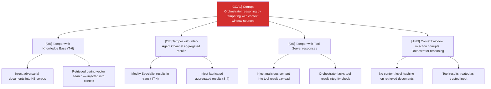

# Attack Tree: T-2 — LLM Agent Orchestrator

**Risk Level**: Critical
**Component**: LLM Agent Orchestrator
**Threat**: Context window manipulation via upstream data source tampering

```mermaid
graph TD
    Goal["[GOAL] Corrupt Orchestrator reasoning by tampering with context window sources"]
    Goal --> A["[OR] Tamper with Knowledge Base (T-6)"]
    A --> A1["Inject adversarial documents into KB corpus"]
    A --> A2["Retrieved during vector search — injected into context"]
    Goal --> B["[OR] Tamper with Inter-Agent Channel aggregated results"]
    B --> B1["Modify Specialist results in transit (T-4)"]
    B --> B2["Inject fabricated aggregated results (S-4)"]
    Goal --> C["[OR] Tamper with Tool Server responses"]
    C --> C1["Inject malicious content into tool result payload"]
    C --> C2["Orchestrator lacks tool result integrity check"]
    Goal --> D["[AND] Context window injection corrupts Orchestrator reasoning"]
    D --> D1["No content-level hashing on retrieved documents"]
    D --> D2["Tool results treated as trusted input"]
    classDef critical fill:#d32f2f,color:#fff
    class Goal critical
```
