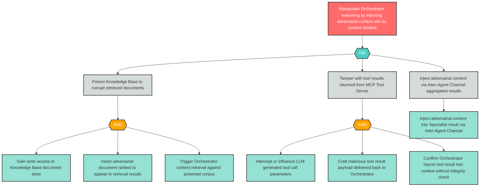

# Attack Tree: T-2 — Orchestrator Context Window Tampered via Upstream Data Source

**Finding ID**: T-2
**Risk Level**: Critical
**Component**: LLM Agent Orchestrator
**Delta Status**: UNCHANGED

```mermaid
flowchart TD
    T2_root["Manipulate Orchestrator reasoning by injecting adversarial content into its context window"]
    T2_or1{{"OR"}}
    T2_sub1["Poison Knowledge Base to corrupt retrieved documents"]
    T2_sub2["Tamper with tool results returned from MCP Tool Server"]
    T2_sub3["Inject adversarial content via Inter-Agent Channel aggregated results"]
    T2_and1{{"AND"}}
    T2_leaf1["Gain write access to Knowledge Base document store"]
    T2_leaf2["Insert adversarial document ranked to appear in retrieval results"]
    T2_leaf3["Trigger Orchestrator context retrieval against poisoned corpus"]
    T2_and2{{"AND"}}
    T2_leaf4["Intercept or influence LLM-generated tool call parameters"]
    T2_leaf5["Craft malicious tool result payload delivered back to Orchestrator"]
    T2_leaf6["Confirm Orchestrator injects tool result into context without integrity check"]
    T2_leaf7["Inject adversarial content into Specialist result via Inter-Agent Channel"]

    T2_root --> T2_or1
    T2_or1 --> T2_sub1
    T2_or1 --> T2_sub2
    T2_or1 --> T2_sub3
    T2_sub1 --> T2_and1
    T2_and1 --> T2_leaf1
    T2_and1 --> T2_leaf2
    T2_and1 --> T2_leaf3
    T2_sub2 --> T2_and2
    T2_and2 --> T2_leaf4
    T2_and2 --> T2_leaf5
    T2_and2 --> T2_leaf6
    T2_sub3 --> T2_leaf7

    classDef goal fill:#ff6b6b,stroke:#333,stroke-width:2px,color:#fff
    classDef andGate fill:#ffa500,stroke:#333,stroke-width:2px,color:#fff
    classDef orGate fill:#4ecdc4,stroke:#333,stroke-width:2px,color:#fff
    classDef subGoal fill:#d5dbdb,stroke:#333,stroke-width:2px,color:#333
    classDef leaf fill:#95e1d3,stroke:#333,stroke-width:2px,color:#333

    class T2_root goal
    class T2_or1 orGate
    class T2_and1,T2_and2 andGate
    class T2_sub1,T2_sub2,T2_sub3 subGoal
    class T2_leaf1,T2_leaf2,T2_leaf3,T2_leaf4,T2_leaf5,T2_leaf6,T2_leaf7 leaf
```
