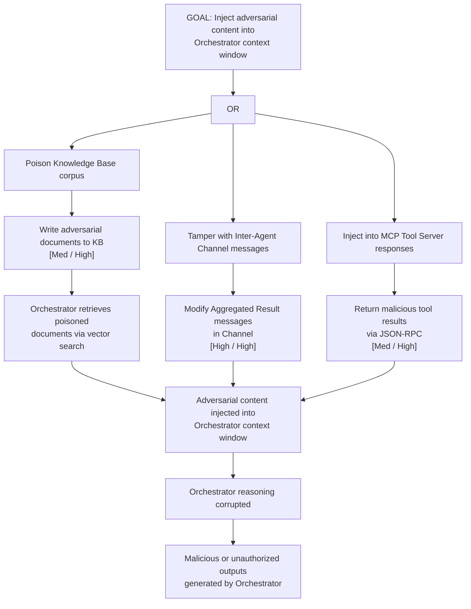

# Attack Tree: T-2 — LLM Agent Orchestrator Context Window Tampering

**Chain-breaking control**: Validate the integrity of all context sources before injecting into the Orchestrator's context window. Apply content-level hashing to retrieved documents at KB read time. Treat tool results as untrusted input and apply output encoding before context injection.
