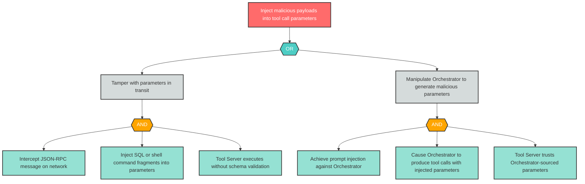

# Attack Tree: T-3 -- JSON-RPC Parameter Injection

| Field | Value |
|-------|-------|
| Finding ID | T-3 |
| Component | MCP Tool Server |
| Risk Level | Critical |
| Threat | JSON-RPC Parameter Injection |
| Correlation | None |

