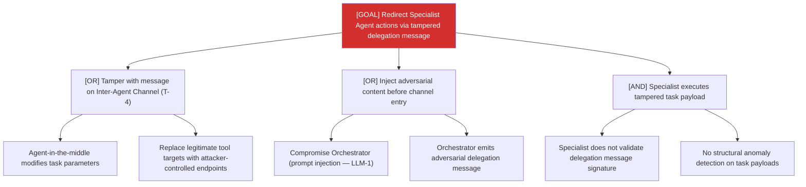

# Attack Tree: T-3 — Specialist Agent

**Risk Level**: Critical
**Component**: Specialist Agent
**Threat**: Adversarial delegation message payload redirects Specialist actions

```mermaid
graph TD
    Goal["[GOAL] Redirect Specialist Agent actions via tampered delegation message"]
    Goal --> A["[OR] Tamper with message on Inter-Agent Channel (T-4)"]
    A --> A1["Agent-in-the-middle modifies task parameters"]
    A --> A2["Replace legitimate tool targets with attacker-controlled endpoints"]
    Goal --> B["[OR] Inject adversarial content before channel entry"]
    B --> B1["Compromise Orchestrator (prompt injection — LLM-1)"]
    B --> B2["Orchestrator emits adversarial delegation message"]
    Goal --> C["[AND] Specialist executes tampered task payload"]
    C --> C1["Specialist does not validate delegation message signature"]
    C --> C2["No structural anomaly detection on task payloads"]
    classDef critical fill:#d32f2f,color:#fff
    class Goal critical
```
