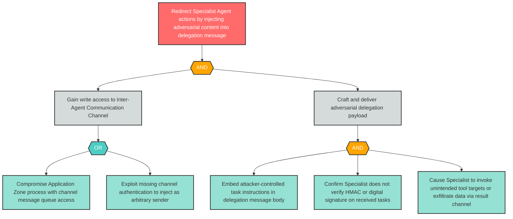

# Attack Tree: T-3 — Specialist Agent Context Tampered via Adversarial Delegation Message

**Finding ID**: T-3
**Risk Level**: Critical
**Component**: Specialist Agent
**Delta Status**: UNCHANGED

```mermaid
flowchart TD
    T3_root["Redirect Specialist Agent actions by injecting adversarial content into delegation message"]
    T3_and1{{"AND"}}
    T3_sub1["Gain write access to Inter-Agent Communication Channel"]
    T3_sub2["Craft and deliver adversarial delegation payload"]
    T3_or1{{"OR"}}
    T3_leaf1["Compromise Application Zone process with channel message queue access"]
    T3_leaf2["Exploit missing channel authentication to inject as arbitrary sender"]
    T3_and2{{"AND"}}
    T3_leaf3["Embed attacker-controlled task instructions in delegation message body"]
    T3_leaf4["Confirm Specialist does not verify HMAC or digital signature on received tasks"]
    T3_leaf5["Cause Specialist to invoke unintended tool targets or exfiltrate data via result channel"]

    T3_root --> T3_and1
    T3_and1 --> T3_sub1
    T3_and1 --> T3_sub2
    T3_sub1 --> T3_or1
    T3_or1 --> T3_leaf1
    T3_or1 --> T3_leaf2
    T3_sub2 --> T3_and2
    T3_and2 --> T3_leaf3
    T3_and2 --> T3_leaf4
    T3_and2 --> T3_leaf5

    classDef goal fill:#ff6b6b,stroke:#333,stroke-width:2px,color:#fff
    classDef andGate fill:#ffa500,stroke:#333,stroke-width:2px,color:#fff
    classDef orGate fill:#4ecdc4,stroke:#333,stroke-width:2px,color:#fff
    classDef subGoal fill:#d5dbdb,stroke:#333,stroke-width:2px,color:#333
    classDef leaf fill:#95e1d3,stroke:#333,stroke-width:2px,color:#333

    class T3_root goal
    class T3_and1,T3_and2 andGate
    class T3_or1 orGate
    class T3_sub1,T3_sub2 subGoal
    class T3_leaf1,T3_leaf2,T3_leaf3,T3_leaf4,T3_leaf5 leaf
```
