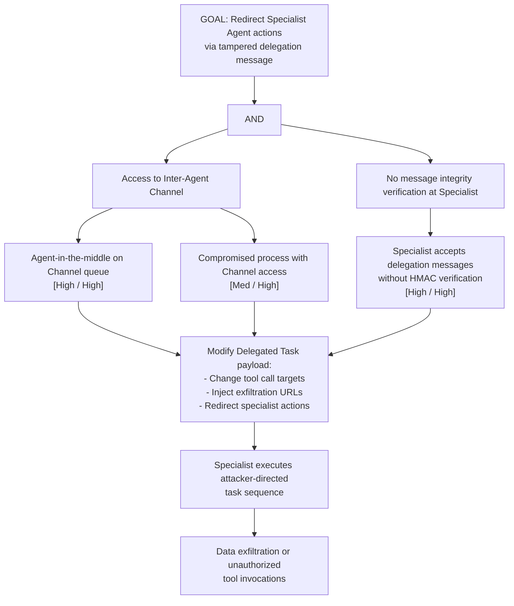

# Attack Tree: T-3 — Specialist Agent Delegation Message Tampering

**Chain-breaking control**: Validate and sanitize all task payloads received by the Specialist Agent before execution. Apply message integrity verification (HMAC or digital signature) on every received delegation message. Reject tasks containing unexpected structural patterns.
