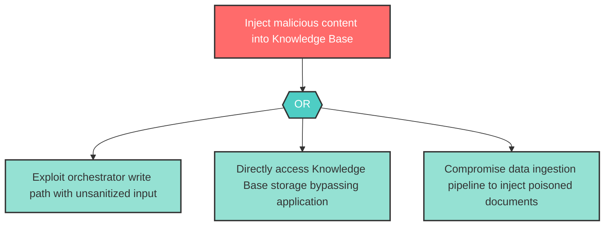

# Attack Tree: T-4 -- Knowledge Base Content Poisoning

| Field | Value |
|-------|-------|
| Finding ID | T-4 |
| Component | Knowledge Base |
| Risk Level | High |
| Threat | Knowledge Base Content Poisoning |
| Correlation | CG-1 (See also: LLM-2) |

