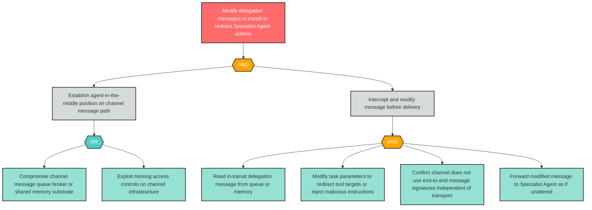

# Attack Tree: T-4 — Agent-in-the-Middle Modifies Delegation Messages in Transit

**Finding ID**: T-4
**Risk Level**: Critical
**Component**: Inter-Agent Communication Channel
**Delta Status**: UNCHANGED

