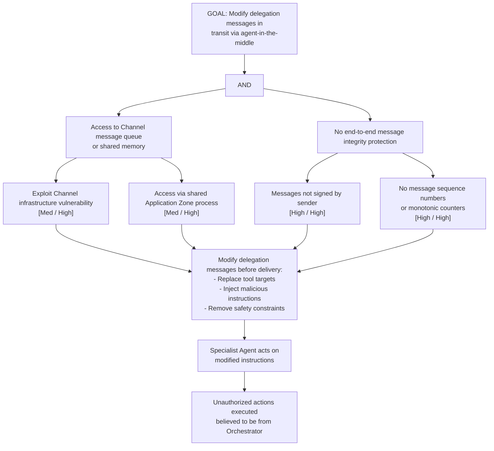

# Attack Tree: T-4 — Inter-Agent Channel Message Tampering

**Chain-breaking control**: Apply end-to-end message integrity protection (digital signatures) at the channel layer. Messages MUST be signed by the sender and verified by the receiver independently of the channel's transport security. Use message sequence numbers and monotonic counters.
