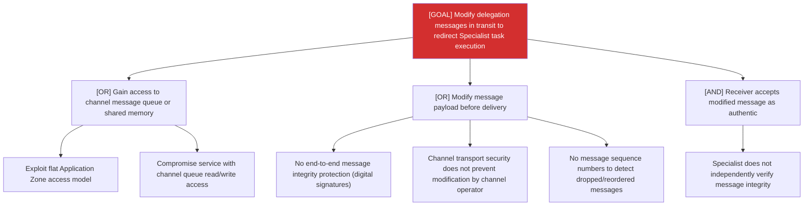

# Attack Tree: T-4 — Inter-Agent Communication Channel

**Risk Level**: Critical
**Component**: Inter-Agent Communication Channel
**Threat**: Agent-in-the-middle modifies delegation messages in transit

