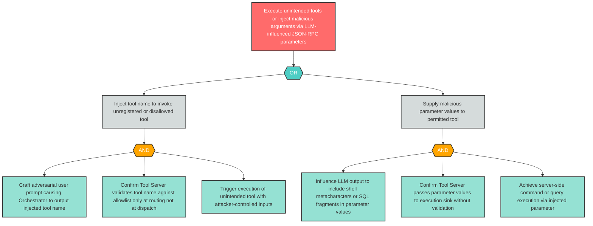

# Attack Tree: T-5 — LLM-Generated Tool Parameters Bypass Allowlist to Achieve Injection

**Finding ID**: T-5
**Risk Level**: Critical
**Component**: MCP Tool Server
**Delta Status**: UNCHANGED

```mermaid
flowchart TD
    T5_root["Execute unintended tools or inject malicious arguments via LLM-influenced JSON-RPC parameters"]
    T5_or1{{"OR"}}
    T5_sub1["Inject tool name to invoke unregistered or disallowed tool"]
    T5_sub2["Supply malicious parameter values to permitted tool"]
    T5_and1{{"AND"}}
    T5_leaf1["Craft adversarial user prompt causing Orchestrator to output injected tool name"]
    T5_leaf2["Confirm Tool Server validates tool name against allowlist only at routing not at dispatch"]
    T5_leaf3["Trigger execution of unintended tool with attacker-controlled inputs"]
    T5_and2{{"AND"}}
    T5_leaf4["Influence LLM output to include shell metacharacters or SQL fragments in parameter values"]
    T5_leaf5["Confirm Tool Server passes parameter values to execution sink without validation"]
    T5_leaf6["Achieve server-side command or query execution via injected parameter"]

    T5_root --> T5_or1
    T5_or1 --> T5_sub1
    T5_or1 --> T5_sub2
    T5_sub1 --> T5_and1
    T5_and1 --> T5_leaf1
    T5_and1 --> T5_leaf2
    T5_and1 --> T5_leaf3
    T5_sub2 --> T5_and2
    T5_and2 --> T5_leaf4
    T5_and2 --> T5_leaf5
    T5_and2 --> T5_leaf6

    classDef goal fill:#ff6b6b,stroke:#333,stroke-width:2px,color:#fff
    classDef andGate fill:#ffa500,stroke:#333,stroke-width:2px,color:#fff
    classDef orGate fill:#4ecdc4,stroke:#333,stroke-width:2px,color:#fff
    classDef subGoal fill:#d5dbdb,stroke:#333,stroke-width:2px,color:#333
    classDef leaf fill:#95e1d3,stroke:#333,stroke-width:2px,color:#333

    class T5_root goal
    class T5_or1 orGate
    class T5_and1,T5_and2 andGate
    class T5_sub1,T5_sub2 subGoal
    class T5_leaf1,T5_leaf2,T5_leaf3,T5_leaf4,T5_leaf5,T5_leaf6 leaf
```
