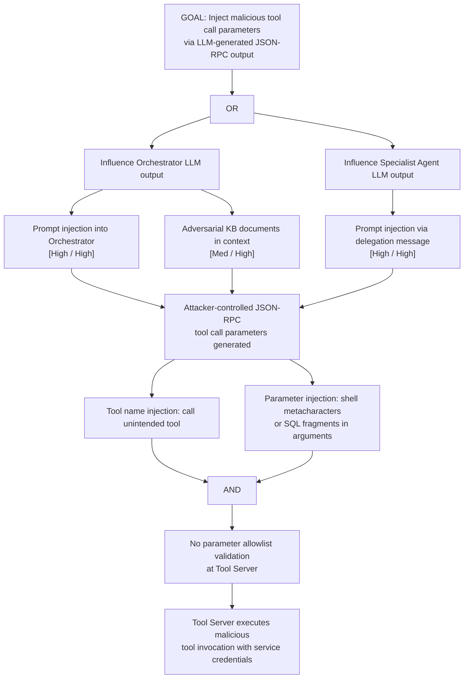

# Attack Tree: T-5 — MCP Tool Server Parameter Injection

**Chain-breaking control**: Implement strict parameter validation on all JSON-RPC tool invocations: validate parameter types, enforce allowlisted values for enumerable parameters, and reject any request containing metacharacters or unexpected structural elements.
