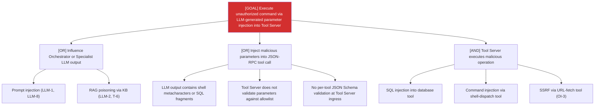

# Attack Tree: T-5 — MCP Tool Server

**Risk Level**: Critical
**Component**: MCP Tool Server
**Threat**: LLM-generated tool parameters bypass validation and inject into execution

```mermaid
graph TD
    Goal["[GOAL] Execute unauthorized command via LLM-generated parameter injection into Tool Server"]
    Goal --> A["[OR] Influence Orchestrator or Specialist LLM output"]
    A --> A1["Prompt injection (LLM-1, LLM-8)"]
    A --> A2["RAG poisoning via KB (LLM-2, T-6)"]
    Goal --> B["[OR] Inject malicious parameters into JSON-RPC tool call"]
    B --> B1["LLM output contains shell metacharacters or SQL fragments"]
    B --> B2["Tool Server does not validate parameters against allowlist"]
    B --> B3["No per-tool JSON Schema validation at Tool Server ingress"]
    Goal --> C["[AND] Tool Server executes malicious operation"]
    C --> C1["SQL injection into database tool"]
    C --> C2["Command injection via shell-dispatch tool"]
    C --> C3["SSRF via URL-fetch tool (OI-3)"]
    classDef critical fill:#d32f2f,color:#fff
    class Goal critical
```
