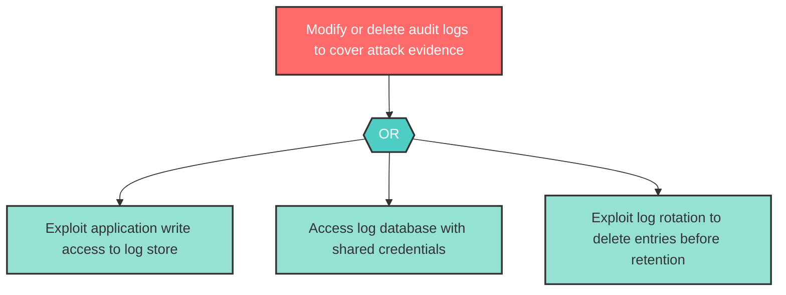

# Attack Tree: T-5 -- Audit Log Tampering

| Field | Value |
|-------|-------|
| Finding ID | T-5 |
| Component | Audit Logger |
| Risk Level | High |
| Threat | Audit Log Tampering |
| Correlation | None |

