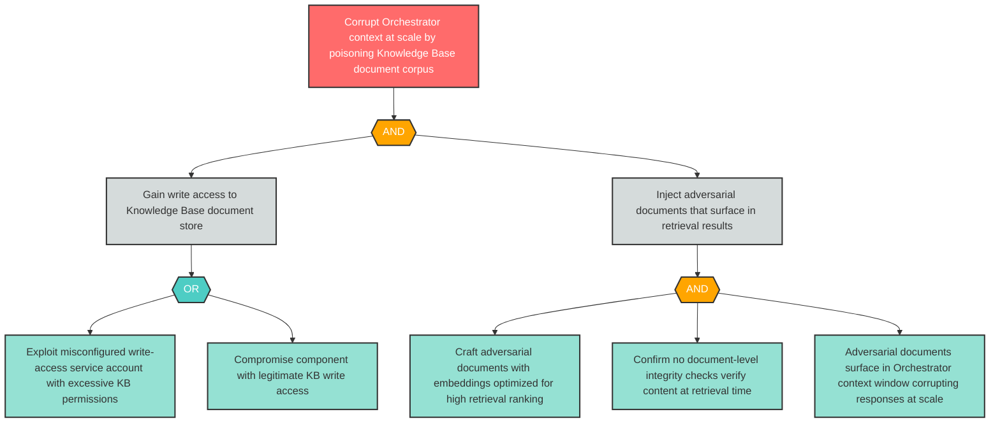

# Attack Tree: T-6 — Knowledge Base Corpus Poisoned via Unauthorized Write Access

**Finding ID**: T-6
**Risk Level**: High
**Component**: Knowledge Base
**Delta Status**: UNCHANGED

```mermaid
flowchart TD
    T6_root["Corrupt Orchestrator context at scale by poisoning Knowledge Base document corpus"]
    T6_and1{{"AND"}}
    T6_sub1["Gain write access to Knowledge Base document store"]
    T6_sub2["Inject adversarial documents that surface in retrieval results"]
    T6_or1{{"OR"}}
    T6_leaf1["Exploit misconfigured write-access service account with excessive KB permissions"]
    T6_leaf2["Compromise component with legitimate KB write access"]
    T6_and2{{"AND"}}
    T6_leaf3["Craft adversarial documents with embeddings optimized for high retrieval ranking"]
    T6_leaf4["Confirm no document-level integrity checks verify content at retrieval time"]
    T6_leaf5["Adversarial documents surface in Orchestrator context window corrupting responses at scale"]

    T6_root --> T6_and1
    T6_and1 --> T6_sub1
    T6_and1 --> T6_sub2
    T6_sub1 --> T6_or1
    T6_or1 --> T6_leaf1
    T6_or1 --> T6_leaf2
    T6_sub2 --> T6_and2
    T6_and2 --> T6_leaf3
    T6_and2 --> T6_leaf4
    T6_and2 --> T6_leaf5

    classDef goal fill:#ff6b6b,stroke:#333,stroke-width:2px,color:#fff
    classDef andGate fill:#ffa500,stroke:#333,stroke-width:2px,color:#fff
    classDef orGate fill:#4ecdc4,stroke:#333,stroke-width:2px,color:#fff
    classDef subGoal fill:#d5dbdb,stroke:#333,stroke-width:2px,color:#333
    classDef leaf fill:#95e1d3,stroke:#333,stroke-width:2px,color:#333

    class T6_root goal
    class T6_and1,T6_and2 andGate
    class T6_or1 orGate
    class T6_sub1,T6_sub2 subGoal
    class T6_leaf1,T6_leaf2,T6_leaf3,T6_leaf4,T6_leaf5 leaf
```
