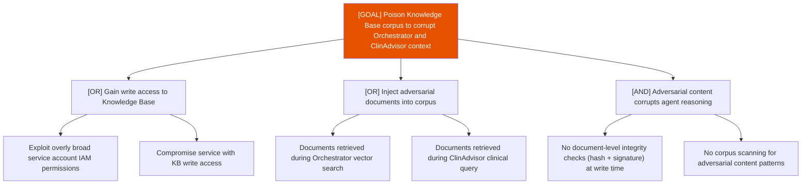

# Attack Tree: T-6 — Knowledge Base

**Risk Level**: High
**Component**: Knowledge Base
**Threat**: KB corpus poisoning via unauthorized write access

```mermaid
graph TD
    Goal["[GOAL] Poison Knowledge Base corpus to corrupt Orchestrator and ClinAdvisor context"]
    Goal --> A["[OR] Gain write access to Knowledge Base"]
    A --> A1["Exploit overly broad service account IAM permissions"]
    A --> A2["Compromise service with KB write access"]
    Goal --> B["[OR] Inject adversarial documents into corpus"]
    B --> B1["Documents retrieved during Orchestrator vector search"]
    B --> B2["Documents retrieved during ClinAdvisor clinical query"]
    Goal --> C["[AND] Adversarial content corrupts agent reasoning"]
    C --> C1["No document-level integrity checks (hash + signature) at write time"]
    C --> C2["No corpus scanning for adversarial content patterns"]
    classDef high fill:#e65100,color:#fff
    class Goal high
```
