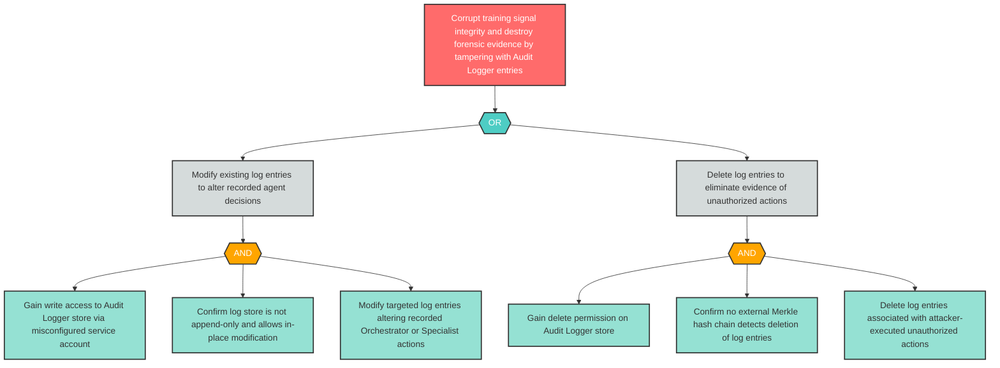

# Attack Tree: T-7 — Audit Log Tampering Destroys Training Signal Integrity and Forensic Evidence

**Finding ID**: T-7
**Risk Level**: High
**Component**: Audit Logger
**Delta Status**: UNCHANGED

```mermaid
flowchart TD
    T7_root["Corrupt training signal integrity and destroy forensic evidence by tampering with Audit Logger entries"]
    T7_or1{{"OR"}}
    T7_sub1["Modify existing log entries to alter recorded agent decisions"]
    T7_sub2["Delete log entries to eliminate evidence of unauthorized actions"]
    T7_and1{{"AND"}}
    T7_leaf1["Gain write access to Audit Logger store via misconfigured service account"]
    T7_leaf2["Confirm log store is not append-only and allows in-place modification"]
    T7_leaf3["Modify targeted log entries altering recorded Orchestrator or Specialist actions"]
    T7_and2{{"AND"}}
    T7_leaf4["Gain delete permission on Audit Logger store"]
    T7_leaf5["Confirm no external Merkle hash chain detects deletion of log entries"]
    T7_leaf6["Delete log entries associated with attacker-executed unauthorized actions"]

    T7_root --> T7_or1
    T7_or1 --> T7_sub1
    T7_or1 --> T7_sub2
    T7_sub1 --> T7_and1
    T7_and1 --> T7_leaf1
    T7_and1 --> T7_leaf2
    T7_and1 --> T7_leaf3
    T7_sub2 --> T7_and2
    T7_and2 --> T7_leaf4
    T7_and2 --> T7_leaf5
    T7_and2 --> T7_leaf6

    classDef goal fill:#ff6b6b,stroke:#333,stroke-width:2px,color:#fff
    classDef andGate fill:#ffa500,stroke:#333,stroke-width:2px,color:#fff
    classDef orGate fill:#4ecdc4,stroke:#333,stroke-width:2px,color:#fff
    classDef subGoal fill:#d5dbdb,stroke:#333,stroke-width:2px,color:#333
    classDef leaf fill:#95e1d3,stroke:#333,stroke-width:2px,color:#333

    class T7_root goal
    class T7_or1 orGate
    class T7_and1,T7_and2 andGate
    class T7_sub1,T7_sub2 subGoal
    class T7_leaf1,T7_leaf2,T7_leaf3,T7_leaf4,T7_leaf5,T7_leaf6 leaf
```
