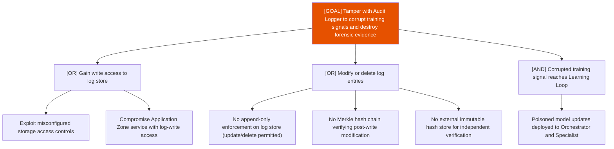

# Attack Tree: T-7 — Audit Logger

**Risk Level**: High
**Component**: Audit Logger
**Threat**: Audit log tampering destroys training signal integrity and forensic evidence

```mermaid
graph TD
    Goal["[GOAL] Tamper with Audit Logger to corrupt training signals and destroy forensic evidence"]
    Goal --> A["[OR] Gain write access to log store"]
    A --> A1["Exploit misconfigured storage access controls"]
    A --> A2["Compromise Application Zone service with log-write access"]
    Goal --> B["[OR] Modify or delete log entries"]
    B --> B1["No append-only enforcement on log store (update/delete permitted)"]
    B --> B2["No Merkle hash chain verifying post-write modification"]
    B --> B3["No external immutable hash store for independent verification"]
    Goal --> C["[AND] Corrupted training signal reaches Learning Loop"]
    C --> C1["Poisoned model updates deployed to Orchestrator and Specialist"]
    classDef high fill:#e65100,color:#fff
    class Goal high
```
