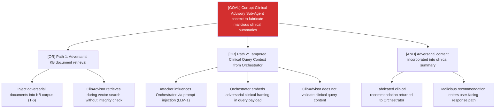

# Attack Tree: T-9 — Clinical Advisory Sub-Agent

**Risk Level**: Critical
**Component**: Clinical Advisory Sub-Agent
**Threat**: Dual-path context window poisoning via KB and clinical query payload

