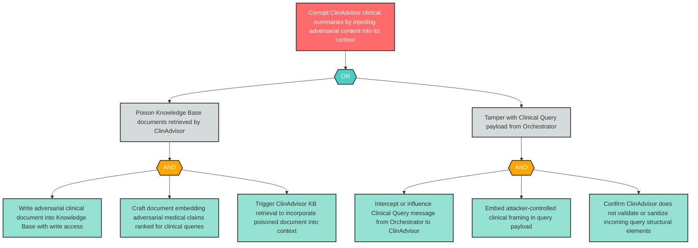

# Attack Tree: T-9 — ClinAdvisor Context Window Tampered via Adversarial KB Documents or Poisoned Query

**Finding ID**: T-9
**Risk Level**: Critical
**Component**: Clinical Advisory Sub-Agent
**Delta Status**: UNCHANGED

