# Threat Report — Agentic AI Application (F-3 Wave 3)

```yaml
---
schema_version: "1.1"
date: "2026-04-26"
source_file: "examples/agentic-app/test-output/2026-04-26T03-39-12-F3-wave3/threats.md"
finding_count: 84
risk_distribution:
  critical: 58
  high: 22
  medium: 4
  low: 0
attack_tree_count: 27
baseline_source: "examples/agentic-app/test-output/2026-04-23T19-30-00-F2-wave4/threats.md"
baseline_date: "2026-04-23"
delta_counts:
  new: 1
  unchanged: 83
  updated: 0
  resolved: 0
---
```

---

## 1. Executive Summary

The Agentic AI Application threat model (Feature 219, F-3 Wave 3) surfaces **84 findings** across STRIDE (Spoofing, Tampering, Repudiation, Information Disclosure, Denial of Service, Elevation of Privilege), Agentic (AG), LLM, Output Integrity (OI), and Misinformation (MI) threat categories. The risk posture is severe: **58 findings are Critical** (69%), **22 are High** (26%), and only 4 are Medium. No Low or Informational findings were identified. This run introduces **one net-new Critical finding** — AG-8 (Insecure Inter-Agent Communication, OWASP ASI07:2026) — against a baseline of 83 findings from 2026-04-23.

### Top Threats by Business Impact

1. **Clinical Advisory Sub-Agent — Misinformation (MI-1, MI-2, MI-3)**: The Clinical Advisory Sub-Agent emits clinical summaries and drug recommendations into the user-facing response path without mandatory RAG grounding verification, a Human-in-the-Loop (HITL) physician review gate, or retrieval-quality monitoring. In a clinical deployment context, a hallucinated drug dose or fabricated contraindication reaching a clinician without AI-provenance disclosure constitutes patient safety risk and regulatory liability. These three Critical findings represent the highest business-impact cluster in the model.

2. **LLM Agent Orchestrator — Compound Risk Nexus (CG-3: E-2 + R-3 + AG-1)**: The Orchestrator is simultaneously vulnerable to prompt injection causing self-authorized privilege escalation (E-2), autonomous execution of high-impact bulk actions (AG-1), and insufficient action logging for non-repudiation (R-3). Exploitation of this cluster could result in full Knowledge Base exfiltration, unauthorized tool invocations against external systems, and an inability to reconstruct the attack chain forensically. This is the highest-density risk component in the architecture.

3. **Long-Running Learning Loop — Temporal Poisoning (CG-2: T-8 + LLM-11)**: The learning loop trains on Audit Logger data without cryptographic provenance verification. An attacker who seeds the audit log with adversarially crafted interaction records can produce a model update that activates malicious behaviors only when a specific future trigger prompt appears — a sleeper-agent injection with delayed activation. This threat is particularly severe because its effects are invisible until the trigger fires.

4. **Inter-Agent Communication Channel — Insecure A2A (AG-8 NEW)**: The channel connecting the Orchestrator, Specialist Agent, and Clinical Advisory Sub-Agent pathway lacks declared mutual TLS (mTLS), message signing (HMAC-SHA256 or Ed25519), and nonce-based replay prevention. An ATLAS AML.T0060 agent-in-the-middle attacker can intercept, replay, or inject delegation messages without any authentic-source signal being available to the receiving component. This is the single new finding in this wave (Feature 219 / F-3).

5. **MCP Tool Server — Tool Injection and Resource Exhaustion (CG-5: D-5 + AG-6)**: LLM-generated JSON-RPC parameters can inject unintended tool names or malicious arguments (AG-5), while runaway agent prompting can exhaust the connection pool and incur unbounded financial costs from External API calls (AG-6, D-5). The Tool Server executes these operations with its own privileged service credentials.

### Key Recommendations

1. **Implement a mandatory HITL physician sign-off gate** for all clinical advisory outputs above a defined risk threshold (any drug dosing, contraindication, or diagnostic recommendation) before inclusion in patient-facing or decision-critical contexts. Apply AI-provenance disclosure on every surfaced clinical recommendation.

2. **Deploy end-to-end inter-agent message signing and mutual TLS** across all Inter-Agent Communication Channel connections. Every message must carry a verifiable sender signature (HMAC-SHA256 or Ed25519 envelope), and receivers must verify before acting. Address AG-8 before the next deployment.

3. **Enforce cryptographic provenance on all training signals** entering the Long-Running Learning Loop. Each Audit Logger batch must carry a verifiable origin signature; the loop must reject unsigned or anomalous training data.

4. **Apply per-session scoped permissions enforced independently by downstream services** (Tool Server, Knowledge Base, ClinAdvisor) — not self-granted by the Orchestrator at runtime. This neutralizes the CG-3 privilege-escalation cluster.

5. **Mandate RAG grounding verification with per-claim source anchoring** for all Clinical Advisory Sub-Agent outputs. Reject outputs where retrieval quality (recall@k) falls below a declared threshold; return a structured "insufficient grounding" response instead.

### Compliance Relevance

- **OWASP LLM Top 10 (2025)**: LLM01 (Prompt Injection) — LLM-1, LLM-2, LLM-8, LLM-13; LLM03 (Training Data Poisoning) — LLM-4, LLM-9, LLM-11, LLM-14; LLM05 (Improper Output Handling) — LLM-5, LLM-6, LLM-7, OI-1 through OI-4; LLM09 (Misinformation) — MI-1, MI-2, MI-3; LLM10 (Model Theft) — LLM-3, LLM-12
- **OWASP ASI07:2026** (Insecure Inter-Agent Communication): AG-8 — CWE-287 (Improper Authentication), MITRE ATLAS AML.T0060
- **SOC2 Trust Services Criteria**: CC6.1 (logical access controls) — S-1 through S-9, E-1 through E-7; CC7.2 (system monitoring) — R-1 through R-9, I-7; CC9.2 (risk mitigation) — MI-1, MI-2, MI-3
- **ISO 27001**: A.9 (access control) — S-series, E-series; A.12.4 (event logging) — R-series; A.14.2 (secure development) — T-series, LLM-series

### Remediation Timeline

- **Immediate (Critical — 58 findings)**: Address AG-8 (new), MI-1, MI-2, MI-3, CG-3 cluster, CG-2 cluster before next deployment.
- **Short-term (High — 22 findings)**: Address High findings within the current development cycle.
- **Medium-term (Medium — 4 findings)**: AGP-01, R-1, R-2, I-1, D-6, D-8 (select Medium findings) scheduled for next planning cycle.
- **Backlog**: No Low or Note findings identified.

---

## 2. Architecture Overview

### System Context

The Agentic AI Application is a multi-agent clinical AI platform built around a supervisor-plus-specialist delegation topology. At its core, the **LLM Agent Orchestrator** (Foundation Model layer, L1) acts as the system's central coordinator: it receives validated prompts from the **Guardrails Service** (Security and Compliance layer, L6), queries the **Knowledge Base** (Data Operations layer, L2) via vector search for context retrieval, delegates subtasks to the **Specialist Agent** via the **Inter-Agent Communication Channel**, dispatches tool invocations to the **MCP Tool Server** (Agent Framework layer, L3), and routes clinical queries to the **Clinical Advisory Sub-Agent** (Agent Ecosystem layer, L7) via JSON-RPC.

The Specialist Agent performs specialized subtasks, invoking tools via the same MCP Tool Server and returning results back through the Inter-Agent Communication Channel. The MCP Tool Server reaches the **External API** (semi-trusted External Services zone) over HTTPS and logs all tool executions to the **Audit Logger** (Evaluation and Observability layer, L5). The **Long-Running Learning Loop** consumes training signals from the Audit Logger and periodically pushes model updates back to the Orchestrator, Specialist Agent, and Clinical Advisory Sub-Agent — creating a closed feedback loop that spans the entire system.

The **Clinical Advisory Sub-Agent** is the system's most sensitive component from a patient-safety perspective. It receives clinical queries from the Orchestrator via JSON-RPC, retrieves supporting documents from the Knowledge Base, and returns clinical summaries and recommendations directly into the Orchestrator's response path without a declared retrieval-strength metric, per-claim source attribution, or HITL review gate.

Data flows over HTTPS/TLS for user-facing boundaries, JSON-RPC 2.0 for agent-to-tool and agent-to-agent communication, and internal protocols for intra-Application Zone flows. The architecture deploys a RAG (Retrieval-Augmented Generation) pattern for both the Orchestrator and Clinical Advisory Sub-Agent.

### Trust Boundary Summary

The architecture defines three trust zones:

- **User Zone (Untrusted)**: Contains only the human User. All inbound traffic crosses through the Guardrails Service, which is the sole declared enforcement point for the untrusted-to-trusted boundary. HTTPS transport and content filtering are the documented controls at this crossing.

- **Application Zone (Trusted)**: Contains all nine internal components — Guardrails Service, LLM Agent Orchestrator, Specialist Agent, Inter-Agent Communication Channel, MCP Tool Server, Knowledge Base, Audit Logger, Long-Running Learning Loop, and Clinical Advisory Sub-Agent. While this zone is classified "Trusted," several findings (notably AG-8, S-5, I-4, T-4) expose that intra-zone trust is asserted without enforcement: the Channel lacks per-message authentication, and any Application Zone process can submit unsigned messages impersonating any other.

- **External Services (Semi-Trusted)**: Contains the External API provider. The MCP Tool Server's outbound HTTPS connection is the only crossing, with TLS as the declared transport control. S-8 identifies that certificate identity beyond standard TLS validation (i.e., certificate pinning) is absent.

The most significant trust boundary gap is **intra-Application-Zone**: the trusted designation does not translate to cryptographic authentication between services, creating a lateral movement surface for any compromised Application Zone process.

---

## 3. Threat Analysis

> This threat model contains 84 findings across 8 threat categories. Per large-threat-model handling rules (>30 findings): Critical and High findings receive full individual narrative; Medium findings are summarized by category.

---

### 3.1 Spoofing (S-1 through S-9)

Spoofing threats arise when an attacker successfully impersonates a legitimate identity — a user, service, or agent — to gain unauthorized access or authority. In this architecture, the absence of cryptographic sender authentication across the inter-agent communication substrate creates a wide spoofing surface.

**S-1** targets the Agent Ecosystem layer (L7) — specifically, the User trust boundary. An attacker replays stolen session tokens or forges identity credentials to bypass authentication at the User→Guardrails boundary. With HIGH likelihood and HIGH impact, this is Critical. Short-lived JWTs bound to device fingerprint, MFA enforcement, and refresh-token rotation with binding checks are the recommended controls.

**S-2** (Security and Compliance layer, L6) identifies that internal service endpoints may not enforce mutual TLS (mTLS) between the Guardrails Service and LLM Agent Orchestrator. Any Application Zone process could impersonate the Guardrails if the Orchestrator's internal endpoint lacks service mesh identity verification. Risk: High (MEDIUM likelihood, HIGH impact). Mitigation: mTLS with SPIFFE/SPIRE identity.

**S-3** (Foundation Model layer, L1) and **S-5** (Unclassified) together represent the most severe spoofing surface in the architecture. S-3 identifies that the Orchestrator's identity is not cryptographically attested to the Specialist Agent: a rogue process can inject delegation messages via the Inter-Agent Communication Channel impersonating the Orchestrator. S-5 generalizes this: the Channel's shared routing substrate lacks any inherent sender authentication, enabling any Application Zone process to impersonate either the Orchestrator or Specialist. Both are Critical (HIGH/HIGH). Mitigations: HMAC or asymmetric signing of all inter-agent messages; per-message digital signatures (ED25519 or HMAC-SHA256) binding sender identity to each envelope.

**S-4** (Unclassified) identifies the reverse spoofing direction: the Specialist Agent could impersonate the Orchestrator when returning aggregated results back through the Channel. Risk: High. Mitigation: sign all Specialist→Channel messages with the Specialist's own identity key.

**S-6** (Agent Framework layer, L3) targets the MCP Tool Server: without caller authentication on JSON-RPC endpoints, any Application Zone process can submit unauthorized tool call requests with the Tool Server's external-facing credentials. Risk: Critical. Mitigation: mTLS caller certificates or signed caller tokens on all JSON-RPC endpoints.

**S-7** (Unclassified) exposes a spoofing vector against the Long-Running Learning Loop: training signals from the Audit Logger are accepted without source integrity verification. A compromised Audit Logger can inject fabricated training batches silently, manipulating future model updates under the appearance of legitimate operational data. Risk: Critical. Mitigation: cryptographic batch signing at the Audit Logger; Learning Loop verifies before ingestion.

**S-8** (Unclassified) notes that External API certificate identity is only validated by standard TLS — not certificate pinning. A BGP route hijack or DNS hijacking attack could redirect the MCP Tool Server's outbound API calls to an attacker-controlled server. Risk: High. Mitigation: certificate pinning with HSTS preload.

**S-9** (Agent Ecosystem layer, L7) targets the Clinical Advisory Sub-Agent: Orchestrator→ClinAdvisor JSON-RPC messages lack per-message sender attestation. A rogue Application Zone process can inject crafted clinical queries producing manipulated clinical summaries that enter the Orchestrator's response path. Risk: Critical. Mitigation: signed caller tokens (mTLS or HMAC-signed envelope) with nonce/replay prevention on every clinical query message.

---

### 3.2 Tampering (T-1 through T-9)

Tampering threats arise when an attacker modifies data, messages, or configuration without authorization. The architecture's RAG pipeline and inter-agent message substrate are the primary tampering surfaces.

**T-1** (Security and Compliance layer, L6) exposes that the Guardrails Service configuration is a tampering target: an insider or misconfigured admin endpoint could silently relax filtering rules, allowing previously-blocked prompt patterns through to the Orchestrator. Risk: High. Mitigation: configuration-as-code with cryptographic commit signing and dual-approval for rule changes.

**T-2** (Foundation Model layer, L1) is part of correlation group CG-1 with LLM-4. The Orchestrator's context window receives inputs from the Knowledge Base, Inter-Agent Channel, and Tool Server — all of which an attacker who controls any upstream source can tamper. Injecting adversarial content into the context manipulates the Orchestrator's reasoning at scale. Risk: Critical. Mitigation: content-level hashing of retrieved documents at KB read time; treat tool results as untrusted input with output encoding before context injection.

**T-3** (Unclassified) and **T-4** (Unclassified) together cover tampering on the Inter-Agent Communication Channel. T-3 identifies that the Specialist Agent's operational context can be compromised by injecting adversarial content into delegation messages, redirecting tool call targets or exfiltrating data via a fabricated task payload. T-4 identifies that messages in transit on the Channel can be modified by a process with access to the message queue — an agent-in-the-middle attack modifying delegation messages before delivery. T-4 carries the `communication_vulnerability` agentic pattern. Both are Critical. Mitigations: HMAC/digital signature integrity protection at the message layer; end-to-end signing independent of transport security; message sequence numbers and monotonic counters.

**T-5** (Agent Framework layer, L3) targets the MCP Tool Server's parameter handling: LLM-generated JSON-RPC parameters can tamper with execution by injecting shell metacharacters, SQL fragments, or unexpected structural elements. Risk: Critical. Mitigation: strict parameter validation against per-tool JSON Schema; reject any request with metacharacters before dispatch.

**T-6** (Data Operations layer, L2) targets the Knowledge Base: an attacker with write access can poison the corpus, causing the Orchestrator to retrieve adversarial context at scale during vector search. Risk: High. Mitigation: least-privilege write controls; document-level integrity checks at write and retrieval time.

**T-7** (Evaluation and Observability layer, L5) targets the Audit Logger: post-write modification destroys both the training signal integrity consumed by the Learning Loop and forensic evidence needed for incident response. Risk: High. Mitigation: append-only store; Merkle hash chain with external immutable hash storage.

**T-8** (Unclassified, `temporal_attack`) is part of CG-2 with LLM-11. The training signal stream from the Audit Logger to the Learning Loop can be poisoned with adversarial entries that activate only when a specific trigger pattern appears in future user prompts — a sleeper-agent injection via the model update cycle. Risk: Critical. Mitigation: training data provenance attestation; anomaly detection on training signal distributions; gradient clipping and differential privacy.

**T-9** (Agent Ecosystem layer, L7) is part of CG-6 with LLM-14. The Clinical Advisory Sub-Agent's context window is tampered via two paths: (1) adversarial documents injected into the Knowledge Base that are retrieved during vector search; (2) tampering with the Clinical Query / Context payload from the Orchestrator. Either path introduces malicious clinical "facts" into the sub-agent's reasoning. Risk: Critical. Mitigation: document-level integrity verification on all KB retrievals by ClinAdvisor; validate and sanitize Clinical Query / Context payloads.

---

### 3.3 Repudiation (R-1 through R-9)

Repudiation threats arise when an agent or user can deny having performed an action, undermining accountability and forensic reconstruction capability.

**R-3** (Foundation Model layer, L1) is the highest-severity repudiation finding, part of CG-3 with E-2 and AG-1. Without per-action logging (with content hashes) of every Orchestrator-originated action, the Orchestrator cannot be held accountable for delegation messages, tool calls, or clinical queries. Risk: Critical. Mitigation: log every action type with content hash, session ID, monotonic sequence number, and Orchestrator service key signature — before execution, not after.

**R-4** (Unclassified), **R-6** (Agent Framework layer, L3), **R-7** (Unclassified, `temporal_attack`), and **R-9** (Agent Ecosystem layer, L7) — all High. The Specialist Agent (R-4), MCP Tool Server (R-6), Long-Running Learning Loop (R-7), and Clinical Advisory Sub-Agent (R-9) each lack sufficient non-repudiation controls. Mitigations: service-key-signed log entries at each component, written atomically before the corresponding action. R-9 specifically requires KB document ID and hash logging alongside clinical output hashes to trace clinical decisions to their retrieval evidence.

**R-5** and **R-8** are Low: the Inter-Agent Communication Channel lacks delivery receipts, and the External API provider's response integrity is unverifiable beyond logging. Both warrant tracking but are non-blocking.

**R-1** and **R-2** are Medium: user prompt non-repudiation (no request signing at the client layer) and Guardrails filtering decision non-repudiation (no tamper-evident filter outcome logs). Schedule for the next planning cycle.

---

### 3.4 Information Disclosure (I-1 through I-9)

Information disclosure threats arise when sensitive data is exposed to unauthorized parties through system output, observable channels, or insecure storage.

**I-2** (Foundation Model layer, L1) is part of CG-4 with LLM-1. The Orchestrator's context window contains sensitive information (KB documents, tool results, system prompts) that can be leaked in its HTTPS response via prompt injection or hallucination. Risk: Critical. Mitigation: output scrubbing before HTTPS response transmission; detect and redact system-prompt preambles, KB document identifiers, and tool response metadata.

**I-4** (Unclassified, `communication_vulnerability`) identifies that inter-agent messages on the Channel are observable by any Application Zone process with access to the shared message bus or queue. Unencrypted inter-agent messages expose sensitive task context to unauthorized observers. Risk: Critical. Mitigation: end-to-end per-message encryption; strict access controls on the channel infrastructure.

**I-7** (Evaluation and Observability layer, L5) is Critical: the Audit Logger aggregates sensitive data from all Application Zone components. Unauthorized read access exposes the full operational history — user prompts, model decisions, tool call parameters, and filter rule triggers. Mitigation: strict read access controls; encrypt at-rest with envelope encryption and HSM-managed keys.

**I-9** (Agent Ecosystem layer, L7) is Critical: the Clinical Advisory Sub-Agent's outputs can leak clinical context (patient-specific data, sensitive medical records) through the Orchestrator's response path, and Clinical Decision Log Entries can propagate sensitive clinical data into the training signal stream if not field-classified before logging.

**I-3, I-5, I-6, I-8** are High: Specialist result leakage through the channel or logs (I-3); Tool result PII logged verbatim to Audit Logger (I-5); full KB corpus exfiltration via unrestricted vector search (I-6); training data extraction via model memorization of PII in the Learning Loop (I-8).

**I-1** is Medium: Guardrails rejection reasons reveal filtering rule details to iterative probers. Address in the next planning cycle.

---

### 3.5 Denial of Service (D-1 through D-9)

Denial of Service (DoS) threats arise when an attacker exhausts system resources, causing degradation or unavailability.

**D-1** (Security and Compliance layer, L6) targets the Guardrails Service with high-volume computationally expensive prompts. Risk: Critical. Mitigation: per-IP/session rate limiting before the Guardrails; computational budget per prompt evaluation; asynchronous queuing with backpressure.

**D-2** (Foundation Model layer, L1, `resource_competition`) is part of CG-3: the Orchestrator's inference pipeline can be exhausted via high-token-count prompts or recursive tool invocation chains, starving legitimate users. Risk: Critical. Mitigation: per-session token budgets; circuit breakers on tool chains; capacity-based load shedding.

**D-5** (Agent Framework layer, L3, `resource_competition`) is part of CG-5 with AG-6: the Tool Server's connection pool can be exhausted by high-volume tool call requests, blocking all legitimate tool calls. Risk: Critical. Mitigation: per-caller/tool rate limiting; overflow rejection (not queuing); circuit breakers.

**D-4** (Unclassified, `resource_competition`) is part of CG-7 with AG-8: the Channel's message queue can be flooded by a compromised agent, dropping legitimate coordination messages and disrupting Orchestrator–Specialist coordination. Risk: High. Mitigation: message queue depth limits; per-sender rate limits; backpressure mechanisms.

**D-3, D-7, D-9** are High: Specialist Agent resource exhaustion via expensive delegated tasks (D-3); Audit Logger flooding creating audit gaps (D-7); Clinical Advisory Sub-Agent capacity exhaustion via high-volume clinical queries (D-9).

**D-6** and **D-8** are Medium: Knowledge Base vector search exhaustion (D-6); Learning Loop runaway processing from training signal flooding (D-8). Schedule for the next planning cycle.

---

### 3.6 Elevation of Privilege (E-1 through E-7)

Elevation of Privilege (EoP) threats arise when an attacker gains capabilities or authority beyond their intended permission level.

**E-1** (Security and Compliance layer, L6) identifies that a prompt injection bypass of the Guardrails effectively elevates the attacker to a trusted Orchestrator caller. Defense-in-depth is required: the Orchestrator must apply independent input validation regardless of Guardrails status. Risk: Critical.

**E-2** (Foundation Model layer, L1) is part of CG-3 with R-3 and AG-1: a prompt injection attack that manipulates the Orchestrator's reasoning can cause it to self-authorize elevated operations — full KB exfiltration, cross-scope tool invocations, or unauthorized delegation. Risk: Critical. Mitigation: per-session scoped permissions enforced independently by the Tool Server, KB, and ClinAdvisor; step-up authentication for high-privilege operations.

**E-4** (Unclassified) and **E-5** (Agent Framework layer, L3) are Critical: E-4 identifies that any Application Zone process can inject Channel messages with forged elevated sender identity if sender authentication is absent; E-5 identifies that unauthorized tool calls gain the Tool Server's full execution privileges and credential set.

**E-6** (Unclassified, `temporal_attack`) is Critical: a poisoned Learning Loop update escalates an attacker from data-layer access to model parameter control — injecting arbitrary behaviors into the Orchestrator, Specialist, and ClinAdvisor on the next update cycle. Mitigation: HSM-signed model updates; staged rollout with behavioral regression.

**E-7** (Agent Ecosystem layer, L7, `trust_exploitation`) is Critical: prompt injection embedded in the Clinical Query / Context payload or via adversarial KB documents can cause the sub-agent to self-authorize elevated KB access, fabricate clinical authority, or return outputs designed to manipulate the Orchestrator into high-privilege tool invocations.

**E-3** (Unclassified) is High: a forged or tampered delegation message can grant the Specialist elevated permissions beyond the session scope. Mitigation: Tool Server must validate Specialist's claimed permission scope against the central session-authorization record at every invocation.

---

### 3.7 Agentic Threats (AG-1 through AG-8)

Agentic threats arise from the autonomous, multi-agent nature of the system — where individual agent capabilities, coordination channels, and tool execution authorities combine to enable threats that no single-component analysis would surface. All 8 AG findings are rendered here as a cohesive block (per SC-019 Feature 219 requirement).

**AG-1** (Foundation Model layer, L1) — Part of CG-3 with E-2 and R-3. Prompt injection causes the Orchestrator to autonomously execute unauthorized high-impact actions: mass data exfiltration from the Knowledge Base, bulk tool invocations against the External API. The Orchestrator's broad access to system capabilities (KB, Tool Server, delegation authority) makes this the broadest blast-radius single finding in the model. Risk: Critical (HIGH/HIGH, OWASP ASI-01). Mitigation: scope-enforcement layer validating every proposed action against session scope; human-in-the-loop confirmation for high-impact operations; supervised-autonomy model with policy engine approval.

**AG-2** (Foundation Model layer, L1, `agent_collusion`) — The Orchestrator and Specialist Agent can coordinate over the Inter-Agent Channel to achieve combined actions that exceed per-agent limits — policy circumvention via action decomposition, joint data exfiltration where each agent extracts an individually permitted fragment. Risk: Critical (HIGH/HIGH, OWASP ASI-01). Mitigation: cross-agent rate limits and coordination throttles at the Channel; combined action sequence policy engine; per-agent AND per-session action budgets enforced independently.

**AG-3** (Unclassified, `trust_exploitation`) — The Specialist Agent operates autonomously without continuous Orchestrator oversight. An adversarially crafted delegation message can cause the Specialist to execute a sequence of individually-permitted tool calls that collectively constitute a prohibited action. Risk: Critical (HIGH/HIGH, OWASP ASI-01). Mitigation: task-level intent verification; tool call budget per task; re-authorization required from Orchestrator for task extensions.

**AG-4** (Unclassified, `trust_exploitation`) — The Channel enables agent-in-the-middle attacks: an attacker intercepts delegation messages, replaces legitimate tool targets with attacker-controlled endpoints, and forwards the modified message to the Specialist. The Specialist executes unauthorized actions believing instructions originated from the Orchestrator. Risk: Critical (HIGH/HIGH, OWASP MCP-03). Mitigation: end-to-end message authentication with digital signatures; replay detection with monotonic message counters and timestamp windows.

**AG-5** (Agent Framework layer, L3, `trust_exploitation`) — The MCP Tool Server is vulnerable to tool call injection via LLM-influenced JSON-RPC parameters: tool name injection selecting unintended tools, or parameter injection supplying malicious arguments to permitted tools. The Tool Server executes these with its privileged service credentials. Risk: Critical (HIGH/HIGH, OWASP MCP-03). Mitigation: registered tool allowlist validation; per-tool parameter JSON Schema validation; parameter encoding for values forwarded to external systems.

**AG-6** (Agent Framework layer, L3, `resource_competition`) — Part of CG-5 with D-5. Runaway or adversarially prompted agents can drive the Tool Server to exhaust the External API provider's rate limits, incur unbounded financial costs, or trigger security lockouts. Risk: High (MEDIUM/HIGH, OWASP MCP-03). Mitigation: per-session/agent tool call budgets at the Tool Server; per-tool circuit breakers; cumulative API spend monitoring.

**AG-7** (Unclassified, `temporal_attack`) — The Learning Loop's model update mechanism can be exploited for a temporal autonomy attack: adversarially crafted training data causes the updated model to expand its autonomous action scope on the next cycle, gradually accumulating unauthorized capabilities. Risk: Critical (HIGH/HIGH, OWASP ASI-01). Mitigation: capability auditing in every model update evaluation; capability allowlist enforced post-update before production deployment.

**AG-8** (Unclassified, `communication_vulnerability`) — **[NEW — Feature 219 F-3 Wave 3]** — Part of CG-7 with D-4. The Inter-Agent Communication Channel connects the Orchestrator, Specialist Agent, and (via the Orchestrator relay) the Clinical Advisory Sub-Agent without declared mutual authentication, inter-agent message signing, or nonce-based replay prevention. The channel does not declare mTLS between senders and receivers; messages lack HMAC envelope signatures or asymmetric envelope signatures (Ed25519 / ECDSA); no timestamp-bound nonce-based replay-window enforcement is documented. A network-positioned attacker or compromised Application Zone process can intercept delegation messages (MITRE ATLAS AML.T0060 agent-in-the-middle topology) and replay, modify, or inject instructions to the Specialist Agent or the Orchestrator without any authentic-source signal available to the receiving component. The Orchestrator additionally acts as a relay between the Channel and the Clinical Advisory Sub-Agent without declared taint propagation — the relay's outputs do not carry the upstream sender's authority labels, enabling an attacker who compromises the Orchestrator's relay function to propagate attacker-controlled content to ClinAdvisor without the authority label ClinAdvisor would need to detect tampering. Risk: Critical (HIGH/HIGH, OWASP ASI-07, CWE-287, ATLAS AML.T0060). Mitigation: (1) mTLS with pinned client/server certificates on every inter-agent channel endpoint; (2) HMAC-SHA256 or Ed25519 envelope signing with integrity verification at the receiving agent before any action is taken; (3) nonce-based replay prevention with bounded message-age window enforced by a monotonic counter; (4) inter-agent taint labels — authority propagation across the Orchestrator relay; (5) mutual JWT or mutual API key as fallback where mTLS is infeasible.

---

### 3.8 LLM Threats (LLM-1 through LLM-14, OI-1 through OI-4, MI-1 through MI-3)

LLM threats cover three sub-categories: **LLM** findings (prompt injection, training data poisoning, model theft from OWASP LLM Top 10); **OI** (Output Integrity — Improper Output Handling per OWASP LLM05:2025, FR-011 emission gate confirmed); and **MI** (Misinformation — OWASP LLM09:2025, FR-017 sub-class differentiation, Clinical Advisory Sub-Agent only).

#### LLM Prompt Injection (LLM01:2025)

**LLM-1** (Foundation Model layer, L1) — Part of CG-4 with I-2. Direct prompt injection via the User→Guardrails→Orchestrator chain: an attacker embeds adversarial instructions that the Guardrails fails to detect, causing the Orchestrator to override its system prompt or execute unauthorized actions. Risk: Critical. Mitigation: multi-layer injection detection; privilege-separated prompt architecture with system prompt in a protected zone inaccessible to user content.

**LLM-2** (Foundation Model layer, L1) — Indirect prompt injection via adversarial documents in the Knowledge Base injected into the Orchestrator's context window during vector search. Risk: Critical. Mitigation: retrieval-time content sanitization; context segmentation marking retrieved content as "untrusted data."

**LLM-8** (Unclassified) — Prompt injection via adversarial delegation messages to the Specialist Agent: the Specialist processes tasks as if they were trusted instructions rather than untrusted data. Risk: Critical. Mitigation: instruction boundary enforcement at the Specialist; delegation message signature verification before processing.

**LLM-13** (Agent Ecosystem layer, L7) — Prompt injection via clinical query context to the Clinical Advisory Sub-Agent: adversarial content in the Clinical Query / Context payload (injected via user prompt, adversarial KB documents, or compromised Orchestrator) can override the sub-agent's system prompt, cause fabricated clinical recommendations, or escalate within the advisory pipeline. Risk: Critical. Mitigation: instruction-boundary enforcement; clinical-query content sanitization; output validation for system-prompt leakage.

#### LLM Training Data Poisoning (LLM03:2025)

**LLM-4** (Foundation Model layer, L1) — Part of CG-1 with T-2. Training data poisoning of the Orchestrator via the Learning Loop's audit-fed update cycle. Risk: Critical. Mitigation: training data validation; provenance tracking; adversarial training detection.

**LLM-9** (Unclassified) and **LLM-11** (Unclassified, `temporal_attack`) — Training data poisoning of the Specialist Agent (LLM-9, self-poisoning via its own decision logs) and the Long-Running Learning Loop (LLM-11, part of CG-2 with T-8, systematic audit log poisoning with delayed temporal activation). Both Critical. Mitigations: agent-specific behavioral baselining; cryptographic log signing; differential privacy during training.

**LLM-14** (Agent Ecosystem layer, L7) — Part of CG-6 with T-9. Training data poisoning of the Clinical Advisory Sub-Agent via adversarial Clinical Decision Log Entries in the Learning Loop, shifting clinical reasoning toward attacker-preferred outputs (drug recommendations, understated contraindications). Risk: Critical. Mitigation: Clinical Decision Log provenance attestation; clinical-domain holdout evaluation before ClinAdvisor update deployment.

#### LLM Model Theft (LLM10:2025)

**LLM-3** (Foundation Model layer, L1) — Model theft via systematic API probing. Risk: High. Mitigation: query rate limiting; anomaly detection for probing patterns; output watermarking.

**LLM-12** (Unclassified, `temporal_attack`) — Model theft via Learning Loop output artifact monitoring. Risk: High. Mitigation: encrypt model update packages end-to-end; HSM-managed keys; watermarking.

#### Output Integrity (OWASP LLM05:2025)

**OI-1** (Foundation Model layer, L1) — Improper output handling: client-side XSS via LLM response rendered in user browser via `innerHTML` or equivalent without HTML entity encoding. Risk: Critical. Mitigation: `textContent` not `innerHTML`; DOMPurify with allowlist configuration; strict CSP with nonce-based script-src.

**OI-2** (Foundation Model layer, L1) — Improper output handling: server-side code/command execution via LLM-synthesized Tool Call Request parameters (SQL injection, command injection). Risk: Critical. Mitigation: parameterized queries; argument vector commands; closed allowlists at the MCP Tool Server ingress.

**OI-3** (Foundation Model layer, L1) — Improper output handling: SSRF via LLM-synthesized URL in Tool Call Request targeting internal service endpoints or cloud metadata endpoints (169.254.169.254). Risk: High. Mitigation: URL allowlisting; egress firewall blocking RFC 1918 and link-local ranges; DNS pinning.

**OI-4** (Agent Ecosystem layer, L7) — Improper output handling: server-side execution via clinical summary content injected into the Orchestrator's downstream Tool Call Request. Risk: High. Mitigation: Orchestrator treats ClinAdvisor outputs as untrusted inputs when constructing Tool Call Requests; schema validation at Tool Server ingress.

#### Misinformation (OWASP LLM09:2025)

The FR-011 two-part emission gate confirmed misinformation findings only for the Clinical Advisory Sub-Agent (LLM keyword match AND factual-output indicators: RAG retrieval without declared retrieval-strength metric, no per-claim source attribution, no HITL gate). No MI findings were emitted for other LLM components.

**MI-1** (Agent Ecosystem layer, L7) — **Ungrounded Factual Emission (FR-017 Category 1)**: The Clinical Advisory Sub-Agent emits clinical summaries containing factual medical claims (diagnostic observations, drug-interaction assertions, clinical recommendations) without mandatory RAG grounding verification. No declared retrieval-strength metric (hit-rate or recall@k); no per-claim source anchoring tracing each assertion to a specific retrieved document section; no output-time verification that claims are supported by retrieved content. A hallucinated clinical assertion reaching a clinician under time pressure may drive a clinical action the recipient would not otherwise take. Risk: Critical (HIGH/HIGH). Mitigation: mandatory RAG grounding with per-claim source anchoring; retrieval-strength metadata alongside output; reject clinical outputs where recall@k falls below a defined threshold.

**MI-2** (Agent Ecosystem layer, L7) — **Overreliance / Missing HITL (FR-017 Category 3)**: Clinical Summary + Recommendations flows directly to the Orchestrator's response path without a declared physician HITL review gate. Clinical recommendations — drug choices, contraindication assessments, diagnostic interpretations — surface to the end consumer without physician sign-off or AI-provenance disclosure. Risk: Critical (HIGH/HIGH). Mitigation: mandatory HITL physician sign-off gate; route outputs above a defined risk threshold through a clinical review workflow; apply AI-provenance disclosure on every surfaced clinical recommendation.

**MI-3** (Agent Ecosystem layer, L7) — **Retrieval-Grounding Gap (FR-017 Category 4)**: The Clinical Advisory Sub-Agent has no declared mechanism to detect retrieval failures (low-recall retrieval, out-of-distribution queries, stale KB content). In these cases, the sub-agent may fabricate plausible-sounding clinical content with the same confidence as retrieval-grounded claims. Risk: Critical (HIGH/HIGH). Mitigation: retrieval-quality gate (recall@k, minimum hit-score threshold); return structured "insufficient grounding" response on low-quality retrieval; Knowledge Base currency monitoring.

---

## 4. Cross-Cutting Themes

Analysis of the 84 findings across all 8 categories reveals five cross-cutting themes that indicate systemic architectural vulnerabilities beyond component-level risks.

### Theme 1: LLM Agent Orchestrator as the Highest-Density Risk Nexus

The LLM Agent Orchestrator accumulates 19 findings across all 8 threat categories — the highest density of any component in this architecture (system average: 84 findings / 11 components ≈ 7.6 per component; the Orchestrator carries 2.5x the average). The Orchestrator is simultaneously exposed to spoofing (S-3), tampering (T-2), repudiation (R-3), information disclosure (I-2), denial of service (D-2), elevation of privilege (E-2, E-1 via Guardrails bypass), and is the target or co-participant in the most severe agentic (AG-1, AG-2) and LLM (LLM-1, LLM-2, LLM-4, LLM-5, LLM-6, OI-1, OI-2, OI-3) threats. Correlation groups CG-1, CG-3, and CG-4 all center on the Orchestrator. This concentration means that a single successful attack vector against the Orchestrator degrades or defeats security across all downstream components.

Contributing findings: S-3, T-2, R-3, I-2, D-2, E-2, AG-1, AG-2, LLM-1, LLM-2, LLM-3, LLM-4, LLM-5, LLM-6, LLM-7, OI-1, OI-2, OI-3, and (via delegation) AG-3.

**Synthesized recommendation**: Treat the LLM Agent Orchestrator as a security perimeter with defense-in-depth: (1) privilege-separated prompt architecture, (2) per-session scoped permissions enforced by downstream services independently of Orchestrator self-assertion, (3) non-repudiable action logging with content hashes before every action, (4) output scrubbing before HTTPS response transmission.

### Theme 2: Inter-Agent Communication Channel — Authentication Gap Enabling Multiple Attack Classes

The Inter-Agent Communication Channel appears as a target or enabling substrate for 8 findings across Spoofing (S-3, S-5), Tampering (T-4), Repudiation (R-5), Information Disclosure (I-4), Denial of Service (D-4), and Agentic (AG-4, AG-8). The root cause across all of these is a single architectural gap: the channel lacks per-message sender authentication, message integrity protection (digital signatures), message confidentiality (end-to-end encryption), and replay prevention. AG-8 [NEW] explicitly formalizes this as an OWASP ASI07:2026 / CWE-287 / ATLAS AML.T0060 finding. Every threat that targets the Channel traces back to the absence of these four controls.

Contributing findings: S-3, S-5, T-4, R-5, I-4, D-4, AG-4, AG-8.

**Synthesized recommendation**: Treat the Inter-Agent Communication Channel as an untrusted transport requiring message-layer security — independent of any transport-layer security. Deploy: (1) mTLS between all channel participants, (2) per-message Ed25519 or HMAC-SHA256 envelope signing, (3) nonce-based replay prevention with monotonic counter, (4) end-to-end per-message encryption with sender-receiver key derivation. These four controls collectively neutralize 7 of the 8 channel-targeting findings.

### Theme 3: Temporal Poisoning Attack Surface via the Learning Loop

Seven findings carry the `temporal_attack` agentic pattern: S-7, T-8, R-7, E-6, LLM-11, LLM-12, AG-7. All trace to the same architectural condition: the Long-Running Learning Loop consumes Audit Logger data without cryptographic provenance, applies model updates to the Orchestrator, Specialist, and ClinAdvisor without staged behavioral regression testing, and accepts update channels without HSM-backed signing. The temporal dimension is key — attacks on the learning loop have delayed activation (triggered at the next training cycle) and are invisible in standard monitoring until a trigger prompt fires.

Contributing findings: S-7, T-8, R-7, E-6, LLM-11, LLM-12, AG-7 (and by extension, CG-2).

**Synthesized recommendation**: Apply a comprehensive learning loop hardening strategy: (1) cryptographic batch signing on all Audit Logger emissions before the training stream; (2) anomaly detection on training signal distributions; (3) capability regression testing on every model update before production deployment; (4) differential privacy during training; (5) model artifact encryption with HSM-managed keys.

### Theme 4: Clinical Advisory Sub-Agent — Patient Safety Risk Concentration

The Clinical Advisory Sub-Agent carries 13 findings, the second-highest density in the architecture, and is the only component with Misinformation (MI) findings — the class with the highest direct patient safety implications. The component has no declared retrieval-strength metric, no per-claim source anchoring, no HITL gate, and no retrieval-failure handling. The combination of MI-1, MI-2, and MI-3 means that fabricated clinical recommendations can enter the user-facing response path in any retrieval scenario — including retrieval failure — without physician review.

Contributing findings: S-9, T-9, R-9, I-9, D-9, E-7, LLM-13, LLM-14, OI-4, MI-1, MI-2, MI-3, and CG-6.

**Synthesized recommendation**: Treat the Clinical Advisory Sub-Agent as a regulated AI component requiring a distinct safety control stack: (1) mandatory HITL physician sign-off before any drug dosing, contraindication, or diagnostic recommendation surfaces to the user; (2) retrieval-quality gate with "insufficient grounding" response on low recall@k; (3) per-claim source anchoring in every clinical output; (4) AI-provenance disclosure on all surfaced outputs; (5) clinical-domain holdout evaluation before every model update.

### Theme 5: Systemic Authentication Deficit Across Service-to-Service Boundaries

Nine spoofing findings (S-1 through S-9), four agentic findings (AG-4, AG-5, AG-8, AG-3 partially), and four elevation-of-privilege findings (E-1, E-2, E-4, E-5) share a root cause: service-to-service authentication is either absent (no mTLS, no signed tokens) or insufficiently enforced at the call boundary. The same pattern appears at the User→Guardrails boundary, the Guardrails→Orchestrator boundary, the Orchestrator→Channel boundary, the Channel→Specialist boundary, the Orchestrator→ClinAdvisor boundary, and the agent→ToolServer boundary. No boundary in the architecture enforces cryptographic caller authentication end-to-end.

Contributing findings: S-1, S-2, S-3, S-4, S-5, S-6, S-7, S-8, S-9, AG-3, AG-4, AG-5, AG-8, E-1, E-2, E-4, E-5.

**Synthesized recommendation**: Deploy a service mesh identity framework (SPIFFE/SPIRE or equivalent) providing cryptographic workload identity to every component. Mandate mTLS on all intra-Application-Zone service calls as a baseline; layer per-message envelope signing on all inter-agent messages. This single architectural investment reduces the authentication surface across 17 findings simultaneously.

---

## 5. Attack Trees

> Attack trees are generated for Critical and High severity findings only. This model contains 58 Critical and 22 High findings. Per SC-019 Feature 219 requirement: AG-1 through AG-8 attack trees are presented as a cohesive block within the Agentic Threats subsection of this section.

> All findings with `[NEW]` status (AG-8) are annotated: _"Context changed since baseline — attack tree regenerated."_
> All UNCHANGED findings carried from baseline 2026-04-23 are annotated: _"Unchanged from baseline (2026-04-23)."_

---

### 5.1 Spoofing Attack Trees

#### S-1: User Identity Impersonation via Session Token Replay

_"Unchanged from baseline (2026-04-23)."_

**Component**: User | **Risk Level**: Critical | **Finding**: Replay stolen session tokens to bypass authentication at User→Guardrails boundary

An attacker who obtains a victim's session token can replay it at the User→Guardrails boundary, gaining unauthorized access under the victim's identity.

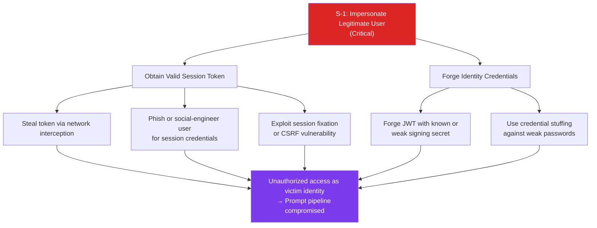
```mermaid
graph TD
    S1_root["S-1: Impersonate Legitimate User\n(Critical)"]:::critical
    S1_root --> S1_a["Obtain Valid Session Token"]
    S1_root --> S1_b["Forge Identity Credentials"]
    S1_a --> S1_a1["Steal token via network interception"]
    S1_a --> S1_a2["Phish or social-engineer user\nfor session credentials"]
    S1_a --> S1_a3["Exploit session fixation\nor CSRF vulnerability"]
    S1_b --> S1_b1["Forge JWT with known or\nweak signing secret"]
    S1_b --> S1_b2["Use credential stuffing\nagainst weak passwords"]
    S1_a1 --> S1_impact["Unauthorized access as victim identity\n→ Prompt pipeline compromised"]:::impact
    S1_a2 --> S1_impact
    S1_a3 --> S1_impact
    S1_b1 --> S1_impact
    S1_b2 --> S1_impact

    classDef critical fill:#DC2626,color:#fff
    classDef impact fill:#7C3AED,color:#fff
```

---

#### S-3: Orchestrator Identity Spoofing on Inter-Agent Channel

_"Unchanged from baseline (2026-04-23)."_

**Component**: LLM Agent Orchestrator | **Risk Level**: Critical | **Finding**: Rogue process injects delegation messages impersonating the Orchestrator

Without cryptographic attestation of the Orchestrator's identity to the Specialist Agent, any process in the Application Zone can impersonate the Orchestrator by injecting messages into the Inter-Agent Channel.

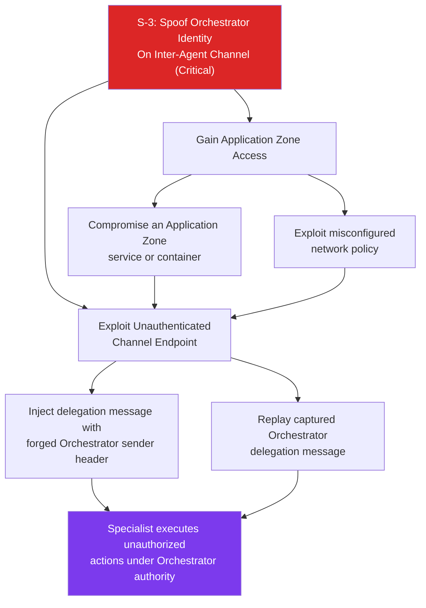
```mermaid
graph TD
    S3_root["S-3: Spoof Orchestrator Identity\nOn Inter-Agent Channel (Critical)"]:::critical
    S3_root --> S3_a["Gain Application Zone Access"]
    S3_root --> S3_b["Exploit Unauthenticated\nChannel Endpoint"]
    S3_a --> S3_a1["Compromise an Application Zone\nservice or container"]
    S3_a --> S3_a2["Exploit misconfigured\nnetwork policy"]
    S3_b --> S3_b1["Inject delegation message with\nforged Orchestrator sender header"]
    S3_b --> S3_b2["Replay captured Orchestrator\ndelegation message"]
    S3_b1 --> S3_impact["Specialist executes unauthorized\nactions under Orchestrator authority"]:::impact
    S3_b2 --> S3_impact
    S3_a1 --> S3_b
    S3_a2 --> S3_b

    classDef critical fill:#DC2626,color:#fff
    classDef impact fill:#7C3AED,color:#fff
```

---

#### S-5: Shared Channel Message Injection (No Sender Auth)

_"Unchanged from baseline (2026-04-23)."_

**Component**: Inter-Agent Communication Channel | **Risk Level**: Critical | **Finding**: Any Application Zone process can inject messages impersonating any agent

The Channel is a shared routing substrate with no inherent sender authentication — enabling identity forgery for any agent pair.

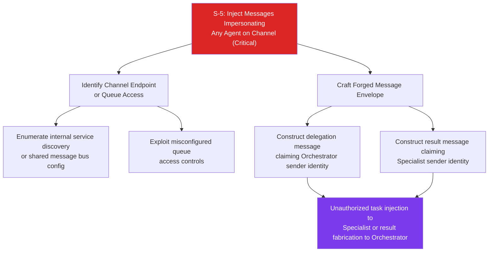
```mermaid
graph TD
    S5_root["S-5: Inject Messages Impersonating\nAny Agent on Channel (Critical)"]:::critical
    S5_root --> S5_a["Identify Channel Endpoint\nor Queue Access"]
    S5_root --> S5_b["Craft Forged Message Envelope"]
    S5_a --> S5_a1["Enumerate internal service discovery\nor shared message bus config"]
    S5_a --> S5_a2["Exploit misconfigured queue\naccess controls"]
    S5_b --> S5_b1["Construct delegation message\nclaiming Orchestrator sender identity"]
    S5_b --> S5_b2["Construct result message claiming\nSpecialist sender identity"]
    S5_b1 --> S5_impact["Unauthorized task injection to\nSpecialist or result fabrication to Orchestrator"]:::impact
    S5_b2 --> S5_impact

    classDef critical fill:#DC2626,color:#fff
    classDef impact fill:#7C3AED,color:#fff
```

---

#### S-6: Agent Identity Spoofing to MCP Tool Server

_"Unchanged from baseline (2026-04-23)."_

**Component**: MCP Tool Server | **Risk Level**: Critical | **Finding**: Application Zone process spoofs agent to submit unauthorized tool calls

Without caller authentication on JSON-RPC endpoints, any process can invoke tools with the Tool Server's service credentials.

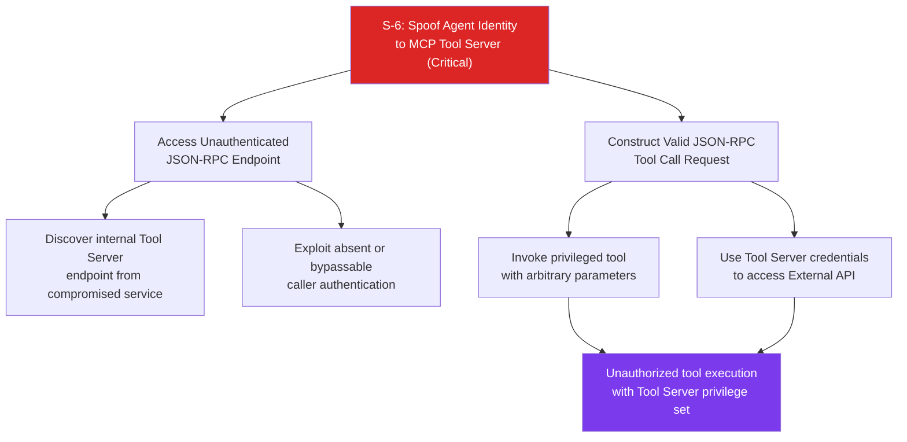
```mermaid
graph TD
    S6_root["S-6: Spoof Agent Identity\nto MCP Tool Server (Critical)"]:::critical
    S6_root --> S6_a["Access Unauthenticated\nJSON-RPC Endpoint"]
    S6_root --> S6_b["Construct Valid JSON-RPC\nTool Call Request"]
    S6_a --> S6_a1["Discover internal Tool Server\nendpoint from compromised service"]
    S6_a --> S6_a2["Exploit absent or bypassable\ncaller authentication"]
    S6_b --> S6_b1["Invoke privileged tool\nwith arbitrary parameters"]
    S6_b --> S6_b2["Use Tool Server credentials\nto access External API"]
    S6_b1 --> S6_impact["Unauthorized tool execution\nwith Tool Server privilege set"]:::impact
    S6_b2 --> S6_impact

    classDef critical fill:#DC2626,color:#fff
    classDef impact fill:#7C3AED,color:#fff
```

---

#### S-7: Fabricated Training Signal Injection at Learning Loop

_"Unchanged from baseline (2026-04-23)."_

**Component**: Long-Running Learning Loop | **Risk Level**: Critical | **Finding**: Training signal accepted without source integrity verification

An attacker who compromises the Audit Logger can inject fabricated training signals silently, manipulating future model updates.

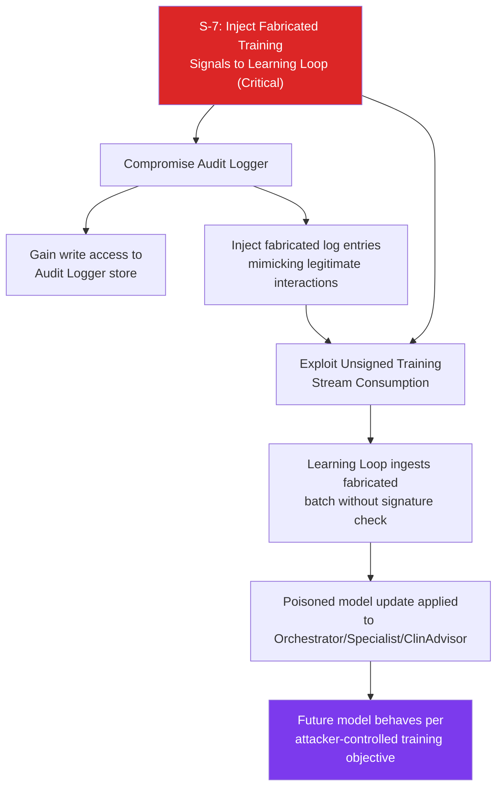
```mermaid
graph TD
    S7_root["S-7: Inject Fabricated Training\nSignals to Learning Loop (Critical)"]:::critical
    S7_root --> S7_a["Compromise Audit Logger"]
    S7_root --> S7_b["Exploit Unsigned Training\nStream Consumption"]
    S7_a --> S7_a1["Gain write access to\nAudit Logger store"]
    S7_a --> S7_a2["Inject fabricated log entries\nmimicking legitimate interactions"]
    S7_b --> S7_b1["Learning Loop ingests fabricated\nbatch without signature check"]
    S7_b1 --> S7_c["Poisoned model update applied\nto Orchestrator/Specialist/ClinAdvisor"]
    S7_c --> S7_impact["Future model behaves per\nattacker-controlled training objective"]:::impact
    S7_a2 --> S7_b

    classDef critical fill:#DC2626,color:#fff
    classDef impact fill:#7C3AED,color:#fff
```

---

#### S-9: Clinical Advisory Sub-Agent — Unauthorized Clinical Query Injection

_"Unchanged from baseline (2026-04-23)."_

**Component**: Clinical Advisory Sub-Agent | **Risk Level**: Critical | **Finding**: Rogue process injects crafted clinical queries impersonating Orchestrator

Without per-message sender attestation on Orchestrator→ClinAdvisor JSON-RPC calls, any Application Zone process can issue crafted clinical queries that return manipulated clinical summaries into the Orchestrator's response path.

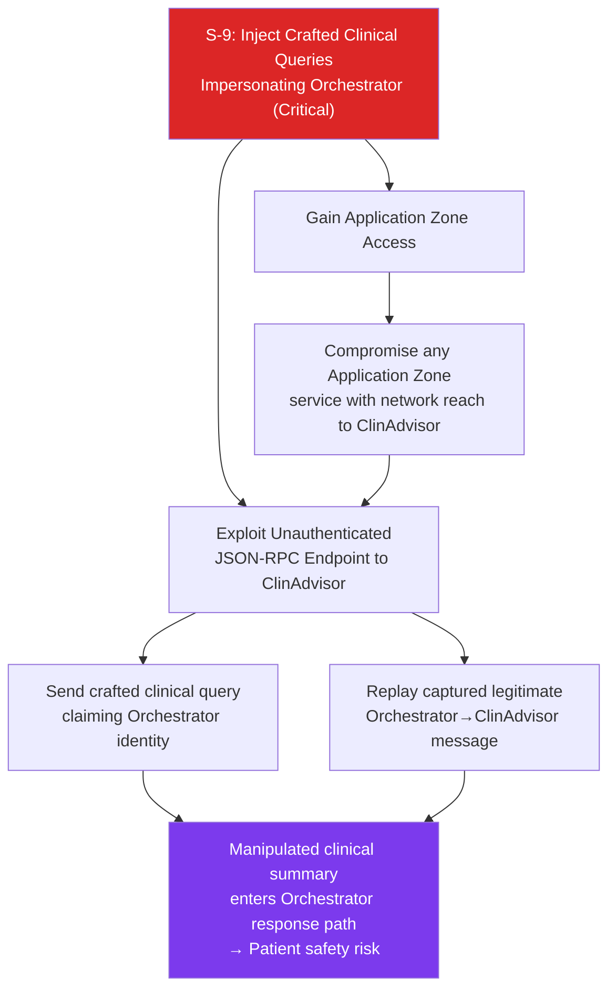
```mermaid
graph TD
    S9_root["S-9: Inject Crafted Clinical Queries\nImpersonating Orchestrator (Critical)"]:::critical
    S9_root --> S9_a["Gain Application Zone Access"]
    S9_root --> S9_b["Exploit Unauthenticated\nJSON-RPC Endpoint to ClinAdvisor"]
    S9_a --> S9_a1["Compromise any Application Zone\nservice with network reach to ClinAdvisor"]
    S9_b --> S9_b1["Send crafted clinical query\nclaiming Orchestrator identity"]
    S9_b --> S9_b2["Replay captured legitimate\nOrchestrator→ClinAdvisor message"]
    S9_b1 --> S9_impact["Manipulated clinical summary\nenters Orchestrator response path\n→ Patient safety risk"]:::impact
    S9_b2 --> S9_impact
    S9_a1 --> S9_b

    classDef critical fill:#DC2626,color:#fff
    classDef impact fill:#7C3AED,color:#fff
```

---

### 5.2 Tampering Attack Trees

#### T-2: Orchestrator Context Window Tampering (CG-1)

_"Unchanged from baseline (2026-04-23)."_

**Component**: LLM Agent Orchestrator | **Risk Level**: Critical | **Finding**: Context window tampered via upstream data source compromise (CG-1 with LLM-4)

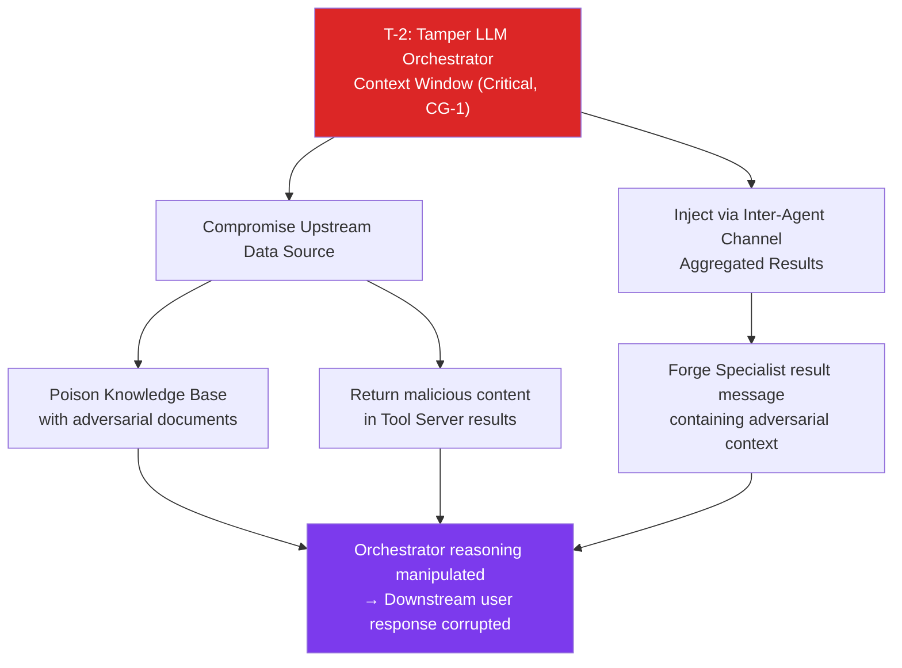
```mermaid
graph TD
    T2_root["T-2: Tamper LLM Orchestrator\nContext Window (Critical, CG-1)"]:::critical
    T2_root --> T2_a["Compromise Upstream Data Source"]
    T2_root --> T2_b["Inject via Inter-Agent Channel\nAggregated Results"]
    T2_a --> T2_a1["Poison Knowledge Base\nwith adversarial documents"]
    T2_a --> T2_a2["Return malicious content\nin Tool Server results"]
    T2_b --> T2_b1["Forge Specialist result message\ncontaining adversarial context"]
    T2_a1 --> T2_impact["Orchestrator reasoning manipulated\n→ Downstream user response corrupted"]:::impact
    T2_a2 --> T2_impact
    T2_b1 --> T2_impact

    classDef critical fill:#DC2626,color:#fff
    classDef impact fill:#7C3AED,color:#fff
```

---

#### T-3: Specialist Agent Delegation Message Tampering

_"Unchanged from baseline (2026-04-23)."_

**Component**: Specialist Agent | **Risk Level**: Critical | **Finding**: Adversarial content injected into delegation message redirects Specialist actions

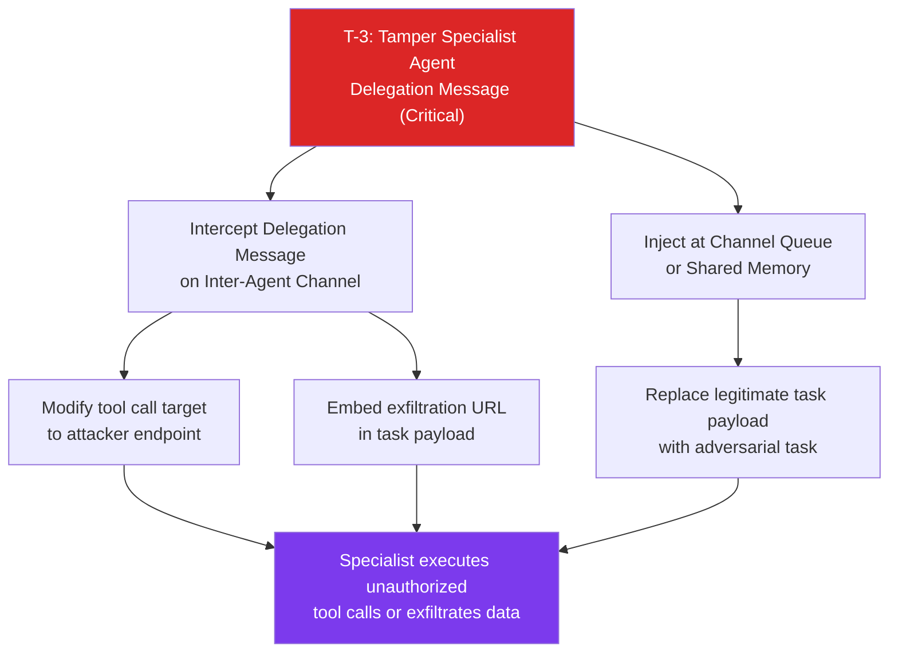
```mermaid
graph TD
    T3_root["T-3: Tamper Specialist Agent\nDelegation Message (Critical)"]:::critical
    T3_root --> T3_a["Intercept Delegation Message\non Inter-Agent Channel"]
    T3_root --> T3_b["Inject at Channel Queue\nor Shared Memory"]
    T3_a --> T3_a1["Modify tool call target\nto attacker endpoint"]
    T3_a --> T3_a2["Embed exfiltration URL\nin task payload"]
    T3_b --> T3_b1["Replace legitimate task payload\nwith adversarial task"]
    T3_a1 --> T3_impact["Specialist executes unauthorized\ntool calls or exfiltrates data"]:::impact
    T3_a2 --> T3_impact
    T3_b1 --> T3_impact

    classDef critical fill:#DC2626,color:#fff
    classDef impact fill:#7C3AED,color:#fff
```

---

#### T-4: Inter-Agent Channel Agent-in-the-Middle

_"Unchanged from baseline (2026-04-23)."_

**Component**: Inter-Agent Communication Channel | **Risk Level**: Critical | **Finding**: Agent-in-the-middle modifies delegation messages before delivery

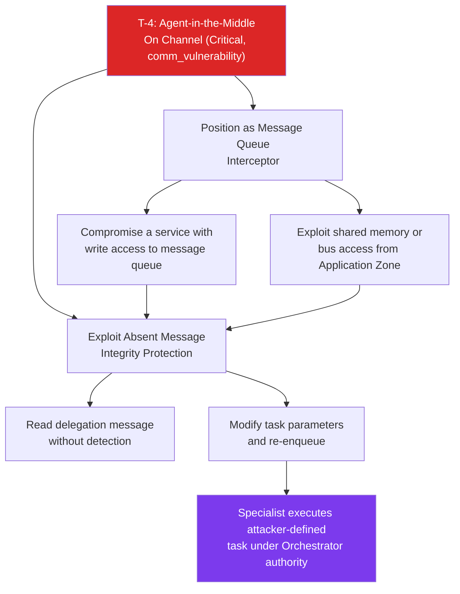
```mermaid
graph TD
    T4_root["T-4: Agent-in-the-Middle\nOn Channel (Critical, comm_vulnerability)"]:::critical
    T4_root --> T4_a["Position as Message Queue\nInterceptor"]
    T4_root --> T4_b["Exploit Absent Message\nIntegrity Protection"]
    T4_a --> T4_a1["Compromise a service with\nwrite access to message queue"]
    T4_a --> T4_a2["Exploit shared memory or\nbus access from Application Zone"]
    T4_b --> T4_b1["Read delegation message\nwithout detection"]
    T4_b --> T4_b2["Modify task parameters\nand re-enqueue"]
    T4_b2 --> T4_impact["Specialist executes attacker-defined\ntask under Orchestrator authority"]:::impact
    T4_a1 --> T4_b
    T4_a2 --> T4_b

    classDef critical fill:#DC2626,color:#fff
    classDef impact fill:#7C3AED,color:#fff
```

---

#### T-5: MCP Tool Server Parameter Injection

_"Unchanged from baseline (2026-04-23)."_

**Component**: MCP Tool Server | **Risk Level**: Critical | **Finding**: LLM-generated tool parameters bypass allowlist enabling shell/SQL injection

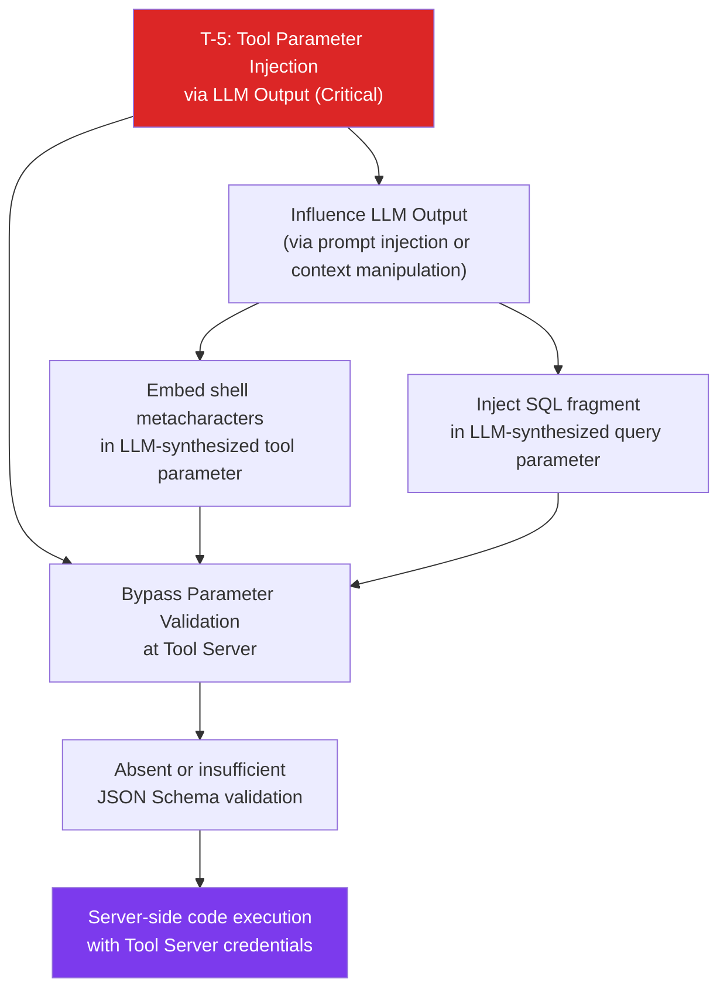
```mermaid
graph TD
    T5_root["T-5: Tool Parameter Injection\nvia LLM Output (Critical)"]:::critical
    T5_root --> T5_a["Influence LLM Output\n(via prompt injection or context manipulation)"]
    T5_root --> T5_b["Bypass Parameter Validation\nat Tool Server"]
    T5_a --> T5_a1["Embed shell metacharacters\nin LLM-synthesized tool parameter"]
    T5_a --> T5_a2["Inject SQL fragment\nin LLM-synthesized query parameter"]
    T5_b --> T5_b1["Absent or insufficient\nJSON Schema validation"]
    T5_b1 --> T5_impact["Server-side code execution\nwith Tool Server credentials"]:::impact
    T5_a1 --> T5_b
    T5_a2 --> T5_b

    classDef critical fill:#DC2626,color:#fff
    classDef impact fill:#7C3AED,color:#fff
```

---

#### T-8: Temporal Training Signal Poisoning (CG-2)

_"Unchanged from baseline (2026-04-23)."_

**Component**: Long-Running Learning Loop | **Risk Level**: Critical | **Finding**: Sleeper-agent injection via poisoned Audit Logger training stream (CG-2 with LLM-11)

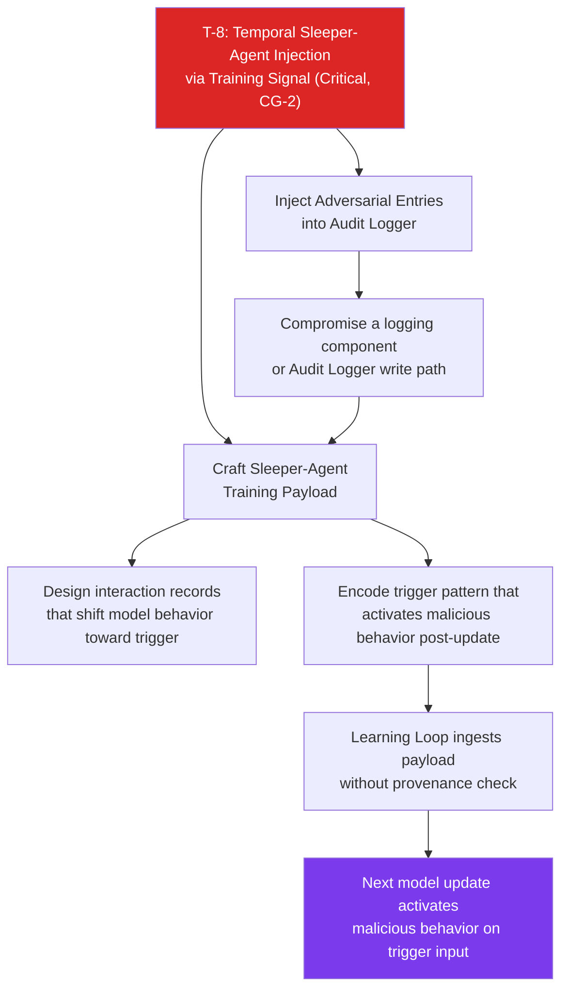
```mermaid
graph TD
    T8_root["T-8: Temporal Sleeper-Agent Injection\nvia Training Signal (Critical, CG-2)"]:::critical
    T8_root --> T8_a["Inject Adversarial Entries\ninto Audit Logger"]
    T8_root --> T8_b["Craft Sleeper-Agent\nTraining Payload"]
    T8_a --> T8_a1["Compromise a logging component\nor Audit Logger write path"]
    T8_b --> T8_b1["Design interaction records\nthat shift model behavior toward trigger"]
    T8_b --> T8_b2["Encode trigger pattern that\nactivates malicious behavior post-update"]
    T8_b2 --> T8_c["Learning Loop ingests payload\nwithout provenance check"]
    T8_c --> T8_impact["Next model update activates\nmalicious behavior on trigger input"]:::impact
    T8_a1 --> T8_b

    classDef critical fill:#DC2626,color:#fff
    classDef impact fill:#7C3AED,color:#fff
```

---

#### T-9: Clinical Advisory Sub-Agent Context Tampering (CG-6)

_"Unchanged from baseline (2026-04-23)."_

**Component**: Clinical Advisory Sub-Agent | **Risk Level**: Critical | **Finding**: Context window tampered via adversarial KB documents or poisoned clinical query payload (CG-6 with LLM-14)

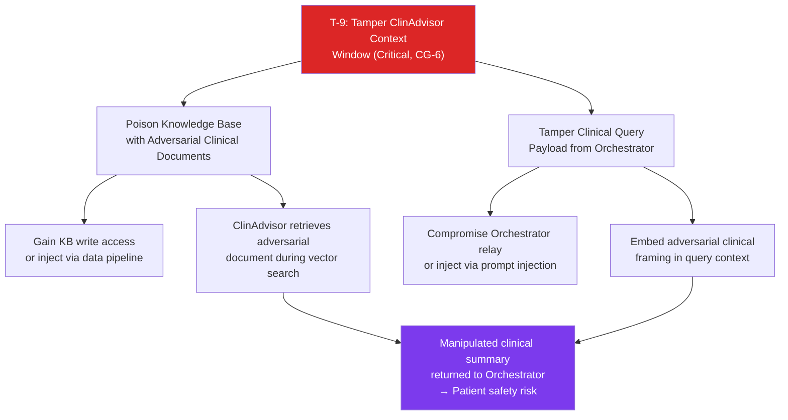
```mermaid
graph TD
    T9_root["T-9: Tamper ClinAdvisor Context\nWindow (Critical, CG-6)"]:::critical
    T9_root --> T9_a["Poison Knowledge Base\nwith Adversarial Clinical Documents"]
    T9_root --> T9_b["Tamper Clinical Query\nPayload from Orchestrator"]
    T9_a --> T9_a1["Gain KB write access\nor inject via data pipeline"]
    T9_a --> T9_a2["ClinAdvisor retrieves adversarial\ndocument during vector search"]
    T9_b --> T9_b1["Compromise Orchestrator relay\nor inject via prompt injection"]
    T9_b --> T9_b2["Embed adversarial clinical\nframing in query context"]
    T9_a2 --> T9_impact["Manipulated clinical summary\nreturned to Orchestrator\n→ Patient safety risk"]:::impact
    T9_b2 --> T9_impact

    classDef critical fill:#DC2626,color:#fff
    classDef impact fill:#7C3AED,color:#fff
```

---

### 5.3 Repudiation Attack Trees

#### R-3: Orchestrator Non-Repudiation Failure (CG-3)

_"Unchanged from baseline (2026-04-23)."_

**Component**: LLM Agent Orchestrator | **Risk Level**: Critical | **Finding**: Orchestrator denies issued actions without content-hash log (CG-3 with E-2 + AG-1)

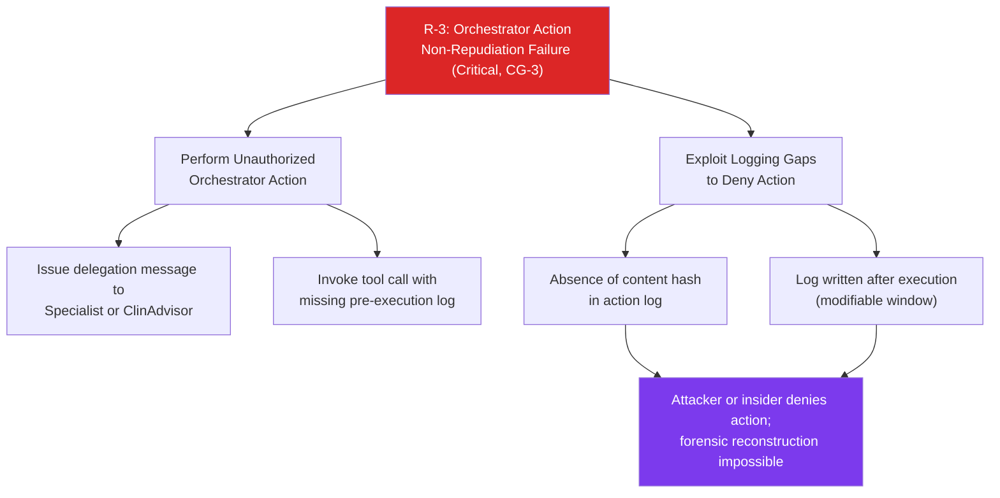
```mermaid
graph TD
    R3_root["R-3: Orchestrator Action\nNon-Repudiation Failure (Critical, CG-3)"]:::critical
    R3_root --> R3_a["Perform Unauthorized\nOrchestrator Action"]
    R3_root --> R3_b["Exploit Logging Gaps\nto Deny Action"]
    R3_a --> R3_a1["Issue delegation message to\nSpecialist or ClinAdvisor"]
    R3_a --> R3_a2["Invoke tool call with\nmissing pre-execution log"]
    R3_b --> R3_b1["Absence of content hash\nin action log"]
    R3_b --> R3_b2["Log written after execution\n(modifiable window)"]
    R3_b1 --> R3_impact["Attacker or insider denies action;\nforensic reconstruction impossible"]:::impact
    R3_b2 --> R3_impact

    classDef critical fill:#DC2626,color:#fff
    classDef impact fill:#7C3AED,color:#fff
```

---

### 5.4 Information Disclosure Attack Trees

#### I-2: Orchestrator Context Window Leakage (CG-4)

_"Unchanged from baseline (2026-04-23)."_

**Component**: LLM Agent Orchestrator | **Risk Level**: Critical | **Finding**: Context window leaked in HTTPS response via hallucination or injection (CG-4 with LLM-1)

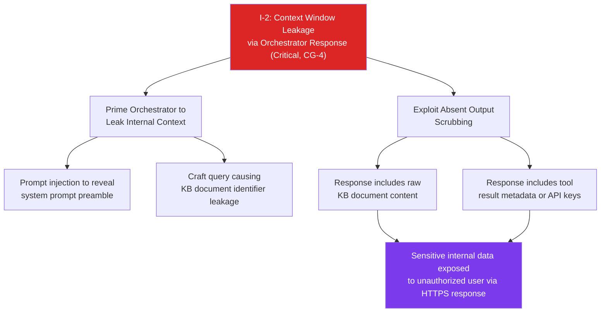
```mermaid
graph TD
    I2_root["I-2: Context Window Leakage\nvia Orchestrator Response (Critical, CG-4)"]:::critical
    I2_root --> I2_a["Prime Orchestrator to\nLeak Internal Context"]
    I2_root --> I2_b["Exploit Absent Output\nScrubbing"]
    I2_a --> I2_a1["Prompt injection to reveal\nsystem prompt preamble"]
    I2_a --> I2_a2["Craft query causing\nKB document identifier leakage"]
    I2_b --> I2_b1["Response includes raw\nKB document content"]
    I2_b --> I2_b2["Response includes tool\nresult metadata or API keys"]
    I2_b1 --> I2_impact["Sensitive internal data exposed\nto unauthorized user via HTTPS response"]:::impact
    I2_b2 --> I2_impact

    classDef critical fill:#DC2626,color:#fff
    classDef impact fill:#7C3AED,color:#fff
```

---

#### I-4: Inter-Agent Channel Message Eavesdropping

_"Unchanged from baseline (2026-04-23)."_

**Component**: Inter-Agent Communication Channel | **Risk Level**: Critical | **Finding**: Channel messages observable to unauthorized Application Zone processes

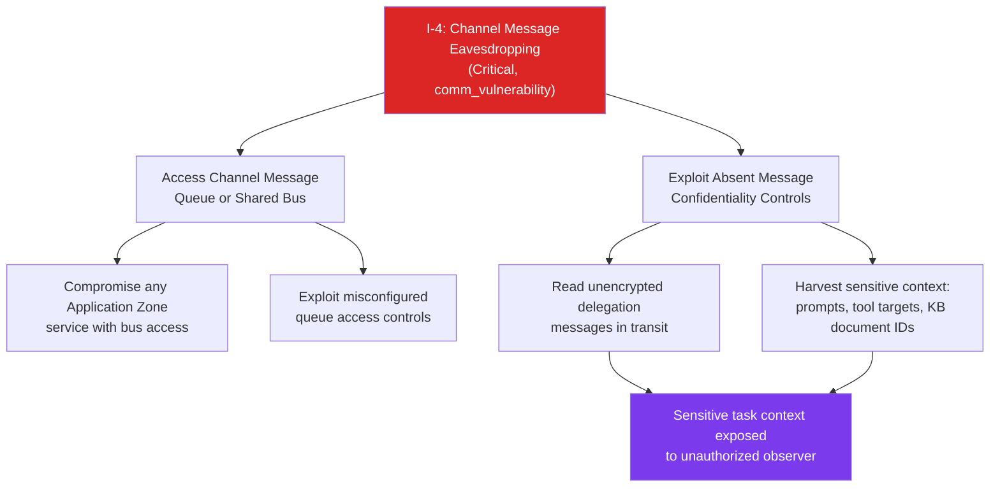
```mermaid
graph TD
    I4_root["I-4: Channel Message Eavesdropping\n(Critical, comm_vulnerability)"]:::critical
    I4_root --> I4_a["Access Channel Message\nQueue or Shared Bus"]
    I4_root --> I4_b["Exploit Absent Message\nConfidentiality Controls"]
    I4_a --> I4_a1["Compromise any Application Zone\nservice with bus access"]
    I4_a --> I4_a2["Exploit misconfigured\nqueue access controls"]
    I4_b --> I4_b1["Read unencrypted delegation\nmessages in transit"]
    I4_b --> I4_b2["Harvest sensitive context:\nprompts, tool targets, KB document IDs"]
    I4_b1 --> I4_impact["Sensitive task context exposed\nto unauthorized observer"]:::impact
    I4_b2 --> I4_impact

    classDef critical fill:#DC2626,color:#fff
    classDef impact fill:#7C3AED,color:#fff
```

---

#### I-7: Audit Logger Unauthorized Read Access

_"Unchanged from baseline (2026-04-23)."_

**Component**: Audit Logger | **Risk Level**: Critical | **Finding**: Unauthorized read access exposes full system operational history

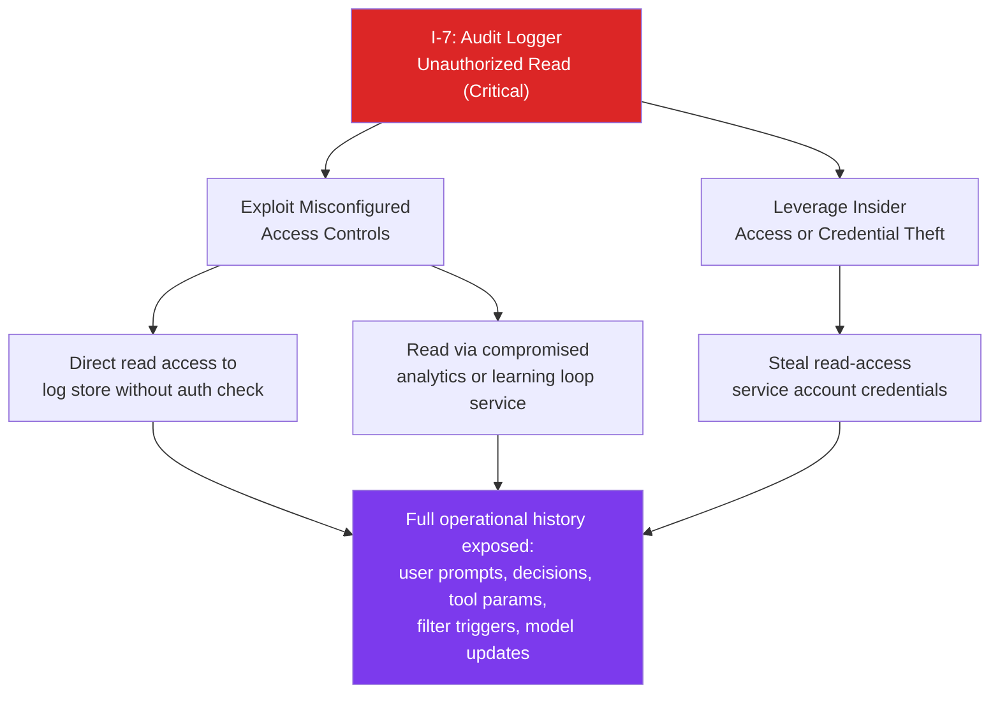
```mermaid
graph TD
    I7_root["I-7: Audit Logger\nUnauthorized Read (Critical)"]:::critical
    I7_root --> I7_a["Exploit Misconfigured\nAccess Controls"]
    I7_root --> I7_b["Leverage Insider\nAccess or Credential Theft"]
    I7_a --> I7_a1["Direct read access to\nlog store without auth check"]
    I7_a --> I7_a2["Read via compromised\nanalytics or learning loop service"]
    I7_b --> I7_b1["Steal read-access\nservice account credentials"]
    I7_a1 --> I7_impact["Full operational history exposed:\nuser prompts, decisions, tool params,\nfilter triggers, model updates"]:::impact
    I7_a2 --> I7_impact
    I7_b1 --> I7_impact

    classDef critical fill:#DC2626,color:#fff
    classDef impact fill:#7C3AED,color:#fff
```

---

#### I-9: Clinical Advisory Sub-Agent — Clinical Context Leakage

_"Unchanged from baseline (2026-04-23)."_

**Component**: Clinical Advisory Sub-Agent | **Risk Level**: Critical | **Finding**: Clinical context leaks in Orchestrator response; sensitive clinical data in training stream

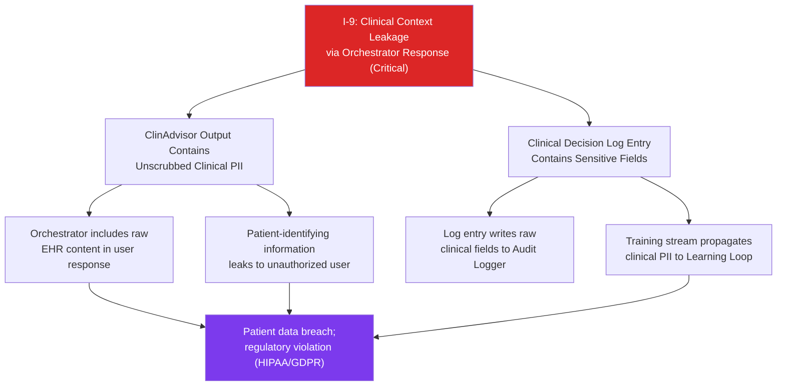
```mermaid
graph TD
    I9_root["I-9: Clinical Context Leakage\nvia Orchestrator Response (Critical)"]:::critical
    I9_root --> I9_a["ClinAdvisor Output Contains\nUnscrubbed Clinical PII"]
    I9_root --> I9_b["Clinical Decision Log Entry\nContains Sensitive Fields"]
    I9_a --> I9_a1["Orchestrator includes raw\nEHR content in user response"]
    I9_a --> I9_a2["Patient-identifying information\nleaks to unauthorized user"]
    I9_b --> I9_b1["Log entry writes raw\nclinical fields to Audit Logger"]
    I9_b --> I9_b2["Training stream propagates\nclinical PII to Learning Loop"]
    I9_a1 --> I9_impact["Patient data breach;\nregulatory violation (HIPAA/GDPR)"]:::impact
    I9_a2 --> I9_impact
    I9_b2 --> I9_impact

    classDef critical fill:#DC2626,color:#fff
    classDef impact fill:#7C3AED,color:#fff
```

---

### 5.5 Denial of Service Attack Trees

#### D-1: Guardrails Service Resource Exhaustion

_"Unchanged from baseline (2026-04-23)."_

**Component**: Guardrails Service | **Risk Level**: Critical | **Finding**: Resource exhaustion via high-volume computationally expensive prompt submission

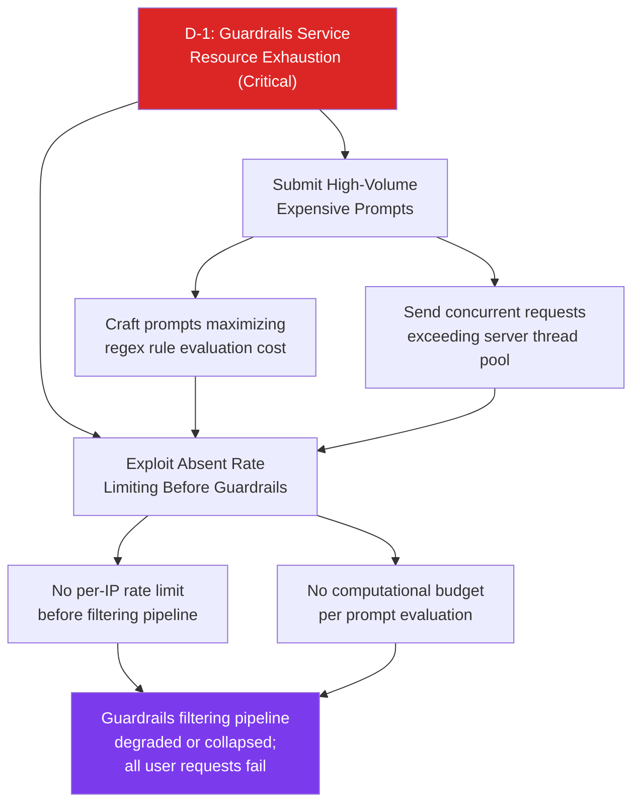
```mermaid
graph TD
    D1_root["D-1: Guardrails Service\nResource Exhaustion (Critical)"]:::critical
    D1_root --> D1_a["Submit High-Volume\nExpensive Prompts"]
    D1_root --> D1_b["Exploit Absent Rate\nLimiting Before Guardrails"]
    D1_a --> D1_a1["Craft prompts maximizing\nregex rule evaluation cost"]
    D1_a --> D1_a2["Send concurrent requests\nexceeding server thread pool"]
    D1_b --> D1_b1["No per-IP rate limit\nbefore filtering pipeline"]
    D1_b --> D1_b2["No computational budget\nper prompt evaluation"]
    D1_b1 --> D1_impact["Guardrails filtering pipeline\ndegraded or collapsed;\nall user requests fail"]:::impact
    D1_b2 --> D1_impact
    D1_a1 --> D1_b
    D1_a2 --> D1_b

    classDef critical fill:#DC2626,color:#fff
    classDef impact fill:#7C3AED,color:#fff
```

---

#### D-2: Orchestrator Inference Pipeline Exhaustion (CG-3)

_"Unchanged from baseline (2026-04-23)."_

**Component**: LLM Agent Orchestrator | **Risk Level**: Critical | **Finding**: Inference pipeline exhausted via high-token prompts or recursive tool chains (resource_competition)

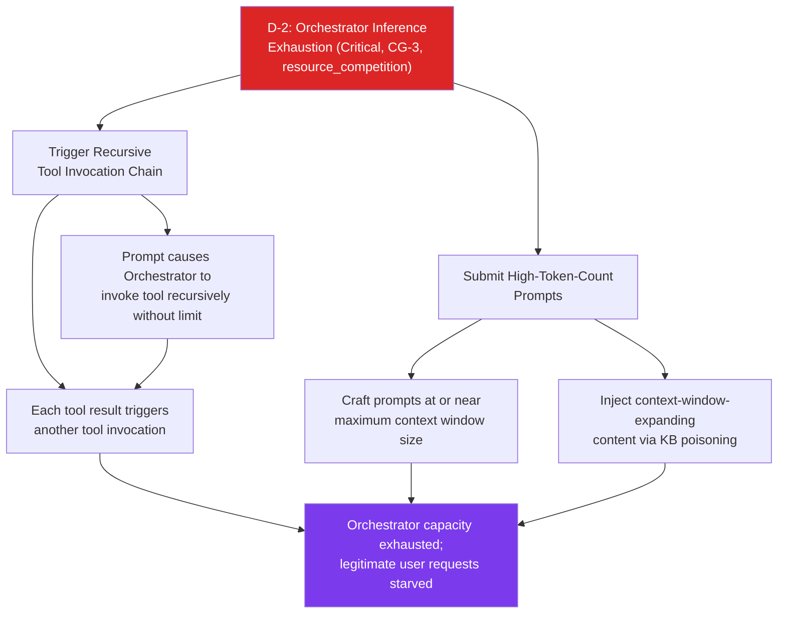
```mermaid
graph TD
    D2_root["D-2: Orchestrator Inference\nExhaustion (Critical, CG-3, resource_competition)"]:::critical
    D2_root --> D2_a["Submit High-Token-Count\nPrompts"]
    D2_root --> D2_b["Trigger Recursive\nTool Invocation Chain"]
    D2_a --> D2_a1["Craft prompts at or near\nmaximum context window size"]
    D2_a --> D2_a2["Inject context-window-expanding\ncontent via KB poisoning"]
    D2_b --> D2_b1["Prompt causes Orchestrator to\ninvoke tool recursively without limit"]
    D2_b --> D2_b2["Each tool result triggers\nanother tool invocation"]
    D2_b2 --> D2_impact["Orchestrator capacity exhausted;\nlegitimate user requests starved"]:::impact
    D2_a1 --> D2_impact
    D2_a2 --> D2_impact
    D2_b1 --> D2_b2

    classDef critical fill:#DC2626,color:#fff
    classDef impact fill:#7C3AED,color:#fff
```

---

#### D-5: MCP Tool Server Connection Pool Exhaustion (CG-5)

_"Unchanged from baseline (2026-04-23)."_

**Component**: MCP Tool Server | **Risk Level**: Critical | **Finding**: Connection pool exhausted via high-volume tool call requests (CG-5 with AG-6)

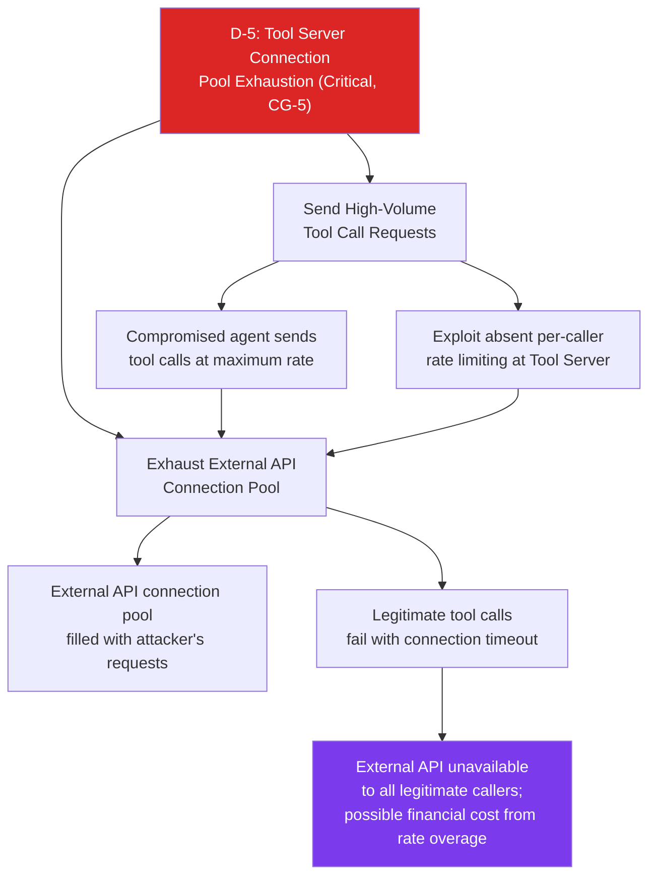
```mermaid
graph TD
    D5_root["D-5: Tool Server Connection\nPool Exhaustion (Critical, CG-5)"]:::critical
    D5_root --> D5_a["Send High-Volume\nTool Call Requests"]
    D5_root --> D5_b["Exhaust External API\nConnection Pool"]
    D5_a --> D5_a1["Compromised agent sends\ntool calls at maximum rate"]
    D5_a --> D5_a2["Exploit absent per-caller\nrate limiting at Tool Server"]
    D5_b --> D5_b1["External API connection pool\nfilled with attacker's requests"]
    D5_b --> D5_b2["Legitimate tool calls\nfail with connection timeout"]
    D5_b2 --> D5_impact["External API unavailable\nto all legitimate callers;\npossible financial cost from rate overage"]:::impact
    D5_a1 --> D5_b
    D5_a2 --> D5_b

    classDef critical fill:#DC2626,color:#fff
    classDef impact fill:#7C3AED,color:#fff
```

---

### 5.6 Elevation of Privilege Attack Trees

#### E-1: Guardrails Bypass Elevates to Trusted Orchestrator Caller

_"Unchanged from baseline (2026-04-23)."_

**Component**: Guardrails Service | **Risk Level**: Critical | **Finding**: Prompt injection bypass elevates attacker to trusted Orchestrator caller privilege

```mermaid
graph TD
    E1_root["E-1: Guardrails Bypass\nPrivilege Escalation (Critical)"]:::critical
    E1_root --> E1_a["Craft Prompt Bypassing\nGuardrails Content Filter"]
    E1_root --> E1_b["Exploit Single-Layer\nValidation (no Orchestrator independent check)"]
    E1_a --> E1_a1["Use encoding or obfuscation\nto evade pattern matching"]
    E1_a --> E1_a2["Exploit edge cases in\nrule logic or regex"]
    E1_b --> E1_b1["Attacker prompt reaches\nOrchestrator with Guardrails trust level"]
    E1_b --> E1_b2["Orchestrator treats input as\ntrusted; executes adversarial instructions"]
    E1_b2 --> E1_impact["Attacker operates at\nOrchestrator trust level;\nsubsequent escalation enabled"]:::impact
    E1_a1 --> E1_b
    E1_a2 --> E1_b

    classDef critical fill:#DC2626,color:#fff
    classDef impact fill:#7C3AED,color:#fff
```

---

#### E-2: Orchestrator Self-Authorized Privilege Escalation (CG-3)

_"Unchanged from baseline (2026-04-23)."_

**Component**: LLM Agent Orchestrator | **Risk Level**: Critical | **Finding**: Prompt injection causes Orchestrator to self-authorize elevated operations (CG-3 with R-3 + AG-1)

```mermaid
graph TD
    E2_root["E-2: Orchestrator Self-Authorized\nPrivilege Escalation (Critical, CG-3)"]:::critical
    E2_root --> E2_a["Inject Prompt that Manipulates\nOrchestrator Reasoning"]
    E2_root --> E2_b["Exploit Absent Session-Scoped\nPermission Enforcement"]
    E2_a --> E2_a1["Embed instructions to\nbypass permission scope check"]
    E2_a --> E2_a2["Craft context that makes\nelevated operation appear authorized"]
    E2_b --> E2_b1["Orchestrator self-grants elevated\npermission at runtime without downstream check"]
    E2_b --> E2_b2["KB, Tool Server, ClinAdvisor\nnot enforcing session scope independently"]
    E2_b1 --> E2_impact["Full KB exfiltration,\ncross-scope tool invocations,\nunauthorized delegation executed"]:::impact
    E2_b2 --> E2_impact
    E2_a1 --> E2_b
    E2_a2 --> E2_b

    classDef critical fill:#DC2626,color:#fff
    classDef impact fill:#7C3AED,color:#fff
```

---

#### E-4: Channel Sender Identity Forgery for Privilege Escalation

_"Unchanged from baseline (2026-04-23)."_

**Component**: Inter-Agent Communication Channel | **Risk Level**: Critical | **Finding**: Application Zone process injects messages with forged elevated sender identity

```mermaid
graph TD
    E4_root["E-4: Forged Sender Identity\nPrivilege Escalation via Channel (Critical)"]:::critical
    E4_root --> E4_a["Forge Orchestrator Sender\nIdentity on Channel Message"]
    E4_root --> E4_b["Exploit Absent Sender\nAuthentication at Channel Layer"]
    E4_a --> E4_a1["Construct message with\nOrchestrator identity header"]
    E4_a --> E4_a2["No signature verification\nrequired for routing"]
    E4_b --> E4_b1["Channel routes forged message\nto Specialist as if from Orchestrator"]
    E4_b1 --> E4_impact["Low-privilege process operates\nat Orchestrator trust level;\nSpecialist executes forged instructions"]:::impact
    E4_a1 --> E4_b
    E4_a2 --> E4_b

    classDef critical fill:#DC2626,color:#fff
    classDef impact fill:#7C3AED,color:#fff
```

---

#### E-5: Tool Server Credential Misuse via Unauthorized Tool Calls

_"Unchanged from baseline (2026-04-23)."_

**Component**: MCP Tool Server | **Risk Level**: Critical | **Finding**: Unauthorized tool calls gain Tool Server execution privileges and full credential set

```mermaid
graph TD
    E5_root["E-5: Unauthorized Tool Calls\nGain Tool Server Privileges (Critical)"]:::critical
    E5_root --> E5_a["Submit Unauthorized Tool\nCall Request"]
    E5_root --> E5_b["Exploit Absent Zero-Trust\nAuthorization at Tool Server"]
    E5_a --> E5_a1["Use forged agent identity\n(S-6 prerequisite)"]
    E5_a --> E5_a2["Exploit compromised Orchestrator\nor Specialist output"]
    E5_b --> E5_b1["Tool Server executes request\nwithout session scope check"]
    E5_b --> E5_b2["Tool Server uses its own\nservice account with full external access"]
    E5_b2 --> E5_impact["Attacker invokes tools with\nTool Server's full credential set;\nExternal API accessed, data exfiltrated"]:::impact
    E5_a1 --> E5_b
    E5_a2 --> E5_b

    classDef critical fill:#DC2626,color:#fff
    classDef impact fill:#7C3AED,color:#fff
```

---

#### E-6: Learning Loop Update Escalates to Model Parameter Control

_"Unchanged from baseline (2026-04-23)."_

**Component**: Long-Running Learning Loop | **Risk Level**: Critical | **Finding**: Poisoned update escalates attacker from data access to model parameter control (temporal_attack)

```mermaid
graph TD
    E6_root["E-6: Data Access Escalates to\nModel Parameter Control (Critical, temporal_attack)"]:::critical
    E6_root --> E6_a["Compromise Audit Logger\nTraining Signal"]
    E6_root --> E6_b["Exploit Unsigned Model\nUpdate Distribution"]
    E6_a --> E6_a1["Inject adversarial training signals\n(see T-8, CG-2)"]
    E6_b --> E6_b1["Learning Loop emits unsigned\nmodel update package"]
    E6_b --> E6_b2["Orchestrator, Specialist, ClinAdvisor\napply update without signature check"]
    E6_b2 --> E6_impact["Attacker controls model parameters\nof all three agents;\narbitrary behaviors injectable post-update"]:::impact
    E6_a1 --> E6_b

    classDef critical fill:#DC2626,color:#fff
    classDef impact fill:#7C3AED,color:#fff
```

---

#### E-7: Clinical Advisory Sub-Agent Privilege Escalation via Injection

_"Unchanged from baseline (2026-04-23)."_

**Component**: Clinical Advisory Sub-Agent | **Risk Level**: Critical | **Finding**: Prompt injection via clinical query elevates ClinAdvisor to self-authorize elevated KB access (trust_exploitation)

```mermaid
graph TD
    E7_root["E-7: ClinAdvisor Self-Authorized\nPrivilege Escalation (Critical, trust_exploitation)"]:::critical
    E7_root --> E7_a["Inject Adversarial Content\nin Clinical Query / Context"]
    E7_root --> E7_b["Exploit via Adversarial\nKB Document Retrieved by ClinAdvisor"]
    E7_a --> E7_a1["Override sub-agent system\nprompt via clinical context injection"]
    E7_a --> E7_a2["Cause sub-agent to issue\nKB queries outside session scope"]
    E7_b --> E7_b1["Adversarial document retrieved\nduring vector search overrides context"]
    E7_b --> E7_b2["Sub-agent returns output designed\nto manipulate Orchestrator tool decisions"]
    E7_b2 --> E7_impact["ClinAdvisor operates beyond\nintended advisory role;\nOrchestrator takes unauthorized high-privilege action"]:::impact
    E7_a1 --> E7_impact
    E7_a2 --> E7_impact
    E7_b1 --> E7_b2

    classDef critical fill:#DC2626,color:#fff
    classDef impact fill:#7C3AED,color:#fff
```

---

### 5.7 Agentic Threats Attack Trees (SC-019 Cohesive Block)

> Per SC-019 (Feature 219): AG-1 through AG-8 are presented as a cohesive block. AG-8 is annotated as NEW.

#### AG-1: Autonomous Unauthorized High-Impact Action Execution (CG-3)

_"Unchanged from baseline (2026-04-23)."_

**Component**: LLM Agent Orchestrator | **Risk Level**: Critical | **Finding**: Prompt injection causes Orchestrator to autonomously execute unauthorized high-impact actions (CG-3 with E-2 + R-3)

```mermaid
graph TD
    AG1_root["AG-1: Autonomous Unauthorized\nHigh-Impact Actions (Critical, CG-3)"]:::critical
    AG1_root --> AG1_a["Inject Prompt Overriding\nScope Enforcement"]
    AG1_root --> AG1_b["Exploit Absent HITL\nfor High-Impact Operations"]
    AG1_a --> AG1_a1["Direct injection via\nUser→Guardrails→Orchestrator chain"]
    AG1_a --> AG1_a2["Indirect injection via\nadversarial KB document"]
    AG1_b --> AG1_b1["No supervised-autonomy policy\nengine approving proposed actions"]
    AG1_b --> AG1_b2["No human confirmation\ngate for bulk operations"]
    AG1_b1 --> AG1_impact["Mass KB exfiltration;\nbulk External API invocations;\nfull Knowledge Base contents leaked"]:::impact
    AG1_b2 --> AG1_impact
    AG1_a1 --> AG1_b
    AG1_a2 --> AG1_b

    classDef critical fill:#DC2626,color:#fff
    classDef impact fill:#7C3AED,color:#fff
```

---

#### AG-2: Orchestrator-Specialist Agent Collusion for Policy Circumvention

_"Unchanged from baseline (2026-04-23)."_

**Component**: LLM Agent Orchestrator | **Risk Level**: Critical | **Finding**: Orchestrator+Specialist coordinate for policy circumvention above per-agent limits (agent_collusion)

```mermaid
graph TD
    AG2_root["AG-2: Orchestrator+Specialist Collusion\nPolicy Circumvention (Critical, agent_collusion)"]:::critical
    AG2_root --> AG2_a["Compromise Both Agents or\nInject Coordinated Prompts"]
    AG2_root --> AG2_b["Exploit Absent Cross-Agent\nCoordination Throttles"]
    AG2_a --> AG2_a1["Inject adversarial prompt to\nOrchestrator that coordinates with Specialist"]
    AG2_a --> AG2_a2["Compromise both Orchestrator\nand Specialist independently"]
    AG2_b --> AG2_b1["Per-agent limits do not\ncapture combined effect"]
    AG2_b --> AG2_b2["No policy engine evaluating\nsequences of multi-agent actions"]
    AG2_b2 --> AG2_impact["Combined exfiltration or action\nexceeds per-agent limits without detection;\npolicy circumvented via distribution"]:::impact
    AG2_b1 --> AG2_impact
    AG2_a1 --> AG2_b
    AG2_a2 --> AG2_b

    classDef critical fill:#DC2626,color:#fff
    classDef impact fill:#7C3AED,color:#fff
```

---

#### AG-3: Specialist Agent Autonomous Prohibited Tool Call Sequence

_"Unchanged from baseline (2026-04-23)."_

**Component**: Specialist Agent | **Risk Level**: Critical | **Finding**: Adversarial delegation causes autonomous prohibited cumulative tool call sequence (trust_exploitation)

```mermaid
graph TD
    AG3_root["AG-3: Specialist Autonomous\nProhibited Tool Sequence (Critical, trust_exploitation)"]:::critical
    AG3_root --> AG3_a["Craft Adversarial Delegation\nMessage with Prohibited Objective"]
    AG3_root --> AG3_b["Exploit Absent Task-Level\nIntent Verification"]
    AG3_a --> AG3_a1["Each individual tool call\nappears permitted in isolation"]
    AG3_a --> AG3_a2["Combination achieves\nprohibited holistic action"]
    AG3_b --> AG3_b1["No tool call budget\nor re-authorization gate"]
    AG3_b --> AG3_b2["Specialist operates without\ncontinuous Orchestrator oversight"]
    AG3_b2 --> AG3_impact["Specialist executes prohibited\naction sequence autonomously;\nno oversight catches the combination"]:::impact
    AG3_b1 --> AG3_impact
    AG3_a1 --> AG3_b
    AG3_a2 --> AG3_b

    classDef critical fill:#DC2626,color:#fff
    classDef impact fill:#7C3AED,color:#fff
```

---

#### AG-4: Agent-in-the-Middle via Channel Delegation Message Interception

_"Unchanged from baseline (2026-04-23)."_

**Component**: Inter-Agent Communication Channel | **Risk Level**: Critical | **Finding**: Agent-in-the-middle intercepts and modifies delegation messages (trust_exploitation)

```mermaid
graph TD
    AG4_root["AG-4: Agent-in-the-Middle\nDelegation Interception (Critical, trust_exploitation)"]:::critical
    AG4_root --> AG4_a["Position as Channel\nIntermediary"]
    AG4_root --> AG4_b["Intercept and Modify\nDelegation Message"]
    AG4_a --> AG4_a1["Compromise service with\nwrite access to message bus"]
    AG4_a --> AG4_a2["Exploit absent routing\nauthentication in channel substrate"]
    AG4_b --> AG4_b1["Replace tool target URL\nwith attacker endpoint"]
    AG4_b --> AG4_b2["Re-enqueue modified message;\nSpecialist receives altered task"]
    AG4_b2 --> AG4_impact["Specialist executes unauthorized\nactions at attacker-controlled endpoint\nbelieving instructions are from Orchestrator"]:::impact
    AG4_a1 --> AG4_b
    AG4_a2 --> AG4_b

    classDef critical fill:#DC2626,color:#fff
    classDef impact fill:#7C3AED,color:#fff
```

---

#### AG-5: MCP Tool Server Tool Call Injection via LLM Output

_"Unchanged from baseline (2026-04-23)."_

**Component**: MCP Tool Server | **Risk Level**: Critical | **Finding**: Tool call injection via LLM-influenced JSON-RPC parameters (trust_exploitation)

```mermaid
graph TD
    AG5_root["AG-5: Tool Call Injection via\nLLM-Influenced JSON-RPC (Critical, trust_exploitation)"]:::critical
    AG5_root --> AG5_a["Influence Orchestrator or\nSpecialist LLM Output"]
    AG5_root --> AG5_b["Exploit Absent Tool Call\nValidation at Tool Server"]
    AG5_a --> AG5_a1["Inject tool name not\nin registered allowlist"]
    AG5_a --> AG5_a2["Inject malicious arguments\nto permitted tool (SQL, shell)"]
    AG5_b --> AG5_b1["Tool Server executes request\nwithout tool name allowlist check"]
    AG5_b --> AG5_b2["No per-tool parameter\nJSON Schema validation"]
    AG5_b1 --> AG5_impact["Unintended tool invoked with\nTool Server service credentials;\nExternal API or internal system compromised"]:::impact
    AG5_b2 --> AG5_impact
    AG5_a1 --> AG5_b
    AG5_a2 --> AG5_b

    classDef critical fill:#DC2626,color:#fff
    classDef impact fill:#7C3AED,color:#fff
```

---

#### AG-7: Temporal Autonomy Expansion via Adversarial Training

_"Unchanged from baseline (2026-04-23)."_

**Component**: Long-Running Learning Loop | **Risk Level**: Critical | **Finding**: Training data causes model to expand autonomous action scope on next update (temporal_attack)

```mermaid
graph TD
    AG7_root["AG-7: Temporal Autonomy Expansion\nvia Adversarial Training (Critical, temporal_attack)"]:::critical
    AG7_root --> AG7_a["Inject Training Data that\nExpands Action Scope"]
    AG7_root --> AG7_b["Exploit Absent Capability\nAudit on Model Updates"]
    AG7_a --> AG7_a1["Craft training signals\nrewarding unauthorized action patterns"]
    AG7_a --> AG7_a2["Gradually accumulate capability\nacross multiple training cycles"]
    AG7_b --> AG7_b1["Model update deployed\nwithout capability regression suite"]
    AG7_b --> AG7_b2["No capability allowlist\nenforced post-update"]
    AG7_b2 --> AG7_impact["Updated model autonomously\nperforms actions beyond authorized scope;\ncapability creep invisible until exercised"]:::impact
    AG7_b1 --> AG7_impact
    AG7_a1 --> AG7_b
    AG7_a2 --> AG7_b

    classDef critical fill:#DC2626,color:#fff
    classDef impact fill:#7C3AED,color:#fff
```

---

#### AG-8: Insecure Inter-Agent Communication — ASI07:2026 (NEW)

_"Context changed since baseline — attack tree regenerated."_

**Component**: Inter-Agent Communication Channel | **Risk Level**: Critical | **Finding**: No mTLS, no message signing, no replay prevention, no taint propagation across Orchestrator relay (OWASP ASI07:2026, CWE-287, ATLAS AML.T0060)

This finding is part of correlation group CG-7. See also: D-4.

```mermaid
graph TD
    AG8_root["AG-8: Insecure Inter-Agent Communication\nASI07:2026 AML.T0060 NEW (Critical, CG-7)"]:::critical
    AG8_root --> AG8_a["Exploit No mTLS on\nChannel Connections"]
    AG8_root --> AG8_b["Exploit No Message Signing\nor Nonce-Based Replay Prevention"]
    AG8_root --> AG8_c["Exploit Absent Taint Labels\non Orchestrator Relay Output"]
    AG8_a --> AG8_a1["Network-positioned attacker\nperforms AML.T0060 A2A intercept"]
    AG8_a --> AG8_a2["Compromised Application Zone process\nreads plaintext inter-agent channel"]
    AG8_b --> AG8_b1["Replay captured delegation\nmessage to Specialist Agent"]
    AG8_b --> AG8_b2["Inject modified instruction\nwithout valid signature detection"]
    AG8_c --> AG8_c1["Attacker compromises Orchestrator relay\nfunction; propagates attacker-controlled content"]
    AG8_c --> AG8_c2["ClinAdvisor receives content\nwithout upstream authority label;\ncannot detect tampering"]
    AG8_a1 --> AG8_impact["Replay/injection of delegation messages;\nClinAdvisor and Specialist execute\nattacker-controlled instructions without detection"]:::impact
    AG8_a2 --> AG8_impact
    AG8_b1 --> AG8_impact
    AG8_b2 --> AG8_impact
    AG8_c2 --> AG8_impact

    classDef critical fill:#DC2626,color:#fff
    classDef impact fill:#7C3AED,color:#fff
```

---

### 5.8 LLM Threats Attack Trees

#### LLM-1: Direct Prompt Injection to Orchestrator (CG-4)

_"Unchanged from baseline (2026-04-23)."_

**Component**: LLM Agent Orchestrator | **Risk Level**: Critical | **Finding**: Direct prompt injection overrides Orchestrator system prompt (CG-4 with I-2)

```mermaid
graph TD
    LLM1_root["LLM-1: Direct Prompt Injection\nOverrides System Prompt (Critical, CG-4)"]:::critical
    LLM1_root --> LLM1_a["Craft Adversarial Prompt\nPassing Guardrails Filter"]
    LLM1_root --> LLM1_b["Exploit Single-Boundary\nInstruction Enforcement"]
    LLM1_a --> LLM1_a1["Use encoding to evade\ncontent filtering patterns"]
    LLM1_a --> LLM1_a2["Exploit semantic gap\nbetween filter logic and model parsing"]
    LLM1_b --> LLM1_b1["Orchestrator treats user content\nas instructions rather than data"]
    LLM1_b --> LLM1_b2["System prompt accessible\nto user content manipulation"]
    LLM1_b2 --> LLM1_impact["Orchestrator system prompt overridden;\nmodel reveals internal configuration\nor executes attacker-defined actions"]:::impact
    LLM1_b1 --> LLM1_impact
    LLM1_a1 --> LLM1_b
    LLM1_a2 --> LLM1_b

    classDef critical fill:#DC2626,color:#fff
    classDef impact fill:#7C3AED,color:#fff
```

---

#### LLM-2: Indirect Prompt Injection via Knowledge Base

_"Unchanged from baseline (2026-04-23)."_

**Component**: LLM Agent Orchestrator | **Risk Level**: Critical | **Finding**: Indirect prompt injection via adversarial KB documents retrieved during vector search

```mermaid
graph TD
    LLM2_root["LLM-2: Indirect Prompt Injection\nvia Knowledge Base (Critical)"]:::critical
    LLM2_root --> LLM2_a["Inject Adversarial Document\ninto Knowledge Base"]
    LLM2_root --> LLM2_b["Orchestrator Retrieves\nAdversarial Document"]
    LLM2_a --> LLM2_a1["Gain KB write access\nor exploit upload pathway"]
    LLM2_a --> LLM2_a2["Craft document with embedded\ninstruction-like patterns"]
    LLM2_b --> LLM2_b1["Vector search selects\nadversarial document as relevant context"]
    LLM2_b --> LLM2_b2["Document injected into\nOrchestrator context window unsanitized"]
    LLM2_b2 --> LLM2_impact["Orchestrator reasoning hijacked\nvia retrieved adversarial content;\nunauthorized actions executed"]:::impact
    LLM2_a1 --> LLM2_b
    LLM2_a2 --> LLM2_b

    classDef critical fill:#DC2626,color:#fff
    classDef impact fill:#7C3AED,color:#fff
```

---

#### LLM-4: Training Data Poisoning via Learning Loop (CG-1)

_"Unchanged from baseline (2026-04-23)."_

**Component**: LLM Agent Orchestrator | **Risk Level**: Critical | **Finding**: Training data poisoning of Orchestrator via audit-fed Learning Loop (CG-1 with T-2)

```mermaid
graph TD
    LLM4_root["LLM-4: Training Data Poisoning\nvia Learning Loop (Critical, CG-1)"]:::critical
    LLM4_root --> LLM4_a["Inject Adversarial Interaction\nRecords into Audit Logger"]
    LLM4_root --> LLM4_b["Exploit Absent Training\nData Validation"]
    LLM4_a --> LLM4_a1["Fabricate user sessions designed\nto shift Orchestrator model behavior"]
    LLM4_a --> LLM4_a2["Ensure fabricated records\npass format and plausibility checks"]
    LLM4_b --> LLM4_b1["No provenance tracking\nor signature verification on training data"]
    LLM4_b --> LLM4_b2["No adversarial training\ndetection on signal distributions"]
    LLM4_b2 --> LLM4_impact["Orchestrator model behavior\nshifted toward attacker objectives\non next Learning Loop update cycle"]:::impact
    LLM4_b1 --> LLM4_impact
    LLM4_a1 --> LLM4_b

    classDef critical fill:#DC2626,color:#fff
    classDef impact fill:#7C3AED,color:#fff
```

---

#### LLM-5: Client-Side XSS via LLM Response in Browser

_"Unchanged from baseline (2026-04-23)."_

**Component**: LLM Agent Orchestrator | **Risk Level**: Critical | **Finding**: Client-side XSS via LLM response rendered in user browser (OWASP LLM05:2025)

```mermaid
graph TD
    LLM5_root["LLM-5: Client-Side XSS\nvia LLM Browser Response (Critical)"]:::critical
    LLM5_root --> LLM5_a["Prime Orchestrator to Emit\nXSS Payload in Response"]
    LLM5_root --> LLM5_b["Exploit Absent HTML\nEntity Encoding on Render"]
    LLM5_a --> LLM5_a1["Prompt injection causing Orchestrator\nto emit script tag payload"]
    LLM5_a --> LLM5_a2["KB poisoning with\nstored XSS in documents"]
    LLM5_b --> LLM5_b1["Client renders LLM output\nvia innerHTML without encoding"]
    LLM5_b --> LLM5_b2["No CSP blocking\nunsafe-inline script execution"]
    LLM5_b1 --> LLM5_impact["Client-side execution in victim browser;\nsession cookie theft, CSRF token access"]:::impact
    LLM5_b2 --> LLM5_impact
    LLM5_a1 --> LLM5_b
    LLM5_a2 --> LLM5_b

    classDef critical fill:#DC2626,color:#fff
    classDef impact fill:#7C3AED,color:#fff
```

---

#### LLM-6: Server-Side Injection via Tool Call Parameters

_"Unchanged from baseline (2026-04-23)."_

**Component**: LLM Agent Orchestrator | **Risk Level**: Critical | **Finding**: Server-side code/command execution via LLM-synthesized Tool Call Request parameters

```mermaid
graph TD
    LLM6_root["LLM-6: Server-Side Injection\nvia Tool Call Parameters (Critical)"]:::critical
    LLM6_root --> LLM6_a["Influence LLM Output to\nEmit Injection Payload in Tool Call"]
    LLM6_root --> LLM6_b["Exploit Absent Parameterization\nat Tool Server"]
    LLM6_a --> LLM6_a1["SQL injection fragment\nin database tool parameter"]
    LLM6_a --> LLM6_a2["Shell metacharacters in\ncommand tool argument"]
    LLM6_b --> LLM6_b1["Tool Server interpolates\nLLM output directly into query/command"]
    LLM6_b --> LLM6_b2["No allowlist or schema\nvalidation at ingress"]
    LLM6_b1 --> LLM6_impact["Server-side code execution with\nTool Server service account credentials;\ndatabase or OS compromised"]:::impact
    LLM6_b2 --> LLM6_impact
    LLM6_a1 --> LLM6_b
    LLM6_a2 --> LLM6_b

    classDef critical fill:#DC2626,color:#fff
    classDef impact fill:#7C3AED,color:#fff
```

---

#### LLM-8: Prompt Injection via Specialist Agent Delegation Messages

_"Unchanged from baseline (2026-04-23)."_

**Component**: Specialist Agent | **Risk Level**: Critical | **Finding**: Prompt injection via adversarial delegation messages hijacks Specialist task execution

```mermaid
graph TD
    LLM8_root["LLM-8: Prompt Injection via\nDelegation Messages (Critical)"]:::critical
    LLM8_root --> LLM8_a["Inject Adversarial Content\ninto Delegation Message"]
    LLM8_root --> LLM8_b["Exploit Absent Instruction\nBoundary Enforcement at Specialist"]
    LLM8_a --> LLM8_a1["Channel tampering injects\nadversarial content into task payload"]
    LLM8_a --> LLM8_a2["Compromise Orchestrator relay\nembeds injection in delegation"]
    LLM8_b --> LLM8_b1["Specialist treats delegation\ncontent as instructions, not data"]
    LLM8_b --> LLM8_b2["No signature verification\nbefore processing delegation message"]
    LLM8_b1 --> LLM8_impact["Specialist hijacked: unauthorized\ntool invocations, data exfiltration\nvia result channel"]:::impact
    LLM8_b2 --> LLM8_impact
    LLM8_a1 --> LLM8_b
    LLM8_a2 --> LLM8_b

    classDef critical fill:#DC2626,color:#fff
    classDef impact fill:#7C3AED,color:#fff
```

---

#### LLM-9: Specialist Agent Training Data Self-Poisoning

_"Unchanged from baseline (2026-04-23)."_

**Component**: Specialist Agent | **Risk Level**: Critical | **Finding**: Specialist training data self-poisoning via own decision log in Learning Loop

```mermaid
graph TD
    LLM9_root["LLM-9: Specialist Self-Poisoning\nvia Decision Log Training (Critical)"]:::critical
    LLM9_root --> LLM9_a["Influence Specialist Decision\nLogs via Adversarial Tasks"]
    LLM9_root --> LLM9_b["Exploit Absent Behavioral\nBaselining Pre-Deploy"]
    LLM9_a --> LLM9_a1["Issue adversarial delegation messages\nproducing attacker-preferred Specialist outputs"]
    LLM9_a --> LLM9_a2["Specialist decision logs\nrecord adversarial interaction as legitimate"]
    LLM9_b --> LLM9_b1["No agent-specific behavioral\nregression suite on model update"]
    LLM9_b --> LLM9_b2["Poisoned Specialist update deployed\nwithout pre/post behavior comparison"]
    LLM9_b2 --> LLM9_impact["Specialist model behavior\nshifted toward attacker objectives;\nself-referential poisoning loop"]:::impact
    LLM9_b1 --> LLM9_impact
    LLM9_a2 --> LLM9_b

    classDef critical fill:#DC2626,color:#fff
    classDef impact fill:#7C3AED,color:#fff
```

---

#### LLM-11: Systematic Audit Log Poisoning for Temporal Model Shift (CG-2)

_"Unchanged from baseline (2026-04-23)."_

**Component**: Long-Running Learning Loop | **Risk Level**: Critical | **Finding**: Systematic audit log poisoning for delayed temporal model behavioral shift (CG-2 with T-8)

```mermaid
graph TD
    LLM11_root["LLM-11: Systematic Audit Log Poisoning\nTemporal Model Shift (Critical, CG-2)"]:::critical
    LLM11_root --> LLM11_a["Systematically Inject Adversarial\nInteraction Records into Audit Logger"]
    LLM11_root --> LLM11_b["Exploit Absent Anomaly Detection\non Training Signal Distributions"]
    LLM11_a --> LLM11_a1["Fabricate plausible interaction\nrecords at low rate to evade detection"]
    LLM11_a --> LLM11_a2["Design records that\ncumulatively shift model distribution"]
    LLM11_b --> LLM11_b1["No distribution anomaly detection\nor outlier filtering on training data"]
    LLM11_b --> LLM11_b2["No differential privacy limiting\nper-example influence"]
    LLM11_b2 --> LLM11_impact["Model behavioral shift activates\non next update cycle;\ndelayed temporal attack invisible until fired"]:::impact
    LLM11_b1 --> LLM11_impact
    LLM11_a1 --> LLM11_b

    classDef critical fill:#DC2626,color:#fff
    classDef impact fill:#7C3AED,color:#fff
```

---

#### LLM-13: Prompt Injection via Clinical Query Context to ClinAdvisor

_"Unchanged from baseline (2026-04-23)."_

**Component**: Clinical Advisory Sub-Agent | **Risk Level**: Critical | **Finding**: Prompt injection via clinical query context overrides ClinAdvisor system prompt

```mermaid
graph TD
    LLM13_root["LLM-13: Prompt Injection via\nClinical Query Context (Critical)"]:::critical
    LLM13_root --> LLM13_a["Inject Adversarial Content\nin Clinical Query / Context Payload"]
    LLM13_root --> LLM13_b["Retrieve Adversarial Document\nfrom Knowledge Base"]
    LLM13_a --> LLM13_a1["Embed instructions in clinical\nquery context from compromised Orchestrator"]
    LLM13_a --> LLM13_a2["User prompt injection that\nsurvives Orchestrator to reach ClinAdvisor query"]
    LLM13_b --> LLM13_b1["Adversarial KB document contains\ninjection that overrides ClinAdvisor context"]
    LLM13_b --> LLM13_b2["ClinAdvisor system prompt\ncontaminated via injected document"]
    LLM13_b2 --> LLM13_impact["ClinAdvisor system prompt overridden;\nfabricated clinical recommendations or\nsystem config leakage to Orchestrator"]:::impact
    LLM13_a1 --> LLM13_impact
    LLM13_a2 --> LLM13_impact
    LLM13_b1 --> LLM13_b2

    classDef critical fill:#DC2626,color:#fff
    classDef impact fill:#7C3AED,color:#fff
```

---

#### LLM-14: Training Data Poisoning of ClinAdvisor via Clinical Decision Logs (CG-6)

_"Unchanged from baseline (2026-04-23)."_

**Component**: Clinical Advisory Sub-Agent | **Risk Level**: Critical | **Finding**: Training data poisoning of ClinAdvisor via adversarial Clinical Decision Log Entries (CG-6 with T-9)

```mermaid
graph TD
    LLM14_root["LLM-14: ClinAdvisor Training\nData Poisoning (Critical, CG-6)"]:::critical
    LLM14_root --> LLM14_a["Inject Adversarial Clinical\nDecision Log Entries"]
    LLM14_root --> LLM14_b["Exploit Absent Clinical\nDomain Holdout Evaluation"]
    LLM14_a --> LLM14_a1["Fabricate clinical interaction records\nrecommending attacker-preferred drugs or doses"]
    LLM14_a --> LLM14_a2["Records systematically omit\ncounterindications or alter dosing guidance"]
    LLM14_b --> LLM14_b1["No clinical-domain holdout suite\nrun pre-deploy on ClinAdvisor update"]
    LLM14_b --> LLM14_b2["No provenance attestation\non Clinical Decision Log entries"]
    LLM14_b2 --> LLM14_impact["ClinAdvisor consistently recommends\nattacker-preferred clinical outcomes;\npatient safety risk at scale"]:::impact
    LLM14_b1 --> LLM14_impact
    LLM14_a1 --> LLM14_b

    classDef critical fill:#DC2626,color:#fff
    classDef impact fill:#7C3AED,color:#fff
```

---

#### OI-1: Client-Side XSS via LLM Response in Browser

_"Unchanged from baseline (2026-04-23)."_

**Component**: LLM Agent Orchestrator | **Risk Level**: Critical | **Finding**: Client-side XSS via LLM response rendered in user browser (OWASP LLM05:2025, OI category)

```mermaid
graph TD
    OI1_root["OI-1: Client-Side XSS via\nLLM Browser Response (Critical)"]:::critical
    OI1_root --> OI1_a["Prime LLM Output to\nContain XSS Script Tag"]
    OI1_root --> OI1_b["Exploit Absent textContent\nor DOMPurify Usage"]
    OI1_a --> OI1_a1["Prompt injection embedding\nscript payload in Orchestrator response"]
    OI1_a --> OI1_a2["Stored KB document with\nscript-tag content retrieved and relayed"]
    OI1_b --> OI1_b1["Client renders using innerHTML\nor equivalent raw DOM injection"]
    OI1_b --> OI1_b2["No Content Security Policy\nblocking inline script execution"]
    OI1_b1 --> OI1_impact["Client-side script execution;\nsession hijacking, CSRF token theft"]:::impact
    OI1_b2 --> OI1_impact
    OI1_a1 --> OI1_b
    OI1_a2 --> OI1_b

    classDef critical fill:#DC2626,color:#fff
    classDef impact fill:#7C3AED,color:#fff
```

---

#### OI-2: Server-Side Code Execution via Tool Call Request

_"Unchanged from baseline (2026-04-23)."_

**Component**: LLM Agent Orchestrator | **Risk Level**: Critical | **Finding**: Server-side code/command execution via LLM-synthesized Tool Call Request parameters

```mermaid
graph TD
    OI2_root["OI-2: Server-Side Execution via\nTool Call Request (Critical)"]:::critical
    OI2_root --> OI2_a["Influence LLM to Emit\nInjection in JSON-RPC Parameters"]
    OI2_root --> OI2_b["Exploit Absent Parameterization\nat MCP Tool Server Ingress"]
    OI2_a --> OI2_a1["SQL injection fragment\nin database query tool parameter"]
    OI2_a --> OI2_a2["Command injection in\nshell-executing tool argument"]
    OI2_b --> OI2_b1["Tool Server uses string\ninterpolation rather than parameterized API"]
    OI2_b --> OI2_b2["No JSON Schema validator\nat Tool Server ingress"]
    OI2_b1 --> OI2_impact["Server-side execution with\nTool Server service account credentials"]:::impact
    OI2_b2 --> OI2_impact
    OI2_a1 --> OI2_b
    OI2_a2 --> OI2_b

    classDef critical fill:#DC2626,color:#fff
    classDef impact fill:#7C3AED,color:#fff
```

---

#### MI-1: Ungrounded Factual Emission — Clinical Summary Hallucination

_"Unchanged from baseline (2026-04-23)."_

**Component**: Clinical Advisory Sub-Agent | **Risk Level**: Critical | **Finding**: Clinical summaries contain hallucinated medical claims without RAG grounding verification

```mermaid
graph TD
    MI1_root["MI-1: Ungrounded Factual Emission\nClinical Hallucination (Critical)"]:::critical
    MI1_root --> MI1_a["ClinAdvisor Generates Summary\nWithout Retrieval-Strength Verification"]
    MI1_root --> MI1_b["Absent Per-Claim\nSource Anchoring"]
    MI1_a --> MI1_a1["No recall@k or hit-rate\nthreshold check on retrieval"]
    MI1_a --> MI1_a2["LLM fills retrieval gap\nwith plausible-sounding fabricated content"]
    MI1_b --> MI1_b1["Each clinical claim not\ntraced to a specific retrieved document"]
    MI1_b --> MI1_b2["Orchestrator relays summary\nto user without grounding metadata"]
    MI1_b2 --> MI1_impact["Hallucinated drug dose, contraindication,\nor diagnostic criterion reaches clinician;\npatient safety risk"]:::impact
    MI1_a2 --> MI1_impact
    MI1_b1 --> MI1_impact

    classDef critical fill:#DC2626,color:#fff
    classDef impact fill:#7C3AED,color:#fff
```

---

#### MI-2: Overreliance / Missing HITL on Clinical Recommendations

_"Unchanged from baseline (2026-04-23)."_

**Component**: Clinical Advisory Sub-Agent | **Risk Level**: Critical | **Finding**: Clinical recommendations surface without physician HITL sign-off gate

```mermaid
graph TD
    MI2_root["MI-2: Missing HITL on Clinical\nRecommendations (Critical)"]:::critical
    MI2_root --> MI2_a["ClinAdvisor Emits High-Risk\nClinical Recommendation"]
    MI2_root --> MI2_b["Absent Physician Sign-Off\nGate Before User Response"]
    MI2_a --> MI2_a1["Drug choice, dosing, or\ncontraindication recommendation generated"]
    MI2_a --> MI2_a2["Recommendation may be\nhallucinated or adversarially influenced"]
    MI2_b --> MI2_b1["No clinical review workflow\nroutes output for physician confirmation"]
    MI2_b --> MI2_b2["No AI-provenance disclosure\non surfaced recommendation"]
    MI2_b1 --> MI2_impact["Unreviewed clinical AI recommendation\nreaches clinician or patient;\nregulatory liability and patient harm"]:::impact
    MI2_b2 --> MI2_impact
    MI2_a1 --> MI2_b
    MI2_a2 --> MI2_b

    classDef critical fill:#DC2626,color:#fff
    classDef impact fill:#7C3AED,color:#fff
```

---

#### MI-3: Retrieval-Grounding Gap — Fabricated Clinical Content on Low-Recall Retrieval

_"Unchanged from baseline (2026-04-23)."_

**Component**: Clinical Advisory Sub-Agent | **Risk Level**: Critical | **Finding**: KB retrieval failure causes fabricated clinical content presented with grounding confidence

```mermaid
graph TD
    MI3_root["MI-3: Retrieval-Grounding Gap\nFabricated Clinical Content (Critical)"]:::critical
    MI3_root --> MI3_a["KB Retrieval Returns\nLow-Quality or No Results"]
    MI3_root --> MI3_b["ClinAdvisor Fabricates\nClinical Content on Retrieval Failure"]
    MI3_a --> MI3_a1["Out-of-distribution query:\nno KB documents match clinical topic"]
    MI3_a --> MI3_a2["Stale KB content:\nclinical guidance outdated or missing"]
    MI3_b --> MI3_b1["No retrieval-quality gate\n(no minimum recall@k check)"]
    MI3_b --> MI3_b2["Fabricated content returned\nwith same confidence as grounded content"]
    MI3_b2 --> MI3_impact["Fabricated clinical guidance\nindistinguishable from retrieved guidance;\nclinician acts on hallucinated recommendation"]:::impact
    MI3_b1 --> MI3_impact
    MI3_a1 --> MI3_b
    MI3_a2 --> MI3_b

    classDef critical fill:#DC2626,color:#fff
    classDef impact fill:#7C3AED,color:#fff
```

---

### 5.9 High Severity Attack Trees (Selected)

> High-severity findings receive 2-level minimum decomposition. The following covers key High findings not already covered above.

#### S-2: Guardrails Spoofing — Direct Orchestrator Endpoint Access (High)

_"Unchanged from baseline (2026-04-23)."_

**Component**: Guardrails Service | **Risk Level**: High | **Finding**: Crafted requests bypass Guardrails by targeting Orchestrator internal endpoint directly

```mermaid
graph TD
    S2_root["S-2: Bypass Guardrails via\nDirect Orchestrator Access (High)"]:::high
    S2_root --> S2_a["Discover Orchestrator Internal\nEndpoint Address"]
    S2_root --> S2_b["Submit Requests Without\nGuardrails Validation"]
    S2_a --> S2_a1["Service discovery or\nnetwork scan from Application Zone"]
    S2_b --> S2_b1["Absent mTLS allows\nunauthenticated internal caller"]
    S2_b1 --> S2_impact["Unfiltered prompt reaches\nOrchestrator; filtering entirely bypassed"]:::impact

    classDef high fill:#EA580C,color:#fff
    classDef impact fill:#7C3AED,color:#fff
```

---

#### AG-6: MCP Tool Server Runaway Tool Calls / Rate Limit Exhaustion (CG-5, High)

_"Unchanged from baseline (2026-04-23)."_

**Component**: MCP Tool Server | **Risk Level**: High | **Finding**: Runaway agent-driven tool calls exhaust External API rate limits (CG-5 with D-5, resource_competition)

```mermaid
graph TD
    AG6_root["AG-6: Runaway Tool Calls Exhaust\nExternal API Rate Limits (High, CG-5)"]:::high
    AG6_root --> AG6_a["Agent Issues Tool Calls\nat High Rate"]
    AG6_root --> AG6_b["Exploit Absent Per-Agent\nTool Call Budget at Tool Server"]
    AG6_a --> AG6_a1["Adversarially prompted Orchestrator\nor Specialist floods tool calls"]
    AG6_b --> AG6_b1["No per-tool circuit breaker\nor spend alert triggers"]
    AG6_b1 --> AG6_impact["External API rate limit exhausted;\nservice lockout; unbounded financial cost"]:::impact

    classDef high fill:#EA580C,color:#fff
    classDef impact fill:#7C3AED,color:#fff
```

---

## 6. Agentic Pattern Analysis

This section enumerates threats by CSA MAESTRO canonical agentic pattern. Patterns are assigned during Phase 3.6 (Pattern Synthesis Engine) per [ADR-026](../../../../docs/architecture/02_ADRs/ADR-026-pattern-classification-mechanism.md) and surface cross-cutting agentic risks that emerge from multi-agent coordination, persistent state, or inter-agent communication — distinct from per-component STRIDE threats. Canonical pattern definitions are sourced from [maestro-agentic-patterns-shared.md](../../../../.claude/skills/tachi-shared/references/maestro-agentic-patterns-shared.md).

---

### Trust Exploitation

Attacks that subvert the trust relationships between agents — identity spoofing between cooperating agents, reputation manipulation in agent registries, trust chain attacks that pivot from a weakly-trusted agent to a highly-trusted peer, and impersonation of supervisor agents.

Critical: 9 | High: 0 | Medium: 0 | Low: 0

The supervisor-plus-specialist delegation topology of this architecture creates an extensive inter-agent trust surface. The LLM Agent Orchestrator issues delegation messages to the Specialist Agent via the Inter-Agent Communication Channel, forwards clinical queries to the Clinical Advisory Sub-Agent via JSON-RPC, and itself holds elevated trust compared to all downstream components. Nine findings map to trust exploitation: five Spoofing findings target identity forgery at specific boundaries (S-1: user, S-3: Orchestrator→Channel, S-5: Channel sender, S-6: agent→ToolServer, S-9: Orchestrator→ClinAdvisor); two Agentic findings target autonomous trust misuse (AG-3: Specialist exploiting delegated trust for prohibited tool sequences; AG-4: agent-in-the-middle exploiting the Channel's unverified routing); and E-7 targets the Clinical Advisory Sub-Agent's exploitation of the trust it holds to issue self-authorized KB queries beyond session scope. The absence of cryptographic inter-agent identity verification at every boundary is the single root cause enabling all nine findings.

Impacted findings: S-1, S-3, S-4, S-5, S-6, S-9, E-7, AG-3, AG-4, AG-5

---

### Temporal Attacks

Attacks that exploit persistent state to achieve delayed or time-gated effects — sleeper agents activating under specific triggers, gradual corruption of learned parameters, seasonal exploitation patterns, or poisoned training data that surfaces only during re-training cycles.

Critical: 7 | High: 0 | Medium: 0 | Low: 0

The Long-Running Learning Loop is the architectural anchor for all seven temporal attack findings. It consumes training signals from the Audit Logger and distributes model updates to the Orchestrator, Specialist Agent, and Clinical Advisory Sub-Agent on a periodic schedule — creating a closed feedback loop across a training cycle horizon. S-7 (unsigned training signal acceptance), T-8 (sleeper-agent injection into the training stream, part of CG-2 with LLM-11), R-7 (learning loop update non-repudiation), E-6 (data-layer access escalates to model parameter control), LLM-11 (systematic audit log poisoning for delayed behavioral shift), LLM-12 (model theft via Learning Loop artifact monitoring), and AG-7 (capability expansion via adversarial training data) all exploit this temporal dimension. The common thread: attacks that poison the training signal or update channel have delayed activation timed to the next training cycle and are invisible in real-time monitoring until a trigger fires.

Impacted findings: S-7, T-8, R-7, E-6, LLM-11, LLM-12, AG-7

---

### Communication Vulnerabilities

Attacks against the inter-agent messaging substrate — interception of messages on shared channels, protocol manipulation that degrades authentication or integrity guarantees, routing attacks that divert messages to adversary-controlled agents, and replay attacks on agent-to-agent communication.

Critical: 3 | High: 0 | Medium: 0 | Low: 0

Three findings target the Inter-Agent Communication Channel as a messaging substrate: T-4 (agent-in-the-middle message modification without integrity protection), I-4 (channel message eavesdropping from the Application Zone), and AG-8 (NEW — Insecure Inter-Agent Communication per OWASP ASI07:2026, formalizing the absence of mTLS, message signing, nonce-based replay prevention, and inter-agent taint labels on the Orchestrator relay). AG-8 is the definitive communication_vulnerability finding for this architecture — it explicitly enumerates all four missing controls that T-4 and I-4 exploit individually. AG-8 also introduces the taint propagation gap: the Orchestrator acts as a relay to the Clinical Advisory Sub-Agent without carrying upstream sender authority labels, creating an additional communication integrity gap not covered by T-4 or I-4 alone.

Impacted findings: T-4, I-4, AG-8

---

### Resource Competition

Attacks that exploit contention between agents for shared resources — resource monopolization by one agent starving peers, priority manipulation in shared schedulers, coordination disruption that induces resource-use conflicts, and quota-exhaustion attacks that degrade peer agents' availability.

Critical: 2 | High: 4 | Medium: 0 | Low: 0

Six findings map to resource competition across three shared resources: the Orchestrator's inference capacity (D-2, Critical), the MCP Tool Server's connection pool (D-5, Critical; AG-6, High — these form CG-5), the Specialist Agent's task processing capacity (D-3, High), the Inter-Agent Communication Channel's message queue (D-4, High), and the Clinical Advisory Sub-Agent's inference capacity and shared KB quota (D-9, High). The multi-agent topology creates a compounding resource contention surface: a single compromised or adversarially prompted agent can starve all peer agents of a shared resource (the Tool Server connection pool, the KB query budget, or the Orchestrator's context window capacity) that no single-component DoS analysis would fully characterize.

Impacted findings: D-2, D-3, D-4, D-5, D-9, AG-6

---

### Agent Collusion

Multiple compromised agents coordinate to achieve malicious objectives that no single agent could accomplish alone — exfiltrating data across shared channels, jointly manipulating planning outputs, or circumventing policies by distributing actions below per-agent detection thresholds.

Critical: 1 | High: 0 | Medium: 0 | Low: 0

AG-2 is the sole agent_collusion finding. The Orchestrator and Specialist Agent share a coordination pathway over the Inter-Agent Communication Channel, enabling joint actions that exceed what either agent could achieve within its per-agent rate limits. An attacker who compromises both agents (or injects coordinated prompts that produce synchronized behavior) can leverage this coordination for policy circumvention by action decomposition: each component performs an individually permitted sub-action, and the combination achieves a prohibited outcome. The absence of a cross-agent coordination policy engine evaluating the combined effect of multi-agent action sequences is the enabling gap.

Impacted findings: AG-2

---

### Emergent Behavior

Attackers exploit unpredictable behaviors that arise only from the interaction of multiple agents (cascading failures, feedback amplification, behavioral drift) — behaviors that are invisible in per-agent analysis and manifest only when agents act in concert.

Critical: 0 | High: 0 | Medium: 1 | Low: 0

AGP-01 is the sole emergent_behavior finding, targeting the LLM Agent Orchestrator as the central coordinator. The multi-agent topology — Orchestrator directing the Specialist, ClinAdvisor, and Tool Server, with the Learning Loop feeding model updates back — creates feedback amplification pathways that are invisible in per-agent analysis. A cascade failure triggered in the Orchestrator propagates through delegation to the Specialist and Tool Server, potentially driving runaway behavior that no individual component's safety evaluation would flag. Risk: Medium. Mitigation: fail-safe shutdown circuits; bounded action scopes; behavioral baselining of the collective agent system.

Impacted findings: AGP-01

---

## 7. Remediation Roadmap

This roadmap covers **84 remediation items** across two priority tiers (no Low findings). Distribution: **58 Immediate (Critical)** and **22 Short-term (High)** and **4 Medium-term (Medium)**. The most impacted component is the LLM Agent Orchestrator (19 findings). The suggested implementation starting point is the Inter-Agent Communication Channel's message authentication stack (addresses 7 findings — S-3, S-5, T-4, I-4, AG-4, AG-8, E-4 — with a single architectural control deployment), followed by the Clinical Advisory Sub-Agent safety controls (MI-1, MI-2, MI-3) as the highest patient-safety-risk cluster.

Correlation groups are consolidated: findings that belong to the same correlation group are listed under the primary finding (first listed in the group), with peer finding IDs in the Dependencies column. Peer findings do not appear as separate rows.

---

### Immediate Priority (Critical Findings)

| Finding ID | Component | Mitigation | Effort | Dependencies |
|---|---|---|---|---|
| S-1 | User | Implement short-lived JWT or session tokens with binding to client IP/device fingerprint. Enforce MFA for all user sessions. Use token revocation lists and refresh-token rotation with binding checks. | Medium | None |
| S-3 | LLM Agent Orchestrator | Authenticate all Orchestrator→Channel messages using HMAC or asymmetric signing with per-session keys. The Specialist Agent MUST verify the signature before acting on delegated tasks. Implement a nonce/replay-prevention field in every delegation message. | High | Requires key management infrastructure |
| S-5 | Inter-Agent Communication Channel | Implement per-message digital signatures (ED25519 or HMAC-SHA256) on all messages transiting the Channel. Bind sender identity to each message envelope. Reject unsigned or unverifiable messages without processing. | High | Depends on S-3 key infrastructure |
| S-6 | MCP Tool Server | Enforce caller authentication on all JSON-RPC endpoints. Each agent (Orchestrator, Specialist) must present a signed caller token or mTLS certificate. The Tool Server must verify the caller's identity before executing any tool invocation. | High | Requires mTLS or caller token infrastructure |
| S-7 | Long-Running Learning Loop | Cryptographically sign each training signal batch at the Audit Logger before emission. The Learning Loop MUST verify the signature before ingestion. Implement provenance attestation for all training data. | High | Requires Audit Logger signing capability |
| S-9 | Clinical Advisory Sub-Agent | Authenticate all Orchestrator→ClinAdvisor JSON-RPC messages using signed caller tokens (mTLS or HMAC-signed envelope). The Clinical Advisory Sub-Agent MUST verify the caller's identity before processing any clinical query. Implement nonce/replay-prevention on every clinical query message. | High | Depends on mTLS/token infrastructure from S-6 |
| T-2 | LLM Agent Orchestrator | Validate the integrity of all context sources before injecting into the Orchestrator's context window. Apply content-level hashing to retrieved documents at KB read time. Treat tool results as untrusted input and apply output encoding before context injection. | High | Correlated: LLM-4 (CG-1) |
| T-3 | Specialist Agent | Validate and sanitize all task payloads received by the Specialist Agent before execution. Apply message integrity verification (HMAC or digital signature) on every received delegation message. Reject tasks containing unexpected structural patterns (new tool targets, exfiltration URLs). | Medium | Depends on S-5 message signing |
| T-4 | Inter-Agent Communication Channel | Apply end-to-end message integrity protection (digital signatures) at the channel layer. Messages MUST be signed by the sender and verified by the receiver independently of the channel's own transport security. Use message sequence numbers and monotonic counters to detect dropped or reordered messages. | High | None (subsumed by AG-8 mitigation) |
| T-5 | MCP Tool Server | Implement strict parameter validation on all JSON-RPC tool invocations: validate parameter types, enforce allowlisted values for enumerable parameters (tool names, targets), and reject any request containing metacharacters or unexpected structural elements. Apply parameter-level allowlisting before tool dispatch. | Medium | None |
| T-8 | Long-Running Learning Loop | Apply training data provenance attestation: each log entry must carry a verifiable origin signature. Implement anomaly detection on training signal distributions to detect adversarial drift. Limit the influence of any single data source on model parameters; implement gradient clipping and differential privacy during training. | High | Correlated: LLM-11 (CG-2) |
| T-9 | Clinical Advisory Sub-Agent | Apply document-level integrity verification on all KB retrievals by the Clinical Advisory Sub-Agent (verify document hash at retrieval time against the hash recorded at write time). Validate and sanitize Clinical Query / Context payloads received from the Orchestrator — apply the same untrusted-input treatment as delegated task messages to specialist agents. Reject query payloads containing unexpected structural elements. | High | Correlated: LLM-14 (CG-6) |
| R-3 | LLM Agent Orchestrator | Log every Orchestrator action (delegation messages, tool call requests, response generation, clinical queries to ClinAdvisor) to the Audit Logger with: (a) the action type and content hash, (b) the session/request ID, (c) a monotonic sequence number, (d) a signature using the Orchestrator's service key. Actions MUST be logged before execution, not after. | High | Correlated: E-2, AG-1 (CG-3) |
| I-2 | LLM Agent Orchestrator | Implement output scrubbing on the Orchestrator's response before transmission to the User: detect and redact content that pattern-matches against known sensitive-data markers (system prompt preambles, KB document identifiers, tool response metadata). Apply a separate "response auditor" step that reviews the output before sending. | High | Correlated: LLM-1 (CG-4) |
| I-4 | Inter-Agent Communication Channel | Encrypt all inter-agent messages end-to-end (not just at the transport layer). Implement per-message encryption with keys derived from the sender-receiver pair. Apply strict access controls on the channel infrastructure (queue, shared memory) to prevent unauthorized reads by other Application Zone processes. | High | Depends on S-5 key infrastructure |
| I-7 | Audit Logger | Enforce strict read access controls on the Audit Logger: only designated incident-response and analytics service accounts should have read access. Encrypt log entries at rest with envelope encryption (per-batch keys stored in a hardware-secured key management service). Audit all read access to the log store. | High | None |
| I-9 | Clinical Advisory Sub-Agent | Apply output scrubbing on all Clinical Advisory Sub-Agent outputs before the Orchestrator includes them in responses: detect and redact patient-identifying information, raw EHR document content, and proprietary clinical protocol identifiers. Apply field-level classification to Clinical Decision Log Entries — hash or tokenize sensitive clinical fields before logging. Enforce per-session scope authorization on the sub-agent's KB queries. | High | None |
| D-1 | Guardrails Service | Implement per-IP and per-session rate limiting at the network ingress (before the Guardrails Service). Apply a computational complexity budget per prompt evaluation; reject prompts that exceed the budget. Use asynchronous processing queues with backpressure to prevent synchronous overload. | Medium | None |
| D-2 | LLM Agent Orchestrator | Implement per-session token budgets and hard context-window limits. Apply circuit breakers on tool invocation chains (maximum recursive depth per session). Use request queuing with priority tiers and capacity-based load shedding. Monitor for anomalous context-window utilization and alert/throttle outlier sessions. | Medium | None |
| D-5 | MCP Tool Server | Implement per-caller and per-tool rate limiting at the Tool Server. Enforce a connection pool limit with overflow rejection (not queuing) for requests exceeding the pool. Apply per-session tool call budgets. Use circuit breakers to isolate External API degradation from internal availability. | Medium | Correlated: AG-6 (CG-5) |
| E-1 | Guardrails Service | Layer defense-in-depth: the Orchestrator MUST apply its own input validation independently of Guardrails. Do not treat Guardrails-passed inputs as implicitly trusted. Implement Orchestrator-level prompt injection detection as a separate control. Apply the principle of least-privilege to all Guardrails→Orchestrator data flows. | Medium | None |
| E-2 | LLM Agent Orchestrator | Implement per-session scoped permissions for the Orchestrator: the session's permitted tool set, KB access scope, and sub-agent dispatch rights are determined at authentication time and enforced independently by the Tool Server, KB, and ClinAdvisor. The Orchestrator MUST NOT grant itself elevated capabilities at runtime. Apply step-up authentication for high-privilege operations. | High | None |
| E-4 | Inter-Agent Communication Channel | Enforce sender identity authentication at the Channel layer: all messages MUST carry a verifiable sender credential (signed token or mTLS certificate). The Channel MUST reject messages whose sender credentials cannot be verified before routing. | High | Depends on S-5 infrastructure |
| E-5 | MCP Tool Server | Implement zero-trust authorization at the Tool Server: each tool invocation MUST be authorized against the originating session's scope, independent of the caller's identity. Apply the principle of least-privilege for tool execution: tool-specific service accounts with minimum necessary external permissions. Rotate API credentials regularly. | High | Depends on E-2 session-scoped permissions |
| E-6 | Long-Running Learning Loop | Authenticate and authorize all model update pushes: the Learning Loop MUST sign each model update package with an HSM-backed key. The Orchestrator, Specialist, and ClinAdvisor MUST verify the update signature before applying. Implement a staged rollout with A/B testing and behavioral regression checks before production deployment of any model update. | High | None |
| E-7 | Clinical Advisory Sub-Agent | Enforce per-session KB access scoping for the Clinical Advisory Sub-Agent: the sub-agent MUST only retrieve documents within the session's authorized clinical scope. Treat the sub-agent's outputs as untrusted at the Orchestrator — apply a clinical-output validator before incorporating them into tool invocation decisions or user-facing responses. Implement instruction-boundary enforcement on the ClinAdvisor's system prompt inaccessible to clinical query content. | High | None |
| AG-1 | LLM Agent Orchestrator | Implement a scope-enforcement layer: the Orchestrator MUST validate every proposed action against the user session's permitted scope before execution. Apply human-in-the-loop confirmation for high-impact operations (bulk exports, external writes). Use a supervised-autonomy model: the Orchestrator proposes an action plan; a separate policy engine approves or rejects it. | High | None |
| AG-2 | LLM Agent Orchestrator | Implement cross-agent rate limits and coordination throttles at the Channel level. Log all inter-agent coordination patterns to the Audit Logger. Apply a policy engine that evaluates the combined effect of multi-agent action sequences. Enforce per-agent AND per-session action budgets independently. | High | Depends on AG-1 policy engine |
| AG-3 | Specialist Agent | Implement task-level intent verification: the Specialist MUST check that each tool invocation in a task sequence is consistent with the task's stated objective. Apply a "budget" on tool calls per task (maximum N calls); require re-authorization from the Orchestrator for task extensions. Log all tool call sequences for retrospective analysis. | High | None |
| AG-4 | Inter-Agent Communication Channel | Implement end-to-end message authentication with digital signatures (Orchestrator signs, Specialist verifies). The Channel itself MUST NOT be trusted for integrity — security MUST be at the message level. Implement replay detection (monotonic message counters, timestamp windows). | High | Subsumed by AG-8 mitigation |
| AG-5 | MCP Tool Server | Implement strict tool call validation: (a) validate the tool name against a registered allowlist, (b) validate each parameter against a per-tool JSON Schema, (c) reject any request that fails validation before execution. Apply parameter encoding for values that will be forwarded to external systems (URLs, SQL fragments, shell arguments). | Medium | None |
| AG-7 | Long-Running Learning Loop | Apply capability auditing as part of every model update evaluation: before deploying an update, run the updated model through a capability regression suite that tests for unauthorized capability expansion. Enforce a strict capability allowlist (permitted tool types, action categories) that is evaluated post-update and MUST pass before production deployment of any model update. | High | Depends on E-6 staged rollout infrastructure |
| AG-8 | Inter-Agent Communication Channel | (1) Mutual TLS (mTLS) — pinned client/server certificates with mutual verification on every inter-agent channel endpoint; reject any channel without declared mTLS at trust-boundary crossings. (2) Inter-agent message signing — HMAC envelope signing (HMAC-SHA256) or asymmetric envelope signature (Ed25519) with integrity verification at the receiving agent BEFORE any action is taken on the message. (3) Nonce-based replay prevention — bounded message-age window enforced with a monotonic counter or timestamp + per-call nonce; receiving agents MUST reject messages outside the replay window. (4) Inter-agent taint labels — authority propagation across the Orchestrator relay: the relay's outputs MUST carry the upstream sender's authority labels so ClinAdvisor and Specialist can detect tampering at the receiving end. (5) Per-channel mutual authentication fallback — mutual JWT or mutual API key as fallback where mTLS is infeasible, validated peer-to-peer at every channel handshake. | High | Correlated: D-4 (CG-7) |
| LLM-1 | LLM Agent Orchestrator | Implement multi-layer prompt injection detection: (1) Guardrails content filtering, (2) Orchestrator-level instruction boundary enforcement (treat user content as data, not instructions), (3) output validation that checks responses for system-prompt leakage patterns. Use a privilege-separated prompt architecture (system prompt in a protected zone inaccessible to user content). | High | None |
| LLM-2 | LLM Agent Orchestrator | Apply retrieval-time content sanitization: strip or neutralize instruction-like patterns from retrieved documents before injection into the Orchestrator's context window. Implement a separate "content auditor" that evaluates retrieved documents for prompt injection patterns. Apply context segmentation: mark retrieved content as "untrusted data" in the context window structure so the model treats it differently from trusted instructions. | High | None |
| LLM-4 | LLM Agent Orchestrator | Apply training data validation: audit all training data before use with anomaly detection, data-quality checks, and outlier filtering. Implement data provenance tracking — every training example must carry a verifiable source signature. Apply adversarial training detection: scan for data patterns designed to shift model outputs toward specific adversarial objectives. | High | Correlated with T-2 (CG-1) |
| LLM-5 | LLM Agent Orchestrator | Implement output encoding before browser rendering: apply HTML entity encoding on all LLM output. Use framework-native safe rendering APIs (React `{value}` not `dangerouslySetInnerHTML`). Layer a strict Content Security Policy (`default-src 'self'`; `script-src 'self' 'nonce-<nonce>'`; no `unsafe-inline`/`unsafe-eval`). Do NOT rely on post-hoc string sanitization as the primary control. | Medium | None |
| LLM-6 | LLM Agent Orchestrator | The MCP Tool Server MUST validate and parameterize all LLM-supplied tool arguments before execution: use `cursor.execute(sql, params)` (not string interpolation) for SQL tools; `subprocess.run([cmd, arg1], shell=False)` for command tools; validate against a closed allowlist for enumerable parameters (tool names, resource identifiers). Implement a JSON Schema validator at the Tool Server ingress that rejects any request failing parameter type/format constraints before dispatch. | High | None |
| LLM-8 | Specialist Agent | Apply prompt injection detection at the Specialist Agent's input processing layer: treat all delegation message content as untrusted data, not instructions. Implement instruction boundary enforcement: the Specialist's system prompt must be in a protected zone inaccessible to delegation message content. Verify delegation message signatures before processing. | High | Depends on S-5 message signing |
| LLM-9 | Specialist Agent | Apply the same training data provenance and anomaly detection controls as LLM-4. Additionally: implement agent-specific behavioral baselining — compare the Specialist's pre/post-update behavior against its baseline on a held-out evaluation set before deploying any update. | High | Depends on LLM-4 provenance infrastructure |
| LLM-11 | Long-Running Learning Loop | Implement training data integrity controls: (a) cryptographic signing of each audit log batch, (b) anomaly detection on training signal distributions (outlier detection, behavioral drift analysis), (c) holdout evaluation before deploying any update, (d) differential privacy during training to limit per-example influence. Apply a human-review gate on model updates that show significant behavioral deviation from the prior version. | High | Correlated with T-8 (CG-2) |
| LLM-13 | Clinical Advisory Sub-Agent | Apply instruction-boundary enforcement at the Clinical Advisory Sub-Agent: the sub-agent's system prompt MUST be in a protected zone inaccessible to clinical query content from the Orchestrator. Implement clinical-query content sanitization: strip instruction-like patterns before context injection into the sub-agent. Apply output validation on the sub-agent's clinical summaries to detect system-prompt leakage or anomalous clinical claims. | High | None |
| LLM-14 | Clinical Advisory Sub-Agent | Apply Clinical Decision Log Entry provenance attestation: each log entry from the Clinical Advisory Sub-Agent must carry a verifiable origin signature. Implement anomaly detection specifically for clinical training signals — monitor for unusual shifts in diagnostic terms, drug recommendation patterns, or contraindication omission rates. Apply a clinical-domain holdout evaluation suite before deploying any model update to the ClinAdvisor: compare pre/post-update clinical recommendations against a reference set of clinically-validated cases. | High | Correlated with T-9 (CG-6) |
| OI-1 | LLM Agent Orchestrator | Use `textContent` (not `innerHTML`) for all LLM response insertion into the DOM. If HTML rendering is required, pass model output through a strict HTML sanitization library (DOMPurify configured with `FORCE_BODY: true`, allowlist elements only). Deploy a Content Security Policy with `script-src 'self' 'nonce-<nonce>'` and no `unsafe-inline`. Do NOT rely on server-side filtering alone — apply encoding at each render point independently. | Medium | None |
| OI-2 | LLM Agent Orchestrator | MCP Tool Server MUST parameterize all LLM-supplied inputs: use `cursor.execute(sql, params)` (not string interpolation) for SQL tools; `subprocess.run([cmd, arg1], shell=False)` for command tools; validate against a closed allowlist for enumerable parameters (tool names, resource identifiers). Implement a JSON Schema validator at the Tool Server ingress that rejects any request failing parameter type/format constraints before dispatch. | High | None |
| MI-1 | Clinical Advisory Sub-Agent | Require mandatory RAG grounding with per-claim source anchoring: each factual claim in the clinical summary output MUST cite a retrievable Knowledge Base document section. Expose per-claim retrieval-strength metadata (hit-rate or recall@k) alongside the output; reject clinical outputs where retrieval strength falls below a defined threshold. Implement a clinical output validator that checks each factual assertion against the retrieved document set before returning the summary to the Orchestrator. | High | None |
| MI-2 | Clinical Advisory Sub-Agent | Implement a mandatory HITL physician sign-off gate before clinical advisory outputs surface in any patient-facing or decision-critical context. Route the Clinical Advisory Sub-Agent's output through a clinical review workflow: outputs above a defined risk threshold (any recommendation about drug dosing, contraindications, or diagnoses) MUST require physician confirmation before inclusion in user-facing responses. Apply AI-provenance disclosure on every surfaced clinical recommendation. | High | None |
| MI-3 | Clinical Advisory Sub-Agent | Implement a retrieval-quality gate: before generating a clinical summary, the sub-agent MUST evaluate retrieval quality metrics (recall@k, minimum hit-score threshold). If retrieval quality falls below the threshold, the sub-agent MUST return a structured "insufficient grounding" response rather than a speculative clinical summary. Apply a retrieval-quality confidence indicator on all outputs; apply Knowledge Base currency monitoring. | High | None |

---

### Short-Term Priority (High Findings)

| Finding ID | Component | Mitigation | Effort | Dependencies |
|---|---|---|---|---|
| S-2 | Guardrails Service | Enforce mutual TLS (mTLS) between Guardrails Service and LLM Agent Orchestrator. Use service mesh identity (e.g., SPIFFE/SPIRE) to authenticate intra-zone service-to-service calls. Never expose the Orchestrator endpoint to unauthenticated internal callers. | High | Requires mTLS infrastructure |
| S-4 | Specialist Agent | Sign all Specialist→Channel messages with the Specialist's own identity key. The Orchestrator MUST verify the result's origin before incorporating it into its context or acting on it. | Medium | Depends on S-5 infrastructure |
| S-8 | External API | Implement certificate pinning on outbound HTTPS connections from MCP Tool Server to External API. Verify the leaf certificate's CN/SAN against the expected provider identity. Use HSTS with a preloaded entry where available. | Low | None |
| T-1 | Guardrails Service | Enforce configuration-as-code with cryptographic commit signing for all Guardrails rule updates. Require dual approval for rule changes. Audit every rule modification in the Audit Logger with immutable timestamps. Alert on any rule relaxation event. | Medium | None |
| T-6 | Knowledge Base | Implement write access controls on the Knowledge Base with least-privilege service accounts. Log all writes with immutable audit trails. Apply document-level integrity checks (hash + signature) at write time; verify at retrieval time. Regularly scan the corpus for adversarial content patterns. | Medium | None |
| T-7 | Audit Logger | Implement the Audit Logger as an append-only store (no update/delete operations). Cryptographically hash log batches (Merkle tree) to detect any post-write modification. Store a log hash chain externally (in a separate immutable store) that cannot be altered without detection. | High | None |
| R-4 | Specialist Agent | Log every Specialist Agent action (received task, tool calls invoked, result produced) to the Audit Logger with content hashes and a signature using the Specialist's service key. Log entries MUST precede the corresponding action. | Medium | None |
| R-6 | MCP Tool Server | Log every JSON-RPC tool invocation to the Audit Logger before execution: the calling agent's identity (verified from the caller token), the tool name, all parameters (hashed for PII), and the resulting output (hashed). Log entries MUST be written atomically before tool execution begins. | Medium | Depends on S-6 caller authentication |
| R-7 | Long-Running Learning Loop | Log every model update event: training data set hash, parameter diff hash, update timestamp, and approval signature. Store model update provenance records in an immutable, externally-verifiable store. Implement model versioning with signed manifests. | High | None |
| R-9 | Clinical Advisory Sub-Agent | Log every clinical output produced by the Clinical Advisory Sub-Agent to the Audit Logger with: (a) the clinical query received (content hash), (b) the KB document IDs and hashes retrieved, (c) the full clinical summary content hash, (d) a signature using the sub-agent's service key. Log the Clinical Decision Log Entry atomically before the summary is returned to the Orchestrator. | Medium | None |
| I-3 | Specialist Agent | Apply data minimization to delegation messages: the Orchestrator MUST NOT include sensitive context in task payloads unless strictly required. Apply output scrubbing on Specialist results before logging or forwarding. Classify and label sensitive fields in inter-agent messages. | Medium | None |
| I-5 | MCP Tool Server | Implement structured logging with field-level classification: PII and sensitive tool result fields MUST be hashed or tokenized before writing to the Audit Logger. The Tool Server MUST apply a log-before-hash policy (hash the content, log the hash) rather than logging raw sensitive content. | Medium | None |
| I-6 | Knowledge Base | Implement query-result access controls: the Knowledge Base MUST enforce per-query result limits and per-session query budgets. Apply context-aware authorization to restrict retrieval to documents within the requesting session's permitted scope. Monitor for anomalous query patterns (high-volume, exhaustive retrievals). | Medium | None |
| I-8 | Long-Running Learning Loop | Apply differential privacy techniques during training to limit per-example memorization. Implement training data de-identification: strip PII, usernames, and session identifiers from training signals before ingestion. Apply canary injection to training data to detect and alert on memorization during post-training evaluation. | High | None |
| D-3 | Specialist Agent | Apply per-task execution time limits and resource budgets on all Specialist Agent invocations. Implement task queue depth limits; reject or queue new delegation messages when the Specialist's queue depth exceeds a threshold. Use health-check probes from the Orchestrator to detect Specialist overload and apply backpressure. | Medium | None |
| D-4 | Inter-Agent Communication Channel | Implement message queue depth limits and per-sender rate limits at the Channel layer. Apply backpressure mechanisms: when the queue approaches capacity, reject new messages from the sender with a rate-limit response. Monitor queue depth metrics and alert on sustained high-water-mark conditions. | Medium | Correlated: AG-8 (CG-7) |
| D-7 | Audit Logger | Decouple Audit Logger writes from the critical path: use asynchronous write queues so that log submission never blocks upstream components. Implement write rate limits per source component. Apply log rotation and capacity management to prevent disk exhaustion. Alert on abnormally high write rates from any single source. | Medium | None |
| D-9 | Clinical Advisory Sub-Agent | Apply per-session and per-request token budgets on Clinical Advisory Sub-Agent invocations. Implement per-query timeout limits and KB query complexity bounds for ClinAdvisor searches. Rate-limit the Orchestrator's dispatch rate to ClinAdvisor. Monitor ClinAdvisor invocation latency and queue depth; apply backpressure to the Orchestrator when thresholds are exceeded. | Medium | None |
| E-3 | Specialist Agent | The MCP Tool Server MUST verify the Specialist's claimed permission scope against the originating user session's authorization at every tool invocation. Delegation messages MUST NOT be self-signed by the Orchestrator alone; they MUST be validated against a central session-authorization record. | High | Depends on E-2 session authorization |
| AG-6 | MCP Tool Server | Implement per-session and per-agent tool call budgets with hard rate limits enforced at the Tool Server (not just the agent). Apply per-tool circuit breakers: if a tool's error rate exceeds a threshold, temporarily disable it and alert operators. Monitor cumulative external API spend and alert on anomalous patterns. | Medium | Correlated: D-5 (CG-5) |
| LLM-3 | LLM Agent Orchestrator | Implement query rate limiting and anomaly detection to identify systematic probing patterns (similar query structures, exhaustive parameter sweeps). Apply differential privacy to training data to limit memorization. Add output perturbation or watermarking to model responses to enable detection of model-extraction datasets. Limit response detail for queries that pattern-match against known extraction techniques. | High | None |
| LLM-7 | LLM Agent Orchestrator | Implement URL allowlisting on all outbound HTTP tool invocations in the MCP Tool Server. Reject any URL not matching an explicit allowlist of permitted external hostnames. Block egress to RFC 1918 ranges, link-local, and cloud metadata endpoints via egress firewall. Validate URL scheme against `{http, https}` only. Apply DNS pinning. | Medium | None |
| LLM-10 | Specialist Agent | Implement output sanitization on all tool results before incorporating them into the Specialist's context window for subsequent tool invocations. Treat tool results as untrusted data inputs — never interpolate them directly into subsequent tool call parameters without validation. Apply allowlist-based parameter validation at the Tool Server for all tool inputs regardless of source. | Medium | None |
| LLM-12 | Long-Running Learning Loop | Encrypt model update packages end-to-end: the Learning Loop MUST encrypt model artifacts before emission; the Orchestrator and Specialist decrypt using HSM-managed keys. Apply model watermarking to enable theft detection. Restrict access to model update artifacts to authorized deployment services only. | High | Depends on E-6 HSM infrastructure |
| OI-3 | LLM Agent Orchestrator | Implement URL allowlisting on the MCP Tool Server for all outbound HTTP tool invocations: reject any URL not in an explicit allowlist of permitted external hostnames. Block egress to RFC 1918 ranges (`10.0.0.0/8`, `172.16.0.0/12`, `192.168.0.0/16`), link-local (`169.254.0.0/16`), and cloud metadata endpoints via egress firewall rules. Validate URL scheme to `{http, https}` only. Apply DNS pinning (resolve once, verify IP is not private before dispatch). | Medium | None |
| OI-4 | Clinical Advisory Sub-Agent | The Orchestrator MUST treat Clinical Advisory Sub-Agent outputs as untrusted inputs when constructing downstream Tool Call Requests: apply output sanitization and allowlist-based parameter validation before incorporating clinical recommendation text into JSON-RPC parameters. Never interpolate raw clinical output directly into tool invocation parameters. Apply the same parameterization and schema-validation controls as for direct LLM output (OI-2 mitigations). | Medium | Depends on OI-2 parameterization controls |

---

### Medium-Term Priority (Medium Findings)

| Finding ID | Component | Mitigation | Effort | Dependencies |
|---|---|---|---|---|
| AGP-01 | LLM Agent Orchestrator | Implement fail-safe shutdown circuits for cascading failure scenarios; enforce bounded action scopes per agent; perform behavioral baselining of the collective agent system. | High | Depends on AG-1 policy engine |
| R-1 | User | Implement request signing at the client layer (e.g., signed HTTP requests with a user-held private key). Log the signed request hash in the Audit Logger alongside the session identity. Use timestamped, immutable audit entries to establish proof of submission. | Medium | None |
| R-2 | Guardrails Service | All Guardrails filtering decisions (pass and reject) MUST be logged to the Audit Logger with a hash of the evaluated prompt, the rule applied, and a monotonic sequence number. Ensure log entries are written atomically before the filtering response is returned. | Low | None |
| I-1 | Guardrails Service | Return generic rejection messages to the User that do not reveal the specific rule triggered (e.g., "Your request could not be processed" rather than "Blocked: contains jailbreak pattern X"). Log the detailed rejection reason internally to the Audit Logger only. | Low | None |
| D-6 | Knowledge Base | Implement per-session query rate limits and complexity bounds on vector search queries. Apply result caching for frequent queries to reduce backend load. Monitor query throughput and reject queries that exceed complexity thresholds. | Medium | None |
| D-8 | Long-Running Learning Loop | Implement training run scheduling with resource quotas (CPU, memory, time-to-completion). Apply training data volume limits per run: cap the number of training examples ingested per scheduled run. Use separate compute pools for the Learning Loop to prevent resource contention with the real-time inference pipeline. | Medium | None |

---

### Backlog Priority (Low Findings)

| Finding ID | Component | Mitigation | Effort | Dependencies |
|---|---|---|---|---|
| R-5 | Inter-Agent Communication Channel | Implement message delivery acknowledgments (ACKs) that include the hash of the received message content. Store ACK records in the Audit Logger. If the sender's message hash and the receiver's ACK hash do not match, flag for investigation. | Low | None |
| R-8 | External API | Log all External API responses (with content hash and timestamp) in the Audit Logger immediately upon receipt. Implement request/response signing protocols with the API provider where supported (e.g., webhook signatures). | Low | None |

---

## 8. Appendix: Finding Reference

Every finding ID from `threats.md` Sections 3, 4, and 4a is mapped below. Each finding appears once per report section where it is referenced. This table satisfies the Zero Finding Loss Rule.

| Finding ID | Status | Risk Level | Component | Report Section References |
|---|---|---|---|---|
| S-1 | UNCHANGED | Critical | User | §3.1, §5.1 (attack tree), §7 (roadmap) |
| S-2 | UNCHANGED | High | Guardrails Service | §3.1, §5.9, §7 |
| S-3 | UNCHANGED | Critical | LLM Agent Orchestrator | §3.1, §5.1 (attack tree), §7 |
| S-4 | UNCHANGED | High | Specialist Agent | §3.1, §7 |
| S-5 | UNCHANGED | Critical | Inter-Agent Communication Channel | §3.1, §5.1 (attack tree), §7 |
| S-6 | UNCHANGED | Critical | MCP Tool Server | §3.1, §5.1 (attack tree), §7 |
| S-7 | UNCHANGED | Critical | Long-Running Learning Loop | §3.1, §5.1 (attack tree), §7 |
| S-8 | UNCHANGED | High | External API | §3.1, §7 |
| S-9 | UNCHANGED | Critical | Clinical Advisory Sub-Agent | §3.1, §5.1 (attack tree), §7 |
| T-1 | UNCHANGED | High | Guardrails Service | §3.2, §7 |
| T-2 | UNCHANGED | Critical | LLM Agent Orchestrator | §3.2, §5.2 (attack tree), §7 (CG-1) |
| T-3 | UNCHANGED | Critical | Specialist Agent | §3.2, §5.2 (attack tree), §7 |
| T-4 | UNCHANGED | Critical | Inter-Agent Communication Channel | §3.2, §5.2 (attack tree), §6 (comm_vulnerability), §7 |
| T-5 | UNCHANGED | Critical | MCP Tool Server | §3.2, §5.2 (attack tree), §7 |
| T-6 | UNCHANGED | High | Knowledge Base | §3.2, §7 |
| T-7 | UNCHANGED | High | Audit Logger | §3.2, §7 |
| T-8 | UNCHANGED | Critical | Long-Running Learning Loop | §3.2, §5.2 (attack tree), §6 (temporal_attack), §7 (CG-2) |
| T-9 | UNCHANGED | Critical | Clinical Advisory Sub-Agent | §3.2, §5.2 (attack tree), §7 (CG-6) |
| R-1 | UNCHANGED | Medium | User | §3.3, §7 |
| R-2 | UNCHANGED | Medium | Guardrails Service | §3.3, §7 |
| R-3 | UNCHANGED | Critical | LLM Agent Orchestrator | §3.3, §5.3 (attack tree), §7 (CG-3) |
| R-4 | UNCHANGED | High | Specialist Agent | §3.3, §7 |
| R-5 | UNCHANGED | Low | Inter-Agent Communication Channel | §3.3, §7 |
| R-6 | UNCHANGED | High | MCP Tool Server | §3.3, §7 |
| R-7 | UNCHANGED | High | Long-Running Learning Loop | §3.3, §6 (temporal_attack), §7 |
| R-8 | UNCHANGED | Low | External API | §3.3, §7 |
| R-9 | UNCHANGED | High | Clinical Advisory Sub-Agent | §3.3, §7 |
| I-1 | UNCHANGED | Medium | Guardrails Service | §3.4, §7 |
| I-2 | UNCHANGED | Critical | LLM Agent Orchestrator | §3.4, §5.4 (attack tree), §7 (CG-4) |
| I-3 | UNCHANGED | High | Specialist Agent | §3.4, §7 |
| I-4 | UNCHANGED | Critical | Inter-Agent Communication Channel | §3.4, §5.4 (attack tree), §6 (comm_vulnerability), §7 |
| I-5 | UNCHANGED | High | MCP Tool Server | §3.4, §7 |
| I-6 | UNCHANGED | High | Knowledge Base | §3.4, §7 |
| I-7 | UNCHANGED | Critical | Audit Logger | §3.4, §5.4 (attack tree), §7 |
| I-8 | UNCHANGED | High | Long-Running Learning Loop | §3.4, §7 |
| I-9 | UNCHANGED | Critical | Clinical Advisory Sub-Agent | §3.4, §5.4 (attack tree), §7 |
| D-1 | UNCHANGED | Critical | Guardrails Service | §3.5, §5.5 (attack tree), §7 |
| D-2 | UNCHANGED | Critical | LLM Agent Orchestrator | §3.5, §5.5 (attack tree), §6 (resource_competition), §7 |
| D-3 | UNCHANGED | High | Specialist Agent | §3.5, §6 (resource_competition), §7 |
| D-4 | UNCHANGED | High | Inter-Agent Communication Channel | §3.5, §6 (resource_competition), §7 (CG-7) |
| D-5 | UNCHANGED | Critical | MCP Tool Server | §3.5, §5.5 (attack tree), §7 (CG-5) |
| D-6 | UNCHANGED | Medium | Knowledge Base | §3.5, §7 |
| D-7 | UNCHANGED | High | Audit Logger | §3.5, §7 |
| D-8 | UNCHANGED | Medium | Long-Running Learning Loop | §3.5, §7 |
| D-9 | UNCHANGED | High | Clinical Advisory Sub-Agent | §3.5, §6 (resource_competition), §7 |
| E-1 | UNCHANGED | Critical | Guardrails Service | §3.6, §5.6 (attack tree), §7 |
| E-2 | UNCHANGED | Critical | LLM Agent Orchestrator | §3.6, §5.6 (attack tree), §7 (CG-3) |
| E-3 | UNCHANGED | High | Specialist Agent | §3.6, §7 |
| E-4 | UNCHANGED | Critical | Inter-Agent Communication Channel | §3.6, §5.6 (attack tree), §7 |
| E-5 | UNCHANGED | Critical | MCP Tool Server | §3.6, §5.6 (attack tree), §7 |
| E-6 | UNCHANGED | Critical | Long-Running Learning Loop | §3.6, §5.6 (attack tree), §6 (temporal_attack), §7 |
| E-7 | UNCHANGED | Critical | Clinical Advisory Sub-Agent | §3.6, §5.6 (attack tree), §6 (trust_exploitation), §7 |
| AG-1 | UNCHANGED | Critical | LLM Agent Orchestrator | §3.7, §5.7 (attack tree), §7 (CG-3) |
| AG-2 | UNCHANGED | Critical | LLM Agent Orchestrator | §3.7, §5.7 (attack tree), §6 (agent_collusion), §7 |
| AG-3 | UNCHANGED | Critical | Specialist Agent | §3.7, §5.7 (attack tree), §6 (trust_exploitation), §7 |
| AG-4 | UNCHANGED | Critical | Inter-Agent Communication Channel | §3.7, §5.7 (attack tree), §6 (trust_exploitation), §7 |
| AG-5 | UNCHANGED | Critical | MCP Tool Server | §3.7, §5.7 (attack tree), §6 (trust_exploitation), §7 |
| AG-6 | UNCHANGED | High | MCP Tool Server | §3.7, §5.9 (attack tree), §6 (resource_competition), §7 (CG-5) |
| AG-7 | UNCHANGED | Critical | Long-Running Learning Loop | §3.7, §5.7 (attack tree), §6 (temporal_attack), §7 |
| AG-8 | NEW | Critical | Inter-Agent Communication Channel | §3.7, §5.7 (attack tree — regenerated), §6 (comm_vulnerability), §7 (CG-7) |
| LLM-1 | UNCHANGED | Critical | LLM Agent Orchestrator | §3.8, §5.8 (attack tree), §7 (CG-4) |
| LLM-2 | UNCHANGED | Critical | LLM Agent Orchestrator | §3.8, §5.8 (attack tree), §7 |
| LLM-3 | UNCHANGED | High | LLM Agent Orchestrator | §3.8, §7 |
| LLM-4 | UNCHANGED | Critical | LLM Agent Orchestrator | §3.8, §5.8 (attack tree), §7 (CG-1) |
| LLM-5 | UNCHANGED | Critical | LLM Agent Orchestrator | §3.8, §5.8 (attack tree), §7 |
| LLM-6 | UNCHANGED | Critical | LLM Agent Orchestrator | §3.8, §5.8 (attack tree), §7 |
| LLM-7 | UNCHANGED | High | LLM Agent Orchestrator | §3.8, §7 |
| LLM-8 | UNCHANGED | Critical | Specialist Agent | §3.8, §5.8 (attack tree), §7 |
| LLM-9 | UNCHANGED | Critical | Specialist Agent | §3.8, §5.8 (attack tree), §7 |
| LLM-10 | UNCHANGED | High | Specialist Agent | §3.8, §7 |
| LLM-11 | UNCHANGED | Critical | Long-Running Learning Loop | §3.8, §5.8 (attack tree), §6 (temporal_attack), §7 (CG-2) |
| LLM-12 | UNCHANGED | High | Long-Running Learning Loop | §3.8, §6 (temporal_attack), §7 |
| LLM-13 | UNCHANGED | Critical | Clinical Advisory Sub-Agent | §3.8, §5.8 (attack tree), §7 |
| LLM-14 | UNCHANGED | Critical | Clinical Advisory Sub-Agent | §3.8, §5.8 (attack tree), §7 (CG-6) |
| OI-1 | UNCHANGED | Critical | LLM Agent Orchestrator | §3.8, §5.8 (attack tree), §7 |
| OI-2 | UNCHANGED | Critical | LLM Agent Orchestrator | §3.8, §5.8 (attack tree), §7 |
| OI-3 | UNCHANGED | High | LLM Agent Orchestrator | §3.8, §7 |
| OI-4 | UNCHANGED | High | Clinical Advisory Sub-Agent | §3.8, §7 |
| MI-1 | UNCHANGED | Critical | Clinical Advisory Sub-Agent | §3.8, §5.8 (attack tree), §7 |
| MI-2 | UNCHANGED | Critical | Clinical Advisory Sub-Agent | §3.8, §5.8 (attack tree), §7 |
| MI-3 | UNCHANGED | Critical | Clinical Advisory Sub-Agent | §3.8, §5.8 (attack tree), §7 |
| AGP-01 | UNCHANGED | Medium | LLM Agent Orchestrator | §3.8 (ref), §6 (emergent_behavior), §7 |
| CG-1 | — | Critical | LLM Agent Orchestrator | §4 (cross-cutting), §7 (consolidated: T-2 + LLM-4) |
| CG-2 | — | Critical | Long-Running Learning Loop | §4 (cross-cutting), §7 (consolidated: T-8 + LLM-11) |
| CG-3 | — | Critical | LLM Agent Orchestrator | §4 (cross-cutting), §7 (consolidated: E-2 + R-3 + AG-1) |
| CG-4 | — | Critical | LLM Agent Orchestrator | §4 (cross-cutting), §7 (consolidated: I-2 + LLM-1) |
| CG-5 | — | Critical | MCP Tool Server | §4 (cross-cutting), §7 (consolidated: D-5 + AG-6) |
| CG-6 | — | Critical | Clinical Advisory Sub-Agent | §4 (cross-cutting), §7 (consolidated: T-9 + LLM-14) |
| CG-7 | — | Critical | Inter-Agent Communication Channel | §4 (cross-cutting), §7 (consolidated: D-4 + AG-8) |

**Zero Finding Loss Self-Check**: 84 findings (S-1 to S-9, T-1 to T-9, R-1 to R-9, I-1 to I-9, D-1 to D-9, E-1 to E-7, AG-1 to AG-8, LLM-1 to LLM-14, OI-1 to OI-4, MI-1 to MI-3, AGP-01) + 7 correlation groups (CG-1 to CG-7) = 91 rows in the appendix mapping table. All 84 unique finding IDs present. PASS.

---

## 9. Delta Summary

**Baseline**: `examples/agentic-app/test-output/2026-04-23T19-30-00-F2-wave4/threats.md` (schema 1.7, run `2026-04-23T19-30-00`, 83 findings)

| Status | Count |
|---|---|
| NEW | 1 |
| UNCHANGED | 83 |
| UPDATED | 0 |
| RESOLVED | 0 |
| **Total** | **84** |

### New Findings This Run (Feature 219 F-3 Wave 3)

**AG-8** — Inter-Agent Communication Channel — Insecure Inter-Agent Communication (Critical)
- OWASP ASI07:2026 (Insecure A2A Communication)
- CWE-287 (Improper Authentication)
- MITRE ATLAS AML.T0060 (Agent-in-the-Middle)
- Pattern Category 9 (A2A) — Heuristic A enrichment from `tool-abuse.md`
- `agentic_pattern: communication_vulnerability`
- New correlation group CG-7: D-4 + AG-8 (Inter-Agent Communication Channel)

### No Resolved Findings

All 83 baseline findings remain UNCHANGED. No findings were resolved, updated, or removed in this run.

### Risk Posture Change

| Metric | Baseline (2026-04-23) | Current (2026-04-26) | Delta |
|---|---|---|---|
| Total findings | 83 | 84 | +1 |
| Critical | 57 | 58 | +1 |
| High | 22 | 22 | 0 |
| Medium | 4 | 4 | 0 |
| Low | 0 | 0 | 0 |
| Correlation groups | 6 | 7 | +1 (CG-7) |
