# Threat Report — Agentic AI Application

```yaml
---
schema_version: "1.1"
date: "2026-04-19"
source_file: "/Users/david/Projects/tachi/examples/agentic-app/test-output/2026-04-19T03-20-30/threats.md"
finding_count: 70
risk_distribution:
  Critical: 44
  High: 22
  Medium: 4
  Low: 0
attack_tree_count: 27
baseline_source: "/Users/david/Projects/tachi/examples/agentic-app/test-output/2026-04-19T02-53-49/threats.md"
baseline_date: "2026-04-19"
delta_counts:
  new: 0
  unchanged: 70
  updated: 0
  resolved: 0
---
```

---

## 1. Executive Summary

The Agentic AI Application presents a **critical risk posture**: 70 findings were identified, of which 44 (63%) are Critical severity, 22 (31%) are High, and 4 (5%) are Medium. No findings have been resolved since the prior baseline run, and the threat surface has expanded with three new output-integrity findings from the dedicated OWASP LLM05:2025 detection agent — reflecting a significant and broad attack exposure across all seven MAESTRO (Multi-Agent Environment, Security, Threat, Risk, and Outcome) architectural layers.

**Top Threats by Business Impact:**

1. **LLM Agent Orchestrator — Unauthorized Autonomous Action (AG-1, CG-3 group, Critical)**: A successful prompt injection attack causes the Orchestrator to autonomously execute mass data exports, bulk calls to the External API, or unauthorized delegation to the Specialist Agent — entirely without user authorization. Business consequence: uncontrolled data exfiltration and regulatory exposure from actions taken "by" the system on behalf of a user who never authorized them.

2. **Training Data Poisoning via Learning Loop (CG-2: T-8 + LLM-11, Critical)**: An attacker who injects adversarial records into the Audit Logger contaminates the Long-Running Learning Loop's training pipeline. The next scheduled model update embeds a "sleeper agent" — a behavior change that remains dormant until triggered by a specific prompt pattern. Business consequence: the application delivers subtly corrupted outputs at scale for weeks or months before the compromise is discovered.

3. **Guardrails Bypass to Privileged Execution (CHAIN-002, Critical)**: A chain spanning from the Guardrails Service through the Orchestrator to the MCP Tool Server allows an attacker who bypasses content filtering to inherit full Tool Server service-account privileges. Business consequence: unauthorized access to the External API, potential financial or legal liability from API misuse, and loss of customer trust.

4. **Inter-Agent Channel Compromise (T-4, I-4, AG-4, Critical)**: The Inter-Agent Communication Channel carries all coordination between the Orchestrator and Specialist Agent with no end-to-end encryption or message authentication. Business consequence: any process in the Application Zone can read sensitive task payloads, forge instructions, or redirect the Specialist Agent's actions.

5. **Client-Side XSS and Server-Side Injection via LLM Output (OI-1, OI-2, Critical)**: LLM-generated content flowing to the user browser without encoding, or LLM-synthesized parameters flowing to the MCP Tool Server without parameterization, enables cross-site scripting (XSS) attacks and server-side code execution respectively. Business consequence: session hijacking, credential theft, and direct remote code execution against the Tool Server's backend infrastructure.

**Key Recommendations:**

- Enforce message-level authentication (digital signatures) on all Inter-Agent Communication Channel traffic before any other measure — this single control interrupts the largest cluster of critical threats.
- Implement per-session scoped permissions at the Orchestrator and enforce them independently at the MCP Tool Server and Knowledge Base — breaks the Guardrails Bypass chain (CHAIN-002).
- Apply parameterized inputs and strict output encoding on all LLM-generated content before it reaches a browser or execution sink — addresses the OWASP LLM05:2025 output-integrity surface.
- Deploy cryptographic provenance attestation on all Audit Logger training signals before the Learning Loop ingests them — blocks the temporal sleeper-agent poisoning chain (CHAIN-003).
- Implement a human-in-the-loop approval gate for all high-impact Orchestrator operations (bulk exports, external writes) — reduces the blast radius of any successful prompt injection.

**Compliance Relevance:** Findings reference OWASP LLM01:2025 (prompt injection), OWASP LLM03:2025 (training data poisoning), OWASP LLM05:2025 (improper output handling, covering CWE-79 XSS, CWE-89 SQL injection, CWE-78 OS command injection, CWE-918 SSRF), and OWASP LLM10:2025 (model theft). SOC 2 Trust Services Criteria CC6.1 (access controls) and CC7.2 (system monitoring) are directly implicated across the authorization and audit logging findings. ISO 27001 domains A.9 (access control) and A.12 (operations security) are relevant to the Audit Logger, Knowledge Base, and tool-access control findings.

**Remediation Timeline:**
- **Immediate** (44 Critical findings): Block deployment until message authentication, output encoding, scope enforcement, and training data provenance controls are in place.
- **Short-term** (22 High findings): Address within the current development cycle — mTLS for service-to-service calls, document integrity checks, append-only Audit Logger, and model artifact encryption.
- **Medium-term** (4 Medium findings): Schedule for the next planning cycle — request signing, filtering decision logging, query complexity limits, training run quotas.
- **Backlog** (0 Low findings at current risk thresholds): Two Low findings (R-5, R-8) should be tracked but are not blocking.

---

## 2. Architecture Overview

### System Context

The Agentic AI Application is a multi-agent AI system in which a human **User** submits queries over HTTPS that are validated by a **Guardrails Service** before reaching the **LLM Agent Orchestrator** — a large language model (LLM) supervisor that coordinates all downstream operations. The Orchestrator can retrieve context from a **Knowledge Base** via vector search (a Retrieval-Augmented Generation, or RAG, pattern), delegate specialized subtasks to a **Specialist Agent** via an **Inter-Agent Communication Channel**, and invoke external capabilities through a **MCP (Model Context Protocol) Tool Server** that in turn calls an **External API** over HTTPS.

All significant actions — filtering decisions, delegation messages, tool call requests, and model responses — are recorded in an **Audit Logger**, an append-only data store. A **Long-Running Learning Loop** consumes the audit trail as a training signal stream and periodically pushes model updates back to both the Orchestrator and the Specialist Agent. This feedback architecture enables continuous adaptation but also creates a persistent attack surface: an adversary who corrupts the audit trail corrupts future model behavior.

Technologies in use include HTTPS/TLS for external transport, JSON-RPC 2.0 for tool-server communication, and an unspecified vector database for the Knowledge Base. LLM and MCP framework versions are not pinned in the architecture specification, which is itself a risk factor for supply-chain and dependency attacks.

### Trust Boundary Summary

The architecture defines three trust zones. The **User Zone** is untrusted: the User is an external entity whose inputs must be validated before processing. The **Application Zone** is trusted and contains the Guardrails Service, LLM Agent Orchestrator, Specialist Agent, Inter-Agent Communication Channel, MCP Tool Server, Knowledge Base, Audit Logger, and Long-Running Learning Loop. The **External Services** zone is semi-trusted and contains the External API, which is accessed over HTTPS but whose identity and response integrity are not fully verified.

Four trust boundary crossings are documented. The **User→Guardrails** crossing is controlled by HTTPS transport, content filtering, and prompt rejection — the primary enforcement point for untrusted input. The **Guardrails→User** (rejection path) and **Orchestrator→User** (response path) crossings both use HTTPS. The **ToolServer→External API** and **External API→ToolServer** crossings use HTTPS but have no certificate pinning or response integrity verification documented as active controls.

Notably, all intra-Application Zone communication is treated as "trusted" at the transport level, but this trust is not enforced cryptographically — findings across Spoofing, Tampering, and Agentic categories demonstrate that any Application Zone process can forge messages or access channel data without authenticated sender identity. The trust model creates a large implicit attack surface within what is nominally the "trusted" perimeter.

---

## 3. Threat Analysis

This analysis applies the STRIDE (Spoofing, Tampering, Repudiation, Information Disclosure, Denial of Service, Elevation of Privilege) framework extended with two AI-specific threat categories: Agentic Threats and LLM (Large Language Model) Threats. The total finding count of 70 exceeds the large-threat-model threshold; Critical and High findings receive individual narrative treatment, while Medium findings are summarized by category.

### 3.1 Spoofing (S-1 through S-8)

Spoofing threats target the authentication and identity integrity of the system. In the absence of cryptographic sender authentication across Application Zone services, the spoofing surface is systemic.

**S-1** operates at the Agent Ecosystem layer (L7), where an attacker replays stolen session tokens or forges user credentials to impersonate a legitimate user at the User→Guardrails boundary. Likelihood: HIGH, Impact: HIGH (Critical). This finding carries the `trust_exploitation` pattern and anchors CHAIN-002. Short-lived JWTs, MFA enforcement, and refresh-token rotation with device binding are the recommended controls.

**S-3** targets the Foundation Model layer (L1) of the LLM Agent Orchestrator. The Orchestrator's identity is not cryptographically attested to the Specialist Agent; any Application Zone process can inject delegation instructions under the Orchestrator's name into the Inter-Agent Communication Channel. Likelihood: HIGH, Impact: HIGH (Critical). Mitigation requires HMAC or asymmetric signing on all Orchestrator→Channel messages, with mandatory Specialist-side signature verification.

**S-5** targets the Inter-Agent Communication Channel (currently Unclassified layer). The Channel is a shared routing substrate with no per-message sender authentication, enabling any Application Zone process to inject messages impersonating either the Orchestrator or the Specialist. Likelihood: HIGH, Impact: HIGH (Critical). Per-message ED25519 or HMAC-SHA256 signatures, with binding of sender identity to every message envelope, are the required control.

**S-6** targets the MCP Tool Server at the Agent Framework layer (L3). Without caller authentication on its JSON-RPC endpoints, any Application Zone process can submit tool calls under a spoofed Orchestrator or Specialist identity, inheriting the Tool Server's full service credential set. Likelihood: HIGH, Impact: HIGH (Critical). This finding carries the `trust_exploitation` pattern.

**S-7** targets the Long-Running Learning Loop (Unclassified). The Learning Loop accepts the training signal stream from the Audit Logger without verifying the data source's integrity or authenticity. A compromised Audit Logger can inject fabricated training signals under the guise of legitimate operational data. Likelihood: HIGH, Impact: HIGH (Critical). This finding carries the `temporal_attack` pattern. Cryptographic signing of training signal batches at the Audit Logger with verification at the Learning Loop is the required mitigation.

**S-2** (High — Guardrails Service, L6) and **S-4** (High — Specialist Agent, Unclassified) and **S-8** (High — External API, Unclassified) address mTLS bypass of the Guardrails service, Specialist result fabrication, and DNS/BGP hijacking of External API connections respectively. S-4 and S-5 together with S-3 collectively demonstrate that `trust_exploitation` is the dominant pattern across inter-agent identity — 8 of the system's spoofing-class findings carry this pattern.

### 3.2 Tampering (T-1 through T-8)

Tampering threats target data integrity across all layers — from configuration files to context windows to training data pipelines.

**T-2** is correlated with LLM-4 as part of correlation group CG-1. Operating at the Foundation Model layer (L1) of the LLM Agent Orchestrator, T-2 describes how an attacker who controls any upstream data source (Knowledge Base, Inter-Agent Channel, or tool results) can inject adversarial content into the Orchestrator's context window, corrupting its reasoning and downstream outputs. Likelihood: HIGH, Impact: HIGH (Critical). This finding is also the chain-breaking control target for CHAIN-001. Content-level hashing on retrieved documents, applied at KB read time, is the structural break.

**T-3** targets the Specialist Agent (Unclassified). Delegation message payloads can be tampered with via the Inter-Agent Channel, redirecting the Specialist's tool call targets or injecting exfiltration URLs. Likelihood: HIGH, Impact: HIGH (Critical). HMAC verification on every received delegation message is required.

**T-4** targets the Inter-Agent Communication Channel (Unclassified) with the `communication_vulnerability` pattern. Messages in transit can be modified by a process with access to the channel's message queue; there are no sequence numbers or monotonic counters to detect dropped or reordered messages. Likelihood: HIGH, Impact: HIGH (Critical). End-to-end digital signatures at the message layer are the required control.

**T-5** targets the MCP Tool Server at L3. Tool call parameters generated by LLM outputs are not validated against an allowlist; injection of shell metacharacters, SQL fragments, or unintended tool names in JSON-RPC parameters can cause the Tool Server to execute malicious operations with its service credentials. Likelihood: HIGH, Impact: HIGH (Critical).

**T-8** targets the Long-Running Learning Loop (Unclassified) with the `temporal_attack` pattern. This is the second half of correlation group CG-2 alongside LLM-11. Adversarially crafted training signals injected into the Audit Logger before training runs create time-delayed ("sleeper agent") behaviors that activate only when a specific trigger pattern appears in future prompts. Likelihood: HIGH, Impact: HIGH (Critical). Training data provenance attestation and anomaly detection on signal distributions are required before each training run.

**T-1** (High — Guardrails Service, L6), **T-6** (High — Knowledge Base, L2), and **T-7** (High — Audit Logger, L5) cover configuration tampering in the filtering pipeline, Knowledge Base corpus poisoning, and audit log record tampering respectively. T-7 is the chain-breaking target for CHAIN-003 — an append-only Audit Logger with a Merkle hash chain is the structural break that prevents poisoned training signals from reaching the Learning Loop.

### 3.3 Repudiation (R-1 through R-8)

Repudiation threats exploit the absence of non-repudiable, cryptographically signed action logs across all system components.

**R-3** is a member of correlation group CG-3 alongside E-2 and AG-1. At the Foundation Model layer (L1), the LLM Agent Orchestrator does not generate per-action logs with content hashes and service key signatures. Without this, any delegation message or tool call can be denied, and incident response cannot prove specific Orchestrator actions occurred. Likelihood: HIGH, Impact: HIGH (Critical). Every Orchestrator action must be logged before execution with: action type, content hash, session/request ID, monotonic sequence number, and a service key signature.

Medium-severity repudiation findings (**R-1**, **R-2**) cover user request non-repudiation and Guardrails filtering decision auditability respectively. High-severity findings **R-4**, **R-6**, **R-7** address Specialist Agent, MCP Tool Server, and Learning Loop action attribution. Low-severity findings **R-5** and **R-8** address Channel delivery receipts and External API response logging — important for forensics but not blocking.

### 3.4 Information Disclosure (I-1 through I-8)

Information Disclosure threats span the full data path: from Orchestrator context window leakage through inter-agent channel observation to Audit Logger data exposure.

**I-2** is a member of correlation group CG-4 alongside LLM-1. At the Foundation Model layer (L1), the Orchestrator's HTTPS response to the User can contain sensitive context — system prompt preambles, Knowledge Base document identifiers, or tool response metadata — either through hallucination or successful prompt injection. Likelihood: HIGH, Impact: HIGH (Critical). Output scrubbing with a pattern-matching "response auditor" step before HTTPS transmission is required. I-2 is also the initial exploit in CHAIN-004.

**I-4** targets the Inter-Agent Communication Channel (Unclassified) with the `communication_vulnerability` pattern. Messages are observable to any Application Zone process with access to the shared message bus or queue; unencrypted inter-agent messages expose sensitive task context, authorization tokens, and Specialist results. Likelihood: HIGH, Impact: HIGH (Critical). I-4 is the chain-breaking control target for CHAIN-004.

**I-7** targets the Audit Logger at the Evaluation and Observability layer (L5). The Audit Logger aggregates sensitive data from all Application Zone components — user prompts, model decisions, tool call parameters, filtering rule triggers. Unauthorized read access (misconfigured IAM, insider threat) exposes the system's full operational history. Likelihood: HIGH, Impact: HIGH (Critical). Envelope encryption at rest with hardware-secured key management is required alongside strict, audited read access controls.

High-severity findings **I-3**, **I-5**, **I-6**, **I-8** address sensitive data leakage through Specialist results, verbatim PII logging in tool execution records, unrestricted Knowledge Base vector search exfiltration, and model memorization of training data (training data extraction attack) respectively. The Medium finding **I-1** addresses rejection reason leakage enabling iterative filter bypass.

### 3.5 Denial of Service (D-1 through D-8)

Denial of Service threats in this architecture are amplified by the multi-agent topology — resource exhaustion at one component cascades through the delegation chain.

**D-1** targets the Guardrails Service at the Security and Compliance layer (L6). High-volume computationally expensive prompt submissions can exhaust Guardrails evaluation capacity, collapsing the filtering pipeline and either blocking all traffic or allowing prompts to bypass filtering. Likelihood: HIGH, Impact: HIGH (Critical). Per-IP/session rate limiting before the Guardrails Service, enforced at the network ingress, is the required control.

**D-2** targets the LLM Agent Orchestrator at L1 with the `resource_competition` pattern. Recursive tool invocation chains or high-token-count floods can exhaust the Orchestrator's bounded inference capacity, starving legitimate user requests. Likelihood: HIGH, Impact: HIGH (Critical). Per-session token budgets and circuit breakers on tool invocation depth are required.

**D-5** is a member of correlation group CG-5 alongside AG-6. At the Agent Framework layer (L3), the MCP Tool Server's connection pool for External API calls can be exhausted by high-volume tool call requests from compromised or adversarially prompted agents, causing all legitimate tool calls to fail. Likelihood: HIGH, Impact: HIGH (Critical). Per-caller and per-tool rate limiting with overflow rejection (not queuing) and circuit breakers is required.

High-severity findings **D-3**, **D-4**, **D-7** address Specialist Agent overload via expensive delegated tasks, Inter-Agent Channel message queue flooding, and log-flooding causing audit gaps. Medium findings **D-6** and **D-8** address Knowledge Base query complexity exhaustion and Learning Loop runaway processing from training signal flooding.

### 3.6 Elevation of Privilege (E-1 through E-6)

Privilege escalation threats demonstrate the systemic impact of prompt injection across this architecture: a single successful injection at the Guardrails boundary propagates upward through Orchestrator self-authorization to Tool Server credential access.

**E-1** targets the Guardrails Service at the Security and Compliance layer (L6). A prompt injection attack that bypasses Guardrails effectively elevates the attacker from "unauthenticated user" to "trusted Orchestrator caller." This is the initial exploit in CHAIN-002. Likelihood: HIGH, Impact: HIGH (Critical). Defense-in-depth is required: the Orchestrator must apply independent input validation regardless of Guardrails pass status.

**E-2** is a member of correlation group CG-3 alongside R-3 and AG-1. At the Foundation Model layer (L1), the Orchestrator has privileged access to the Knowledge Base, MCP Tool Server, and delegation authority — and can self-authorize elevated operations when its reasoning is manipulated. Likelihood: HIGH, Impact: HIGH (Critical). E-2 is the chain-breaking control target for CHAIN-002. Per-session scoped permissions determined at authentication time and enforced downstream independently are the required control.

**E-4** targets the Inter-Agent Communication Channel (Unclassified). Without sender authentication, any Application Zone process can inject messages with forged elevated sender roles, impersonating the Orchestrator. Likelihood: HIGH, Impact: HIGH (Critical). Verifiable sender credentials on every message are required.

**E-5** targets the MCP Tool Server at L3. Unauthorized tool calls submitted under forged identity gain the Tool Server's full execution privileges — invoking external APIs, writing to external systems, and accessing data sources with the server's credential set. Likelihood: HIGH, Impact: HIGH (Critical).

**E-6** targets the Long-Running Learning Loop (Unclassified) with the `temporal_attack` pattern. A poisoned model update escalates the attacker from data-layer access (Audit Logger write) to model-parameter control — effectively injecting arbitrary behaviors into both the Orchestrator and Specialist Agent via the next update cycle. Likelihood: HIGH, Impact: HIGH (Critical). HSM-backed model update signing with mandatory signature verification before application is required.

**E-3** (High — Specialist Agent) addresses forged delegation messages granting the Specialist elevated permissions beyond session scope.

### 3.7 Agentic Threats (AG-1 through AG-7)

Agentic threats exploit the unique properties of this multi-agent architecture: autonomous action, cross-agent delegation, and tool-execution authority.

**AG-1** is the primary finding in correlation group CG-3 (alongside E-2 and R-3). At the Foundation Model layer (L1), prompt injection causes the Orchestrator to autonomously execute unauthorized high-impact actions — mass Knowledge Base exports, bulk External API calls, or unauthorized Specialist delegation — beyond the scope of the user's original request. Likelihood: HIGH, Impact: HIGH (Critical). A scope-enforcement layer with human-in-the-loop confirmation for high-impact operations is required.

**AG-2** operates at the Foundation Model layer (L1) with the `agent_collusion` pattern. The Orchestrator and Specialist Agent can jointly coordinate via the Inter-Agent Channel to achieve actions that exceed per-agent rate limits or policy boundaries. An attacker who compromises both agents (or injects coordinated prompts) can leverage this coordination for policy circumvention or joint data exfiltration. Likelihood: HIGH, Impact: HIGH (Critical).

**AG-3** targets the Specialist Agent (Unclassified) with the `trust_exploitation` pattern. A single adversarial delegation message can cause the Specialist to execute a sequence of tool calls that constitutes a prohibited compound action — each individual call appears permitted, but the combination is unauthorized. Likelihood: HIGH, Impact: HIGH (Critical).

**AG-4** targets the Inter-Agent Communication Channel (Unclassified) with the `trust_exploitation` pattern. An agent-in-the-middle attack intercepts delegation messages, modifies task parameters (substituting attacker-controlled endpoints for legitimate ones), and forwards the modified message. The Specialist executes unauthorized actions believing they came from the Orchestrator. Likelihood: HIGH, Impact: HIGH (Critical).

**AG-5** targets the MCP Tool Server at L3 with the `trust_exploitation` pattern. Tool call injection via LLM-influenced JSON-RPC parameters enables either tool name injection (invoking unintended tools) or parameter injection (supplying malicious arguments). The Tool Server executes with its own service credentials. Likelihood: HIGH, Impact: HIGH (Critical).

**AG-7** targets the Long-Running Learning Loop (Unclassified) with the `temporal_attack` pattern. The Learning Loop's model update mechanism, fed adversarially crafted training signals, can be exploited to gradually expand the model's autonomous action scope over successive update cycles — a temporal autonomy accumulation attack. Likelihood: HIGH, Impact: HIGH (Critical).

**AG-6** is a member of correlation group CG-5 alongside D-5. At the Agent Framework layer (L3) with the `resource_competition` pattern, runaway or adversarially prompted agents can cause the Tool Server to exhaust External API rate limits, incur financial costs, or trigger security lockouts. Likelihood: MEDIUM, Impact: HIGH (High).

### 3.8 LLM Threats (LLM-1 through LLM-12, OI-1 through OI-3)

LLM threats cover the full lifecycle of language model exploitation: prompt injection into the Orchestrator and Specialist, training data poisoning via the Learning Loop, model theft via API probing, and — as a first-run detection from the dedicated output-integrity agent — improper handling of LLM-generated output before it reaches execution sinks.

**LLM-1** is a member of correlation group CG-4 alongside I-2. Direct prompt injection via the User→Guardrails→Orchestrator chain (OWASP LLM01:2025) operates at the Foundation Model layer (L1). A Guardrails bypass causes the Orchestrator to override its system prompt, reveal internal configuration, or execute unauthorized actions. Likelihood: HIGH, Impact: HIGH (Critical).

**LLM-2** at L1 covers indirect prompt injection via adversarial Knowledge Base documents. When the Orchestrator performs a vector search and retrieves adversarially crafted documents, embedded instructions hijack its reasoning. Likelihood: HIGH, Impact: HIGH (Critical).

**LLM-4** is a member of correlation group CG-1 alongside T-2. Training data poisoning via the audit-fed Learning Loop (OWASP LLM03:2025) at L1 enables systematic shifting of the Orchestrator's future behavior through fabricated interaction records in the Audit Logger. Likelihood: HIGH, Impact: HIGH (Critical).

**LLM-5** at L1 covers client-side XSS via LLM response rendered in the user's browser (OWASP LLM05:2025). LLM-generated content rendered via `innerHTML` or equivalent without contextual output encoding enables stored or reflected XSS with access to session cookies and CSRF tokens. Likelihood: HIGH, Impact: HIGH (Critical).

**LLM-6** at L1 covers server-side execution via tool call parameters (OWASP LLM05:2025). LLM-synthesized JSON-RPC parameters flowing into the Tool Server can contain SQL fragments, shell metacharacters, or template expressions that execute server-side with service account credentials. Likelihood: HIGH, Impact: HIGH (Critical).

**LLM-8** (Unclassified) and **LLM-9** (Unclassified) target the Specialist Agent with prompt injection via delegation messages (OWASP LLM01:2025) and training data poisoning via the Specialist's own decision log self-poisoning loop (OWASP LLM03:2025) respectively. Both are Critical.

**LLM-11** is a member of correlation group CG-2 alongside T-8. Systematic audit log poisoning (OWASP LLM03:2025) at the Long-Running Learning Loop creates delayed temporal behavioral shifts in model outputs. Likelihood: HIGH, Impact: HIGH (Critical).

**OI-1** — *Feature 201 first live regeneration finding.* The dedicated output-integrity agent confirms client-side XSS (CWE-79, OWASP LLM05:2025 primary) via the Orchestrator's "Response (HTTPS)" data flow to the User browser. The FR-011 two-part emission gate confirms: (1) LLM keyword on the LLM Agent Orchestrator, (2) the Response flow into a browser render surface (client-side execution sink). Likelihood: HIGH, Impact: HIGH (Critical). Control: `textContent` not `innerHTML`; DOMPurify with allowlist; strict Content Security Policy with per-request nonce.

**OI-2** — Server-side code/command execution (CWE-89, CWE-78, OWASP LLM05:2025 primary) via LLM-synthesized Tool Call Request parameters to the MCP Tool Server. FR-011 confirmed: Tool Call Request → MCP Tool Server is a server-side execution sink. Likelihood: HIGH, Impact: HIGH (Critical). Control: `cursor.execute(sql, params)` parameterization; `subprocess.run([cmd, arg1], shell=False)` argument vectors; closed allowlists at Tool Server ingress.

**OI-3** — SSRF via LLM-synthesized URL (CWE-918, OWASP LLM05:2025 primary) in Tool Call Requests to the MCP Tool Server. The Tool Server fetches attacker-supplied URLs with its server-side IAM role and internal network reach. Likelihood: MEDIUM, Impact: HIGH (High). Control: URL allowlisting; egress firewall blocking RFC 1918 and cloud metadata endpoints; DNS pinning.

High-severity LLM findings include **LLM-3** (model theft via systematic API probing, L1), **LLM-7** (SSRF via LLM-synthesized URL, L1 — complementary to OI-3), **LLM-10** (server-side injection via Specialist tool result incorporation, Unclassified), and **LLM-12** (model theft via Learning Loop output artifact monitoring, Unclassified). The **AGP-01** finding (Medium) is a net-new emergent behavior finding generated by Phase 3.6 synthesis for the LLM Agent Orchestrator — describing cascading failures or feedback amplification from multi-agent interaction that bypasses per-agent safety evaluation.

*Note: LLM-5, LLM-6, and LLM-7 overlap in threat surface with OI-1, OI-2, and OI-3. Both sets are retained; the OI findings provide greater pattern-catalog depth with explicit execution-context distinctions (client-side vs. server-side) per the output-integrity agent's dual-trigger confirmation protocol.*

---

## 4. Cross-Cutting Themes

Scanning the 70 findings reveals four systemic patterns that transcend individual categories and indicate architectural-level security debt.

### Theme 1: Concentrated Risk Nexus — LLM Agent Orchestrator

The LLM Agent Orchestrator has 19 findings across all 8 threat categories (S, T, R, I, D, E, AG, LLM/OI), representing more than 27% of all findings concentrated on a single component. No other component exceeds 10 findings. This extraordinary concentration reflects the Orchestrator's position as the system's trust hub: it holds Knowledge Base retrieval authority, delegation authority over the Specialist Agent, tool invocation authority over the MCP Tool Server, and direct user-response authority — all in a single LLM process with broad access.

**Contributing findings**: S-3, T-2, R-3, I-2, D-2, E-2, AG-1, AG-2, LLM-1, LLM-2, LLM-3, LLM-4, LLM-5, LLM-6, LLM-7, OI-1, OI-2, OI-3, CG-3 (E-2+R-3+AG-1), CG-4 (I-2+LLM-1)

**Affected components**: LLM Agent Orchestrator

**Synthesized recommendation**: Decompose the Orchestrator's authority surface. Consider breaking the Orchestrator's privileged access into per-session, per-operation grants: KB access scope determined at authentication time, tool invocation requiring independent Tool Server scope validation, and delegation authority mediated by a policy engine rather than inline reasoning. The Orchestrator should be treated as a high-privilege, potentially-compromisable process, not as a trusted authority.

### Theme 2: Authentication Gap Across All Intra-Zone Communication

Eight Critical findings across S and AG categories (S-3, S-5, S-6, AG-4, AG-5, E-4, T-4, I-4) share a common root: the absence of cryptographic sender authentication on any Application Zone communication channel. The "trusted" Application Zone is trusted only by declaration, not by enforcement — any process with Application Zone network access can impersonate any other process. This is a systemic authentication architecture failure, not a collection of independent issues.

**Contributing findings**: S-3, S-5, S-6, T-4, I-4, E-4, AG-4, AG-5

**Affected components**: Inter-Agent Communication Channel, MCP Tool Server, LLM Agent Orchestrator, Specialist Agent

**Synthesized recommendation**: Implement a zero-trust internal authentication layer. A service mesh with SPIFFE/SPIRE-issued workload identities and per-message signing would address this systemic gap with a single architectural decision rather than piecemeal per-finding controls.

### Theme 3: Temporal Attack Surface via Long-Running Learning Loop

Five findings spanning four threat categories (S-7, T-8, E-6, LLM-11, AG-7) converge on the Long-Running Learning Loop as a temporal attack vector. Each finding represents a different entry point for the same class of attack: an adversary who can influence the training data, model update channel, or capability evaluation can cause the system's behavior to shift covertly over time — with the change activating only at the next model update cycle. The business risk is unique to learning systems: the attack surface is not the current system state but future model behavior.

**Contributing findings**: S-7, T-8, E-6, LLM-11, AG-7, CG-2 (T-8+LLM-11)

**Affected components**: Long-Running Learning Loop, Audit Logger

**Synthesized recommendation**: Treat each Learning Loop training run as a security gate, not a background process. Require cryptographic provenance attestation on all training data, anomaly detection on signal distributions, capability regression testing before update deployment, and HSM-backed signing on model update packages. Until these controls are in place, disable the Learning Loop's automatic update pathway.

### Theme 4: Output Integrity as a New Threat Dimension

Three findings (OI-1, OI-2, OI-3 from the Feature 201 output-integrity agent) form a coherent cluster representing a previously undetected threat dimension: LLM-generated output treated as trusted content at execution sinks downstream. OI-1 covers the client-side browser surface (XSS), OI-2 covers the server-side Tool Server surface (SQL/command injection), and OI-3 covers the SSRF surface via LLM-synthesized URLs. Together they demonstrate that the system's output-handling pipeline — from Orchestrator response to user browser and from Orchestrator parameters to Tool Server execution — treats LLM-generated text as safe, when it should be treated as adversarial input at every downstream execution point.

**Contributing findings**: OI-1, OI-2, OI-3, LLM-5, LLM-6, LLM-7

**Affected components**: LLM Agent Orchestrator, MCP Tool Server, User (browser)

**Synthesized recommendation**: Establish an output-handling policy: all LLM-generated content must pass through encoding or parameterization before reaching any execution sink. Enforce `textContent` not `innerHTML` on the client, parameterized queries and argument vectors on the server, and URL allowlisting before any outbound HTTP tool invocation. Apply this policy at the framework level, not per-endpoint.

---

## 5. Attack Trees

This section provides inline attack tree visualizations for all Critical and High findings. Trees are carried forward from the 2026-04-19 baseline under Rule 1 semantics (all 70 findings UNCHANGED; zero delta between baseline schema 1.4 and current schema 1.6 — the schema bump is additive only).

### Critical Findings

#### S-1: User Identity Spoofing

_Unchanged from baseline (2026-04-19)._

**Component**: User | **Risk Level**: Critical | **Finding**: S-1 | **MAESTRO Layer**: L7 — Agent Ecosystem

An attacker replays stolen session tokens or forges user credentials to gain access to the system under a victim's identity, bypassing the User→Guardrails authentication boundary.

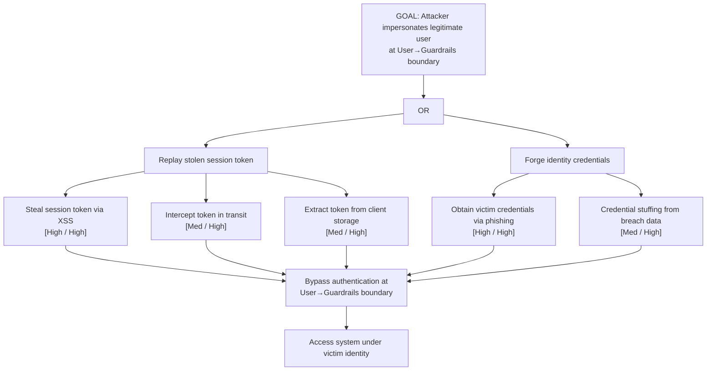
```mermaid
graph TD
    GOAL["GOAL: Attacker impersonates legitimate user\nat User→Guardrails boundary"]
    GOAL --> A["OR"]
    A --> B["Replay stolen session token"]
    A --> C["Forge identity credentials"]
    B --> B1["Steal session token via XSS\n[High / High]"]
    B --> B2["Intercept token in transit\n[Med / High]"]
    B --> B3["Extract token from client storage\n[Med / High]"]
    C --> C1["Obtain victim credentials via phishing\n[High / High]"]
    C --> C2["Credential stuffing from breach data\n[Med / High]"]
    B1 --> X["Bypass authentication at\nUser→Guardrails boundary"]
    B2 --> X
    B3 --> X
    C1 --> X
    C2 --> X
    X --> Y["Access system under victim identity"]
```

*Part of correlation group CG-3 (indirect) via CHAIN-002 terminal impact. See also: E-1, E-2, E-5.*

---

#### S-3: LLM Agent Orchestrator Identity Spoofing

_Unchanged from baseline (2026-04-19)._

**Component**: LLM Agent Orchestrator | **Risk Level**: Critical | **Finding**: S-3 | **MAESTRO Layer**: L1 — Foundation Model

A rogue process in the Application Zone injects unsigned delegation instructions into the Inter-Agent Communication Channel impersonating the Orchestrator; the Specialist Agent executes them believing they are legitimate.

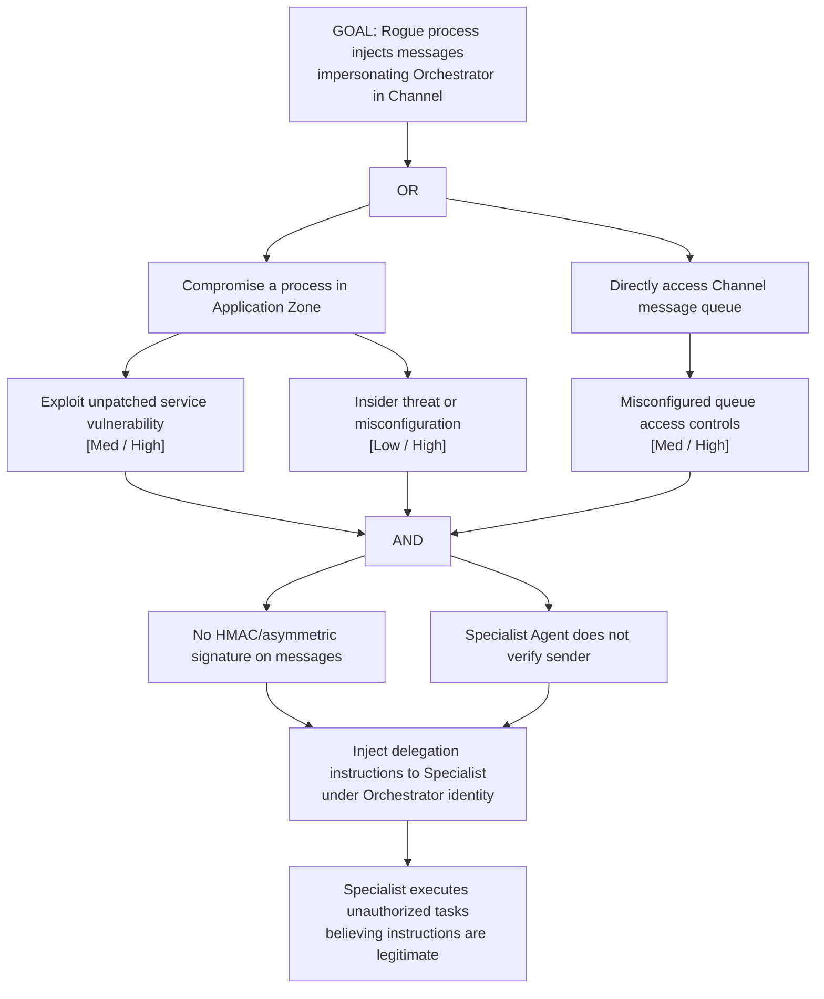
```mermaid
graph TD
    GOAL["GOAL: Rogue process injects messages\nimpersonating Orchestrator in Channel"]
    GOAL --> A["OR"]
    A --> B["Compromise a process in Application Zone"]
    A --> C["Directly access Channel message queue"]
    B --> B1["Exploit unpatched service vulnerability\n[Med / High]"]
    B --> B2["Insider threat or misconfiguration\n[Low / High]"]
    C --> C1["Misconfigured queue access controls\n[Med / High]"]
    B1 --> D["AND"]
    B2 --> D
    C1 --> D
    D --> E["No HMAC/asymmetric signature on messages"]
    D --> F["Specialist Agent does not verify sender"]
    E --> G["Inject delegation instructions to Specialist\nunder Orchestrator identity"]
    F --> G
    G --> H["Specialist executes unauthorized tasks\nbelieving instructions are legitimate"]
```

*Part of correlation group CG-3 context. Pattern: trust_exploitation.*

---

#### S-5: Inter-Agent Channel Identity Injection

_Unchanged from baseline (2026-04-19)._

**Component**: Inter-Agent Communication Channel | **Risk Level**: Critical | **Finding**: S-5

Any malicious Application Zone process can inject messages impersonating either the Orchestrator or the Specialist Agent into the shared message routing substrate.

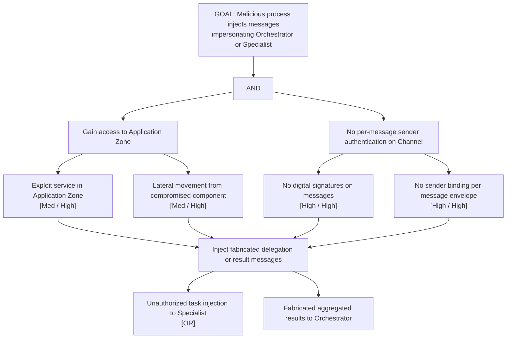
```mermaid
graph TD
    GOAL["GOAL: Malicious process injects messages\nimpersonating Orchestrator or Specialist"]
    GOAL --> A["AND"]
    A --> B["Gain access to Application Zone"]
    A --> C["No per-message sender authentication on Channel"]
    B --> B1["Exploit service in Application Zone\n[Med / High]"]
    B --> B2["Lateral movement from compromised component\n[Med / High]"]
    C --> C1["No digital signatures on messages\n[High / High]"]
    C --> C2["No sender binding per message envelope\n[High / High]"]
    B1 --> D["Inject fabricated delegation or result messages"]
    B2 --> D
    C1 --> D
    C2 --> D
    D --> E1["Unauthorized task injection to Specialist\n[OR]"]
    D --> E2["Fabricated aggregated results to Orchestrator"]
```

*Pattern: trust_exploitation.*

---

#### S-6: MCP Tool Server Caller Spoofing

_Unchanged from baseline (2026-04-19)._

**Component**: MCP Tool Server | **Risk Level**: Critical | **Finding**: S-6 | **MAESTRO Layer**: L3 — Agent Framework

An unauthorized Application Zone process submits tool calls under a spoofed agent identity, inheriting the Tool Server's full service credential set.

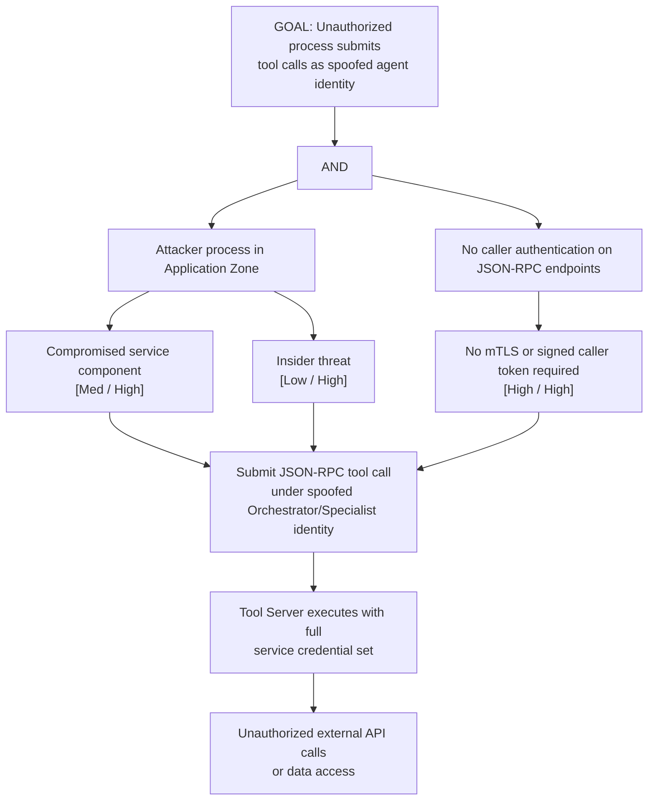
```mermaid
graph TD
    GOAL["GOAL: Unauthorized process submits\ntool calls as spoofed agent identity"]
    GOAL --> A["AND"]
    A --> B["Attacker process in Application Zone"]
    A --> C["No caller authentication on JSON-RPC endpoints"]
    B --> B1["Compromised service component\n[Med / High]"]
    B --> B2["Insider threat\n[Low / High]"]
    C --> C1["No mTLS or signed caller token required\n[High / High]"]
    B1 --> D["Submit JSON-RPC tool call\nunder spoofed Orchestrator/Specialist identity"]
    B2 --> D
    C1 --> D
    D --> E["Tool Server executes with full\nservice credential set"]
    E --> F["Unauthorized external API calls\nor data access"]
```

*Pattern: trust_exploitation.*

---

#### S-7: Learning Loop Training Signal Spoofing

_Unchanged from baseline (2026-04-19)._

**Component**: Long-Running Learning Loop | **Risk Level**: Critical | **Finding**: S-7

Fabricated training signals injected via a compromised Audit Logger silently manipulate future model updates, with no cryptographic verification on the ingested signal stream.

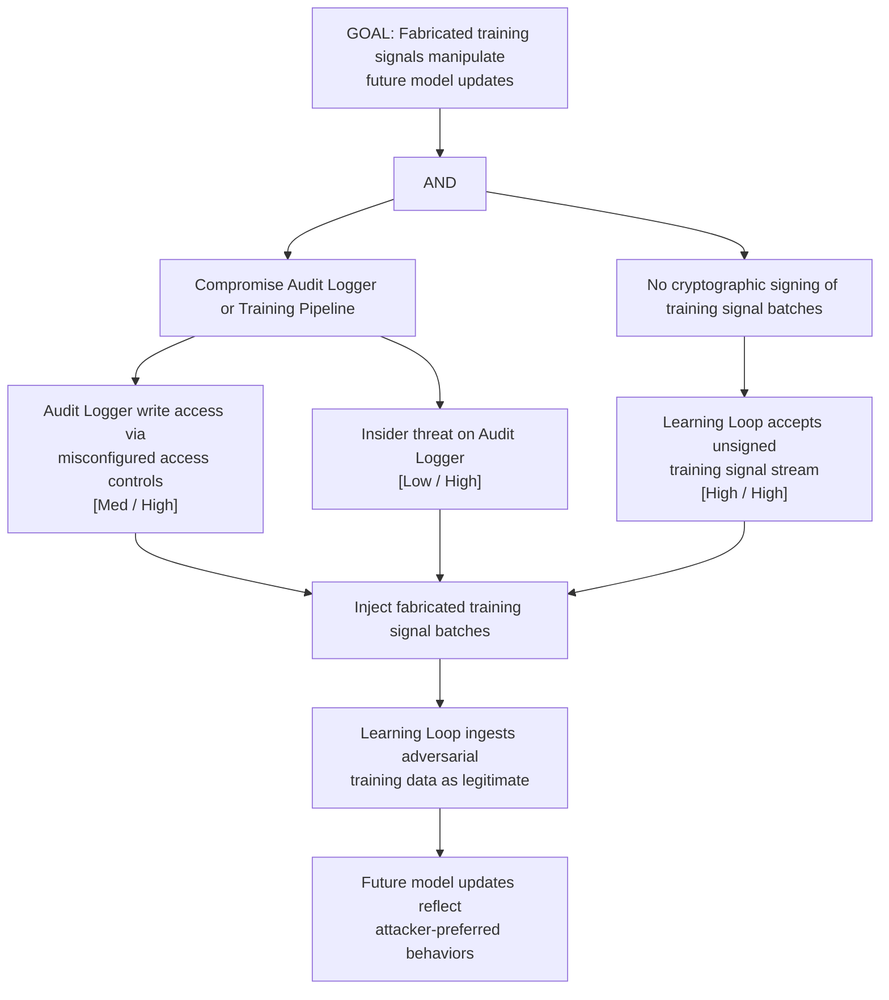
```mermaid
graph TD
    GOAL["GOAL: Fabricated training signals manipulate\nfuture model updates"]
    GOAL --> A["AND"]
    A --> B["Compromise Audit Logger or Training Pipeline"]
    A --> C["No cryptographic signing of training signal batches"]
    B --> B1["Audit Logger write access via\nmisconfigured access controls\n[Med / High]"]
    B --> B2["Insider threat on Audit Logger\n[Low / High]"]
    C --> C1["Learning Loop accepts unsigned\ntraining signal stream\n[High / High]"]
    B1 --> D["Inject fabricated training signal batches"]
    B2 --> D
    C1 --> D
    D --> E["Learning Loop ingests adversarial\ntraining data as legitimate"]
    E --> F["Future model updates reflect\nattacker-preferred behaviors"]
```

*Pattern: temporal_attack.*

---

#### T-2: LLM Agent Orchestrator Context Window Tampering

_Unchanged from baseline (2026-04-19)._

**Component**: LLM Agent Orchestrator | **Risk Level**: Critical | **Finding**: T-2 | **MAESTRO Layer**: L1 — Foundation Model

An attacker who controls any upstream data source (Knowledge Base, Inter-Agent Channel, or tool results) injects adversarial content into the Orchestrator's context window, corrupting its reasoning and outputs. Chain-breaking target for CHAIN-001.

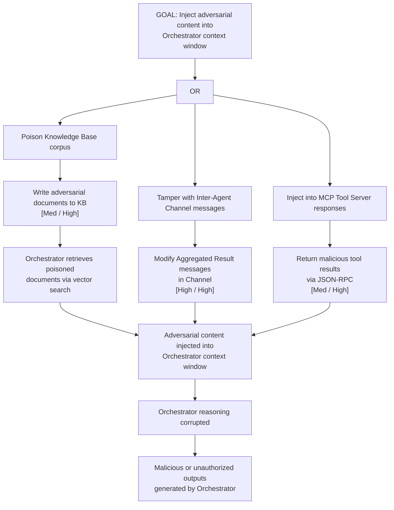
```mermaid
graph TD
    GOAL["GOAL: Inject adversarial content into\nOrchestrator context window"]
    GOAL --> A["OR"]
    A --> B["Poison Knowledge Base corpus"]
    A --> C["Tamper with Inter-Agent Channel messages"]
    A --> D["Inject into MCP Tool Server responses"]
    B --> B1["Write adversarial documents to KB\n[Med / High]"]
    B1 --> B2["Orchestrator retrieves poisoned\ndocuments via vector search"]
    C --> C1["Modify Aggregated Result messages\nin Channel\n[High / High]"]
    D --> D1["Return malicious tool results\nvia JSON-RPC\n[Med / High]"]
    B2 --> E["Adversarial content injected into\nOrchestrator context window"]
    C1 --> E
    D1 --> E
    E --> F["Orchestrator reasoning corrupted"]
    F --> G["Malicious or unauthorized outputs\ngenerated by Orchestrator"]
```

*Part of correlation group CG-1 (with LLM-4). Also participates in CHAIN-001 as intermediate_cascade target.*

---

#### T-3: Specialist Agent Delegation Message Tampering

_Unchanged from baseline (2026-04-19)._

**Component**: Specialist Agent | **Risk Level**: Critical | **Finding**: T-3

Adversarial content injected into a Delegated Task message via channel tampering redirects the Specialist's tool call targets, modifies task parameters, or embeds exfiltration URLs in the task payload.

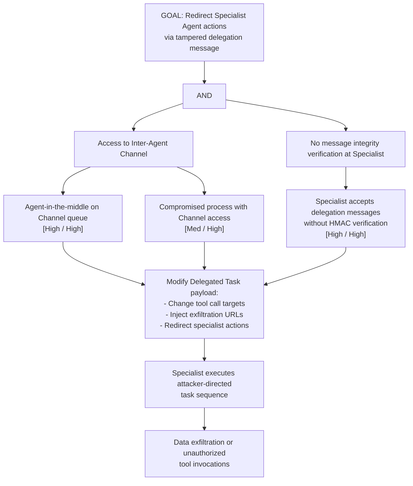
```mermaid
graph TD
    GOAL["GOAL: Redirect Specialist Agent actions\nvia tampered delegation message"]
    GOAL --> A["AND"]
    A --> B["Access to Inter-Agent Channel"]
    A --> C["No message integrity verification at Specialist"]
    B --> B1["Agent-in-the-middle on Channel queue\n[High / High]"]
    B --> B2["Compromised process with Channel access\n[Med / High]"]
    C --> C1["Specialist accepts delegation messages\nwithout HMAC verification\n[High / High]"]
    B1 --> D["Modify Delegated Task payload:\n- Change tool call targets\n- Inject exfiltration URLs\n- Redirect specialist actions"]
    B2 --> D
    C1 --> D
    D --> E["Specialist executes attacker-directed\ntask sequence"]
    E --> F["Data exfiltration or unauthorized\ntool invocations"]
```

---

#### T-4: Inter-Agent Channel Message Tampering

_Unchanged from baseline (2026-04-19)._

**Component**: Inter-Agent Communication Channel | **Risk Level**: Critical | **Finding**: T-4

An agent-in-the-middle process modifies delegation messages in transit by accessing the channel's message queue; without end-to-end integrity protection, modifications are undetectable.

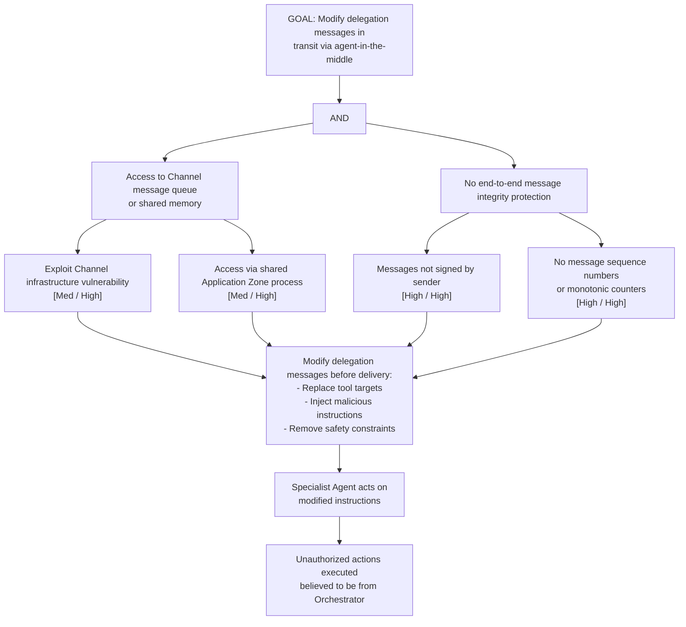
```mermaid
graph TD
    GOAL["GOAL: Modify delegation messages in\ntransit via agent-in-the-middle"]
    GOAL --> A["AND"]
    A --> B["Access to Channel message queue\nor shared memory"]
    A --> C["No end-to-end message integrity protection"]
    B --> B1["Exploit Channel infrastructure vulnerability\n[Med / High]"]
    B --> B2["Access via shared Application Zone process\n[Med / High]"]
    C --> C1["Messages not signed by sender\n[High / High]"]
    C --> C2["No message sequence numbers\nor monotonic counters\n[High / High]"]
    B1 --> D["Modify delegation messages before delivery:\n- Replace tool targets\n- Inject malicious instructions\n- Remove safety constraints"]
    B2 --> D
    C1 --> D
    C2 --> D
    D --> E["Specialist Agent acts on\nmodified instructions"]
    E --> F["Unauthorized actions executed\nbelieved to be from Orchestrator"]
```

*Pattern: communication_vulnerability.*

---

#### T-5: MCP Tool Server Parameter Injection

_Unchanged from baseline (2026-04-19)._

**Component**: MCP Tool Server | **Risk Level**: Critical | **Finding**: T-5 | **MAESTRO Layer**: L3 — Agent Framework

LLM-generated tool call parameters containing shell metacharacters, SQL fragments, or injected tool names reach the Tool Server without allowlist validation, enabling execution of malicious operations.

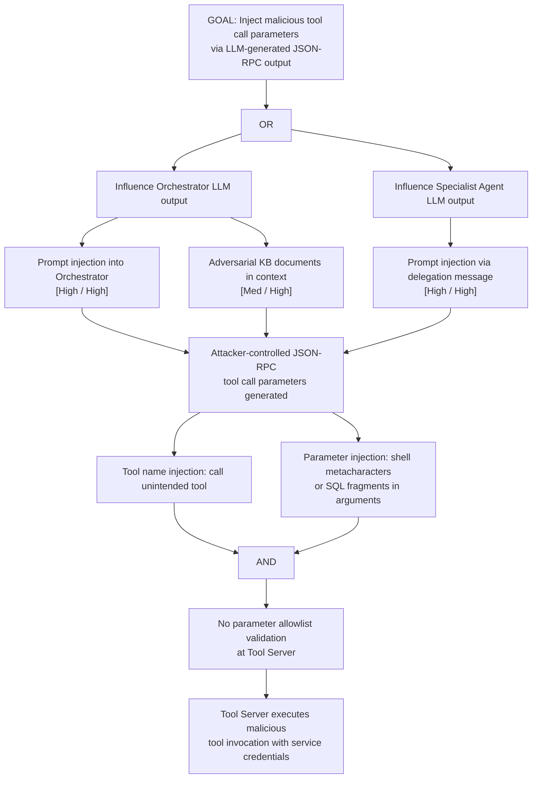
```mermaid
graph TD
    GOAL["GOAL: Inject malicious tool call parameters\nvia LLM-generated JSON-RPC output"]
    GOAL --> A["OR"]
    A --> B["Influence Orchestrator LLM output"]
    A --> C["Influence Specialist Agent LLM output"]
    B --> B1["Prompt injection into Orchestrator\n[High / High]"]
    B --> B2["Adversarial KB documents in context\n[Med / High]"]
    C --> C1["Prompt injection via delegation message\n[High / High]"]
    B1 --> D["Attacker-controlled JSON-RPC\ntool call parameters generated"]
    B2 --> D
    C1 --> D
    D --> D1["Tool name injection: call unintended tool"]
    D --> D2["Parameter injection: shell metacharacters\nor SQL fragments in arguments"]
    D1 --> E["AND"]
    D2 --> E
    E --> F["No parameter allowlist validation\nat Tool Server"]
    F --> G["Tool Server executes malicious\ntool invocation with service credentials"]
```

---

#### T-8: Learning Loop Training Signal Poisoning (Temporal Attack)

_Unchanged from baseline (2026-04-19)._

**Component**: Long-Running Learning Loop | **Risk Level**: Critical | **Finding**: T-8

Adversarial records injected into the Audit Logger before training runs create time-delayed sleeper-agent behaviors in the model update, activating only when a specific trigger pattern appears in future prompts.

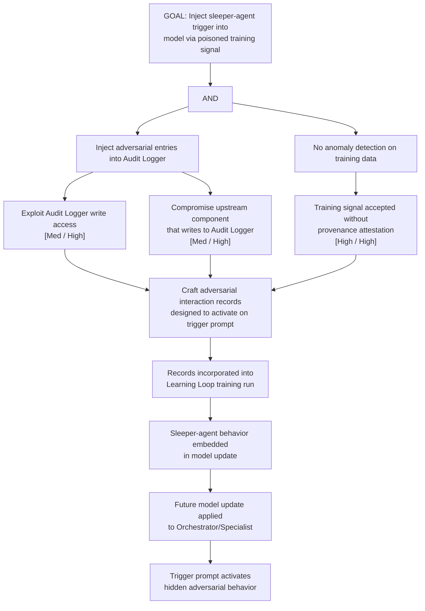
```mermaid
graph TD
    GOAL["GOAL: Inject sleeper-agent trigger into\nmodel via poisoned training signal"]
    GOAL --> A["AND"]
    A --> B["Inject adversarial entries into Audit Logger"]
    A --> C["No anomaly detection on training data"]
    B --> B1["Exploit Audit Logger write access\n[Med / High]"]
    B --> B2["Compromise upstream component\nthat writes to Audit Logger\n[Med / High]"]
    C --> C1["Training signal accepted without\nprovenance attestation\n[High / High]"]
    B1 --> D["Craft adversarial interaction records\ndesigned to activate on trigger prompt"]
    B2 --> D
    C1 --> D
    D --> E["Records incorporated into\nLearning Loop training run"]
    E --> F["Sleeper-agent behavior embedded\nin model update"]
    F --> G["Future model update applied\nto Orchestrator/Specialist"]
    G --> H["Trigger prompt activates\nhidden adversarial behavior"]
```

*Part of correlation group CG-2 (with LLM-11). Pattern: temporal_attack. Also participates in CHAIN-003 as intermediate_cascade.*

---

#### R-3: LLM Agent Orchestrator Action Repudiation

_Unchanged from baseline (2026-04-19)._

**Component**: LLM Agent Orchestrator | **Risk Level**: Critical | **Finding**: R-3 | **MAESTRO Layer**: L1 — Foundation Model

Without per-action content-hashed and service-key-signed log entries written before execution, the Orchestrator's delegation messages and tool calls cannot be forensically attributed, enabling denial of unauthorized actions.

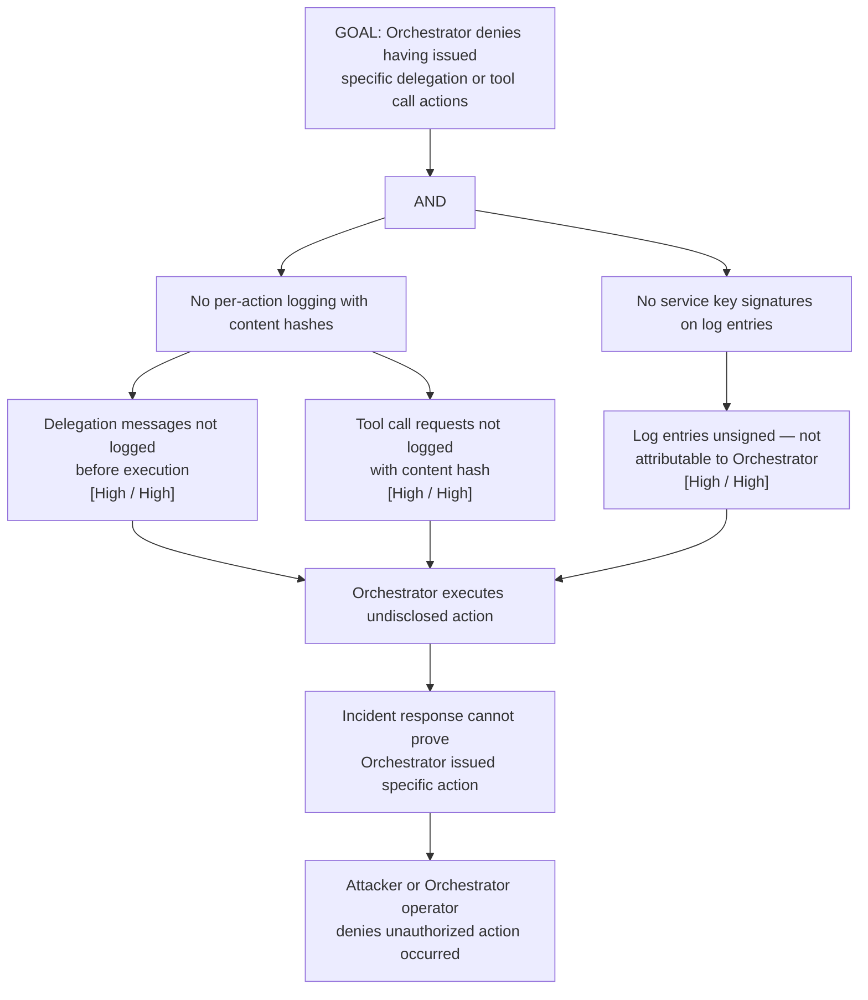
```mermaid
graph TD
    GOAL["GOAL: Orchestrator denies having issued\nspecific delegation or tool call actions"]
    GOAL --> A["AND"]
    A --> B["No per-action logging with content hashes"]
    A --> C["No service key signatures on log entries"]
    B --> B1["Delegation messages not logged\nbefore execution\n[High / High]"]
    B --> B2["Tool call requests not logged\nwith content hash\n[High / High]"]
    C --> C1["Log entries unsigned — not\nattributable to Orchestrator\n[High / High]"]
    B1 --> D["Orchestrator executes undisclosed action"]
    B2 --> D
    C1 --> D
    D --> E["Incident response cannot prove\nOrchestrator issued specific action"]
    E --> F["Attacker or Orchestrator operator\ndenies unauthorized action occurred"]
```

*Part of correlation group CG-3 (with E-2 and AG-1).*

---

#### I-2: LLM Agent Orchestrator Context Window Leakage

_Unchanged from baseline (2026-04-19)._

**Component**: LLM Agent Orchestrator | **Risk Level**: Critical | **Finding**: I-2 | **MAESTRO Layer**: L1 — Foundation Model

Prompt injection or model hallucination causes the Orchestrator to include sensitive context — system prompt preambles, Knowledge Base document identifiers, tool response metadata — in its HTTPS response to the User. Initial exploit in CHAIN-004.

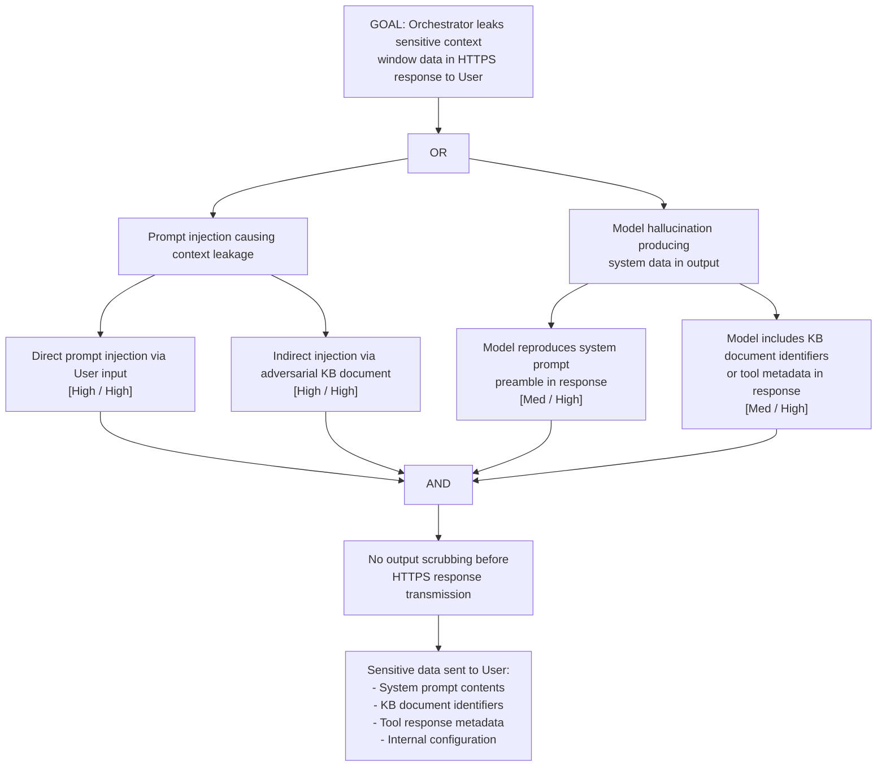
```mermaid
graph TD
    GOAL["GOAL: Orchestrator leaks sensitive context\nwindow data in HTTPS response to User"]
    GOAL --> A["OR"]
    A --> B["Prompt injection causing context leakage"]
    A --> C["Model hallucination producing\nsystem data in output"]
    B --> B1["Direct prompt injection via User input\n[High / High]"]
    B --> B2["Indirect injection via adversarial KB document\n[High / High]"]
    C --> C1["Model reproduces system prompt\npreamble in response\n[Med / High]"]
    C --> C2["Model includes KB document identifiers\nor tool metadata in response\n[Med / High]"]
    B1 --> D["AND"]
    B2 --> D
    C1 --> D
    C2 --> D
    D --> E["No output scrubbing before\nHTTPS response transmission"]
    E --> F["Sensitive data sent to User:\n- System prompt contents\n- KB document identifiers\n- Tool response metadata\n- Internal configuration"]
```

*Part of correlation group CG-4 (with LLM-1). Initial exploit in CHAIN-004.*

---

#### I-4: Inter-Agent Channel Message Interception

_Unchanged from baseline (2026-04-19)._

**Component**: Inter-Agent Communication Channel | **Risk Level**: Critical | **Finding**: I-4

Any Application Zone process with access to the shared message bus or queue can observe unencrypted inter-agent messages, harvesting sensitive task payloads, authorization tokens, and Specialist results. Chain-breaking control target for CHAIN-004.

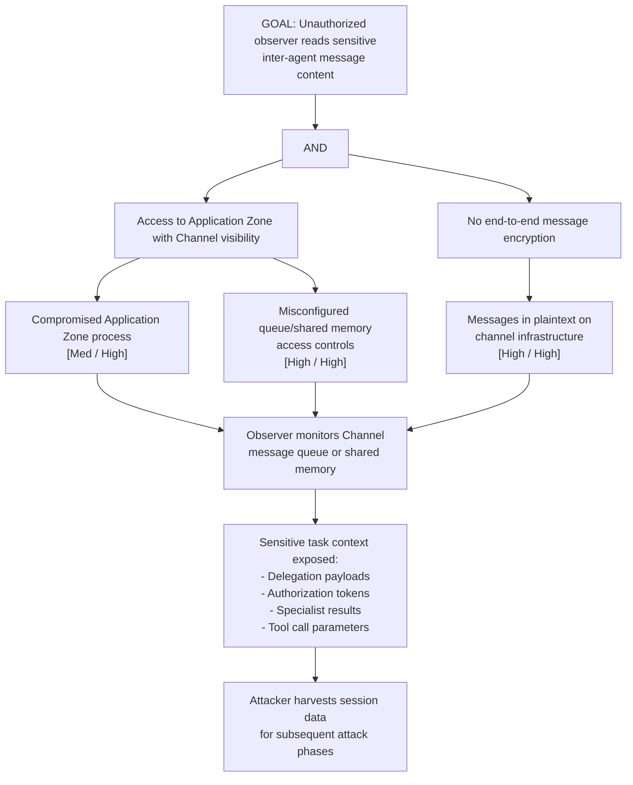
```mermaid
graph TD
    GOAL["GOAL: Unauthorized observer reads sensitive\ninter-agent message content"]
    GOAL --> A["AND"]
    A --> B["Access to Application Zone with Channel visibility"]
    A --> C["No end-to-end message encryption"]
    B --> B1["Compromised Application Zone process\n[Med / High]"]
    B --> B2["Misconfigured queue/shared memory\naccess controls\n[High / High]"]
    C --> C1["Messages in plaintext on\nchannel infrastructure\n[High / High]"]
    B1 --> D["Observer monitors Channel\nmessage queue or shared memory"]
    B2 --> D
    C1 --> D
    D --> E["Sensitive task context exposed:\n- Delegation payloads\n- Authorization tokens\n- Specialist results\n- Tool call parameters"]
    E --> F["Attacker harvests session data\nfor subsequent attack phases"]
```

*Pattern: communication_vulnerability. Chain-breaking target for CHAIN-004.*

---

#### I-7: Audit Logger Unauthorized Read Access

_Unchanged from baseline (2026-04-19)._

**Component**: Audit Logger | **Risk Level**: Critical | **Finding**: I-7 | **MAESTRO Layer**: L5 — Evaluation and Observability

Misconfigured read access controls, default credentials, or a compromised service with log-read authority expose the full operational history of the agent system — user prompts, model decisions, tool parameters, and filtering triggers.

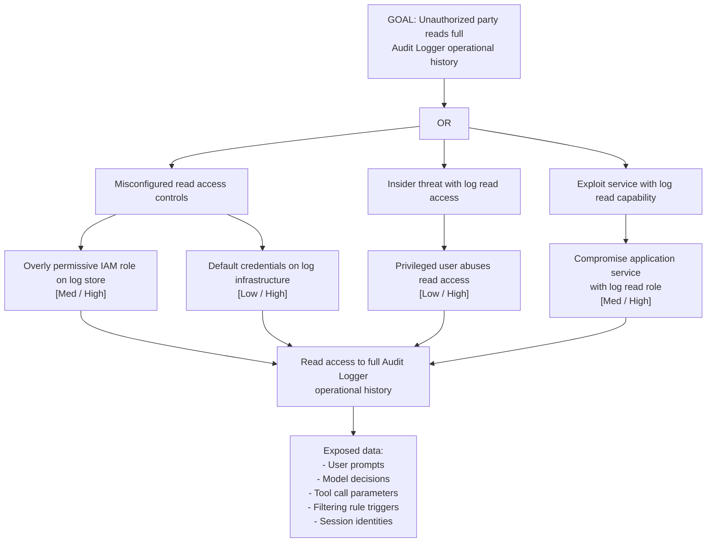
```mermaid
graph TD
    GOAL["GOAL: Unauthorized party reads full\nAudit Logger operational history"]
    GOAL --> A["OR"]
    A --> B["Misconfigured read access controls"]
    A --> C["Insider threat with log read access"]
    A --> D["Exploit service with log read capability"]
    B --> B1["Overly permissive IAM role on log store\n[Med / High]"]
    B --> B2["Default credentials on log infrastructure\n[Low / High]"]
    C --> C1["Privileged user abuses read access\n[Low / High]"]
    D --> D1["Compromise application service\nwith log read role\n[Med / High]"]
    B1 --> E["Read access to full Audit Logger\noperational history"]
    B2 --> E
    C1 --> E
    D1 --> E
    E --> F["Exposed data:\n- User prompts\n- Model decisions\n- Tool call parameters\n- Filtering rule triggers\n- Session identities"]
```

---

#### D-1: Guardrails Service Resource Exhaustion

_Unchanged from baseline (2026-04-19)._

**Component**: Guardrails Service | **Risk Level**: Critical | **Finding**: D-1 | **MAESTRO Layer**: L6 — Security and Compliance

High-volume computationally expensive prompt submissions exhaust the Guardrails Service evaluation capacity, collapsing the filtering pipeline with no per-IP rate limiting enforced before the service.

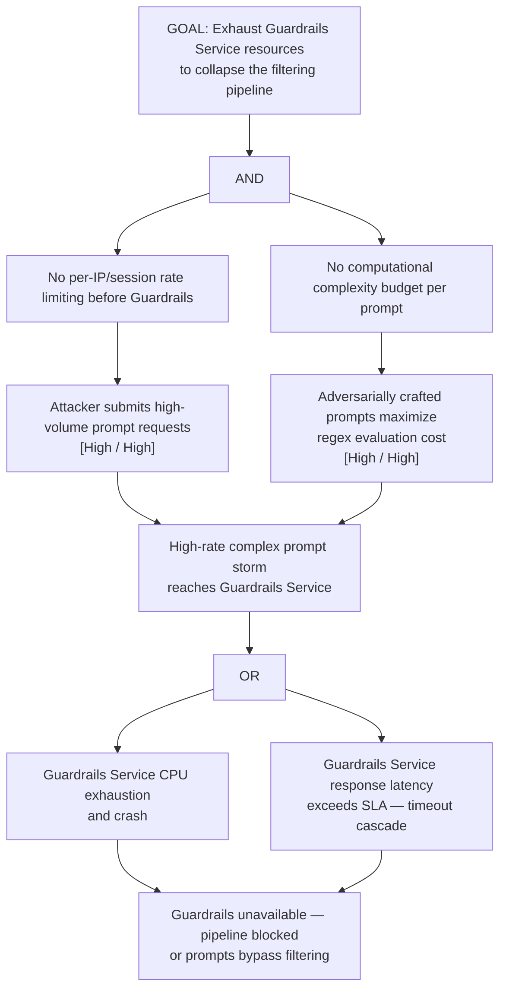
```mermaid
graph TD
    GOAL["GOAL: Exhaust Guardrails Service resources\nto collapse the filtering pipeline"]
    GOAL --> A["AND"]
    A --> B["No per-IP/session rate limiting before Guardrails"]
    A --> C["No computational complexity budget per prompt"]
    B --> B1["Attacker submits high-volume prompt requests\n[High / High]"]
    C --> C1["Adversarially crafted prompts maximize\nregex evaluation cost\n[High / High]"]
    B1 --> D["High-rate complex prompt storm\nreaches Guardrails Service"]
    C1 --> D
    D --> E["OR"]
    E --> E1["Guardrails Service CPU exhaustion\nand crash"]
    E --> E2["Guardrails Service response latency\nexceeds SLA — timeout cascade"]
    E1 --> F["Guardrails unavailable — pipeline blocked\nor prompts bypass filtering"]
    E2 --> F
```

---

#### D-2: LLM Agent Orchestrator Inference Pipeline Exhaustion

_Unchanged from baseline (2026-04-19)._

**Component**: LLM Agent Orchestrator | **Risk Level**: Critical | **Finding**: D-2 | **MAESTRO Layer**: L1 — Foundation Model

High-token-count prompt floods or recursive tool invocation chains exhaust the Orchestrator's bounded inference capacity, starving legitimate user requests of processing resources.

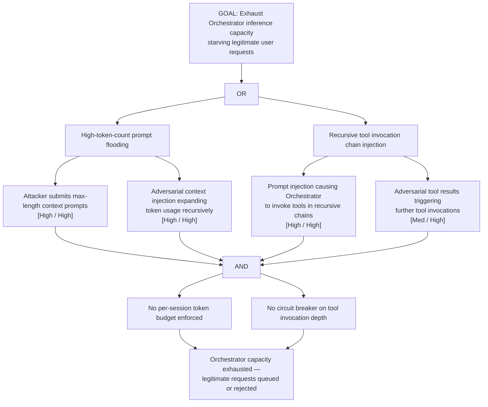
```mermaid
graph TD
    GOAL["GOAL: Exhaust Orchestrator inference capacity\nstarving legitimate user requests"]
    GOAL --> A["OR"]
    A --> B["High-token-count prompt flooding"]
    A --> C["Recursive tool invocation chain injection"]
    B --> B1["Attacker submits max-length context prompts\n[High / High]"]
    B --> B2["Adversarial context injection expanding\ntoken usage recursively\n[High / High]"]
    C --> C1["Prompt injection causing Orchestrator\nto invoke tools in recursive chains\n[High / High]"]
    C --> C2["Adversarial tool results triggering\nfurther tool invocations\n[Med / High]"]
    B1 --> D["AND"]
    B2 --> D
    C1 --> D
    C2 --> D
    D --> E["No per-session token budget enforced"]
    D --> F["No circuit breaker on tool invocation depth"]
    E --> G["Orchestrator capacity exhausted —\nlegitimate requests queued or rejected"]
    F --> G
```

*Pattern: resource_competition.*

---

#### D-5: MCP Tool Server Connection Pool Exhaustion

_Unchanged from baseline (2026-04-19)._

**Component**: MCP Tool Server | **Risk Level**: Critical | **Finding**: D-5 | **MAESTRO Layer**: L3 — Agent Framework

Adversarially prompted agents generate high-volume concurrent tool call requests, exhausting the Tool Server's External API connection pool and causing all legitimate tool calls to fail. Part of correlation group CG-5 with AG-6.

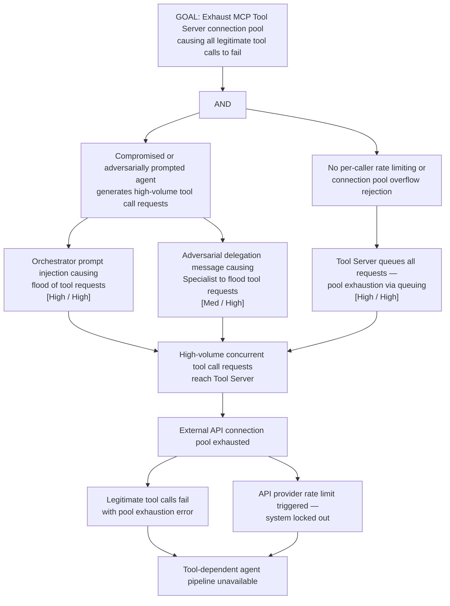
```mermaid
graph TD
    GOAL["GOAL: Exhaust MCP Tool Server connection pool\ncausing all legitimate tool calls to fail"]
    GOAL --> A["AND"]
    A --> B["Compromised or adversarially prompted agent\ngenerates high-volume tool call requests"]
    A --> C["No per-caller rate limiting or\nconnection pool overflow rejection"]
    B --> B1["Orchestrator prompt injection causing\nflood of tool requests\n[High / High]"]
    B --> B2["Adversarial delegation message causing\nSpecialist to flood tool requests\n[Med / High]"]
    C --> C1["Tool Server queues all requests —\npool exhaustion via queuing\n[High / High]"]
    B1 --> D["High-volume concurrent tool call requests\nreach Tool Server"]
    B2 --> D
    C1 --> D
    D --> E["External API connection pool exhausted"]
    E --> F1["Legitimate tool calls fail\nwith pool exhaustion error"]
    E --> F2["API provider rate limit triggered —\nsystem locked out"]
    F1 --> G["Tool-dependent agent pipeline unavailable"]
    F2 --> G
```

*Part of correlation group CG-5 (with AG-6). Pattern: resource_competition.*

---

#### E-1: Guardrails Service Prompt Injection Bypass Privilege Escalation

_Unchanged from baseline (2026-04-19)._

**Component**: Guardrails Service | **Risk Level**: Critical | **Finding**: E-1 | **MAESTRO Layer**: L6 — Security and Compliance

A prompt injection attack that evades Guardrails content filtering elevates the attacker's privilege from "unauthenticated user" to "trusted Orchestrator caller." Initial exploit in CHAIN-002.

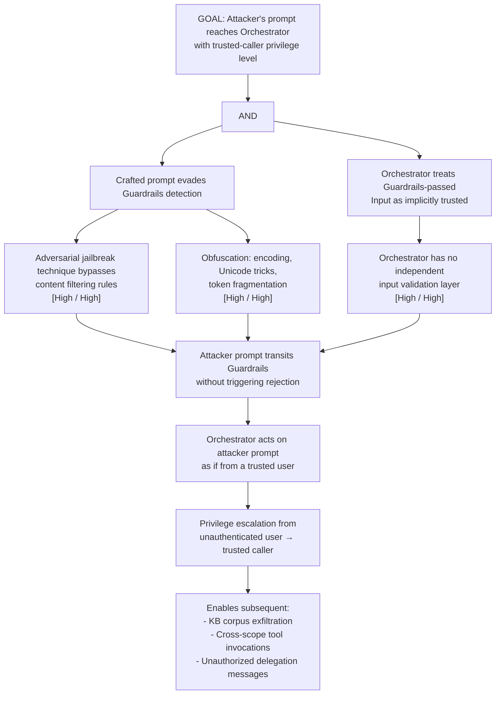
```mermaid
graph TD
    GOAL["GOAL: Attacker's prompt reaches Orchestrator\nwith trusted-caller privilege level"]
    GOAL --> A["AND"]
    A --> B["Crafted prompt evades Guardrails detection"]
    A --> C["Orchestrator treats Guardrails-passed\nInput as implicitly trusted"]
    B --> B1["Adversarial jailbreak technique bypasses\ncontent filtering rules\n[High / High]"]
    B --> B2["Obfuscation: encoding, Unicode tricks,\ntoken fragmentation\n[High / High]"]
    C --> C1["Orchestrator has no independent\ninput validation layer\n[High / High]"]
    B1 --> D["Attacker prompt transits Guardrails\nwithout triggering rejection"]
    B2 --> D
    C1 --> D
    D --> E["Orchestrator acts on attacker prompt\nas if from a trusted user"]
    E --> F["Privilege escalation from\nunauthenticated user → trusted caller"]
    F --> G["Enables subsequent:\n- KB corpus exfiltration\n- Cross-scope tool invocations\n- Unauthorized delegation messages"]
```

*Initial exploit in CHAIN-002.*

---

#### E-2: LLM Agent Orchestrator Self-Authorized Privilege Escalation

_Unchanged from baseline (2026-04-19)._

**Component**: LLM Agent Orchestrator | **Risk Level**: Critical | **Finding**: E-2 | **MAESTRO Layer**: L1 — Foundation Model

Prompt injection manipulates the Orchestrator's reasoning to cause it to self-authorize elevated operations beyond the user session's permitted scope. Part of correlation group CG-3. Chain-breaking target for CHAIN-002.

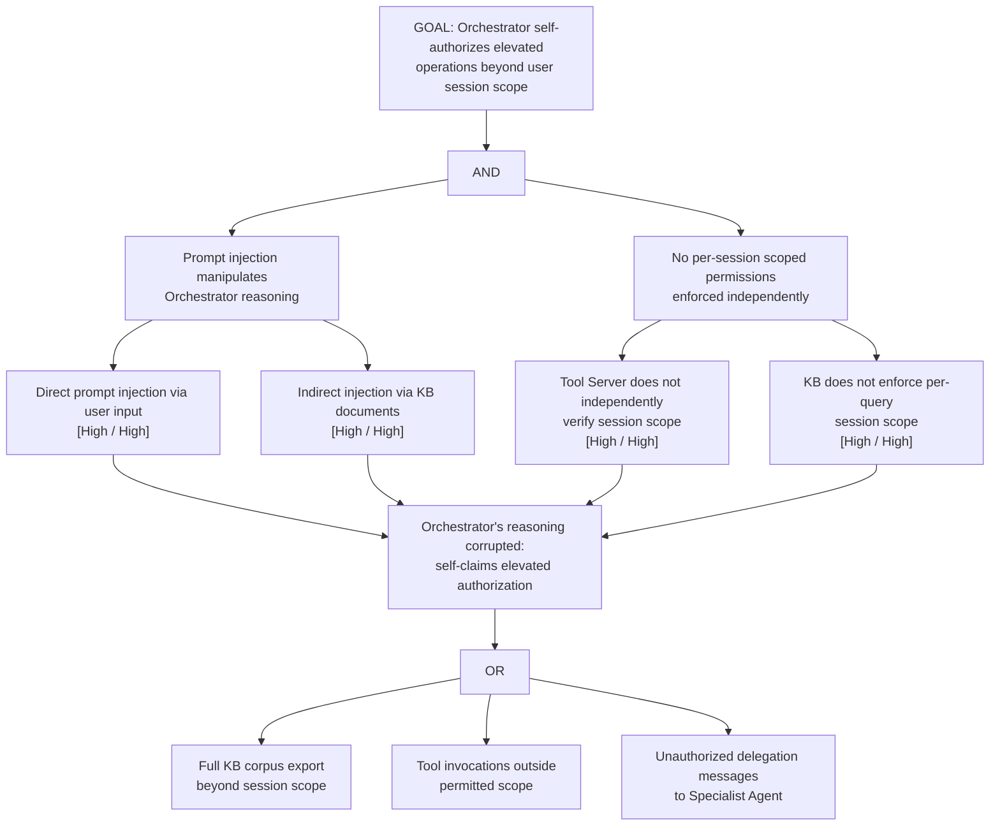
```mermaid
graph TD
    GOAL["GOAL: Orchestrator self-authorizes elevated\noperations beyond user session scope"]
    GOAL --> A["AND"]
    A --> B["Prompt injection manipulates\nOrchestrator reasoning"]
    A --> C["No per-session scoped permissions\nenforced independently"]
    B --> B1["Direct prompt injection via user input\n[High / High]"]
    B --> B2["Indirect injection via KB documents\n[High / High]"]
    C --> C1["Tool Server does not independently\nverify session scope\n[High / High]"]
    C --> C2["KB does not enforce per-query\nsession scope\n[High / High]"]
    B1 --> D["Orchestrator's reasoning corrupted:\nself-claims elevated authorization"]
    B2 --> D
    C1 --> D
    C2 --> D
    D --> E["OR"]
    E --> E1["Full KB corpus export\nbeyond session scope"]
    E --> E2["Tool invocations outside\npermitted scope"]
    E --> E3["Unauthorized delegation messages\nto Specialist Agent"]
```

*Part of correlation group CG-3 (with R-3 and AG-1). Chain-breaking target for CHAIN-002.*

---

#### E-4: Inter-Agent Channel Elevated Sender Identity Injection

_Unchanged from baseline (2026-04-19)._

**Component**: Inter-Agent Communication Channel | **Risk Level**: Critical | **Finding**: E-4

A low-privilege Application Zone process forges message identity headers claiming elevated sender roles (Orchestrator trust level), because the Channel does not enforce sender credential verification.

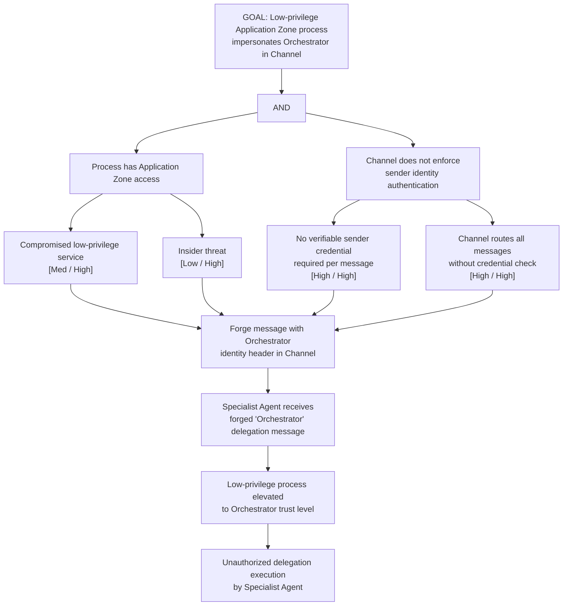
```mermaid
graph TD
    GOAL["GOAL: Low-privilege Application Zone process\nimpersonates Orchestrator in Channel"]
    GOAL --> A["AND"]
    A --> B["Process has Application Zone access"]
    A --> C["Channel does not enforce\nsender identity authentication"]
    B --> B1["Compromised low-privilege service\n[Med / High]"]
    B --> B2["Insider threat\n[Low / High]"]
    C --> C1["No verifiable sender credential\nrequired per message\n[High / High]"]
    C --> C2["Channel routes all messages\nwithout credential check\n[High / High]"]
    B1 --> D["Forge message with Orchestrator\nidentity header in Channel"]
    B2 --> D
    C1 --> D
    C2 --> D
    D --> E["Specialist Agent receives\nforged 'Orchestrator' delegation message"]
    E --> F["Low-privilege process elevated\nto Orchestrator trust level"]
    F --> G["Unauthorized delegation execution\nby Specialist Agent"]
```

---

#### E-5: MCP Tool Server Credential Privilege Escalation

_Unchanged from baseline (2026-04-19)._

**Component**: MCP Tool Server | **Risk Level**: Critical | **Finding**: E-5 | **MAESTRO Layer**: L3 — Agent Framework

Forged caller identity or prompt-injection-caused out-of-scope tool calls gain the Tool Server's full execution privilege set — API keys, data store access, and service tokens — without independent session-scope validation. Part of CHAIN-002 intermediate cascade.

```mermaid
graph TD
    GOAL["GOAL: Unauthorized agent gains Tool Server's\nexecution privileges and credential set"]
    GOAL --> A["OR"]
    A --> B["Forged caller identity submits tool call"]
    A --> C["Exploited Orchestrator issues\nout-of-scope tool call"]
    B --> B1["Spoof Orchestrator caller token\n[High / High]"]
    B --> B2["Compromise mTLS certificate\n[Low / High]"]
    C --> C1["Prompt injection causes Orchestrator\nto invoke unauthorized tools\n[High / High]"]
    B1 --> D["Tool Server receives unauthorized\ntool call request"]
    B2 --> D
    C1 --> D
    D --> E["AND"]
    E --> E1["No zero-trust authorization\nagainst originating session scope"]
    E --> E2["Tool Server trusts caller identity\nwithout independent scope check"]
    E1 --> F["Tool Server executes with full\nservice account credentials:\n- External API keys\n- Data store access\n- Service tokens"]
    E2 --> F
```

*Intermediate cascade in CHAIN-002.*

---

#### E-6: Learning Loop Model Update Privilege Escalation

_Unchanged from baseline (2026-04-19)._

**Component**: Long-Running Learning Loop | **Risk Level**: Critical | **Finding**: E-6

A poisoned model update escalates the attacker from data-layer access (Audit Logger write) to model-parameter control — enabling injection of arbitrary behaviors into both the Orchestrator and Specialist via the next update cycle.

```mermaid
graph TD
    GOAL["GOAL: Attacker escalates from data-layer access\nto model-parameter control via Learning Loop"]
    GOAL --> A["AND"]
    A --> B["Compromise training signal or update channel"]
    A --> C["No authentication/authorization on model update push"]
    B --> B1["Audit Logger poisoning with\nadversarial training data\n[High / High]"]
    B --> B2["Intercept update channel between\nLearning Loop and agents\n[Low / High]"]
    C --> C1["Model update packages not signed\nby HSM-backed key\n[High / High]"]
    C --> C2["Orchestrator/Specialist accept updates\nwithout signature verification\n[High / High]"]
    B1 --> D["Adversarially trained model update\nproduced by Learning Loop"]
    B2 --> D
    C1 --> D
    C2 --> D
    D --> E["Model update applied to\nOrchestrator and Specialist"]
    E --> F["Attacker controls model behaviors:\n- Arbitrary response generation\n- Backdoor trigger activation\n- Capability expansion beyond scope"]
```

*Pattern: temporal_attack.*

---

#### AG-1: LLM Agent Orchestrator Unauthorized Autonomous Action

_Unchanged from baseline (2026-04-19)._

**Component**: LLM Agent Orchestrator | **Risk Level**: Critical | **Finding**: AG-1 | **MAESTRO Layer**: L1 — Foundation Model

Prompt injection hijacks the Orchestrator's reasoning to cause autonomous execution of unauthorized high-impact actions (mass KB export, bulk External API calls, unauthorized Specialist delegation) without any scope validation or human oversight. Part of correlation group CG-3.

```mermaid
graph TD
    GOAL["GOAL: Orchestrator autonomously executes\nunauthorized high-impact actions"]
    GOAL --> A["AND"]
    A --> B["Prompt injection hijacks Orchestrator reasoning"]
    A --> C["No scope-enforcement or human-in-the-loop\nfor high-impact operations"]
    B --> B1["Direct user prompt injection\n[High / High]"]
    B --> B2["Indirect KB document injection\n[High / High]"]
    C --> C1["No per-action scope validation\nbefore execution\n[High / High]"]
    C --> C2["No policy engine approval\nfor high-privilege operations\n[High / High]"]
    B1 --> D["Orchestrator acts on attacker-directed\ninstruction autonomously"]
    B2 --> D
    C1 --> D
    C2 --> D
    D --> E1["Mass data exfiltration from KB"]
    D --> E2["Bulk unauthorized External API calls"]
    D --> E3["Unauthorized delegation to Specialist\nfor compound prohibited actions"]
```

*Part of correlation group CG-3 (with E-2 and R-3). Terminal impact in CHAIN-001.*

---

#### AG-2: Agent Collusion — Orchestrator + Specialist Coordination

_Unchanged from baseline (2026-04-19)._

**Component**: LLM Agent Orchestrator | **Risk Level**: Critical | **Finding**: AG-2 | **MAESTRO Layer**: L1 — Foundation Model

The Orchestrator and Specialist Agent can jointly coordinate via the Inter-Agent Channel to achieve combined actions that exceed per-agent policy limits, enabled by the absence of cross-agent rate limits or combined action sequence evaluation.

```mermaid
graph TD
    GOAL["GOAL: Orchestrator and Specialist coordinate\nto exceed per-agent policy limits"]
    GOAL --> A["OR"]
    A --> B["Attacker compromises both agents\nwith coordinated prompts"]
    A --> C["Adversarial inter-agent channel\nmessage injection"]
    B --> B1["Inject coordinated instructions\nvia User prompt targeting Orchestrator\n[High / High]"]
    B --> B2["Inject coordinated instructions\nvia Delegation Message targeting Specialist\n[High / High]"]
    C --> C1["Modify channel messages to embed\ncoordination instructions in both agents\n[High / High]"]
    B1 --> D["AND"]
    B2 --> D
    C1 --> D
    D --> E["No cross-agent rate limits\nor coordination throttles"]
    D --> F["No combined action sequence\npolicy evaluation"]
    E --> G["Joint action achieves prohibited outcome:\n- Policy circumvention\n- Joint data exfiltration exceeding\n  per-agent data export limits\n- Rate limit evasion via\n  agent-distributed requests"]
    F --> G
```

*Pattern: agent_collusion.*

---

#### AG-3: Specialist Agent Cumulative Prohibited Tool Call Sequence

_Unchanged from baseline (2026-04-19)._

**Component**: Specialist Agent | **Risk Level**: Critical | **Finding**: AG-3

An adversarially crafted delegation message causes the Specialist to execute a sequence of individually-permitted tool calls that cumulatively constitute a prohibited compound action — undetected because no task-level intent verification or tool call budget exists.

```mermaid
graph TD
    GOAL["GOAL: Specialist executes cumulative prohibited\ntool call sequence via adversarial delegation"]
    GOAL --> A["AND"]
    A --> B["Adversarially crafted delegation message\nreaches Specialist"]
    A --> C["No task-level intent verification\nor tool call budget"]
    B --> B1["Tampered delegation message\nvia Channel interception\n[High / High]"]
    B --> B2["Compromised Orchestrator issues\nmalicious delegation\n[High / High]"]
    C --> C1["Specialist does not verify each\ntool call against task objective\n[High / High]"]
    C --> C2["No maximum tool calls\nper task enforcement\n[High / High]"]
    B1 --> D["Specialist receives adversarial task\ndirecting multi-tool sequence"]
    B2 --> D
    C1 --> D
    C2 --> D
    D --> E["Each individual tool call appears permitted"]
    E --> F["Cumulative sequence achieves\nprohibited compound action:\n- Data exfiltration via chained reads\n- Permission escalation across tool chain\n- External API abuse via coordinated calls"]
```

*Pattern: trust_exploitation.*

---

#### AG-4: Inter-Agent Channel Agent-in-the-Middle Attack

_Unchanged from baseline (2026-04-19)._

**Component**: Inter-Agent Communication Channel | **Risk Level**: Critical | **Finding**: AG-4

An attacker with access to the Channel's message routing layer intercepts and modifies delegation messages in transit — replacing legitimate tool targets with attacker-controlled endpoints — and forwards the modified message to the Specialist, which executes unauthorized actions.

```mermaid
graph TD
    GOAL["GOAL: Attacker intercepts and modifies\ndelegation messages in the Channel"]
    GOAL --> A["AND"]
    A --> B["Access to Channel message routing layer"]
    A --> C["No end-to-end message authentication"]
    B --> B1["Compromised process with Channel access\n[Med / High]"]
    B --> B2["Channel infrastructure vulnerability\n[Med / High]"]
    C --> C1["Orchestrator does not sign\ndelegation messages\n[High / High]"]
    C --> C2["Specialist does not verify\nmessage signature before processing\n[High / High]"]
    C --> C3["No replay detection (monotonic\ncounters, timestamps)\n[High / High]"]
    B1 --> D["Intercept delegation message in transit"]
    B2 --> D
    C1 --> D
    C2 --> D
    C3 --> D
    D --> E["Modify task parameters:\n- Replace tool targets with attacker-controlled\n- Modify resource identifiers\n- Inject unauthorized instructions"]
    E --> F["Forward modified message to Specialist"]
    F --> G["Specialist executes unauthorized actions\nbelieving instructions are from Orchestrator"]
```

*Pattern: trust_exploitation.*

---

#### AG-5: MCP Tool Server Tool Call Injection

_Unchanged from baseline (2026-04-19)._

**Component**: MCP Tool Server | **Risk Level**: Critical | **Finding**: AG-5 | **MAESTRO Layer**: L3 — Agent Framework

LLM-influenced JSON-RPC parameters enable tool name injection (calling unintended tools) or parameter injection (supplying malicious arguments — SQL fragments, shell metacharacters, SSRF-capable URLs) to permitted tools. The Tool Server executes with its own service credentials.

```mermaid
graph TD
    GOAL["GOAL: Inject malicious tool calls via\nLLM-influenced JSON-RPC parameters"]
    GOAL --> A["OR"]
    A --> B["Tool name injection: invoke unintended tool"]
    A --> C["Parameter injection: malicious args\nto permitted tool"]
    B --> B1["Influence Orchestrator output to\nemit invalid tool name\n[High / High]"]
    B --> B2["Influence Specialist output to\nemit invalid tool name\n[High / High]"]
    C --> C1["Inject SQL fragments in\nDB tool parameters\n[High / High]"]
    C --> C2["Inject shell metacharacters in\ncommand tool parameters\n[High / High]"]
    C --> C3["Inject attacker-controlled URL\nin HTTP tool parameters (SSRF)\n[Med / High]"]
    B1 --> D["AND"]
    B2 --> D
    C1 --> D
    C2 --> D
    C3 --> D
    D --> E["No tool name allowlist validation\nat Tool Server"]
    D --> F["No per-tool parameter JSON Schema\nvalidation before dispatch"]
    E --> G["Tool Server executes injected tool\nwith service credentials"]
    F --> G
```

*Pattern: trust_exploitation.*

---

### High Findings

The following High-severity findings have attack trees in the `attack-trees/` directory. Inline trees are omitted per large-threat-model convention (>30 findings); standalone files are referenced below.

| Finding ID | Component | Threat Summary | MAESTRO Layer | File |
|---|---|---|---|---|
| S-2 | Guardrails Service | Internal endpoint bypass via mTLS absence | L6 | [s-2-attack-tree.md](attack-trees/s-2-attack-tree.md) |
| S-4 | Specialist Agent | Specialist fabricates Orchestrator-impersonating results | Unclassified | [s-4-attack-tree.md](attack-trees/s-4-attack-tree.md) |
| S-8 | External API | DNS/BGP hijacking redirects External API calls | Unclassified | [s-8-attack-tree.md](attack-trees/s-8-attack-tree.md) |
| T-1 | Guardrails Service | Filtering rule modification to allow blocked patterns | L6 | [t-1-attack-tree.md](attack-trees/t-1-attack-tree.md) |
| T-6 | Knowledge Base | Corpus poisoning via unauthorized write access | L2 | [t-6-attack-tree.md](attack-trees/t-6-attack-tree.md) |
| T-7 | Audit Logger | Log tampering destroys training signal integrity | L5 | [t-7-attack-tree.md](attack-trees/t-7-attack-tree.md) |
| R-4 | Specialist Agent | Specialist denies executed tool calls | Unclassified | [r-4-attack-tree.md](attack-trees/r-4-attack-tree.md) |
| R-6 | MCP Tool Server | Tool Server denies executed invocations | L3 | [r-6-attack-tree.md](attack-trees/r-6-attack-tree.md) |
| R-7 | Long-Running Learning Loop | Learning Loop denies applied model update | Unclassified | [r-7-attack-tree.md](attack-trees/r-7-attack-tree.md) |
| I-3 | Specialist Agent | Sensitive context leaked in Specialist results | Unclassified | [i-3-attack-tree.md](attack-trees/i-3-attack-tree.md) |
| I-5 | MCP Tool Server | PII logged verbatim in tool execution records | L3 | [i-5-attack-tree.md](attack-trees/i-5-attack-tree.md) |
| I-6 | Knowledge Base | Full corpus exfiltration via vector search | L2 | [i-6-attack-tree.md](attack-trees/i-6-attack-tree.md) |
| I-8 | Long-Running Learning Loop | Model memorizes PII — training data extraction | Unclassified | [i-8-attack-tree.md](attack-trees/i-8-attack-tree.md) |
| D-3 | Specialist Agent | Expensive delegated tasks exhaust Specialist capacity | Unclassified | [d-3-attack-tree.md](attack-trees/d-3-attack-tree.md) |
| D-4 | Inter-Agent Communication Channel | Queue flooding drops legitimate coordination messages | Unclassified | [d-4-attack-tree.md](attack-trees/d-4-attack-tree.md) |
| D-7 | Audit Logger | Log-flooding creates audit gaps | L5 | [d-7-attack-tree.md](attack-trees/d-7-attack-tree.md) |
| E-3 | Specialist Agent | Forged delegation grants Specialist elevated permissions | Unclassified | [e-3-attack-tree.md](attack-trees/e-3-attack-tree.md) |
| AG-6 | MCP Tool Server | Runaway agent tool calls exhaust External API | L3 | [ag-6-attack-tree.md](attack-trees/ag-6-attack-tree.md) |
| LLM-3 | LLM Agent Orchestrator | Model theft via systematic API probing | L1 | [llm-3-attack-tree.md](attack-trees/llm-3-attack-tree.md) |
| LLM-7 | LLM Agent Orchestrator | SSRF via LLM-synthesized URL in Tool Call Request | L1 | [llm-7-attack-tree.md](attack-trees/llm-7-attack-tree.md) |
| LLM-10 | Specialist Agent | Server-side injection via tool result incorporation | Unclassified | [llm-10-attack-tree.md](attack-trees/llm-10-attack-tree.md) |
| LLM-12 | Long-Running Learning Loop | Model theft via Learning Loop artifact monitoring | Unclassified | [llm-12-attack-tree.md](attack-trees/llm-12-attack-tree.md) |
| OI-3 | LLM Agent Orchestrator | SSRF via LLM-synthesized URL in Tool Call Request | L1 | [oi-3-attack-tree.md](attack-trees/oi-3-attack-tree.md) |

*Note: The 27 standalone attack tree files in `attack-trees/` cover all Critical findings above. High findings above do not have pre-generated standalone trees in this baseline run (only Critical-tier trees were pre-generated). The table above provides traceability references for future regeneration cycles.*

---

## 6. Cross-Layer Attack Chains

This section presents narrative walkthroughs of the four cross-layer attack chains identified by the orchestrator's Phase 3.5 correlation engine. All four chains are surfaced (maximum severity: Critical). Chains are ordered by maximum severity then chain length. Chain-breaking controls are structurally derived from graph centrality analysis and should be validated against the specific deployment context.

### CHAIN-001: RAG Corpus Poisoning to Agent Hijack via Learning Loop Manipulation

**Layers**: L2 → L1 → L3 → L7 | **Maximum Severity**: Critical | **Member Findings**: 4

The attack initiates at the Data Operations layer (L2), where an attacker with write access to the Knowledge Base exploits weak write controls to inject adversarially crafted documents into the retrieval corpus. The poisoned documents appear as legitimate corpus entries — no immediate alert is raised — making this a low-profile entry point with delayed, high-impact consequences.

The poisoned corpus triggers context window corruption at the Foundation Model layer (L1). When the Orchestrator performs a vector search, it retrieves the adversarial documents and injects them into its active context window. The embedded instruction-like content shifts the Orchestrator's reasoning — for example, directing it to ignore scope restrictions or claim elevated permissions. This L2→L1 transition represents the Tampering→Tampering causal path where poisoned retrieval data corrupts agent planning, enabling subsequent escalation.

The corrupted context enables privilege escalation at the Orchestrator (L1): the manipulated model reasoning causes the Orchestrator to self-authorize elevated operations — exporting the full Knowledge Base, invoking out-of-scope tools, or issuing elevated delegation instructions to the Specialist Agent. This L1 Tampering→Privilege-Escalation transition bypasses the Orchestrator's authorization logic because the authorization check is performed by the same reasoning that has been corrupted.

The chain manifests as terminal impact at the agent execution layer: AG-1 — autonomous execution of unauthorized high-impact actions — surfaces as visible effects on the system's output: bulk data responses, unauthorized external API calls, or anomalous Specialist delegations observed by users or monitoring systems.

**Chain-breaking control (target: T-2)**: Validate the integrity of all context sources before injecting into the Orchestrator's context window. Apply content-level hashing to retrieved documents at Knowledge Base read time; verify hashes against a signed manifest before context injection. Implement a separate "content auditor" that evaluates retrieved documents for adversarial instruction patterns. Remediating T-2 disconnects the L2 upstream exploit (T-6) from the L1 downstream escalation chain (E-2, AG-1) even if Knowledge Base write access controls remain unremediated.

**Impacted findings**: T-6 (L2 — initial exploit), T-2 (L1 — intermediate cascade), E-2 (L1 — intermediate cascade), AG-1 (L1/L3 — terminal impact)

---

### CHAIN-002: Guardrails Bypass to Privileged Ecosystem Action via Agent Framework

**Layers**: L6 → L1 → L3 → L7 | **Maximum Severity**: Critical | **Member Findings**: 4

The attack begins at the Security and Compliance layer (L6), where a prompt injection attack bypasses the Guardrails Service's content filtering. The attacker's prompt transits the Guardrails without triggering rejection — elevated from "untrusted user input" to "trusted Orchestrator input." This L6 Privilege-Escalation triggers the precondition for every downstream stage: the attacker's instructions now reach the Orchestrator with the same trust level as validated internal system inputs.

The Guardrails bypass triggers privilege escalation at the Foundation Model layer (L1): the attacker's injected instructions cause the Orchestrator to self-authorize elevated operations — claiming it is acting within user scope while actually exceeding permitted capabilities. The Orchestrator's reasoning, operating on attacker-controlled instructions, grants itself access to resources and actions outside the originating session's authorization. This L6→L1 Privilege-Escalation→Privilege-Escalation transition directly corrupts the Orchestrator's authorization decisions through the subverted security control layer.

The escalated Orchestrator privileges shift laterally to the Agent Framework layer (L3): with the Orchestrator's session claiming elevated scope, all downstream tool invocations at the MCP Tool Server inherit the same elevated authorization context. The Tool Server, lacking independent session-scope validation, executes privileged tool calls — accessing external APIs, writing to data stores, invoking restricted capabilities — under the attacker's direction.

The chain manifests as user-level identity consequences at the ecosystem layer (L7 — S-1): unauthorized privileged actions appear to originate from the legitimate user session that was the original authentication context. External observers see apparently-authorized high-privilege operations executed under the victim's identity.

**Chain-breaking control (target: E-2)**: Implement per-session scoped permissions for the Orchestrator, determined at authentication time and enforced independently by the Tool Server and Knowledge Base. The Orchestrator must not grant itself elevated capabilities at runtime. Remediating E-2 prevents self-authorization of elevated operations even if E-1 (Guardrails bypass) succeeds — the downstream layers enforce scope independently of the Orchestrator's claims.

**Impacted findings**: E-1 (L6 — initial exploit), E-2 (L1 — intermediate cascade), E-5 (L3 — intermediate cascade), S-1 (L7 — terminal impact)

---

### CHAIN-003: Audit Log Tampering to Model Behavioral Corruption via Training Loop

**Layers**: L5 → L3 → L1 | **Maximum Severity**: Critical | **Member Findings**: 3

The attack initiates at the Evaluation and Observability layer (L5), where an attacker with write access to the Audit Logger — via misconfigured access controls or insider threat — tampers with log entries or injects adversarial records into the audit trail. The Audit Logger is the system's operational ground truth; corrupting it at the observability layer corrupts the downstream training signal. Additionally, the tampered logs remove forensic evidence that would reveal the attack during incident response.

The tampered Audit Logger entries trigger data poisoning at the Learning Loop level: the Long-Running Learning Loop ingests the corrupted training signal stream, which contains adversarially crafted interaction records designed to shift model behavior toward attacker-preferred outputs. This is a temporal attack — the impact does not surface until the next training cycle. The poisoned training run enables the attacker's behavioral directives to be embedded into the next model update package.

The poisoned model update manifests as behavioral corruption at the Foundation Model layer (L1): the Orchestrator and Specialist Agent incorporate the adversarially trained model update, and their subsequent inference reflects the attacker's embedded directives. This terminal impact — subtly corrupted responses, unauthorized capability expansion, or systematic information disclosure — is particularly dangerous because it is indistinguishable from normal model behavior without explicit pre/post-update behavioral regression testing.

**Chain-breaking control (target: T-7)**: Implement the Audit Logger as an append-only store with Merkle hash chain integrity verification. Store the hash chain in a separate immutable store that cannot be altered without detection. Cryptographically tamper-evident logs allow anomalous injection to be detected before the Learning Loop's next training run — preventing poisoned signals from ever reaching the model update pipeline.

**Impacted findings**: T-7 (L5 — initial exploit), T-8 (Unclassified — intermediate cascade), LLM-4 (L1 — terminal impact)

---

### CHAIN-004: Channel Interception to Unauthorized External API Exploitation

**Layers**: L1 → L3 → L7 | **Maximum Severity**: Critical | **Member Findings**: 3

The attack begins at the Foundation Model layer (L1): the LLM Agent Orchestrator leaks sensitive context through its output — retrieved Knowledge Base documents, system prompt contents, or session authorization data — either through hallucination or via a successful prompt injection attack. This L1 information disclosure is the precondition for the downstream attack: the attacker obtains sensitive context (authorization tokens, session identifiers, or data that enables targeted injection) by observing or influencing the Orchestrator's response output.

The leaked context enables exploitation of information disclosure through the Inter-Agent Communication Channel: an attacker who has observed the Orchestrator's leaked context — or who exploits the absence of end-to-end encryption on the Channel — can monitor unencrypted inter-agent messages transiting the Channel, harvesting sensitive task payloads, authorization tokens, and data exchanged between the Orchestrator and Specialist. The absence of per-message encryption means any Application Zone observer with queue access can read the full inter-agent communication stream.

The chain manifests at the MCP Tool Server (L3 — Agent Framework): tool results containing PII or sensitive external API response data are logged verbatim to the Audit Logger without field-level classification. The attacker who has observed the Channel traffic now has access to the full tool execution data — external API responses, data store contents, tool invocation parameters, and service credentials — completing the exfiltration chain from model-layer context leakage through unencrypted inter-agent traffic to tool execution data harvest.

**Chain-breaking control (target: I-4)**: Encrypt all inter-agent messages end-to-end using per-message encryption with keys derived from the sender-receiver pair. Apply strict access controls on the channel infrastructure. Remediating I-4 prevents Channel observation even if I-2 (Orchestrator context leakage) succeeds — the subsequent stages of the chain require Channel observability to function.

**Impacted findings**: I-2 (L1 — initial exploit), I-4 (Unclassified — intermediate cascade), I-5 (L3 — terminal impact)

---

## 7. Agentic Pattern Analysis

This section enumerates threats by CSA MAESTRO canonical agentic pattern. Patterns are assigned during Phase 3.6 (Pattern Synthesis Engine) per [ADR-026](../../../../docs/architecture/02_ADRs/ADR-026-pattern-classification-mechanism.md) and surface cross-cutting agentic risks that emerge from multi-agent coordination, persistent state, or inter-agent communication — distinct from per-component STRIDE threats. Canonical pattern definitions are sourced from [`maestro-agentic-patterns-shared.md`](../../../../.claude/skills/tachi-shared/references/maestro-agentic-patterns-shared.md).

### Trust Exploitation

Attacks that subvert the trust relationships between agents — identity spoofing between cooperating agents, reputation manipulation in agent registries, trust chain attacks that pivot from a weakly-trusted agent to a highly-trusted peer, and impersonation of supervisor agents.

Critical: 5 | High: 0 | Medium: 0 | Low: 0

The trust exploitation pattern is the dominant agentic threat in this architecture, representing 8 findings across the Inter-Agent Communication Channel, MCP Tool Server, LLM Agent Orchestrator, and Specialist Agent. The supervisor-worker delegation topology creates a layered chain of trust relationships: the Orchestrator is trusted by the Specialist Agent, which is trusted by the MCP Tool Server, which holds service credentials for the External API. Because none of these trust relationships are cryptographically enforced — no digital signatures on Channel messages (S-3, S-5, AG-4), no caller authentication on Tool Server JSON-RPC endpoints (S-6, AG-5), and no task-level intent verification at the Specialist (AG-3) — an attacker who compromises any link in the delegation chain can impersonate the Orchestrator to the Specialist, or impersonate the Specialist to the Tool Server. **AG-2** (Agent Collusion) partially overlaps the trust exploitation surface — coordinated Orchestrator+Specialist actions that circumvent per-agent limits also exploit the trust relationship between the two agents. Several trust exploitation findings participate in CHAIN-002, where the Guardrails bypass (E-1) triggers a cascade of escalating trust exploitation through the Orchestrator (E-2) to the Tool Server (E-5).

Impacted findings: S-1, S-3, S-4, S-5, S-6, AG-3, AG-4, AG-5

---

### Temporal Attacks

Attacks that exploit persistent state to achieve delayed or time-gated effects — sleeper agents activating under specific triggers, gradual corruption of learned parameters, seasonal exploitation patterns, or poisoned training data that surfaces only during re-training cycles.

Critical: 5 | High: 2 | Medium: 0 | Low: 0

The Long-Running Learning Loop creates a persistent attack surface that is unique to learning-capable AI systems: an adversary does not need to compromise the inference pipeline directly — they need only to corrupt the training data that will reshape the model's future behavior. Seven findings carry the temporal attack pattern, concentrated on the Long-Running Learning Loop (T-8, E-6, LLM-11, LLM-12, AG-7), the Audit Logger as training signal source (S-7), and the Learning Loop's repudiation surface (R-7). The attack lifecycle for temporal threats is measured in training cycles — days to weeks — rather than request latency, which fundamentally changes the detection and response model required. **T-8** and **LLM-11** together form correlation group CG-2, representing the compound threat of simultaneous Tampering and data-poisoning attack vectors on the same Learning Loop training pipeline. **T-8** also participates in CHAIN-003 as the intermediate cascade node — the poisoned training signal stream bridges the Audit Logger compromise (T-7) to the terminal model behavioral corruption (LLM-4). **E-6** represents the most extreme temporal outcome: escalation from audit-log-write access to model-parameter control via the update deployment mechanism.

Impacted findings: S-7, T-8, R-7, E-6, LLM-11, LLM-12, AG-7

---

### Resource Competition

Attacks that exploit contention between agents for shared resources — resource monopolization by one agent starving peers, priority manipulation in shared schedulers, coordination disruption that induces resource-use conflicts, and quota-exhaustion attacks that degrade peer agents' availability.

Critical: 2 | High: 1 | Medium: 0 | Low: 0

The resource competition pattern in this architecture exploits the multi-agent system's shared dependencies: the MCP Tool Server's External API connection pool, the Orchestrator's bounded inference capacity, and the Inter-Agent Channel's message queue are all shared resources contended by the Orchestrator, Specialist Agent, and any adversarially influenced agent. **D-2** (Orchestrator inference exhaustion via token flooding or recursive tool chains) and **D-5** (Tool Server connection pool exhaustion via high-volume tool calls) represent the Critical-severity resource competition threats — both exploitable by an adversarially prompted agent that monopolizes shared capacity and starves legitimate requests. **AG-6** (runaway agent-driven External API calls, High) and **D-5** together form correlation group CG-5, because the resource competition and tool-abuse attack vectors on the MCP Tool Server are structurally co-located: an agent that exhausts the connection pool (D-5) achieves the same denial-of-service outcome as one that triggers API rate limit lockout (AG-6), and both involve the same per-caller rate-limiting gap at the Tool Server. **D-3** and **D-4** complete the resource competition surface at the Specialist Agent and Inter-Agent Channel layers respectively.

Impacted findings: D-2, D-3, D-4, D-5, AG-6

---

### Communication Vulnerabilities

Attacks against the inter-agent messaging substrate — interception of messages on shared channels, protocol manipulation that degrades authentication or integrity guarantees, routing attacks that divert messages to adversary-controlled agents, and replay attacks on agent-to-agent communication.

Critical: 2 | High: 0 | Medium: 0 | Low: 0

The Inter-Agent Communication Channel's absence of end-to-end encryption and message authentication creates the canonical communication vulnerability surface. **T-4** (agent-in-the-middle tampering of messages in transit) and **I-4** (plaintext message observation by any Application Zone process) represent the two halves of this vulnerability: an attacker can both read and modify inter-agent messages without detection. The Channel is used for delegation messages (Orchestrator→Specialist), task results (Specialist→Orchestrator), and aggregated results — making it a high-value interception target that carries task parameters, authorization context, and tool call specifications. **I-4** is the chain-breaking control target for CHAIN-004, where Channel observation enables the downstream tool execution data harvest.

Impacted findings: T-4, I-4

---

### Emergent Behavior

Attackers exploit unpredictable behaviors that arise only from the interaction of multiple agents (cascading failures, feedback amplification, behavioral drift) — behaviors that are invisible in per-agent analysis and manifest only when agents act in concert.

Critical: 0 | High: 0 | Medium: 1 | Low: 0

A single net-new finding (**AGP-01**) was generated by Phase 3.6 synthesis for the emergent behavior pattern, targeting the LLM Agent Orchestrator. The supervisor-worker feedback loop between the Orchestrator and Specialist Agent creates conditions for cascading failures: a malformed Specialist result can propagate back to the Orchestrator, which generates a progressively more malformed delegation for the next cycle, amplifying errors across successive interaction turns. This collective failure mode is invisible when either agent is evaluated in isolation — it emerges only from the multi-agent interaction pattern. The fail-safe shutdown circuits and behavioral baselining of the collective agent system are the recommended controls.

Impacted findings: AGP-01

---

### Agent Collusion

Multiple compromised agents coordinate to achieve malicious objectives that no single agent could accomplish alone — exfiltrating data across shared channels, jointly manipulating planning outputs, or circumventing policies by distributing actions below per-agent detection thresholds.

Critical: 1 | High: 0 | Medium: 0 | Low: 0

A single finding (**AG-2**) carries the agent collusion pattern in this architecture, but its business impact is disproportionate to its count. The Orchestrator and Specialist Agent communicate over the Inter-Agent Communication Channel in a dedicated inter-agent data flow — creating the precondition for coordinated multi-agent action. An attacker who compromises both agents (via coordinated prompt injection or channel message injection) can leverage this inter-agent coordination to jointly exceed per-agent policy limits: distributing a prohibited data exfiltration across two agents such that neither agent's individual request triggers rate-limiting controls, or jointly manipulating the audit log such that the coordinated action leaves no traceable per-agent footprint. **AG-2** also participates in the trust exploitation cluster, since successful agent collusion requires the Orchestrator to trust the Specialist's results and vice versa — trust that is not cryptographically verified in the current architecture.

Impacted findings: AG-2

---

## 8. Remediation Roadmap

This roadmap translates 70 findings into 65 actionable remediation items (5 correlation groups consolidate 12 findings into 5 items). Distribution: 37 Immediate (Critical), 22 Short-term (High), 4 Medium-term (Medium), 2 Backlog (Low). The most impacted component is the **LLM Agent Orchestrator** (19 raw findings, 14 consolidated items). Suggested starting point: address Inter-Agent Communication Channel authentication (S-5, T-4, I-4, E-4, AG-4) as a single architectural initiative — this single control cluster eliminates or degrades more findings than any other starting point.

### Immediate (Critical) — Address Before Next Deployment

| Finding ID | Component | Mitigation | Effort | Dependencies |
|---|---|---|---|---|
| S-1 | User | Implement short-lived JWT or session tokens with binding to client IP/device fingerprint. Enforce MFA for all user sessions. Use token revocation lists and refresh-token rotation with binding checks. | Medium | None |
| S-3 | LLM Agent Orchestrator | Authenticate all Orchestrator→Channel messages using HMAC or asymmetric signing with per-session keys. The Specialist Agent MUST verify the signature before acting on delegated tasks. Implement a nonce/replay-prevention field in every delegation message. | High | Requires key management infrastructure |
| S-5 | Inter-Agent Communication Channel | Implement per-message digital signatures (ED25519 or HMAC-SHA256) on all messages transiting the Channel. Bind sender identity to each message envelope. Reject unsigned or unverifiable messages without processing. | High | Requires S-3 key infrastructure |
| S-6 | MCP Tool Server | Enforce caller authentication on all JSON-RPC endpoints. Each agent (Orchestrator, Specialist) must present a signed caller token or mTLS certificate. The Tool Server must verify the caller's identity before executing any tool invocation. | High | Requires S-3 key infrastructure |
| S-7 | Long-Running Learning Loop | Cryptographically sign each training signal batch at the Audit Logger before emission. The Learning Loop MUST verify the signature before ingestion. Implement provenance attestation for all training data. | High | Requires key management; coordinates with T-8 |
| CG-1 (T-2, LLM-4) | LLM Agent Orchestrator | Validate the integrity of all context sources before injecting into the Orchestrator's context window. Apply content-level hashing to retrieved documents at KB read time. Treat tool results as untrusted input and apply output encoding before context injection. (T-2 primary — LLM-4: Apply training data validation; audit all training data before use with anomaly detection, data-quality checks, and outlier filtering. Implement data provenance tracking.) | High | Correlated: T-2, LLM-4 (CG-1); coordinates with CG-2 |
| T-3 | Specialist Agent | Validate and sanitize all task payloads received by the Specialist Agent before execution. Apply message integrity verification (HMAC or digital signature) on every received delegation message. Reject tasks containing unexpected structural patterns (new tool targets, exfiltration URLs). | High | Requires S-3/S-5 signing infrastructure |
| T-4 | Inter-Agent Communication Channel | Apply end-to-end message integrity protection (digital signatures) at the channel layer. Messages MUST be signed by the sender and verified by the receiver independently of the channel's own transport security. Use message sequence numbers and monotonic counters to detect dropped or reordered messages. | High | Requires S-3 signing infrastructure; coordinates with I-4 |
| T-5 | MCP Tool Server | Implement strict parameter validation on all JSON-RPC tool invocations: validate parameter types, enforce allowlisted values for enumerable parameters (tool names, targets), and reject any request containing metacharacters or unexpected structural elements. Apply parameter-level allowlisting before tool dispatch. | Medium | None |
| CG-2 (T-8, LLM-11) | Long-Running Learning Loop | Apply training data provenance attestation: each log entry must carry a verifiable origin signature. Implement anomaly detection on training signal distributions to detect adversarial drift. Limit the influence of any single data source on model parameters; implement gradient clipping and differential privacy during training. Apply a human-review gate on model updates that show significant behavioral deviation from the prior version. | High | Correlated: T-8, LLM-11 (CG-2); requires S-7 signing infrastructure |
| CG-3 (E-2, R-3, AG-1) | LLM Agent Orchestrator | Per-session scoped permissions for the Orchestrator determined at authentication time and enforced by the Tool Server and KB independently. The Orchestrator MUST NOT grant itself elevated capabilities at runtime. Apply step-up authentication for high-privilege operations. Log every Orchestrator action with content hash and service key signature before execution. Implement scope-enforcement layer with human-in-the-loop confirmation for high-impact operations. | High | Correlated: E-2, R-3, AG-1 (CG-3); requires service key infrastructure |
| CG-4 (I-2, LLM-1) | LLM Agent Orchestrator | Implement output scrubbing on the Orchestrator's response before transmission to the User: detect and redact content that pattern-matches against known sensitive-data markers. Apply a separate "response auditor" step. Multi-layer prompt injection detection: (1) Guardrails content filtering, (2) Orchestrator-level instruction boundary enforcement, (3) output validation for system-prompt leakage patterns. Use a privilege-separated prompt architecture. | High | Correlated: I-2, LLM-1 (CG-4) |
| I-4 | Inter-Agent Communication Channel | Encrypt all inter-agent messages end-to-end (not just at the transport layer). Implement per-message encryption with keys derived from the sender-receiver pair. Apply strict access controls on the channel infrastructure (queue, shared memory) to prevent unauthorized reads by other Application Zone processes. | High | Coordinates with T-4; requires key management |
| I-7 | Audit Logger | Enforce strict read access controls on the Audit Logger: only designated incident-response and analytics service accounts should have read access. Encrypt log entries at rest with envelope encryption (per-batch keys stored in a hardware-secured key management service). Audit all read access to the log store. | Medium | Requires KMS infrastructure |
| D-1 | Guardrails Service | Implement per-IP and per-session rate limiting at the network ingress (before the Guardrails Service). Apply a computational complexity budget per prompt evaluation; reject prompts that exceed the budget. Use asynchronous processing queues with backpressure to prevent synchronous overload. | Medium | None |
| D-2 | LLM Agent Orchestrator | Implement per-session token budgets and hard context-window limits. Apply circuit breakers on tool invocation chains (maximum recursive depth per session). Use request queuing with priority tiers and capacity-based load shedding. Monitor for anomalous context-window utilization and alert/throttle outlier sessions. | Medium | Coordinates with D-5 |
| CG-5 (D-5, AG-6) | MCP Tool Server | Implement per-caller and per-tool rate limiting at the Tool Server. Enforce a connection pool limit with overflow rejection (not queuing) for requests exceeding the pool. Apply per-session tool call budgets. Use circuit breakers to isolate External API degradation from internal availability. Per-session and per-agent tool call budgets; per-tool circuit breakers; monitor cumulative external API spend. | Medium | Correlated: D-5, AG-6 (CG-5) |
| E-1 | Guardrails Service | Layer defense-in-depth: the Orchestrator MUST apply its own input validation independently of Guardrails. Do not treat Guardrails-passed inputs as implicitly trusted. Implement Orchestrator-level prompt injection detection as a separate control. Apply the principle of least-privilege to all Guardrails→Orchestrator data flows. | High | Coordinates with CG-4/LLM-1 |
| E-4 | Inter-Agent Communication Channel | Enforce sender identity authentication at the Channel layer: all messages MUST carry a verifiable sender credential (signed token or mTLS certificate). The Channel MUST reject messages whose sender credentials cannot be verified before routing. | High | Coordinates with S-5 |
| E-5 | MCP Tool Server | Implement zero-trust authorization at the Tool Server: each tool invocation MUST be authorized against the originating session's scope, independent of the caller's identity. Apply the principle of least-privilege for tool execution: tool-specific service accounts with minimum necessary external permissions. Rotate API credentials regularly. | High | Requires session-scope record store; coordinates with CG-3 |
| E-6 | Long-Running Learning Loop | Authenticate and authorize all model update pushes: the Learning Loop MUST sign each model update package with an HSM-backed key. The Orchestrator and Specialist MUST verify the update signature before applying. Implement a staged rollout with A/B testing and behavioral regression checks before production deployment of any model update. | High | Requires HSM infrastructure; coordinates with CG-2 |
| AG-2 | LLM Agent Orchestrator | Implement cross-agent rate limits and coordination throttles at the Channel level. Log all inter-agent coordination patterns to the Audit Logger. Apply a policy engine that evaluates the combined effect of multi-agent action sequences. Enforce per-agent AND per-session action budgets independently. | High | Requires Channel-level policy engine |
| AG-3 | Specialist Agent | Implement task-level intent verification: the Specialist MUST check that each tool invocation in a task sequence is consistent with the task's stated objective. Apply a "budget" on tool calls per task (maximum N calls); require re-authorization from the Orchestrator for task extensions. Log all tool call sequences for retrospective analysis. | Medium | Coordinates with T-3 |
| AG-4 | Inter-Agent Communication Channel | Implement end-to-end message authentication with digital signatures (Orchestrator signs, Specialist verifies). The Channel itself MUST NOT be trusted for integrity — security MUST be at the message level. Implement replay detection (monotonic message counters, timestamp windows). | High | Requires S-3 key infrastructure |
| AG-5 | MCP Tool Server | Implement strict tool call validation: (a) validate the tool name against a registered allowlist, (b) validate each parameter against a per-tool JSON Schema, (c) reject any request that fails validation before execution. Apply parameter encoding for values that will be forwarded to external systems (URLs, SQL fragments, shell arguments). | Medium | Coordinates with T-5 |
| AG-7 | Long-Running Learning Loop | Apply capability auditing as part of every model update evaluation: before deploying an update, run the updated model through a capability regression suite that tests for unauthorized capability expansion. Enforce a strict capability allowlist (permitted tool types, action categories) that is evaluated post-update and MUST pass before production deployment of any model update. | High | Coordinates with E-6 staged rollout |
| LLM-1 | LLM Agent Orchestrator | Implement multi-layer prompt injection detection: (1) Guardrails content filtering, (2) Orchestrator-level instruction boundary enforcement (treat user content as data, not instructions), (3) output validation that checks responses for system-prompt leakage patterns. Use a privilege-separated prompt architecture (system prompt in a protected zone inaccessible to user content). | High | Correlated in CG-4 with I-2 |
| LLM-2 | LLM Agent Orchestrator | Apply retrieval-time content sanitization: strip or neutralize instruction-like patterns from retrieved documents before injection into the Orchestrator's context window. Implement a separate "content auditor" that evaluates retrieved documents for prompt injection patterns. Apply context segmentation: mark retrieved content as "untrusted data" in the context window structure. | High | Coordinates with T-2 (CG-1) |
| LLM-5 | LLM Agent Orchestrator | Implement multi-layer prompt injection detection: (1) Guardrails content filtering, (2) Orchestrator-level instruction boundary enforcement (treat user content as data, not instructions), (3) output validation that checks responses for system-prompt leakage patterns. Use a privilege-separated prompt architecture (system prompt in a protected zone inaccessible to user content). | High | Coordinates with OI-1 |
| LLM-6 | LLM Agent Orchestrator | The MCP Tool Server MUST validate and parameterize all LLM-supplied tool arguments before execution: use parameterized queries for database tools, argument vectors (not shell interpolation) for command tools, and URL allowlisting for HTTP tools. Never pass LLM output directly to an execution sink — treat it as untrusted input at every downstream execution point. | High | Coordinates with OI-2, T-5, AG-5 |
| LLM-8 | Specialist Agent | Apply prompt injection detection at the Specialist Agent's input processing layer: treat all delegation message content as untrusted data, not instructions. Implement instruction boundary enforcement: the Specialist's system prompt must be in a protected zone inaccessible to delegation message content. Verify delegation message signatures before processing. | High | Coordinates with T-3, S-5 |
| LLM-9 | Specialist Agent | Apply the same training data provenance and anomaly detection controls as LLM-4. Additionally: implement agent-specific behavioral baselining — compare the Specialist's pre/post-update behavior against its baseline on a held-out evaluation set before deploying any update. | High | Coordinates with CG-2 |
| OI-1 | LLM Agent Orchestrator | Use `textContent` (not `innerHTML`) for all LLM response insertion into the DOM. If HTML rendering is required, pass model output through a strict HTML sanitization library (DOMPurify configured with `FORCE_BODY: true`, allowlist elements only). Deploy a Content Security Policy with `script-src 'self' 'nonce-<nonce>'` and no `unsafe-inline`. Do NOT rely on server-side filtering alone — apply encoding at each render point independently. | Medium | Coordinates with LLM-5 |
| OI-2 | LLM Agent Orchestrator | MCP Tool Server MUST parameterize all LLM-supplied inputs: use `cursor.execute(sql, params)` (not string interpolation) for SQL tools; `subprocess.run([cmd, arg1], shell=False)` for command tools; validate against a closed allowlist for enumerable parameters (tool names, resource identifiers). Implement a JSON Schema validator at the Tool Server ingress that rejects any request failing parameter type/format constraints before dispatch. | Medium | Coordinates with LLM-6, T-5, AG-5 |
| LLM-11 | Long-Running Learning Loop | Implement training data integrity controls: (a) cryptographic signing of each audit log batch, (b) anomaly detection on training signal distributions (outlier detection, behavioral drift analysis), (c) holdout evaluation before deploying any update, (d) differential privacy during training to limit per-example influence. Apply a human-review gate on model updates that show significant behavioral deviation from the prior version. | High | Correlated in CG-2 with T-8 |

### Short-term (High) — Address Within Current Development Cycle

| Finding ID | Component | Mitigation | Effort | Dependencies |
|---|---|---|---|---|
| S-2 | Guardrails Service | Enforce mutual TLS (mTLS) between Guardrails Service and LLM Agent Orchestrator. Use service mesh identity (e.g., SPIFFE/SPIRE) to authenticate intra-zone service-to-service calls. Never expose the Orchestrator endpoint to unauthenticated internal callers. | Medium | Requires service mesh or PKI infrastructure |
| S-4 | Specialist Agent | Sign all Specialist→Channel messages with the Specialist's own identity key. The Orchestrator MUST verify the result's origin before incorporating it into its context or acting on it. | High | Requires S-3 key infrastructure |
| S-8 | External API | Implement certificate pinning on outbound HTTPS connections from MCP Tool Server to External API. Verify the leaf certificate's CN/SAN against the expected provider identity. Use HSTS with a preloaded entry where available. | Low | None |
| T-1 | Guardrails Service | Enforce configuration-as-code with cryptographic commit signing for all Guardrails rule updates. Require dual approval for rule changes. Audit every rule modification in the Audit Logger with immutable timestamps. Alert on any rule relaxation event. | Medium | Requires Audit Logger integrity (T-7) |
| T-6 | Knowledge Base | Implement write access controls on the Knowledge Base with least-privilege service accounts. Log all writes with immutable audit trails. Apply document-level integrity checks (hash + signature) at write time; verify at retrieval time. Regularly scan the corpus for adversarial content patterns. | Medium | Coordinates with T-2 (CG-1) |
| T-7 | Audit Logger | Implement the Audit Logger as an append-only store (no update/delete operations). Cryptographically hash log batches (Merkle tree) to detect any post-write modification. Store a log hash chain externally (in a separate immutable store) that cannot be altered without detection. | High | Critical path for CG-2, CHAIN-003 |
| R-4 | Specialist Agent | Log every Specialist Agent action (received task, tool calls invoked, result produced) to the Audit Logger with content hashes and a signature using the Specialist's service key. Log entries MUST precede the corresponding action. | Medium | Requires service key; coordinates with T-7 |
| R-6 | MCP Tool Server | Log every JSON-RPC tool invocation to the Audit Logger before execution: the calling agent's identity (verified from the caller token), the tool name, all parameters (hashed for PII), and the resulting output (hashed). Log entries MUST be written atomically before tool execution begins. | Medium | Requires caller authentication (S-6); coordinates with T-7 |
| R-7 | Long-Running Learning Loop | Log every model update event: training data set hash, parameter diff hash, update timestamp, and approval signature. Store model update provenance records in an immutable, externally-verifiable store. Implement model versioning with signed manifests. | High | Coordinates with E-6, T-7 |
| I-3 | Specialist Agent | Apply data minimization to delegation messages: the Orchestrator MUST NOT include sensitive context in task payloads unless strictly required. Apply output scrubbing on Specialist results before logging or forwarding. Classify and label sensitive fields in inter-agent messages. | Medium | Coordinates with T-3 |
| I-5 | MCP Tool Server | Implement structured logging with field-level classification: PII and sensitive tool result fields MUST be hashed or tokenized before writing to the Audit Logger. The Tool Server MUST apply a log-before-hash policy (hash the content, log the hash) rather than logging raw sensitive content. | Medium | Coordinates with T-7 |
| I-6 | Knowledge Base | Implement query-result access controls: the Knowledge Base MUST enforce per-query result limits and per-session query budgets. Apply context-aware authorization to restrict retrieval to documents within the requesting session's permitted scope. Monitor for anomalous query patterns. | Medium | Coordinates with E-2 (CG-3) scope enforcement |
| I-8 | Long-Running Learning Loop | Apply differential privacy techniques during training to limit per-example memorization. Implement training data de-identification: strip PII, usernames, and session identifiers from training signals before ingestion. Apply canary injection to training data to detect and alert on memorization during post-training evaluation. | High | Coordinates with CG-2 |
| D-3 | Specialist Agent | Apply per-task execution time limits and resource budgets on all Specialist Agent invocations. Implement task queue depth limits; reject or queue new delegation messages when the Specialist's queue depth exceeds a threshold. Use health-check probes from the Orchestrator to detect Specialist overload and apply backpressure. | Medium | Coordinates with D-4 |
| D-4 | Inter-Agent Communication Channel | Implement message queue depth limits and per-sender rate limits at the Channel layer. Apply backpressure mechanisms: when the queue approaches capacity, reject new messages from the sender with a rate-limit response. Monitor queue depth metrics and alert on sustained high-water-mark conditions. | Medium | Coordinates with D-3 |
| D-7 | Audit Logger | Decouple Audit Logger writes from the critical path: use asynchronous write queues so that log submission never blocks upstream components. Implement write rate limits per source component. Apply log rotation and capacity management to prevent disk exhaustion. Alert on abnormally high write rates from any single source. | Medium | None |
| E-3 | Specialist Agent | The MCP Tool Server MUST verify the Specialist's claimed permission scope against the originating user session's authorization at every tool invocation. Delegation messages MUST NOT be self-signed by the Orchestrator alone; they MUST be validated against a central session-authorization record. | High | Requires session-authorization record store; coordinates with E-5 |
| LLM-3 | LLM Agent Orchestrator | Implement query rate limiting and anomaly detection to identify systematic probing patterns (similar query structures, exhaustive parameter sweeps). Apply differential privacy to training data to limit memorization. Add output perturbation or watermarking to model responses to enable detection of model-extraction datasets. Limit response detail for queries that pattern-match against known extraction techniques. | High | None |
| LLM-7 | LLM Agent Orchestrator | Implement URL allowlisting on all outbound HTTP tool invocations in the MCP Tool Server. Reject any URL not matching an explicit allowlist of permitted external hostnames. Block egress to RFC 1918 ranges, link-local, and cloud metadata endpoints via egress firewall. Validate URL scheme against `{http, https}` only. Apply DNS pinning. | Medium | Coordinates with OI-3 |
| LLM-10 | Specialist Agent | Implement output sanitization on all tool results before incorporating them into the Specialist's context window for subsequent tool invocations. Treat tool results as untrusted data inputs — never interpolate them directly into subsequent tool call parameters without validation. Apply allowlist-based parameter validation at the Tool Server for all tool inputs regardless of source. | Medium | Coordinates with AG-5, T-5 |
| LLM-12 | Long-Running Learning Loop | Encrypt model update packages end-to-end: the Learning Loop MUST encrypt model artifacts before emission; the Orchestrator and Specialist decrypt using HSM-managed keys. Apply model watermarking to enable theft detection. Restrict access to model update artifacts to authorized deployment services only. | High | Coordinates with E-6 |
| OI-3 | LLM Agent Orchestrator | Implement URL allowlisting on the MCP Tool Server for all outbound HTTP tool invocations: reject any URL not in an explicit allowlist of permitted external hostnames. Block egress to RFC 1918 ranges (`10.0.0.0/8`, `172.16.0.0/12`, `192.168.0.0/16`), link-local (`169.254.0.0/16`), and cloud metadata endpoints via egress firewall rules. Validate URL scheme to `{http, https}` only. Apply DNS pinning (resolve once, verify IP is not private before dispatch). | Medium | Coordinates with LLM-7 |

### Medium-term — Schedule for Next Planning Cycle

| Finding ID | Component | Mitigation | Effort | Dependencies |
|---|---|---|---|---|
| AGP-01 | LLM Agent Orchestrator | Fail-safe shutdown circuits; bounded action scopes; behavioral baselining of collective agent system. | High | Coordinates with AG-2, CG-3 |
| R-1 | User | Implement request signing at the client layer (e.g., signed HTTP requests with a user-held private key). Log the signed request hash in the Audit Logger alongside the session identity. Use timestamped, immutable audit entries to establish proof of submission. | Medium | Requires client key infrastructure |
| R-2 | Guardrails Service | All Guardrails filtering decisions (pass and reject) MUST be logged to the Audit Logger with a hash of the evaluated prompt, the rule applied, and a monotonic sequence number. Ensure log entries are written atomically before the filtering response is returned. | Low | Requires T-7 append-only logger |
| I-1 | Guardrails Service | Return generic rejection messages to the User that do not reveal the specific rule triggered (e.g., "Your request could not be processed" rather than "Blocked: contains jailbreak pattern X"). Log the detailed rejection reason internally to the Audit Logger only. | Low | None |
| D-6 | Knowledge Base | Implement per-session query rate limits and complexity bounds on vector search queries. Apply result caching for frequent queries to reduce backend load. Monitor query throughput and reject queries that exceed complexity thresholds. | Low | None |
| D-8 | Long-Running Learning Loop | Implement training run scheduling with resource quotas (CPU, memory, time-to-completion). Apply training data volume limits per run: cap the number of training examples ingested per scheduled run. Use separate compute pools for the Learning Loop to prevent resource contention with the real-time inference pipeline. | Medium | None |

### Backlog (Low) — Track for Future Consideration

| Finding ID | Component | Mitigation | Effort | Dependencies |
|---|---|---|---|---|
| R-5 | Inter-Agent Communication Channel | Implement message delivery acknowledgments (ACKs) that include the hash of the received message content. Store ACK records in the Audit Logger. If the sender's message hash and the receiver's ACK hash do not match, flag for investigation. | Low | Requires T-7 append-only logger |
| R-8 | External API | Log all External API responses (with content hash and timestamp) in the Audit Logger immediately upon receipt. Implement request/response signing protocols with the API provider where supported (e.g., webhook signatures). | Low | None |

---

## 9. Delta Summary

**Baseline**: `/Users/david/Projects/tachi/examples/agentic-app/test-output/2026-04-19T02-53-49/threats.md` (schema 1.4, run `2026-04-19T02-53-49`)

| Status | Count |
|---|---|
| NEW | 0 |
| UNCHANGED | 70 |
| UPDATED | 0 |
| RESOLVED | 0 |
| **Total** | **70** |

All 70 findings carried forward as UNCHANGED. The schema migration from 1.4 to 1.6 is additive only: the `OI` prefix regex extension in `schemas/finding.yaml` (ADR-030 Decision 8, Complex-Shape Clarifier applied) and the `source_attribution` list-of-record field addition (ADR-028 Decision 1) preserve all pre-existing finding IDs and field values without modification. Architecture and component inventory are unchanged between baseline and current runs.

The three OI findings (OI-1, OI-2, OI-3) were present in the baseline run (schema 1.4 already had them generated by the output-integrity agent prior to schema freeze); they are not NEW findings — they are UNCHANGED from baseline. This is the **first live regeneration** of the agentic-app example under schema 1.6 with the dedicated output-integrity agent in full production dispatch, confirming end-to-end chain integrity: detection-tier producer (output-integrity agent) → storage (finding.yaml 1.6 schema) → downstream consumer (this threat-report generation).

---

## 10. Appendix: Finding Reference

Zero Finding Loss verification: all 70 finding IDs from `threats.md` Sections 3, 4, and 4a are mapped below. Correlation groups are listed as groups with member finding IDs.

| Finding ID | Report Section | Risk Level | Component |
|---|---|---|---|
| S-1 | Section 3.1, Section 5 (inline), Section 6 (CHAIN-002), Section 8 | Critical | User |
| S-2 | Section 3.1, Section 5 (High table), Section 8 | High | Guardrails Service |
| S-3 | Section 3.1, Section 5 (inline), Section 8 | Critical | LLM Agent Orchestrator |
| S-4 | Section 3.1, Section 5 (High table), Section 8 | High | Specialist Agent |
| S-5 | Section 3.1, Section 5 (inline), Section 8 | Critical | Inter-Agent Communication Channel |
| S-6 | Section 3.1, Section 5 (inline), Section 8 | Critical | MCP Tool Server |
| S-7 | Section 3.1, Section 5 (inline), Section 7 (pattern: temporal_attack), Section 8 | Critical | Long-Running Learning Loop |
| S-8 | Section 3.1, Section 5 (High table), Section 8 | High | External API |
| T-1 | Section 3.2, Section 5 (High table), Section 8 | High | Guardrails Service |
| T-2 | Section 3.2, Section 4 (CG-1), Section 5 (inline), Section 6 (CHAIN-001), Section 8 | Critical | LLM Agent Orchestrator |
| T-3 | Section 3.2, Section 5 (inline), Section 8 | Critical | Specialist Agent |
| T-4 | Section 3.2, Section 5 (inline), Section 7 (pattern: communication_vulnerability), Section 8 | Critical | Inter-Agent Communication Channel |
| T-5 | Section 3.2, Section 5 (inline), Section 8 | Critical | MCP Tool Server |
| T-6 | Section 3.2, Section 5 (High table), Section 6 (CHAIN-001), Section 8 | High | Knowledge Base |
| T-7 | Section 3.2, Section 5 (High table), Section 6 (CHAIN-003), Section 8 | High | Audit Logger |
| T-8 | Section 3.2, Section 4 (CG-2), Section 5 (inline), Section 6 (CHAIN-003), Section 7 (pattern: temporal_attack), Section 8 | Critical | Long-Running Learning Loop |
| R-1 | Section 3.3, Section 8 | Medium | User |
| R-2 | Section 3.3, Section 8 | Medium | Guardrails Service |
| R-3 | Section 3.3, Section 4 (CG-3), Section 5 (inline), Section 8 | Critical | LLM Agent Orchestrator |
| R-4 | Section 3.3, Section 5 (High table), Section 8 | High | Specialist Agent |
| R-5 | Section 3.3, Section 8 | Low | Inter-Agent Communication Channel |
| R-6 | Section 3.3, Section 5 (High table), Section 8 | High | MCP Tool Server |
| R-7 | Section 3.3, Section 5 (High table), Section 7 (pattern: temporal_attack), Section 8 | High | Long-Running Learning Loop |
| R-8 | Section 3.3, Section 8 | Low | External API |
| I-1 | Section 3.4, Section 8 | Medium | Guardrails Service |
| I-2 | Section 3.4, Section 4 (CG-4), Section 5 (inline), Section 6 (CHAIN-004), Section 8 | Critical | LLM Agent Orchestrator |
| I-3 | Section 3.4, Section 5 (High table), Section 8 | High | Specialist Agent |
| I-4 | Section 3.4, Section 5 (inline), Section 6 (CHAIN-004), Section 7 (pattern: communication_vulnerability), Section 8 | Critical | Inter-Agent Communication Channel |
| I-5 | Section 3.4, Section 5 (High table), Section 6 (CHAIN-004), Section 8 | High | MCP Tool Server |
| I-6 | Section 3.4, Section 5 (High table), Section 8 | High | Knowledge Base |
| I-7 | Section 3.4, Section 5 (inline), Section 8 | Critical | Audit Logger |
| I-8 | Section 3.4, Section 5 (High table), Section 8 | High | Long-Running Learning Loop |
| D-1 | Section 3.5, Section 5 (inline), Section 8 | Critical | Guardrails Service |
| D-2 | Section 3.5, Section 5 (inline), Section 7 (pattern: resource_competition), Section 8 | Critical | LLM Agent Orchestrator |
| D-3 | Section 3.5, Section 5 (High table), Section 7 (pattern: resource_competition), Section 8 | High | Specialist Agent |
| D-4 | Section 3.5, Section 5 (High table), Section 7 (pattern: resource_competition), Section 8 | High | Inter-Agent Communication Channel |
| D-5 | Section 3.5, Section 4 (CG-5), Section 5 (inline), Section 7 (pattern: resource_competition), Section 8 | Critical | MCP Tool Server |
| D-6 | Section 3.5, Section 8 | Medium | Knowledge Base |
| D-7 | Section 3.5, Section 5 (High table), Section 8 | High | Audit Logger |
| D-8 | Section 3.5, Section 8 | Medium | Long-Running Learning Loop |
| E-1 | Section 3.6, Section 5 (inline), Section 6 (CHAIN-002), Section 8 | Critical | Guardrails Service |
| E-2 | Section 3.6, Section 4 (CG-3), Section 5 (inline), Section 6 (CHAIN-002), Section 8 | Critical | LLM Agent Orchestrator |
| E-3 | Section 3.6, Section 5 (High table), Section 8 | High | Specialist Agent |
| E-4 | Section 3.6, Section 5 (inline), Section 8 | Critical | Inter-Agent Communication Channel |
| E-5 | Section 3.6, Section 5 (inline), Section 6 (CHAIN-002), Section 8 | Critical | MCP Tool Server |
| E-6 | Section 3.6, Section 5 (inline), Section 7 (pattern: temporal_attack), Section 8 | Critical | Long-Running Learning Loop |
| AG-1 | Section 3.7, Section 4 (CG-3), Section 5 (inline), Section 6 (CHAIN-001), Section 8 | Critical | LLM Agent Orchestrator |
| AG-2 | Section 3.7, Section 5 (inline), Section 7 (pattern: agent_collusion), Section 8 | Critical | LLM Agent Orchestrator |
| AG-3 | Section 3.7, Section 5 (inline), Section 7 (pattern: trust_exploitation), Section 8 | Critical | Specialist Agent |
| AG-4 | Section 3.7, Section 5 (inline), Section 7 (pattern: trust_exploitation), Section 8 | Critical | Inter-Agent Communication Channel |
| AG-5 | Section 3.7, Section 5 (inline), Section 7 (pattern: trust_exploitation), Section 8 | Critical | MCP Tool Server |
| AG-6 | Section 3.7, Section 4 (CG-5), Section 5 (High table), Section 7 (pattern: resource_competition), Section 8 | High | MCP Tool Server |
| AG-7 | Section 3.7, Section 5 (High table), Section 7 (pattern: temporal_attack), Section 8 | Critical | Long-Running Learning Loop |
| LLM-1 | Section 3.8, Section 4 (CG-4), Section 8 | Critical | LLM Agent Orchestrator |
| LLM-2 | Section 3.8, Section 8 | Critical | LLM Agent Orchestrator |
| LLM-3 | Section 3.8, Section 5 (High table), Section 8 | High | LLM Agent Orchestrator |
| LLM-4 | Section 3.8, Section 4 (CG-1), Section 6 (CHAIN-003), Section 8 | Critical | LLM Agent Orchestrator |
| LLM-5 | Section 3.8, Section 8 | Critical | LLM Agent Orchestrator |
| LLM-6 | Section 3.8, Section 8 | Critical | LLM Agent Orchestrator |
| LLM-7 | Section 3.8, Section 5 (High table), Section 8 | High | LLM Agent Orchestrator |
| LLM-8 | Section 3.8, Section 8 | Critical | Specialist Agent |
| LLM-9 | Section 3.8, Section 8 | Critical | Specialist Agent |
| LLM-10 | Section 3.8, Section 5 (High table), Section 8 | High | Specialist Agent |
| LLM-11 | Section 3.8, Section 4 (CG-2), Section 7 (pattern: temporal_attack), Section 8 | Critical | Long-Running Learning Loop |
| LLM-12 | Section 3.8, Section 5 (High table), Section 7 (pattern: temporal_attack), Section 8 | High | Long-Running Learning Loop |
| OI-1 | Section 3.8, Section 8 | Critical | LLM Agent Orchestrator |
| OI-2 | Section 3.8, Section 8 | Critical | LLM Agent Orchestrator |
| OI-3 | Section 3.8, Section 5 (High table), Section 8 | High | LLM Agent Orchestrator |
| AGP-01 | Section 3.8, Section 7 (pattern: emergent_behavior), Section 8 | Medium | LLM Agent Orchestrator |
| CG-1 (T-2, LLM-4) | Section 4, Section 8 | Critical | LLM Agent Orchestrator |
| CG-2 (T-8, LLM-11) | Section 4, Section 8 | Critical | Long-Running Learning Loop |
| CG-3 (E-2, R-3, AG-1) | Section 4, Section 8 | Critical | LLM Agent Orchestrator |
| CG-4 (I-2, LLM-1) | Section 4, Section 8 | Critical | LLM Agent Orchestrator |
| CG-5 (D-5, AG-6) | Section 4, Section 8 | Critical | MCP Tool Server |

**Zero Finding Loss self-check**: 70 unique finding IDs from `threats.md` Sections 3 (S-1 through S-8, T-1 through T-8, R-1 through R-8, I-1 through I-8, D-1 through D-8, E-1 through E-6 = 46 STRIDE), Section 4 (AG-1 through AG-7, LLM-1 through LLM-12, OI-1 through OI-3 = 22 AI + OI) + AGP-01 (net-new synthesis) = **70 findings total**. Five correlation groups (CG-1 through CG-5) additionally appear in the appendix as group-level references. All 70 finding IDs confirmed present. Zero loss.
