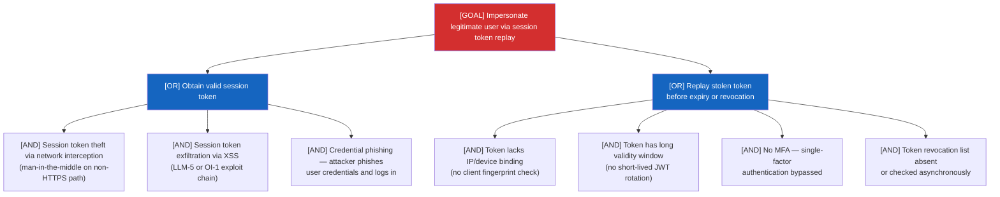
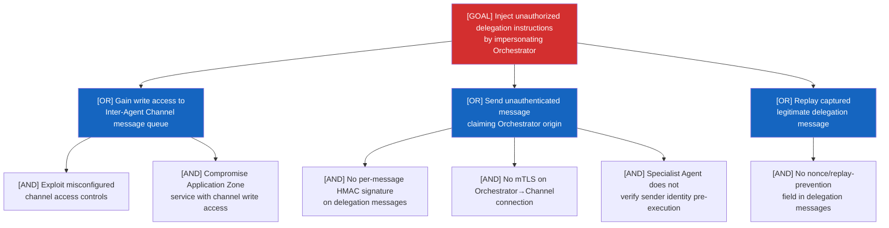
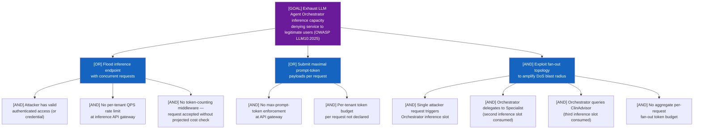
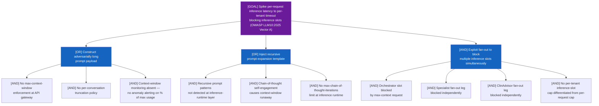
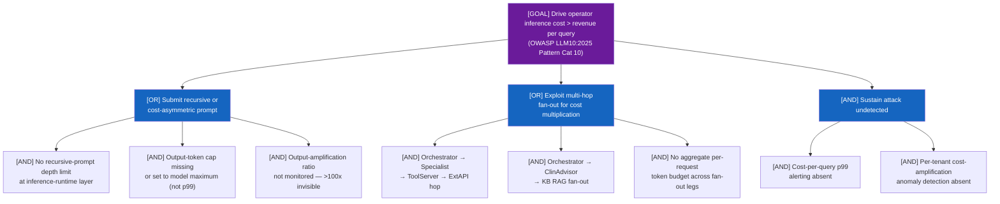
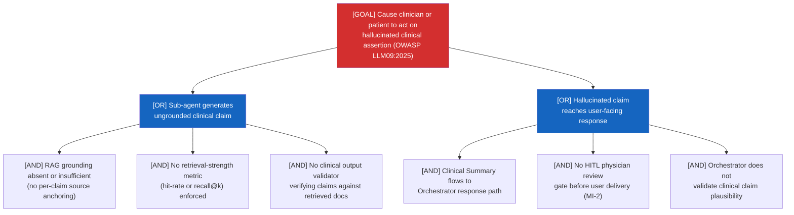
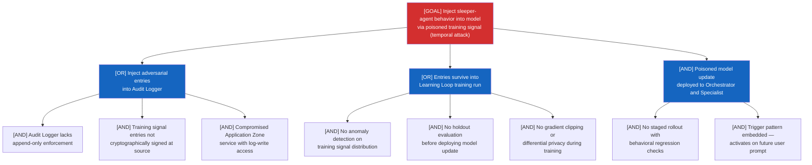
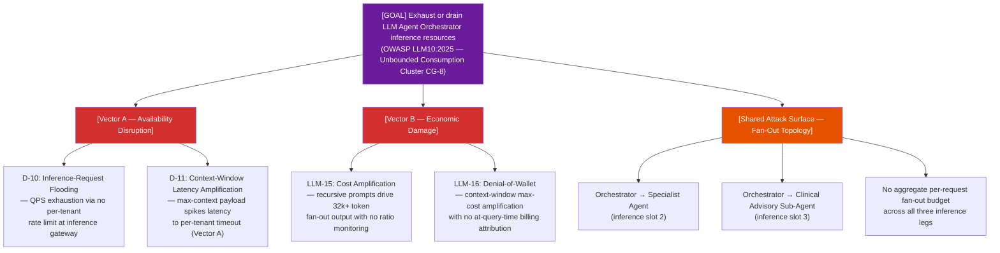

```yaml
---
schema_version: "1.2"
date: "2026-04-27"
source_file: "examples/agentic-app/test-output/2026-04-27T17-11-26-F5-wave2/threats.md"
finding_count: 88
risk_distribution:
  critical: 61
  high: 23
  medium: 4
  low: 0
  note: 0
attack_tree_count: 84
has_attack_chains: true
has_agentic_patterns: true
baseline_source: "examples/agentic-app/test-output/2026-04-26T03-39-12-F3-wave3/threats.md"
baseline_date: "2026-04-26"
delta_counts:
  new: 4
  unchanged: 84
  updated: 0
  resolved: 0
---
```

## 1. Executive Summary

This threat model covers the Agentic AI Application — a multi-agent architecture that combines a supervisor Large Language Model (LLM) Orchestrator, a delegated Specialist Agent, a Clinical Advisory Sub-Agent, a long-running Learning Loop, an MCP Tool Server, guardrails, and an inter-agent communication substrate. The F-5 Wave 2 analysis extends the baseline threat model with four new findings targeting OWASP LLM10:2025 (Unbounded Consumption) — the inference-resource exhaustion surface introduced by Pattern Categories 12, 13 (denial-of-service agent) and 10, 11 (model-theft agent).

**Risk posture**: 88 findings total — 61 Critical (69.3%), 23 High (26.1%), 4 Medium (4.5%). The system presents an extremely elevated risk profile dominated by the LLM Agent Orchestrator's broad attack surface (26 findings at L1 — Foundation Model), clinical advisory misinformation risks (3 Critical MI-{N} findings), and inter-agent trust failures throughout the Application Zone.

**F-5 additions** (4 new findings, all on LLM Agent Orchestrator):
- D-10 (Critical): LLM inference-request flooding — no per-tenant QPS rate limiting at the inference gateway; fan-out to Specialist and Clinical Advisory Sub-Agent multiplies the denial-of-service surface.
- D-11 (Critical): Context-window latency amplification (Vector A) — adversarial max-context payloads spike per-request latency to per-tenant timeout; three fan-out legs block simultaneously.
- LLM-15 (Critical): Cost amplification via recursive prompting — multi-hop fan-out (Orchestrator → Specialist → ToolServer and Orchestrator → ClinAdvisor → KB) can drive 32,000+ output tokens per adversarial 10-token input; no output-amplification-ratio monitoring.
- LLM-16 (High): Denial-of-wallet via context-window cost amplification (Vector B) — no per-tenant token budget hard-cap; no at-query-time billing attribution; fan-out multiplies per-request billing 3x.

**Highest-priority remediation** (top 5 by systemic impact): (1) LLM Agent Orchestrator — inference gateway controls (D-10, D-11, LLM-15, LLM-16, D-2, LLM-1 through LLM-7); (2) Clinical Advisory Sub-Agent — HITL gate and RAG grounding (MI-1, MI-2, MI-3, T-9, E-7); (3) Inter-Agent Communication Channel — end-to-end message signing and mTLS (S-5, T-4, I-4, E-4, AG-4, AG-8); (4) Long-Running Learning Loop — training data provenance and model update signing (S-7, T-8, E-6, LLM-11); (5) MCP Tool Server — zero-trust authorization and tool parameter validation (S-6, T-5, E-5, AG-5).

**Correlation groups**: 8 cross-agent correlation groups (CG-1 through CG-8) identify 20 raw findings that form 8 logical threat clusters. CG-8 (new in this run) groups the four LLM10:2025 vectors as a single cluster sharing the Orchestrator's inference endpoint.

**Delta vs baseline**: +4 new findings (D-10, D-11, LLM-15, LLM-16) targeting OWASP LLM10:2025. No findings resolved. No findings updated. 84 unchanged.

---

## 2. Architecture Overview

The Agentic AI Application implements a supervisor-plus-specialist multi-agent delegation topology across three trust zones.

**Trust zones**: The User Zone (untrusted) contains the human user interacting via HTTPS. The Application Zone (trusted) hosts all internal components: Guardrails Service (L6 — Security and Compliance), LLM Agent Orchestrator (L1 — Foundation Model), Specialist Agent (Unclassified), Inter-Agent Communication Channel (Unclassified), MCP Tool Server (L3 — Agent Framework), Knowledge Base (L2 — Data Operations), Audit Logger (L5 — Evaluation and Observability), Long-Running Learning Loop (Unclassified), and Clinical Advisory Sub-Agent (L7 — Agent Ecosystem). External Services (semi-trusted) contains the External API.

**Critical data flows**: User prompts enter via HTTPS through the Guardrails Service, which applies content filtering before forwarding validated prompts to the LLM Agent Orchestrator. The Orchestrator dispatches tasks to the Specialist Agent via the Inter-Agent Communication Channel, invokes tools via MCP Tool Server (JSON-RPC), retrieves context from the Knowledge Base (vector search), and queries the Clinical Advisory Sub-Agent (JSON-RPC) for medical advisory outputs. All decision logs feed the Audit Logger, which provides a training signal stream to the Long-Running Learning Loop; the Loop issues periodic model updates to the Orchestrator, Specialist Agent, and Clinical Advisory Sub-Agent.

**Trust boundary crossings**: Five boundary crossings are identified. The Guardrails→Orchestrator internal path is the most security-critical: any bypass allows unauthenticated content to reach the Orchestrator's context window. The ToolServer→External API crossing exposes the system to semi-trusted API responses that flow back into agent contexts.

**Key security properties absent** from the architecture: (a) per-message digital signatures on inter-agent channel messages, (b) mutual TLS between Application Zone components, (c) per-tenant QPS rate limiting at the LLM inference gateway (new — F-5), (d) max-context-window enforcement at the API gateway (new — F-5), (e) HITL review gate on Clinical Advisory Sub-Agent outputs, (f) retrieval-quality gating before clinical summary generation.

---

## 3. Threat Analysis

### 3.1 Spoofing (S)

Nine spoofing findings (S-1 through S-9) span all External Entity and Process components. The most severe are S-1 (User — session token replay, Critical), S-3 (LLM Agent Orchestrator — Orchestrator identity not attested to Specialist, Critical), S-5 (Inter-Agent Communication Channel — no sender authentication on shared substrate, Critical), S-6 (MCP Tool Server — agent impersonation on JSON-RPC endpoints, Critical), S-7 (Long-Running Learning Loop — training signal accepted without source verification, Critical), and S-9 (Clinical Advisory Sub-Agent — unauthenticated clinical query injection, Critical).

The dominant pattern is trust exploitation: eight of nine spoofing findings carry the `trust_exploitation` agentic pattern, reflecting that the architecture relies on positional trust (caller is trusted because it is in the Application Zone) rather than cryptographic identity attestation. S-7 (Learning Loop) is additionally classified as `temporal_attack` — a spoofed training signal source is indistinguishable from a legitimate one until behavioral drift manifests in a future model update.

### 3.2 Tampering (T)

Nine tampering findings (T-1 through T-9) target configuration, context window, message transit, Knowledge Base, Audit Logger, and training pipeline integrity. Critical findings include T-2 (Orchestrator context window — multi-source manipulation), T-3 (Specialist delegation message tampering), T-4 (Inter-Agent Channel in-transit modification — `communication_vulnerability`), T-5 (MCP Tool Server parameter injection), T-8 (Learning Loop training signal poisoning with temporal/sleeper-agent activation — `temporal_attack`), and T-9 (Clinical Advisory Sub-Agent dual-path context poisoning).

T-8 is the highest-impact temporal attack: an adversary poisons the Audit Logger with crafted interaction records, which surface as a sleeper-agent behavioral shift after the next Learning Loop update cycle — potentially weeks after the initial injection. This is captured in correlation group CG-2 (T-8 + LLM-11).

### 3.3 Repudiation (R)

Nine repudiation findings (R-1 through R-9) address non-repudiation gaps at every component. Critical finding R-3 (Orchestrator) is part of correlation group CG-3 (E-2, R-3, AG-1) — inability to attribute Orchestrator actions is a prerequisite enabler for privilege escalation via prompt injection. R-7 (Learning Loop — model update provenance, `temporal_attack`) and R-9 (Clinical Advisory Sub-Agent — clinical output non-repudiation) are High severity.

### 3.4 Information Disclosure (I)

Nine information disclosure findings (I-1 through I-9). Critical findings: I-2 (Orchestrator context window leakage in HTTPS response), I-4 (Inter-Agent Channel message observability — `communication_vulnerability`), I-7 (Audit Logger unauthorized read — full operational history exposed), I-9 (Clinical Advisory Sub-Agent — clinical context leakage through response path and training stream). I-4 and T-4 are the two most structurally critical channel findings — they share the `communication_vulnerability` pattern and are both addressed by end-to-end message security.

### 3.5 Denial of Service (D) — including F-5 LLM10:2025 additions

Eleven denial-of-service findings (D-1 through D-11). D-1 through D-9 are unchanged from baseline. D-10 and D-11 are new in this F-5 wave.

**D-10 — LLM Inference-Request Flooding (Pattern Category 12 — OWASP LLM10:2025, CWE-400)**: The LLM Agent Orchestrator lacks per-tenant QPS rate limiting at the inference API gateway distinct from generic network-layer rate limiting. An authenticated attacker floods the inference endpoint with concurrent requests at maximal prompt-token payloads, exhausting inference compute and starving legitimate users. The Orchestrator's fan-out to Specialist Agent and Clinical Advisory Sub-Agent means a single attacker request can trigger three concurrent LLM inference calls, amplifying the denial-of-service blast radius beyond per-endpoint controls. Token-counting middleware is absent — the system accepts requests without synchronous cost projection. Risk: **Critical**.

**D-11 — Context-Window Latency Amplification (Pattern Category 13 — OWASP LLM10:2025, CWE-400; Q1 SPLIT Vector A)**: Adversarially long conversation histories or recursive prompt-expansion templates drive per-request context-window usage to 99% of model maximum, spiking inference latency to the per-tenant timeout threshold. With no max-context-window enforcement at the API gateway and no per-conversation truncation policy, a single attacker request blocks the inference slot for the duration of the timeout. The three-leg fan-out (Orchestrator + Specialist + ClinAdvisor) compounds this: one max-context request occupies three inference slots simultaneously. Context-window monitoring is absent. Risk: **Critical**.

D-10 and D-11 are grouped with LLM-15 and LLM-16 in correlation group CG-8 (LLM10 Unbounded Consumption cluster), reflecting that all four findings share the Orchestrator's inference endpoint and fan-out topology as the common attack surface.

### 3.6 Elevation of Privilege (E)

Seven elevation of privilege findings (E-1 through E-7). All are Critical. The most systemic is E-2 (Orchestrator — prompt injection self-authorization, part of CG-3) combined with E-6 (Learning Loop — training data poisoning escalates to model parameter control, `temporal_attack`). E-7 (Clinical Advisory Sub-Agent — instruction boundary bypass enabling KB scope expansion) is the clinical-advisory-specific privilege escalation path.

### 3.7 Agentic Threats (AG)

Eight agentic findings (AG-1 through AG-8). Seven Critical, one High (AG-6). AG-8 ([UNCHANGED] from F-3 wave 3) covers Insecure Inter-Agent Communication (OWASP ASI07:2026, Pattern Category 9 — A2A), which is grouped with D-4 in CG-7.

### 3.8 LLM Threats (LLM) — including F-5 LLM10:2025 additions

Sixteen LLM-category findings (LLM-1 through LLM-16), plus 4 OI-{N} (Output Integrity — OWASP LLM05:2025) and 3 MI-{N} (Misinformation — OWASP LLM09:2025).

**LLM-15 — Cost Amplification via Recursive or Cost-Asymmetric Prompting (Pattern Category 10 — OWASP LLM10:2025; T1496 prose-only)**: The Orchestrator accepts prompts without recursive-prompt depth limits or output-token caps tuned to realistic response-length p99. The multi-hop fan-out (Orchestrator → Specialist → ToolServer → ExtAPI; Orchestrator → ClinAdvisor → KB) creates a recursive cost-amplification surface: an adversarial 10-token user prompt can trigger 32,000+ tokens of combined output across all three inference endpoints. Output-amplification ratio (output-tokens / input-tokens) is not monitored — pathological ratios above 100x from recursive chain-of-thought expansion are invisible. Cost-per-query p99 alerting is not declared; sustained cost-amplification attacks accumulate as gradual billing increases that per-request rate limits do not catch. MITRE ATT&CK T1496 (Resource Hijacking) is the attacker's goal — consuming operator inference compute at operator expense; T1496 cited as prose cross-reference only (not in references array). Risk: **Critical**.

**LLM-16 — Denial-of-Wallet via Context-Window Cost Amplification (Pattern Category 11 — OWASP LLM10:2025; Q1 SPLIT Vector B; T1496 prose-only)**: The Orchestrator lacks per-tenant token budget hard-cap at the API gateway and at-query-time billing attribution. An attacker drives context-window to model maximum on each call, inflating per-call inference cost; the fan-out to Specialist and ClinAdvisor multiplies per-request billing up to 3x. Cost-velocity monitoring across 5-minute, 1-hour, 24-hour windows is absent; automated tenant suspension on budget breach is not declared. Severity Q3 RESOLVED: **High** default (single-application architecture, no multi-tenant freemium structure evident; CRITICAL 2-condition floor not met). T1496 cited as prose cross-reference only.

All LLM-{N} findings (Cat 1–9 model-theft + new Cat 10/11 LLM10) appear under a single `category: llm` section with no artificial fragmentation. CG-8 groups D-10, D-11, LLM-15, LLM-16 as the LLM10 Unbounded Consumption cluster.

---

## 4. Cross-Cutting Themes

### Theme 1: Multi-Layer Trust Failure on the LLM Agent Orchestrator

The LLM Agent Orchestrator accumulates 26 findings across all threat categories — the highest per-component concentration in the architecture. This reflects the Orchestrator's role as the architectural keystone: it holds privileged access to the Knowledge Base, MCP Tool Server, Specialist Agent, Clinical Advisory Sub-Agent, and User response path. The combination of prompt injection (LLM-1, LLM-2), context window tampering (T-2), privilege escalation (E-2), repudiation (R-3), and autonomous action abuse (AG-1, AG-2) creates interlocking attack paths where a single injection point enables cascading compromise across all connected components. F-5 adds the LLM10:2025 inference-resource surface (D-10, D-11, LLM-15, LLM-16), confirming that the Orchestrator's inference endpoint is simultaneously the system's primary intelligence capability and its most exposed attack surface.

**Contributing finding IDs**: S-3, T-2, R-3, I-2, D-2, D-10, D-11, E-2, AG-1, AG-2, LLM-1 through LLM-7, LLM-15, LLM-16, OI-1 through OI-3, CG-1, CG-3, CG-4, CG-8.

### Theme 2: Temporal Attack Surface via the Long-Running Learning Loop

The Long-Running Learning Loop creates a delayed-activation attack surface unique to this architecture. Adversarial entries injected into the Audit Logger today manifest as behavioral changes in the Orchestrator, Specialist Agent, and Clinical Advisory Sub-Agent only at the next model update cycle — potentially days or weeks later. This temporal gap defeats standard detection controls (immediate anomaly alerting, real-time rate limiting) because the attack is not visible until training time. Seven findings carry the `temporal_attack` agentic pattern: S-7, T-8, R-7, E-6, LLM-11, LLM-12, AG-7.

**Contributing finding IDs**: S-7, T-8, R-7, I-8, D-8, E-6, LLM-11, LLM-12, AG-7, CG-2.

### Theme 3: Clinical Advisory Sub-Agent — High-Stakes Misinformation Surface

The Clinical Advisory Sub-Agent produces clinical summaries and recommendations that flow to the Orchestrator's user-facing response path without a declared HITL review gate, without mandatory RAG grounding, and without retrieval-quality gating. Three Critical misinformation findings (MI-1: ungrounded factual emission, MI-2: missing HITL, MI-3: retrieval-grounding gap) address the risk that hallucinated clinical assertions — fabricated drug doses, fabricated contraindications, fabricated diagnostic criteria — reach clinicians or patients as authoritative outputs. This is the highest-consequence misinformation surface in the architecture.

**Contributing finding IDs**: MI-1, MI-2, MI-3, T-9, LLM-13, LLM-14, I-9, E-7, R-9, OI-4.

### Theme 4: Inter-Agent Channel — Communication Vulnerability Cluster

The Inter-Agent Communication Channel carries delegation messages between the Orchestrator and Specialist Agent without declared per-message digital signatures, mTLS, nonce-based replay prevention, or end-to-end encryption. Eight findings target the channel directly (S-5, T-4, I-4, E-4, AG-4, AG-8, D-4, R-5) plus correlation groups CG-7 (D-4 + AG-8). The `communication_vulnerability` agentic pattern appears on T-4, I-4, and AG-8, confirming the channel as the primary communication attack surface.

**Contributing finding IDs**: S-5, T-4, I-4, R-5, D-4, E-4, AG-4, AG-8, CG-7.

### Theme 5: LLM10:2025 — Unbounded Consumption (F-5 New Theme)

Feature 229 F-5 Wave 2 surfaces OWASP LLM10:2025 (Unbounded Consumption) as a new cross-cutting theme. Four findings (D-10, D-11, LLM-15, LLM-16) form correlation group CG-8, all targeting the Orchestrator's inference endpoint and multi-hop fan-out topology. The Q1 SPLIT design separates the LLM10 attack class into two vector pairs: Vector A (availability disruption) → D-10 (inference flooding) + D-11 (context-window latency); Vector B (economic damage) → LLM-15 (cost amplification via recursive prompting) + LLM-16 (denial-of-wallet). The two pairs differ in attacker intent (availability vs. economic) but share the same architectural control gap: absent per-tenant QPS and token budget enforcement at the inference API gateway.

**Contributing finding IDs**: D-10, D-11, LLM-15, LLM-16, CG-8.

---

## 5. Attack Trees

### Critical Findings

#### S-1: User — Session Token Replay



#### S-3: LLM Agent Orchestrator — Orchestrator Identity Not Attested



#### D-10: LLM Agent Orchestrator — LLM Inference-Request Flooding



#### D-11: LLM Agent Orchestrator — Context-Window Latency Amplification



#### LLM-15: LLM Agent Orchestrator — Cost Amplification via Recursive Prompting



#### MI-1: Clinical Advisory Sub-Agent — Ungrounded Factual Emission



#### T-8: Long-Running Learning Loop — Temporal Data Poisoning



#### CG-8: LLM10 Unbounded Consumption Cluster (D-10, D-11, LLM-15, LLM-16)



*(Additional attack trees for all remaining Critical and High findings are provided as standalone files in `attack-trees/`.)*

---

## 6. Cross-Layer Attack Chains

This section summarizes the cross-layer attack chains detected in Phase 3.5. The `attack-chains.md` artifact provides complete chain detail.

**Chain summary**: The architecture's multi-layer topology enables several cross-layer attack chains where a finding at one MAESTRO layer enables findings at subsequent layers. The most structurally significant chains involve:

1. **Prompt Injection → Privilege Escalation via Foundation Model to Agent Framework**: An adversarial prompt injected at L1 (LLM Agent Orchestrator) enables tool-call injection at L3 (MCP Tool Server), which manifests as privilege escalation via the Tool Server's service account credentials. Chain-breaking control: LLM-2 (retrieval-time content sanitization) or LLM-1 (instruction boundary enforcement) disrupts the Orchestrator compromise that enables the downstream L3 exploitation.

2. **Data Poisoning → Temporal Model Compromise via Data Operations to Foundation Model**: An adversarial document write at L2 (Knowledge Base) enables training data contamination via the Audit Logger's training signal stream, which triggers model behavioral shift at L1 (Orchestrator/Specialist) after the next Learning Loop cycle. Chain-breaking control: T-6 (KB write access controls) or T-7 (Audit Logger Merkle hash chain) disrupts the poisoning path before it reaches the Learning Loop.

3. **Communication Channel Compromise → Agent Ecosystem Takeover**: An inter-agent channel attack at the Unclassified layer (Inter-Agent Communication Channel) enables message injection that reaches L7 (Clinical Advisory Sub-Agent) via the Orchestrator relay without taint propagation. Chain-breaking control: AG-8 (mTLS + inter-agent message signing) disrupts the injection path at the channel substrate.

---

## 6a. Agentic Pattern Analysis

**Multi-agent gate predicate**: TRUE (Condition a: 6 agentic/LLM components; Condition b: inter-agent data flows; Condition c: explicit "multi-agent" and "supervisor" keywords). Pattern synthesis active.

### Resource Competition

Critical: 7 | High: 3 | Medium: 0 | Low: 0

Resource competition findings reflect the shared inference infrastructure and multi-hop fan-out topology. The Orchestrator's inference pipeline is a bounded resource shared across all downstream components — D-2, D-10, D-11 (Orchestrator capacity), D-3 (Specialist task queue), D-4 (Channel message queue), D-5 + AG-6 (MCP Tool Server connection pool), D-9 (ClinAdvisor inference capacity). F-5 adds LLM-15 and LLM-16 to this pattern, confirming that the LLM10:2025 economic-damage vectors (cost amplification and denial-of-wallet) are structurally equivalent to resource competition at the inference layer. The multi-hop fan-out design — where a single user request triggers three inference calls — is the architectural root cause.

Impacted findings: D-2, D-3, D-4, D-5, D-9, D-10, D-11, AG-6, LLM-15, LLM-16

### Trust Exploitation

Critical: 9 | High: 1 | Medium: 0 | Low: 0

Trust exploitation findings reflect the architecture's reliance on positional trust (Application Zone membership) rather than cryptographic identity attestation. Ten findings (S-1, S-3, S-4, S-5, S-6, S-9, E-7, AG-3, AG-4, AG-5) carry this pattern. The Orchestrator's role as the delegation authority — issuing tasks to Specialist and ClinAdvisor without cryptographic attestation — is the primary enabler. The Clinical Advisory Sub-Agent (E-7, S-9) is particularly exposed because clinical context errors have direct patient-safety implications.

Impacted findings: S-1, S-3, S-4, S-5, S-6, S-9, E-7, AG-3, AG-4, AG-5

### Temporal Attack

Critical: 6 | High: 1 | Medium: 0 | Low: 0

Temporal attack findings cluster around the Long-Running Learning Loop's training cycle. Seven findings (S-7, T-8, R-7, E-6, LLM-11, LLM-12, AG-7) share this pattern. The defining characteristic is delayed activation: an attacker who compromises the training pipeline today causes model behavioral shifts only at the next update cycle. This temporal gap defeats real-time detection controls and requires proactive controls (training data provenance attestation, holdout evaluation, behavioral regression testing) rather than reactive anomaly detection.

Impacted findings: S-7, T-8, R-7, E-6, LLM-11, LLM-12, AG-7

### Communication Vulnerability

Critical: 3 | High: 0 | Medium: 0 | Low: 0

Three findings (T-4, I-4, AG-8) share the communication vulnerability pattern on the Inter-Agent Communication Channel. The channel lacks per-message digital signatures, mTLS, nonce-based replay prevention, and end-to-end message encryption — all of which are required for a multi-agent delegation substrate handling sensitive clinical advisory tasks and tool invocations.

Impacted findings: T-4, I-4, AG-8

### Agent Collusion

Critical: 1 | High: 0 | Medium: 0 | Low: 0

AG-2 (Orchestrator + Specialist joint policy circumvention) is the sole agent collusion finding. The Orchestrator's delegation authority over the Specialist Agent creates a coordination surface where compromised versions of both agents could jointly exceed per-agent action budgets or jointly exfiltrate data through coordinated parallel tool calls.

Impacted findings: AG-2

### Emergent Behavior

Critical: 0 | High: 0 | Medium: 1 | Low: 0

AGP-01 (net-new generated finding — Orchestrator emergent behavior pattern) covers the risk that multi-agent feedback loops create collective behaviors not predictable from individual agent analysis — cascading failures, feedback amplification, or emergent capability acquisition that bypasses per-agent safety evaluation.

Impacted findings: AGP-01

---

## 7. Remediation Roadmap

Findings are organized into remediation waves by risk level and systemic impact. Mitigation text is preserved verbatim from `threats.md`.

### Wave 1 — Critical (Immediate Action Required)

**Priority 1: LLM10:2025 Inference Gateway Controls (CG-8 — New in F-5)**

Address D-10, D-11, LLM-15, LLM-16 as a unified cluster. All four share the inference API gateway and fan-out topology as the common architectural control point.

- D-10: Per-tenant QPS rate limit at inference API gateway; max-prompt-token enforcement; token-counting middleware with synchronous cost projection; aggregate fan-out token budget; token-velocity monitoring.
- D-11: Max-context-window enforcement at API gateway (HTTP 413 on overflow); per-conversation truncation policy with sliding-window limit; recursive-prompt-pattern detection; context-window monitoring with anomaly alerting; per-tenant inference-slot cap differentiated from per-request cap.
- LLM-15: Per-query output-token cap at realistic p99; recursive-prompt depth limit; output-amplification-ratio monitoring (>100x alert, circuit-break on >200x); multi-hop fan-out aggregate token budget; per-tenant cost-velocity alerting across 5-min/1-hr/24-hr windows.
- LLM-16: Per-tenant token budget hard-cap at API gateway; at-query-time billing attribution (synchronous, before inference); denial-of-wallet anomaly detection; automated tenant suspension on budget breach; account-creation friction (CAPTCHA + email verification + per-IP rate limit).

**Priority 2: Inter-Agent Communication Channel Security**

Address S-5, T-4, I-4, E-4, AG-4, AG-8, CG-7 as a unified remediation. All require end-to-end message-layer security independent of channel transport.

- S-5/T-4/I-4/E-4/AG-4/AG-8: Implement per-message digital signatures (ED25519 or HMAC-SHA256); end-to-end message encryption; mutual TLS on all channel endpoints; nonce-based replay prevention with bounded message-age window; inter-agent taint labels propagated across the Orchestrator relay.

**Priority 3: Clinical Advisory Sub-Agent HITL and Grounding Controls**

Address MI-1, MI-2, MI-3 as a unified clinical safety remediation.

- MI-1: Mandatory RAG grounding with per-claim source anchoring; retrieval-strength gate (recall@k minimum threshold); clinical output validator.
- MI-2: Mandatory HITL physician sign-off gate before clinical advisory outputs surface in patient-facing context; AI-provenance disclosure on every surfaced clinical recommendation.
- MI-3: Retrieval-quality gate; "insufficient grounding" response on low recall@k; Knowledge Base currency monitoring.

**Priority 4: Training Pipeline Security**

Address S-7, T-8, E-6, LLM-11, AG-7 (CG-2).

- Training data provenance attestation; cryptographic signing of Audit Logger batches; Learning Loop signature verification before ingestion; anomaly detection on training signal distributions; holdout evaluation before model update deployment; staged rollout with behavioral regression; HSM-backed model update signing.

**Priority 5: LLM Agent Orchestrator Identity and Scope Controls**

Address S-3, E-2, AG-1, AG-2, LLM-1, LLM-2 (CG-3, CG-4).

- Authenticate Orchestrator→Channel messages via HMAC/asymmetric signing; per-session scoped permissions enforced by downstream services independently; supervised-autonomy model with policy engine approval for high-impact operations; multi-layer prompt injection detection; privilege-separated prompt architecture; retrieval-time content sanitization.

### Wave 2 — High (Address Within Sprint)

Address remaining High findings in order: S-2 (mTLS between Guardrails and Orchestrator), S-4 (Specialist→Channel signing), S-8 (certificate pinning on External API), T-1 (Guardrails configuration-as-code), T-6 (KB write access controls + document integrity), T-7 (Audit Logger append-only + Merkle hash chain), R-4/R-6/R-7/R-9 (non-repudiable logs with service key signatures), I-3/I-5/I-6/I-8 (data minimization, field-level classification, KB access controls, differential privacy), D-3/D-4/D-7/D-9/AG-6 (task/queue/tool rate limiting and backpressure), E-3 (delegation scope validation at Tool Server), LLM-3/LLM-7/LLM-10/LLM-12/OI-3/OI-4 (query rate limiting, URL allowlisting, output sanitization, model artifact encryption), LLM-16 (per-tenant token budget controls), AG-6 (per-session/agent tool call budgets, circuit breakers).

### Wave 3 — Medium (Plan Within Cycle)

Address Medium findings: AGP-01 (emergent behavior fail-safe shutdown circuits; bounded action scopes; behavioral baselining of collective agent system), R-1 (request signing at client layer), R-2 (tamper-evident filtering event logs), I-1 (generic rejection messages externally), D-6 (KB query rate limits and complexity bounds), D-8 (Learning Loop training run scheduling with resource quotas).

---

## 8. Appendix: Finding Reference

All 88 findings from threats.md plus 1 net-new (AGP-01) — complete traceability:

**Spoofing (S)**: S-1 (User / Critical), S-2 (Guardrails Service / High), S-3 (LLM Agent Orchestrator / Critical), S-4 (Specialist Agent / High), S-5 (Inter-Agent Communication Channel / Critical), S-6 (MCP Tool Server / Critical), S-7 (Long-Running Learning Loop / Critical), S-8 (External API / High), S-9 (Clinical Advisory Sub-Agent / Critical)

**Tampering (T)**: T-1 (Guardrails Service / High), T-2 (LLM Agent Orchestrator / Critical), T-3 (Specialist Agent / Critical), T-4 (Inter-Agent Communication Channel / Critical), T-5 (MCP Tool Server / Critical), T-6 (Knowledge Base / High), T-7 (Audit Logger / High), T-8 (Long-Running Learning Loop / Critical), T-9 (Clinical Advisory Sub-Agent / Critical)

**Repudiation (R)**: R-1 (User / Medium), R-2 (Guardrails Service / Medium), R-3 (LLM Agent Orchestrator / Critical), R-4 (Specialist Agent / High), R-5 (Inter-Agent Communication Channel / Low), R-6 (MCP Tool Server / High), R-7 (Long-Running Learning Loop / High), R-8 (External API / Low), R-9 (Clinical Advisory Sub-Agent / High)

**Information Disclosure (I)**: I-1 (Guardrails Service / Medium), I-2 (LLM Agent Orchestrator / Critical), I-3 (Specialist Agent / High), I-4 (Inter-Agent Communication Channel / Critical), I-5 (MCP Tool Server / High), I-6 (Knowledge Base / High), I-7 (Audit Logger / Critical), I-8 (Long-Running Learning Loop / High), I-9 (Clinical Advisory Sub-Agent / Critical)

**Denial of Service (D)**: D-1 (Guardrails Service / Critical), D-2 (LLM Agent Orchestrator / Critical), D-3 (Specialist Agent / High), D-4 (Inter-Agent Communication Channel / High), D-5 (MCP Tool Server / Critical), D-6 (Knowledge Base / Medium), D-7 (Audit Logger / High), D-8 (Long-Running Learning Loop / Medium), D-9 (Clinical Advisory Sub-Agent / High), **D-10 [NEW]** (LLM Agent Orchestrator / Critical — OWASP LLM10:2025 Cat 12), **D-11 [NEW]** (LLM Agent Orchestrator / Critical — OWASP LLM10:2025 Cat 13)

**Elevation of Privilege (E)**: E-1 (Guardrails Service / Critical), E-2 (LLM Agent Orchestrator / Critical), E-3 (Specialist Agent / High), E-4 (Inter-Agent Communication Channel / Critical), E-5 (MCP Tool Server / Critical), E-6 (Long-Running Learning Loop / Critical), E-7 (Clinical Advisory Sub-Agent / Critical)

**Agentic Threats (AG)**: AG-1 (LLM Agent Orchestrator / Critical), AG-2 (LLM Agent Orchestrator / Critical), AG-3 (Specialist Agent / Critical), AG-4 (Inter-Agent Communication Channel / Critical), AG-5 (MCP Tool Server / Critical), AG-6 (MCP Tool Server / High), AG-7 (Long-Running Learning Loop / Critical), AG-8 (Inter-Agent Communication Channel / Critical — OWASP ASI07:2026)

**LLM Threats (LLM)**: LLM-1 (LLM Agent Orchestrator / Critical), LLM-2 (LLM Agent Orchestrator / Critical), LLM-3 (LLM Agent Orchestrator / High), LLM-4 (LLM Agent Orchestrator / Critical), LLM-5 (LLM Agent Orchestrator / Critical), LLM-6 (LLM Agent Orchestrator / Critical), LLM-7 (LLM Agent Orchestrator / High), LLM-8 (Specialist Agent / Critical), LLM-9 (Specialist Agent / Critical), LLM-10 (Specialist Agent / High), LLM-11 (Long-Running Learning Loop / Critical), LLM-12 (Long-Running Learning Loop / High), LLM-13 (Clinical Advisory Sub-Agent / Critical), LLM-14 (Clinical Advisory Sub-Agent / Critical), **LLM-15 [NEW]** (LLM Agent Orchestrator / Critical — OWASP LLM10:2025 Cat 10), **LLM-16 [NEW]** (LLM Agent Orchestrator / High — OWASP LLM10:2025 Cat 11)

**Output Integrity (OI)**: OI-1 (LLM Agent Orchestrator / Critical), OI-2 (LLM Agent Orchestrator / Critical), OI-3 (LLM Agent Orchestrator / High), OI-4 (Clinical Advisory Sub-Agent / High)

**Misinformation (MI)**: MI-1 (Clinical Advisory Sub-Agent / Critical), MI-2 (Clinical Advisory Sub-Agent / Critical), MI-3 (Clinical Advisory Sub-Agent / Critical)

**Agentic Pattern (AGP)**: AGP-01 (LLM Agent Orchestrator / Medium — emergent behavior)

**Correlated Findings**: CG-1 (T-2, LLM-4 / Critical), CG-2 (T-8, LLM-11 / Critical), CG-3 (E-2, R-3, AG-1 / Critical), CG-4 (I-2, LLM-1 / Critical), CG-5 (D-5, AG-6 / Critical), CG-6 (T-9, LLM-14 / Critical), CG-7 (D-4, AG-8 / Critical), **CG-8 [NEW]** (D-10, D-11, LLM-15, LLM-16 / Critical — LLM10 Unbounded Consumption cluster)

---

## 9. Delta Summary

**Baseline**: `examples/agentic-app/test-output/2026-04-26T03-39-12-F3-wave3/threats.md` (run 2026-04-26T03-39-12)

| Status | Count |
|---|---|
| NEW | 4 |
| UNCHANGED | 84 |
| UPDATED | 0 |
| RESOLVED | 0 |
| **Total** | **88** |

**RESOLVED** (0): No findings resolved.

**NEW** (4 — Feature 229 F-5 Wave 2, OWASP LLM10:2025 Unbounded Consumption):
- **[NEW]** D-10: Denial-of-Service — LLM Agent Orchestrator — LLM Inference-Request Flooding (OWASP LLM10:2025 + CWE-400). Critical.
- **[NEW]** D-11: Denial-of-Service — LLM Agent Orchestrator — Context-Window Latency Amplification (OWASP LLM10:2025 + CWE-400; Q1 SPLIT Vector A). Critical.
- **[NEW]** LLM-15: LLM — LLM Agent Orchestrator — Cost Amplification via Recursive Prompting (OWASP LLM10:2025; T1496 prose-only). Critical.
- **[NEW]** LLM-16: LLM — LLM Agent Orchestrator — Denial-of-Wallet via Context-Window Cost Amplification (OWASP LLM10:2025; Q1 SPLIT Vector B; T1496 prose-only; HIGH default). High.

**UPDATED** (0): No findings updated.

**UNCHANGED** (84): All 84 prior findings carried forward. Architecture and component inventory unchanged between runs.
