# Threat Report: Agentic AI Application

## 1. Executive Summary

This threat model assessed an agentic AI application comprising 7 components across 3 trust zones, analyzing 34 findings across 8 threat categories (6 STRIDE and 2 AI-specific). The analysis employed the OWASP STRIDE (Spoofing, Tampering, Repudiation, Information Disclosure, Denial of Service, Elevation of Privilege) methodology extended with AI-specific threat agents for agentic and LLM (Large Language Model) threat analysis.

### Risk Posture

The system presents an **elevated risk posture** with 8 Critical and 14 High findings requiring immediate attention. The LLM Agent Orchestrator is the highest-risk component, concentrating 11 of 34 findings across all threat categories including AI-specific threats. Positively, the architecture includes a dedicated Guardrails Service for input filtering and an Audit Logger for centralized logging -- these components, once hardened, provide strong foundations for defense-in-depth.

### Top 5 Threats by Business Impact

1. **Direct Prompt Injection (LLM-1, Critical)**: Adversarial prompts can override the Orchestrator's system instructions, potentially causing harmful content generation, data disclosure, or unauthorized actions. This is the most accessible attack vector requiring no special access.

2. **Unauthorized Consequential Actions (AG-1, Critical)**: The Orchestrator can execute irreversible external operations (API calls, data writes) without human approval, meaning a single misinterpreted instruction could cause permanent data loss or financial damage.

3. **Tool Access Without Authorization (E-2, E-3, AG-3, Critical)**: Neither the Orchestrator nor the MCP Tool Server enforces role-based access control on tool dispatch, allowing standard users to invoke privileged operations including data exports and configuration changes.

4. **Service Impersonation (S-3, Critical)**: The JSON-RPC channel between the Orchestrator and MCP Tool Server lacks mutual authentication, enabling an attacker to forge tool call requests by impersonating the Orchestrator.

5. **Entry Point Denial of Service (D-1, D-2, Critical)**: Both the Guardrails Service and the Orchestrator lack rate limiting and input size caps, enabling an attacker to exhaust compute resources with high-volume or maximum-length requests.

### Key Recommendations

1. **Implement role-based access control (RBAC)** on all tool dispatch paths in both the Orchestrator and MCP Tool Server before deployment.
2. **Deploy structured prompt templates** with explicit boundary enforcement between system instructions and user input to defend against prompt injection.
3. **Enforce mutual TLS (mTLS)** between all internal services, particularly on the Orchestrator-to-MCP Tool Server JSON-RPC channel.
4. **Add rate limiting and input size caps** at the API gateway layer to protect the Guardrails Service and Orchestrator from denial of service.
5. **Establish human-in-the-loop checkpoints** for all irreversible or external actions executed by the agentic system.

### Compliance Relevance

- **SOC2 CC6.1 (Logical Access)**: Findings E-1, E-2, E-3, AG-3 directly relate to access control failures
- **SOC2 CC7.2 (System Monitoring)**: Findings R-1 through R-5, I-5 relate to logging and monitoring gaps
- **ISO 27001 A.9 (Access Control)**: Findings E-1 through E-3 map to access control management
- **ISO 27001 A.12 (Operations Security)**: Findings T-1 through T-5 map to operational integrity
- **CWE-287 (Improper Authentication)**: S-1 through S-4
- **CWE-269 (Improper Privilege Management)**: E-1 through E-3
- **CWE-400 (Uncontrolled Resource Consumption)**: D-1 through D-5
- **OWASP LLM01:2025 (Prompt Injection)**: LLM-1, LLM-2
- **OWASP ASI-01 (Excessive Agency)**: AG-1, AG-2

### Remediation Timeline

- **Immediate** (8 Critical findings): S-3, T-3, D-1, D-2, E-2, E-3, AG-1, AG-3, LLM-1 -- address before next deployment
- **Short-term** (14 High findings): Address within current development cycle
- **Medium-term** (6 Medium findings): Schedule for next planning cycle
- **Backlog** (1 Low finding): R-5 -- track for future consideration

---

## 2. Architecture Overview

### System Context

The system is an agentic AI application that processes user prompts through a multi-stage pipeline. Users interact with the system by submitting natural language prompts over HTTPS, which are first screened by a **Guardrails Service** that validates and filters input before forwarding approved prompts to the **LLM Agent Orchestrator**. The Orchestrator is the central coordination hub: it retrieves contextual documents from a **Knowledge Base** via vector search, dispatches tool calls to an **MCP Tool Server** using JSON-RPC, and composes final responses returned to the user.

The **MCP Tool Server** acts as the execution layer for external integrations, receiving tool call requests from the Orchestrator and making HTTPS calls to an **External API** on behalf of the agentic system. All significant operations across the Guardrails Service, Orchestrator, and MCP Tool Server are logged to a centralized **Audit Logger**.

The technology stack includes HTTPS for external communication, JSON-RPC for internal tool dispatch, vector search for knowledge retrieval, and the Model Context Protocol (MCP) for tool integration.

### Trust Boundary Summary

The architecture defines three trust zones:

1. **User Zone (Untrusted)**: Contains only the User. All input from this zone is treated as potentially adversarial.

2. **Application Zone (Semi-Trusted)**: Contains the Guardrails Service, LLM Agent Orchestrator, MCP Tool Server, Knowledge Base, and Audit Logger. This is the primary processing zone where the application logic resides.

3. **External Services (Untrusted)**: Contains the External API. Responses from this zone should be treated as untrusted input.

Three boundary crossings exist:
- **User to Application**: Protected by the Guardrails Service input validation and filtering
- **Application to External**: Protected by HTTPS transport encryption when the MCP Tool Server calls the External API
- **Application to User**: Protected by HTTPS transport encryption for response delivery

Notable concern: the inter-service communications within the Application Zone (Guardrails-to-Orchestrator, Orchestrator-to-MCP Tool Server, Orchestrator-to-Knowledge Base) lack documented security controls beyond assumed network-level trust.

---

## 3. Threat Analysis

### 3.1 Spoofing (S)

Spoofing threats target identity verification and authentication mechanisms. Four spoofing findings were identified across User (external entity), Guardrails Service, LLM Agent Orchestrator, and MCP Tool Server.

**S-1** targets the **User** entry point. An attacker could impersonate a legitimate user by replaying or forging bearer tokens, since user identity verification relies solely on bearer tokens without client context binding such as device fingerprint or IP address. Risk: HIGH likelihood, HIGH impact, **High** severity. The mitigation recommends DPoP token binding, session fingerprinting, and MFA.

**S-2** targets the **Guardrails Service**. An attacker could bypass the Guardrails entirely by directly accessing the Orchestrator endpoint, impersonating the Guardrails Service identity. This is possible because inter-service authentication between these components is not enforced. Risk: MEDIUM likelihood, HIGH impact, **High** severity.

**S-3** targets the **LLM Agent Orchestrator** and represents the most severe spoofing threat. An attacker could forge JSON-RPC tool call requests to the MCP Tool Server by impersonating the Orchestrator, because the inter-service channel lacks mutual authentication. Risk: HIGH likelihood, HIGH impact, **Critical** severity. Without mTLS on this channel, any network-accessible attacker can dispatch arbitrary tool calls.

**S-4** targets the **MCP Tool Server**. An attacker could redirect outbound API requests to an attacker-controlled endpoint through DNS spoofing, because certificate pinning is not enforced on outbound HTTPS connections. Risk: MEDIUM likelihood, HIGH impact, **High** severity.

### 3.2 Tampering (T)

Tampering threats target data integrity across processes and data stores. Five tampering findings were identified.

**T-1** targets the **Guardrails Service**. An attacker could modify validation rules at runtime because configuration files are stored in a writable location without integrity verification. Risk: MEDIUM likelihood, HIGH impact, **High** severity.

**T-2** targets the **LLM Agent Orchestrator**. The validated prompt data flow between Guardrails and the Orchestrator lacks integrity protection, enabling injection of malicious content. Risk: MEDIUM likelihood, HIGH impact, **High** severity.

**T-3** targets the **MCP Tool Server** and is the most critical tampering finding. An attacker could manipulate JSON-RPC parameters in transit, injecting SQL fragments or shell commands into tool arguments, because parameter integrity is not verified at the tool server boundary. Risk: HIGH likelihood, HIGH impact, **Critical** severity.

**T-4** targets the **Knowledge Base**. An attacker could inject malicious content through the orchestrator's data ingestion path because input sanitization is not enforced before persisting to the vector store. Risk: MEDIUM likelihood, HIGH impact, **High** severity. This finding is part of correlation group CG-1 with LLM-2 -- the combination enables both persistent data corruption and runtime prompt manipulation through the RAG pipeline.

**T-5** targets the **Audit Logger**. An attacker could modify or delete audit log entries because the log store is writable by the same application processes that generate logs. Risk: MEDIUM likelihood, HIGH impact, **High** severity.

### 3.3 Repudiation (R)

Repudiation threats target accountability and audit trail completeness. Five findings were identified across all external entities and processes.

**R-1** targets the **User**. Users could deny submitting specific prompts because non-repudiable evidence linking authenticated identity to prompt submission is not captured. Risk: MEDIUM likelihood, MEDIUM impact, **Medium** severity.

**R-2** targets the **Guardrails Service**. Filtering event logs lack sufficient detail to reconstruct rejection decisions, enabling disputes about incorrectly filtered prompts. Risk: MEDIUM likelihood, MEDIUM impact, **Medium** severity.

**R-3** targets the **LLM Agent Orchestrator**. The Orchestrator executes tool calls without logging the full decision chain -- originating user context, tool selection reasoning, parameters, and results. Risk: MEDIUM likelihood, HIGH impact, **High** severity. This finding is part of correlation group CG-3 with AG-2, where missing audit trails combine with unconstrained autonomous operation to create unauditable agent behavior.

**R-4** targets the **MCP Tool Server**. Tool executions lack requesting orchestrator context, preventing forensic attribution. Risk: MEDIUM likelihood, MEDIUM impact, **Medium** severity.

**R-5** targets the **External API**. External API interactions lack correlation identifiers. Risk: LOW likelihood, MEDIUM impact, **Low** severity.

### 3.4 Information Disclosure (I)

Information disclosure threats target confidentiality across processes and data stores. Five findings were identified.

**I-1** targets the **Guardrails Service**. Detailed rejection reasons reveal internal filtering rules, regex patterns, or blocked keyword lists. Risk: HIGH likelihood, MEDIUM impact, **High** severity.

**I-2** targets the **LLM Agent Orchestrator**. Verbose error messages could leak internal service topology, Knowledge Base schema details, or model configuration. Risk: MEDIUM likelihood, HIGH impact, **High** severity.

**I-3** targets the **MCP Tool Server**. Raw External API error responses are forwarded without sanitization, potentially exposing third-party API keys or internal URLs. Risk: MEDIUM likelihood, HIGH impact, **High** severity.

**I-4** targets the **Knowledge Base**. Query responses include internal metadata, embedding vectors, and storage schema details because field-level projection is not enforced. Risk: HIGH likelihood, MEDIUM impact, **High** severity.

**I-5** targets the **Audit Logger**. Audit logs contain sensitive data including prompt content, PII, and credentials, accessible to operations staff beyond the security team. Risk: MEDIUM likelihood, HIGH impact, **High** severity.

### 3.5 Denial of Service (D)

Denial of service threats target system availability. Five findings were identified.

**D-1** targets the **Guardrails Service**. High-volume prompt submissions could exhaust CPU on regex-based filtering because no rate limiting or input size caps are enforced. Risk: HIGH likelihood, HIGH impact, **Critical** severity.

**D-2** targets the **LLM Agent Orchestrator**. Concurrent maximum-length prompts could exhaust LLM inference compute. Risk: HIGH likelihood, HIGH impact, **Critical** severity.

**D-3** targets the **MCP Tool Server**. Concurrent tool calls without concurrency caps could exhaust resources. Risk: MEDIUM likelihood, HIGH impact, **High** severity. This finding is part of correlation group CG-4 with AG-4, where resource exhaustion and tool chaining escalation share the root cause of uncontrolled tool invocation.

**D-4** targets the **Knowledge Base**. Unbounded vector search queries with adversarial inputs could exhaust resources. Risk: MEDIUM likelihood, MEDIUM impact, **Medium** severity.

**D-5** targets the **Audit Logger**. High-volume logging events could cause storage exhaustion. Risk: MEDIUM likelihood, MEDIUM impact, **Medium** severity.

### 3.6 Elevation of Privilege (E)

Elevation of privilege threats target authorization boundaries. Three findings were identified, all at Critical or High severity.

**E-1** targets the **Guardrails Service**. An attacker could bypass the Guardrails via an alternate route to the Orchestrator because authorization is only enforced at the Guardrails layer. Risk: MEDIUM likelihood, HIGH impact, **High** severity.

**E-2** targets the **LLM Agent Orchestrator**. An attacker could escalate to administrative tool capabilities through prompt injection because RBAC is not enforced on tool dispatch. Risk: HIGH likelihood, HIGH impact, **Critical** severity. This finding is part of correlation group CG-2 with AG-1, where missing access controls combine with missing human oversight to enable unauthorized high-privilege operations.

**E-3** targets the **MCP Tool Server**. Users can invoke administrative tool endpoints by manipulating the tool_name parameter because RBAC is not enforced. Risk: HIGH likelihood, HIGH impact, **Critical** severity.

### 3.7 Agentic Threats (AG)

Agentic threats target the autonomous agent capabilities of the system. Four findings were identified across the LLM Agent Orchestrator and MCP Tool Server.

**AG-1** targets the **LLM Agent Orchestrator**. The Orchestrator executes consequential actions (external API calls, Knowledge Base writes) without human approval gates because no risk-tier classification distinguishes reversible from irreversible operations. Risk: HIGH likelihood, HIGH impact, **Critical** severity. This finding is part of correlation group CG-2 with E-2.

**AG-2** targets the **LLM Agent Orchestrator**. The Orchestrator operates in an unbounded reasoning loop without maximum iteration count, execution timeout, or cost cap. Risk: HIGH likelihood, MEDIUM impact, **High** severity. This finding is part of correlation group CG-3 with R-3.

**AG-3** targets the **MCP Tool Server**. The MCP Tool Server exposes all registered tools to every connected client without per-agent capability scoping. Risk: HIGH likelihood, HIGH impact, **Critical** severity.

**AG-4** targets the **MCP Tool Server**. Tool call chaining enables capability escalation beyond individual permissions because no cross-tool policy evaluates composite effects. Risk: MEDIUM likelihood, HIGH impact, **High** severity. This finding is part of correlation group CG-4 with D-3.

### 3.8 LLM Threats (LLM)

LLM-specific threats target the language model integration. Three findings were identified, all targeting the LLM Agent Orchestrator.

**LLM-1** targets the **LLM Agent Orchestrator**. Adversarial prompts can override the system prompt because user input is concatenated without structured boundary enforcement. Risk: HIGH likelihood, HIGH impact, **Critical** severity. This is the highest-priority LLM threat due to its direct exploitability.

**LLM-2** targets the **LLM Agent Orchestrator**. Adversarial content in the Knowledge Base can hijack the Orchestrator during RAG retrieval (indirect prompt injection). Risk: MEDIUM likelihood, HIGH impact, **High** severity. This finding is part of correlation group CG-1 with T-4.

**LLM-3** targets the **LLM Agent Orchestrator**. Systematic querying could enable model extraction through distillation. Risk: LOW likelihood, HIGH impact, **Medium** severity.

---

## 4. Cross-Cutting Themes

### Theme 1: Concentrated Risk in the LLM Agent Orchestrator

The LLM Agent Orchestrator is the highest-risk component in the architecture, accumulating 11 of 34 findings across all 8 threat categories. It serves as the system's central coordination hub with access to the Knowledge Base, MCP Tool Server, and direct user communication -- making it the single point where spoofing, tampering, injection, privilege escalation, and autonomous action threats converge.

**Contributing findings**: S-3, T-2, R-3, I-2, D-2, E-2, AG-1, AG-2, LLM-1, LLM-2, LLM-3

**Affected components**: LLM Agent Orchestrator (primary), with cascading effects on Knowledge Base and MCP Tool Server

**Synthesized recommendation**: Treat the Orchestrator as the highest-priority hardening target. Implement defense-in-depth: structured prompt templates (LLM-1), mTLS for all connections (S-3), RBAC on tool dispatch (E-2), decision audit logging (R-3), rate limiting (D-2), termination constraints (AG-2), and human-in-the-loop checkpoints (AG-1). A comprehensive Orchestrator security review should precede deployment.

### Theme 2: Missing Inter-Service Authentication

Multiple findings across different threat categories identify the absence of mutual authentication between services as a systemic gap. The Guardrails-to-Orchestrator path (S-2), the Orchestrator-to-MCP Tool Server path (S-3, T-3), and the Tool Server-to-External API path (S-4) all lack cryptographic identity verification.

**Contributing findings**: S-2, S-3, S-4, T-2, T-3, E-1

**Affected components**: Guardrails Service, LLM Agent Orchestrator, MCP Tool Server

**Synthesized recommendation**: Deploy a service mesh or implement mTLS across all inter-service communication channels within the Application Zone. Enforce certificate-based identity verification on every service-to-service request. This single infrastructure change addresses 6 findings simultaneously.

### Theme 3: Insufficient Access Control on Tool Operations

Role-based access control is absent at both the Orchestrator and MCP Tool Server levels, creating multiple paths to privilege escalation and unauthorized tool invocation. This gap is compounded by the agentic system's ability to autonomously select and invoke tools.

**Contributing findings**: E-2, E-3, AG-1, AG-3, AG-4

**Affected components**: LLM Agent Orchestrator, MCP Tool Server

**Synthesized recommendation**: Implement a unified tool permission framework: define a tool capability manifest mapping each tool to required permission levels, enforce RBAC at both Orchestrator dispatch and Tool Server execution, implement per-agent capability allowlists, and add cross-tool policy evaluation for composite effects.

### Theme 4: Audit and Accountability Gaps

Six findings identify gaps in logging, audit trails, and non-repudiation controls. The Orchestrator lacks full decision chain logging (R-3), the Tool Server lacks orchestrator context propagation (R-4), the Audit Logger itself is vulnerable to tampering (T-5) and information disclosure (I-5), and user prompt attribution is insufficient (R-1).

**Contributing findings**: R-1, R-2, R-3, R-4, R-5, T-5, I-5

**Affected components**: User, Guardrails Service, LLM Agent Orchestrator, MCP Tool Server, Audit Logger, External API

**Synthesized recommendation**: Implement an end-to-end request correlation framework: assign a unique correlation ID at the Guardrails entry point, propagate it through every component interaction, capture structured audit events at each stage with consistent schema, and forward all events to an immutable append-only log store with role-based access controls.

---

## 5. Attack Trees

Attack trees are provided for all 22 Critical and High findings. Each tree decomposes the attacker's goal into sub-goals and concrete actions using Bruce Schneier's attack tree methodology.

### S-1: User Identity Spoofing via Token Replay

**Component**: User | **Risk Level**: High | **Finding**: S-1

An attacker replays or forges bearer tokens to impersonate a legitimate user.

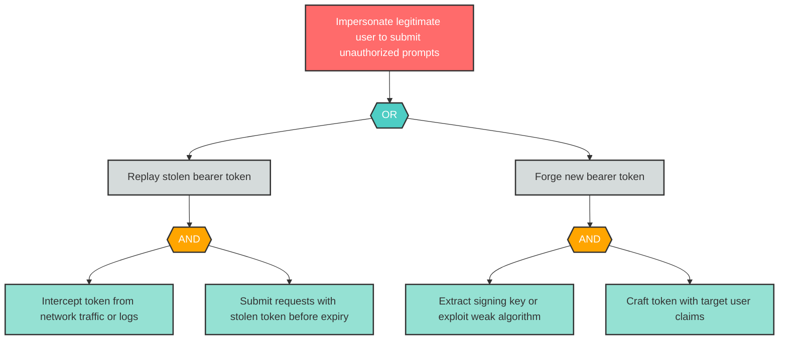

### S-2: Guardrails Bypass via Service Impersonation

**Component**: Guardrails Service | **Risk Level**: High | **Finding**: S-2

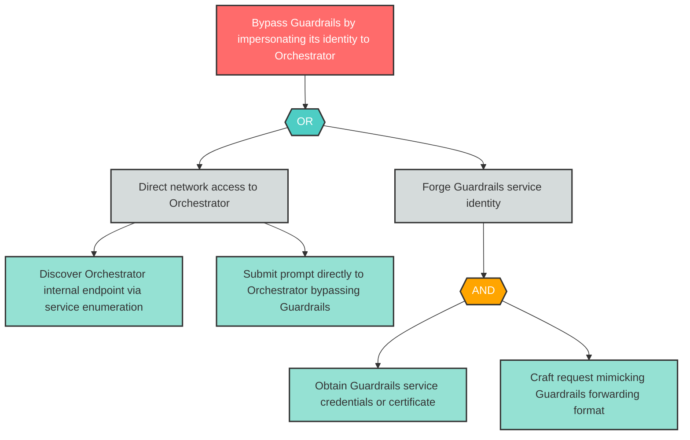

### S-3: Orchestrator Impersonation on JSON-RPC Channel

**Component**: LLM Agent Orchestrator | **Risk Level**: Critical | **Finding**: S-3

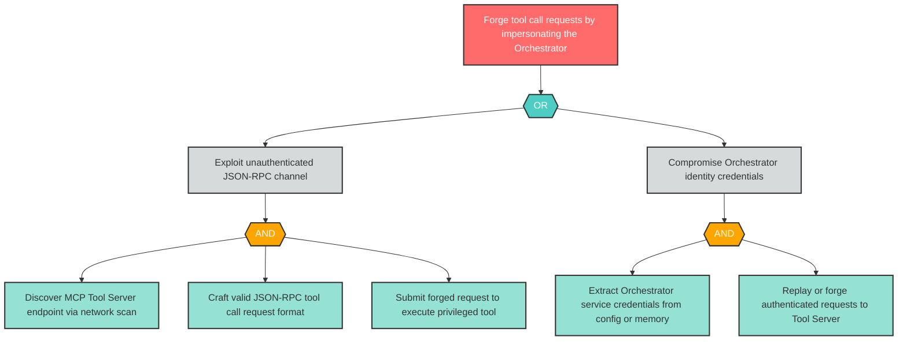

### S-4: DNS Spoofing to Redirect External API Calls

**Component**: MCP Tool Server | **Risk Level**: High | **Finding**: S-4

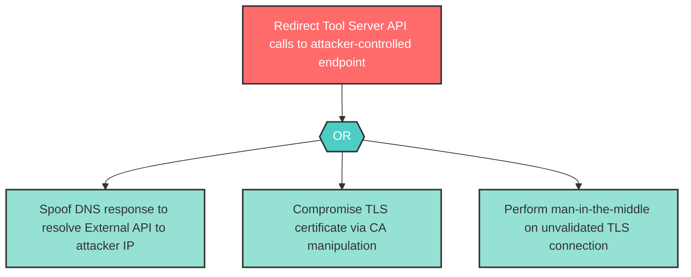

### T-1: Guardrails Configuration Tampering

**Component**: Guardrails Service | **Risk Level**: High | **Finding**: T-1

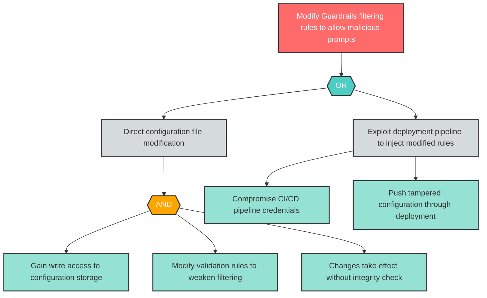

### T-2: Prompt Tampering in Transit

**Component**: LLM Agent Orchestrator | **Risk Level**: High | **Finding**: T-2

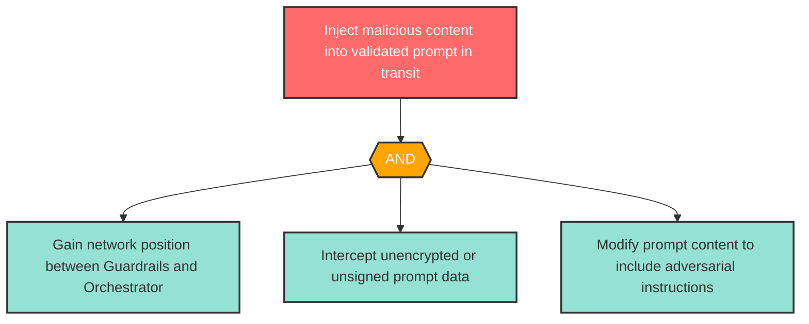

### T-3: JSON-RPC Parameter Injection

**Component**: MCP Tool Server | **Risk Level**: Critical | **Finding**: T-3

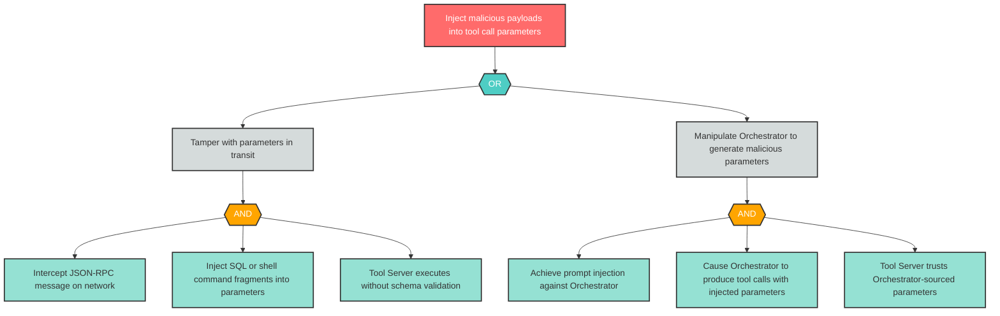

### T-4: Knowledge Base Content Poisoning

**Component**: Knowledge Base | **Risk Level**: High | **Finding**: T-4

This finding is part of correlation group CG-1. See also: LLM-2.

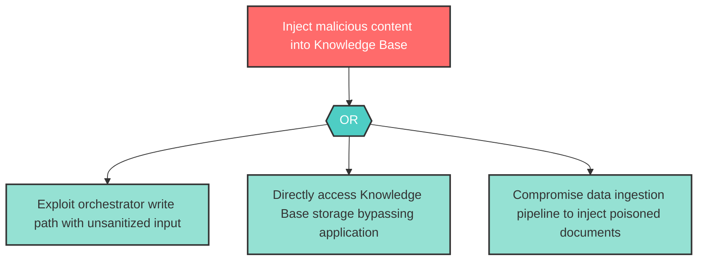

### T-5: Audit Log Tampering

**Component**: Audit Logger | **Risk Level**: High | **Finding**: T-5

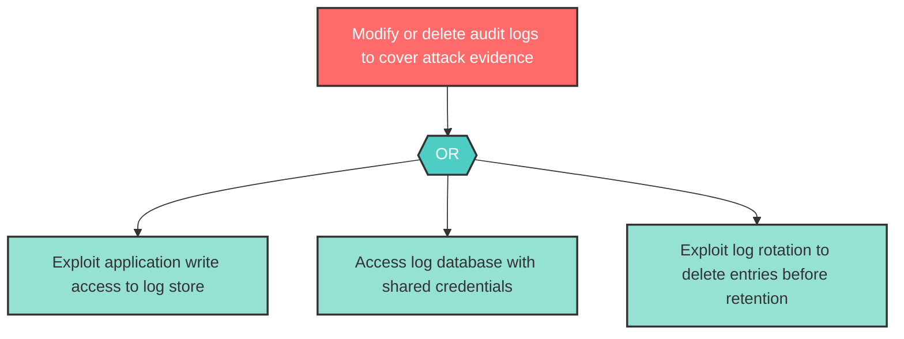

### R-3: Missing Decision Chain Audit Trail

**Component**: LLM Agent Orchestrator | **Risk Level**: High | **Finding**: R-3

This finding is part of correlation group CG-3. See also: AG-2.

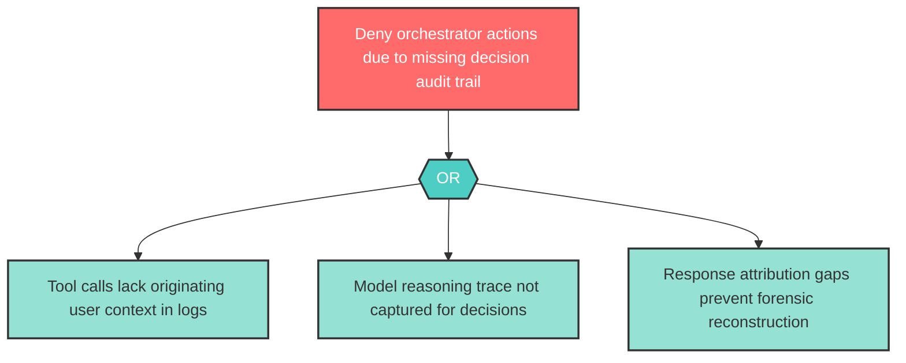

### I-1: Filter Rule Disclosure via Rejection Messages

**Component**: Guardrails Service | **Risk Level**: High | **Finding**: I-1

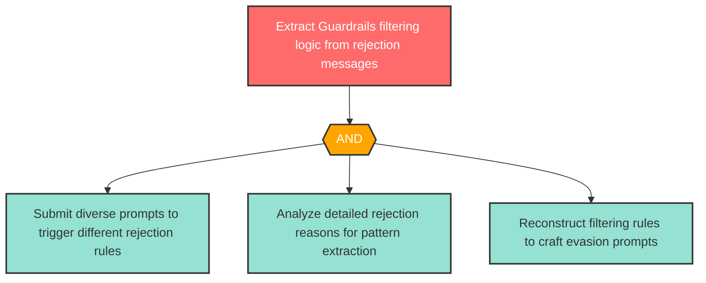

### I-2: Internal State Leakage via Error Messages

**Component**: LLM Agent Orchestrator | **Risk Level**: High | **Finding**: I-2

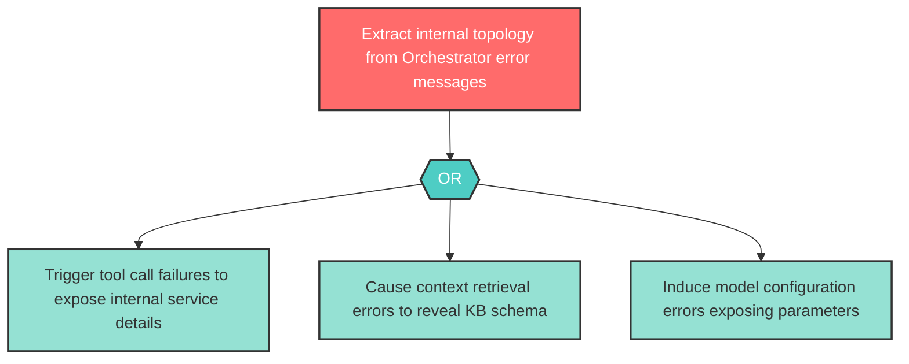

### I-3: API Key Exposure via Unsanitized Error Forwarding

**Component**: MCP Tool Server | **Risk Level**: High | **Finding**: I-3

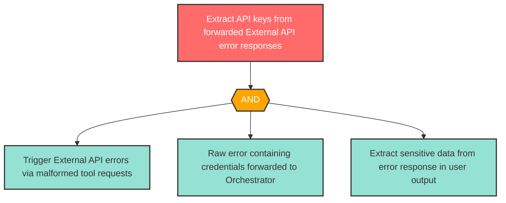

### I-4: Knowledge Base Metadata Exposure

**Component**: Knowledge Base | **Risk Level**: High | **Finding**: I-4

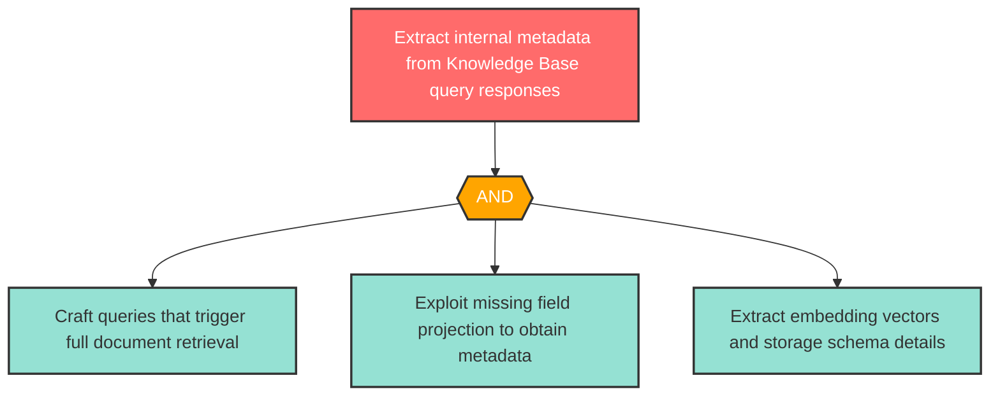

### I-5: Sensitive Data in Audit Logs

**Component**: Audit Logger | **Risk Level**: High | **Finding**: I-5

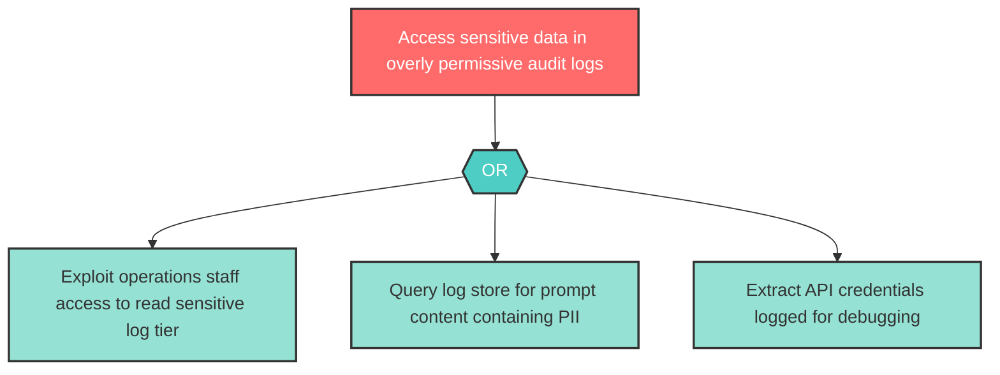

### D-1: Guardrails Service Resource Exhaustion

**Component**: Guardrails Service | **Risk Level**: Critical | **Finding**: D-1

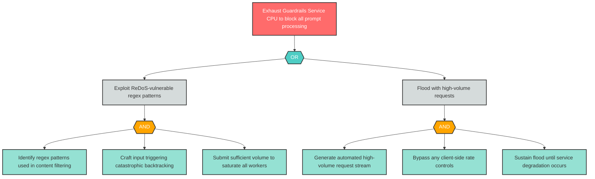

### D-2: Orchestrator Compute Exhaustion

**Component**: LLM Agent Orchestrator | **Risk Level**: Critical | **Finding**: D-2

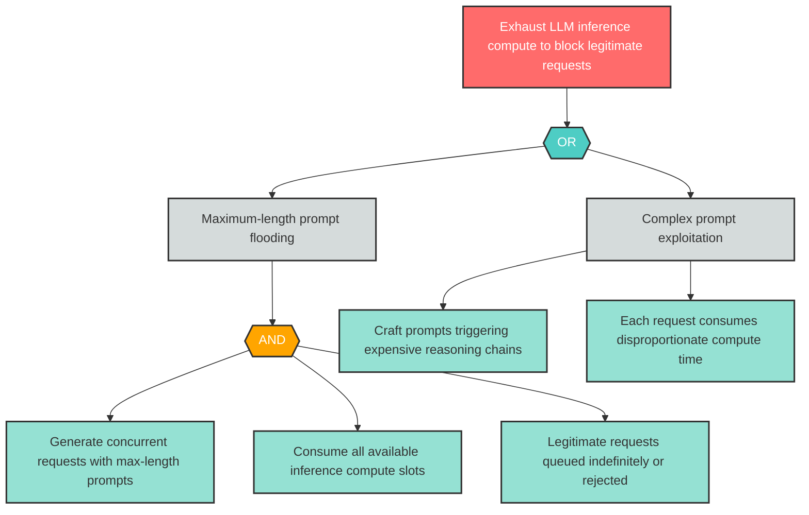

### D-3: Tool Server Concurrent Execution Exhaustion

**Component**: MCP Tool Server | **Risk Level**: High | **Finding**: D-3

This finding is part of correlation group CG-4. See also: AG-4.

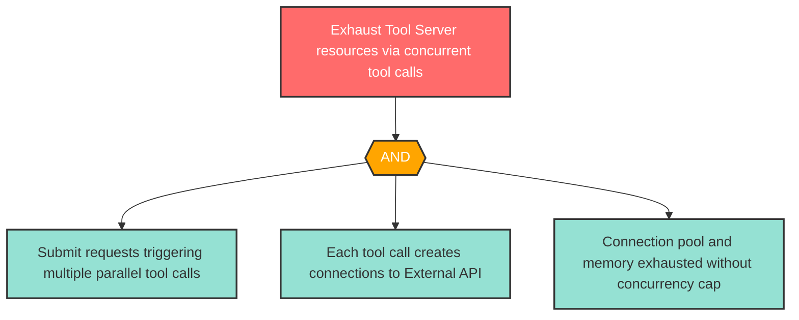

### E-1: Guardrails Bypass via Alternate Route

**Component**: Guardrails Service | **Risk Level**: High | **Finding**: E-1

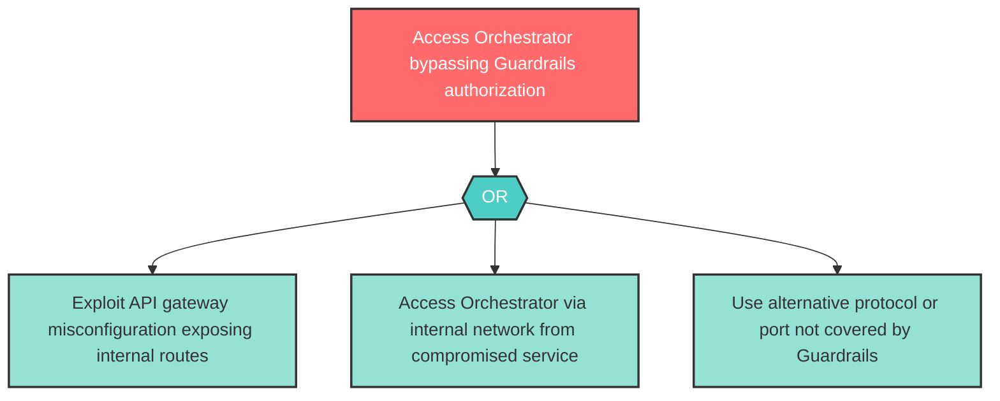

### E-2: Privilege Escalation via Tool Selection Manipulation

**Component**: LLM Agent Orchestrator | **Risk Level**: Critical | **Finding**: E-2

This finding is part of correlation group CG-2. See also: AG-1.

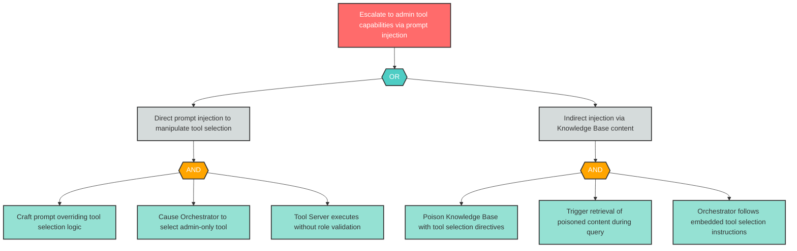

### E-3: Administrative Tool Access via Parameter Manipulation

**Component**: MCP Tool Server | **Risk Level**: Critical | **Finding**: E-3

```mermaid
flowchart TD
    E3_root["Invoke admin tool endpoints by manipulating tool_name"]
    E3_or1{{"OR"}}
    E3_sub1["Direct parameter manipulation"]
    E3_sub2["Prompt injection to control tool selection"]
    E3_and1{{"AND"}}
    E3_leaf1["Enumerate available tools via Tool Server discovery"]
    E3_leaf2["Craft tool call with admin tool_name parameter"]
    E3_leaf3["Tool Server executes without RBAC validation"]
    E3_leaf4["Achieve prompt injection against Orchestrator"]
    E3_leaf5["Cause Orchestrator to request admin-level tool call"]

    E3_root --> E3_or1
    E3_or1 --> E3_sub1
    E3_or1 --> E3_sub2
    E3_sub1 --> E3_and1
    E3_and1 --> E3_leaf1
    E3_and1 --> E3_leaf2
    E3_and1 --> E3_leaf3
    E3_sub2 --> E3_leaf4
    E3_sub2 --> E3_leaf5

    classDef goal fill:#ff6b6b,stroke:#333,stroke-width:2px,color:#fff
    classDef andGate fill:#ffa500,stroke:#333,stroke-width:2px,color:#fff
    classDef orGate fill:#4ecdc4,stroke:#333,stroke-width:2px,color:#fff
    classDef subGoal fill:#d5dbdb,stroke:#333,stroke-width:2px,color:#333
    classDef leaf fill:#95e1d3,stroke:#333,stroke-width:2px,color:#333

    class E3_root goal
    class E3_or1 orGate
    class E3_and1 andGate
    class E3_sub1,E3_sub2 subGoal
    class E3_leaf1,E3_leaf2,E3_leaf3,E3_leaf4,E3_leaf5 leaf
```

### AG-1: Autonomous Consequential Action Execution

**Component**: LLM Agent Orchestrator | **Risk Level**: Critical | **Finding**: AG-1

This finding is part of correlation group CG-2. See also: E-2.

```mermaid
flowchart TD
    AG1_root["Execute unauthorized consequential actions via Orchestrator"]
    AG1_or1{{"OR"}}
    AG1_sub1["Exploit missing risk-tier classification"]
    AG1_sub2["Bypass human-in-the-loop checkpoint"]
    AG1_and1{{"AND"}}
    AG1_leaf1["Identify high-stakes tool operation exposed by Orchestrator"]
    AG1_leaf2["Craft prompt triggering multi-step tool chain"]
    AG1_leaf3["Confirm no approval gate distinguishes read vs write operations"]
    AG1_and2{{"AND"}}
    AG1_leaf4["Discover checkpoint trigger conditions via probing"]
    AG1_leaf5["Construct prompt that routes below checkpoint threshold"]
    AG1_leaf6["Execute irreversible external action without approval"]

    AG1_root --> AG1_or1
    AG1_or1 --> AG1_sub1
    AG1_or1 --> AG1_sub2
    AG1_sub1 --> AG1_and1
    AG1_and1 --> AG1_leaf1
    AG1_and1 --> AG1_leaf2
    AG1_and1 --> AG1_leaf3
    AG1_sub2 --> AG1_and2
    AG1_and2 --> AG1_leaf4
    AG1_and2 --> AG1_leaf5
    AG1_and2 --> AG1_leaf6

    classDef goal fill:#ff6b6b,stroke:#333,stroke-width:2px,color:#fff
    classDef andGate fill:#ffa500,stroke:#333,stroke-width:2px,color:#fff
    classDef orGate fill:#4ecdc4,stroke:#333,stroke-width:2px,color:#fff
    classDef subGoal fill:#d5dbdb,stroke:#333,stroke-width:2px,color:#333
    classDef leaf fill:#95e1d3,stroke:#333,stroke-width:2px,color:#333

    class AG1_root goal
    class AG1_or1 orGate
    class AG1_and1,AG1_and2 andGate
    class AG1_sub1,AG1_sub2 subGoal
    class AG1_leaf1,AG1_leaf2,AG1_leaf3,AG1_leaf4,AG1_leaf5,AG1_leaf6 leaf
```

### AG-2: Unbounded Agent Reasoning Loop

**Component**: LLM Agent Orchestrator | **Risk Level**: High | **Finding**: AG-2

This finding is part of correlation group CG-3. See also: R-3.

```mermaid
flowchart TD
    AG2_root["Trigger unbounded Orchestrator reasoning loop"]
    AG2_and1{{"AND"}}
    AG2_leaf1["Submit ambiguous prompt with unclear completion criteria"]
    AG2_leaf2["Orchestrator enters iterative loop without termination constraint"]
    AG2_leaf3["Resources consumed indefinitely until external intervention"]

    AG2_root --> AG2_and1
    AG2_and1 --> AG2_leaf1
    AG2_and1 --> AG2_leaf2
    AG2_and1 --> AG2_leaf3

    classDef goal fill:#ff6b6b,stroke:#333,stroke-width:2px,color:#fff
    classDef andGate fill:#ffa500,stroke:#333,stroke-width:2px,color:#fff
    classDef leaf fill:#95e1d3,stroke:#333,stroke-width:2px,color:#333

    class AG2_root goal
    class AG2_and1 andGate
    class AG2_leaf1,AG2_leaf2,AG2_leaf3 leaf
```

### AG-3: Unscoped Tool Access on MCP Server

**Component**: MCP Tool Server | **Risk Level**: Critical | **Finding**: AG-3

```mermaid
flowchart TD
    AG3_root["Access all MCP tools regardless of agent authorization"]
    AG3_or1{{"OR"}}
    AG3_sub1["Exploit unscoped tool registry"]
    AG3_sub2["Dynamic tool discovery enumeration"]
    AG3_and1{{"AND"}}
    AG3_leaf1["Connect to MCP Tool Server as any agent"]
    AG3_leaf2["Enumerate all available tools via discovery endpoint"]
    AG3_leaf3["Invoke privileged tool not in agent capability set"]
    AG3_leaf4["Query tool registry for complete tool listing"]
    AG3_leaf5["Identify high-value tools outside intended scope"]

    AG3_root --> AG3_or1
    AG3_or1 --> AG3_sub1
    AG3_or1 --> AG3_sub2
    AG3_sub1 --> AG3_and1
    AG3_and1 --> AG3_leaf1
    AG3_and1 --> AG3_leaf2
    AG3_and1 --> AG3_leaf3
    AG3_sub2 --> AG3_leaf4
    AG3_sub2 --> AG3_leaf5

    classDef goal fill:#ff6b6b,stroke:#333,stroke-width:2px,color:#fff
    classDef andGate fill:#ffa500,stroke:#333,stroke-width:2px,color:#fff
    classDef orGate fill:#4ecdc4,stroke:#333,stroke-width:2px,color:#fff
    classDef subGoal fill:#d5dbdb,stroke:#333,stroke-width:2px,color:#333
    classDef leaf fill:#95e1d3,stroke:#333,stroke-width:2px,color:#333

    class AG3_root goal
    class AG3_or1 orGate
    class AG3_and1 andGate
    class AG3_sub1,AG3_sub2 subGoal
    class AG3_leaf1,AG3_leaf2,AG3_leaf3,AG3_leaf4,AG3_leaf5 leaf
```

### AG-4: Capability Escalation via Tool Chaining

**Component**: MCP Tool Server | **Risk Level**: High | **Finding**: AG-4

This finding is part of correlation group CG-4. See also: D-3.

```mermaid
flowchart TD
    AG4_root["Achieve data exfiltration via tool call chaining"]
    AG4_and1{{"AND"}}
    AG4_sub1["Execute data retrieval tool"]
    AG4_sub2["Execute data export tool"]
    AG4_sub3["Execute network send tool"]
    AG4_leaf1["Query database via authorized read tool"]
    AG4_leaf2["Write results to file via authorized export tool"]
    AG4_leaf3["Transmit file externally via authorized network tool"]

    AG4_root --> AG4_and1
    AG4_and1 --> AG4_sub1
    AG4_and1 --> AG4_sub2
    AG4_and1 --> AG4_sub3
    AG4_sub1 --> AG4_leaf1
    AG4_sub2 --> AG4_leaf2
    AG4_sub3 --> AG4_leaf3

    classDef goal fill:#ff6b6b,stroke:#333,stroke-width:2px,color:#fff
    classDef andGate fill:#ffa500,stroke:#333,stroke-width:2px,color:#fff
    classDef subGoal fill:#d5dbdb,stroke:#333,stroke-width:2px,color:#333
    classDef leaf fill:#95e1d3,stroke:#333,stroke-width:2px,color:#333

    class AG4_root goal
    class AG4_and1 andGate
    class AG4_sub1,AG4_sub2,AG4_sub3 subGoal
    class AG4_leaf1,AG4_leaf2,AG4_leaf3 leaf
```

### LLM-1: Direct Prompt Injection

**Component**: LLM Agent Orchestrator | **Risk Level**: Critical | **Finding**: LLM-1

```mermaid
flowchart TD
    LLM1_root["Override Orchestrator system prompt via adversarial input"]
    LLM1_or1{{"OR"}}
    LLM1_sub1["Instruction override injection"]
    LLM1_sub2["System prompt extraction"]
    LLM1_sub3["Jailbreak via iterative probing"]
    LLM1_and1{{"AND"}}
    LLM1_leaf1["Craft prompt with ignore previous instructions directive"]
    LLM1_leaf2["Inject new system-level instructions in user input"]
    LLM1_leaf3["Model follows injected instructions over original system prompt"]
    LLM1_and2{{"AND"}}
    LLM1_leaf4["Submit meta-instruction queries to reveal system prompt"]
    LLM1_leaf5["Extract sensitive business logic or API keys from prompt"]
    LLM1_leaf6["Submit iterative jailbreak variations without rate limiting"]
    LLM1_leaf7["Identify prompt pattern that bypasses safety alignment"]

    LLM1_root --> LLM1_or1
    LLM1_or1 --> LLM1_sub1
    LLM1_or1 --> LLM1_sub2
    LLM1_or1 --> LLM1_sub3
    LLM1_sub1 --> LLM1_and1
    LLM1_and1 --> LLM1_leaf1
    LLM1_and1 --> LLM1_leaf2
    LLM1_and1 --> LLM1_leaf3
    LLM1_sub2 --> LLM1_and2
    LLM1_and2 --> LLM1_leaf4
    LLM1_and2 --> LLM1_leaf5
    LLM1_sub3 --> LLM1_leaf6
    LLM1_sub3 --> LLM1_leaf7

    classDef goal fill:#ff6b6b,stroke:#333,stroke-width:2px,color:#fff
    classDef andGate fill:#ffa500,stroke:#333,stroke-width:2px,color:#fff
    classDef orGate fill:#4ecdc4,stroke:#333,stroke-width:2px,color:#fff
    classDef subGoal fill:#d5dbdb,stroke:#333,stroke-width:2px,color:#333
    classDef leaf fill:#95e1d3,stroke:#333,stroke-width:2px,color:#333

    class LLM1_root goal
    class LLM1_or1 orGate
    class LLM1_and1,LLM1_and2 andGate
    class LLM1_sub1,LLM1_sub2,LLM1_sub3 subGoal
    class LLM1_leaf1,LLM1_leaf2,LLM1_leaf3,LLM1_leaf4,LLM1_leaf5,LLM1_leaf6,LLM1_leaf7 leaf
```

### LLM-2: Indirect Prompt Injection via RAG Pipeline

**Component**: LLM Agent Orchestrator | **Risk Level**: High | **Finding**: LLM-2

This finding is part of correlation group CG-1. See also: T-4.

```mermaid
flowchart TD
    LLM2_root["Hijack Orchestrator behavior via poisoned RAG documents"]
    LLM2_or1{{"OR"}}
    LLM2_sub1["Inject adversarial instructions into Knowledge Base"]
    LLM2_sub2["Exploit existing document with embedded instructions"]
    LLM2_and1{{"AND"}}
    LLM2_leaf1["Obtain document upload access to Knowledge Base"]
    LLM2_leaf2["Craft document with adversarial instructions"]
    LLM2_leaf3["Ensure document ranks highly for target query embeddings"]
    LLM2_leaf4["Identify existing document containing instruction-like content"]
    LLM2_leaf5["Craft user query triggering retrieval of exploitable document"]

    LLM2_root --> LLM2_or1
    LLM2_or1 --> LLM2_sub1
    LLM2_or1 --> LLM2_sub2
    LLM2_sub1 --> LLM2_and1
    LLM2_and1 --> LLM2_leaf1
    LLM2_and1 --> LLM2_leaf2
    LLM2_and1 --> LLM2_leaf3
    LLM2_sub2 --> LLM2_leaf4
    LLM2_sub2 --> LLM2_leaf5

    classDef goal fill:#ff6b6b,stroke:#333,stroke-width:2px,color:#fff
    classDef andGate fill:#ffa500,stroke:#333,stroke-width:2px,color:#fff
    classDef orGate fill:#4ecdc4,stroke:#333,stroke-width:2px,color:#fff
    classDef subGoal fill:#d5dbdb,stroke:#333,stroke-width:2px,color:#333
    classDef leaf fill:#95e1d3,stroke:#333,stroke-width:2px,color:#333

    class LLM2_root goal
    class LLM2_or1 orGate
    class LLM2_and1 andGate
    class LLM2_sub1,LLM2_sub2 subGoal
    class LLM2_leaf1,LLM2_leaf2,LLM2_leaf3,LLM2_leaf4,LLM2_leaf5 leaf
```

---

## 6. Remediation Roadmap

This roadmap contains 30 remediation items (34 findings consolidated via 4 correlation groups): 8 Immediate, 12 Short-term, 6 Medium-term, and 1 Backlog. The most impacted component is the LLM Agent Orchestrator. Recommended starting point: implement mTLS across all inter-service channels and RBAC on tool dispatch simultaneously.

### Immediate (Critical)

| Finding ID | Component | Mitigation | Effort | Dependencies |
|------------|-----------|------------|--------|--------------|
| S-3 | LLM Agent Orchestrator | Implement mutual TLS (mTLS) with certificate pinning between the LLM Agent Orchestrator and MCP Tool Server; sign all JSON-RPC requests with a per-session HMAC key; validate caller identity on every tool call before dispatch | High | None |
| T-3 | MCP Tool Server | Implement strict JSON schema validation on all incoming tool call parameters at the MCP Tool Server; enforce parameterized queries and command sanitization; sign JSON-RPC payloads with HMAC at the Orchestrator and verify at the Tool Server; reject malformed or unsigned requests | High | Depends on S-3 mTLS implementation |
| D-1 | Guardrails Service | Enforce per-client rate limiting (e.g., 30 requests/minute) at the API gateway layer before the Guardrails Service; cap prompt input size at 4096 characters; implement request timeout at 10 seconds; use compiled regex with ReDoS-safe patterns; deploy auto-scaling with circuit breaker after sustained high load | Medium | None |
| D-2 | LLM Agent Orchestrator | Enforce per-client rate limiting of 10 requests/minute on the Orchestrator endpoint; cap prompt input at 4096 tokens; configure request timeout at 30 seconds with circuit breaker after 5 consecutive failures; set memory limit at 1GB per worker with OOM-kill restart policy; implement priority queuing for authenticated users | Medium | None |
| E-2 | LLM Agent Orchestrator | Implement RBAC policy on tool dispatch: map each tool to a required permission set; validate the authenticated user's role against the tool permission manifest before dispatch; reject unauthorized tool invocations with 403 and log the attempt; enforce least privilege -- standard users receive a restricted tool allowlist. Additionally, classify operations into risk tiers and require human approval for irreversible external actions. | High | Correlated: E-2, AG-1 (CG-2) |
| E-3 | MCP Tool Server | Implement RBAC policy on the MCP Tool Server that maps each tool endpoint to a required permission set; validate caller role against the tool permission manifest before dispatch; reject unauthorized tool invocations with 403 and log the attempt with caller identity and requested tool; enforce tool-level allowlists per agent role | High | Depends on E-2 for consistent RBAC framework |
| AG-3 | MCP Tool Server | Implement per-agent tool allowlists at the MCP Tool Server; each agent connection must declare its required capabilities and the server enforces that only declared tools are invocable; implement dynamic capability scoping based on the originating user's role; log all tool invocations with agent identity for audit | High | None |
| LLM-1 | LLM Agent Orchestrator | Implement structured prompt templates with explicit delimiter tokens between system instructions and user input; deploy an input classifier that detects adversarial prompt patterns before forwarding to the model; apply output filtering to detect responses that violate expected behavior boundaries; implement canary tokens in system prompts to detect extraction attempts | High | None |

### Short-term (High)

| Finding ID | Component | Mitigation | Effort | Dependencies |
|------------|-----------|------------|--------|--------------|
| S-1 | User | Implement token binding using DPoP (Demonstration of Proof-of-Possession) or certificate-bound access tokens; enforce session binding to client fingerprint (IP range, user-agent, TLS session); require MFA for sensitive operations; set short token lifetimes (15 minutes) with rotation | High | None |
| S-2 | Guardrails Service | Enforce mutual TLS (mTLS) between Guardrails Service and LLM Agent Orchestrator; validate service identity claims using signed JWTs with audience restriction; reject requests to the Orchestrator that do not originate from an authenticated Guardrails Service instance | High | Depends on S-3 mTLS infrastructure |
| S-4 | MCP Tool Server | Implement TLS certificate pinning for all outbound connections to the External API; validate DNS responses using DNSSEC; configure strict certificate chain verification; monitor for unexpected certificate changes on external endpoints | Medium | None |
| T-1 | Guardrails Service | Store Guardrails validation rules in an immutable configuration store with cryptographic integrity verification (SHA-256 checksums); enforce read-only filesystem mounts for configuration; implement change detection alerts on rule modifications; require signed configuration updates through a separate deployment pipeline | Medium | None |
| T-2 | LLM Agent Orchestrator | Sign validated prompts with an HMAC before forwarding from Guardrails Service to Orchestrator; verify signature on receipt; reject prompts with invalid or missing signatures; encrypt the inter-service channel with TLS to prevent network-level tampering | Medium | Depends on S-2 mTLS implementation |
| T-4 | Knowledge Base | Implement content validation and sanitization on all write operations to the Knowledge Base; enforce allowlist-based content filtering; apply integrity checksums (SHA-256) on stored records; restrict write access to an authorized ingestion pipeline with audit logging; implement versioned snapshots for rollback capability. Additionally, sanitize retrieved content before prompt injection and implement provenance tracking. | High | Correlated: T-4, LLM-2 (CG-1) |
| T-5 | Audit Logger | Deploy the Audit Logger as an append-only, immutable log store (e.g., write-once S3 bucket or blockchain-anchored log); separate write permissions from read/admin permissions; forward logs to an external SIEM within 60 seconds; implement cryptographic chaining (hash chain) to detect tampering; restrict direct database access to the log store | High | None |
| R-3 | LLM Agent Orchestrator | Instrument the Orchestrator to emit structured decision audit events for every tool dispatch: record authenticated user ID, session ID, input prompt hash, model reasoning trace, each tool call details, final response hash, and UTC timestamp; forward to append-only Audit Logger within 60 seconds. Additionally, implement termination constraints: max 25 iterations, 5-minute timeout, $10 cost cap; add circuit breaker for repeated action patterns. | High | Correlated: R-3, AG-2 (CG-3). Depends on T-5 immutable log store. |
| I-1 | Guardrails Service | Return generic rejection messages to users (e.g., "Your request could not be processed") without exposing filter rule details; log detailed rejection reasons only to the internal Audit Logger; implement separate user-facing and internal-facing error response schemas | Low | None |
| I-2 | LLM Agent Orchestrator | Implement standardized error responses that strip internal details; return generic error codes to users (e.g., "Service temporarily unavailable"); route detailed error information to internal monitoring only; audit all response schemas for unintended metadata disclosure | Low | None |
| I-3 | MCP Tool Server | Sanitize all External API responses before returning to the Orchestrator; strip authentication headers, internal URLs, and API keys from error payloads; implement an error response allowlist that passes only expected fields; log raw responses internally for debugging | Medium | None |
| I-4 | Knowledge Base | Implement field-level projection on Knowledge Base query responses to return only content fields required by the Orchestrator; strip internal metadata, embedding vectors, document IDs, and storage schema details; enforce query-scoped access controls matching the requesting user's authorization level | Medium | None |
| I-5 | Audit Logger | Implement log data classification: separate sensitive fields (prompt content, PII, credentials) into a restricted log tier with strict access controls; apply PII masking or tokenization before writing to the general log store; enforce role-based access to audit logs (security team only for sensitive tier); implement log retention policies with automatic purging of sensitive data | Medium | Depends on T-5 immutable log store |
| D-3 | MCP Tool Server | Enforce a maximum of 5 concurrent tool calls per user request; implement per-tool rate limiting; configure tool execution timeout at 15 seconds; deploy circuit breaker for external API calls with exponential backoff. Additionally, implement tool chain policy engine evaluating composite effects; define forbidden tool combinations; enforce max chain depth of 3. | High | Correlated: D-3, AG-4 (CG-4) |
| E-1 | Guardrails Service | Implement defense-in-depth: enforce authorization checks at both the Guardrails Service and the Orchestrator; configure network policies to restrict Orchestrator access to only the Guardrails Service; deploy API gateway rules that block direct access to internal service endpoints; validate origin service identity on every request | Medium | Depends on S-2 mTLS implementation |

### Medium-term (Medium)

| Finding ID | Component | Mitigation | Effort | Dependencies |
|------------|-----------|------------|--------|--------------|
| R-1 | User | Implement non-repudiation controls: capture authenticated user ID, session ID, client IP, timestamp (UTC, sub-second precision), and cryptographic hash of the submitted prompt in an immutable audit record; require user acknowledgment for sensitive operations; retain audit records for the compliance-required retention period | Medium | Depends on T-5 immutable log store |
| R-2 | Guardrails Service | Instrument the Guardrails Service to emit structured audit events for every filtering decision: include request correlation ID, authenticated user ID, original prompt hash, matched filter rule ID, confidence score, action taken (allow/reject), and UTC timestamp; forward events to the append-only Audit Logger | Low | None |
| R-4 | MCP Tool Server | Log every tool execution with: requesting orchestrator session ID, originating user ID (propagated from orchestrator), tool name, input parameters, execution duration, response status, External API endpoint called, and UTC timestamp; correlate with orchestrator decision logs via shared request correlation ID | Low | None |
| D-4 | Knowledge Base | Enforce maximum result count (top-k limit of 10) on all Knowledge Base queries; cap query vector dimensions; implement query timeout at 5 seconds; deploy connection pool limits; monitor query patterns for anomalous complexity spikes | Low | None |
| D-5 | Audit Logger | Implement log volume throttling with per-source rate limits; set storage quotas with automatic rotation; deploy log sampling for high-volume event sources during load spikes; monitor disk usage with alerts at 80% capacity; use external log shipping to scalable storage (S3, cloud logging service) | Low | None |
| LLM-3 | LLM Agent Orchestrator | Restrict API output to top-k predictions only; implement per-API-key query budgets with alerts at threshold crossings; deploy query pattern analysis that detects systematic probing (uniform input distributions, grid sampling patterns); add watermarking to model outputs to enable downstream detection of extracted copies | Medium | None |

### Backlog (Low)

| Finding ID | Component | Mitigation | Effort | Dependencies |
|------------|-----------|------------|--------|--------------|
| R-5 | External API | Include a unique request correlation ID in all External API calls (via HTTP header); log the correlation ID alongside the originating user request ID in both the MCP Tool Server and Audit Logger; implement request-response logging for all external API interactions | Low | None |

---

## 7. Appendix: Finding Reference

| Finding ID | Report Section | Heading Reference |
|------------|---------------|-------------------|
| S-1 | 3.1 Spoofing | Section 3 |
| S-1 | 5. Attack Trees | Section 5 |
| S-1 | 6. Remediation Roadmap | Section 6 |
| S-2 | 3.1 Spoofing | Section 3 |
| S-2 | 5. Attack Trees | Section 5 |
| S-2 | 6. Remediation Roadmap | Section 6 |
| S-3 | 3.1 Spoofing | Section 3 |
| S-3 | 5. Attack Trees | Section 5 |
| S-3 | 6. Remediation Roadmap | Section 6 |
| S-4 | 3.1 Spoofing | Section 3 |
| S-4 | 5. Attack Trees | Section 5 |
| S-4 | 6. Remediation Roadmap | Section 6 |
| T-1 | 3.2 Tampering | Section 3 |
| T-1 | 5. Attack Trees | Section 5 |
| T-1 | 6. Remediation Roadmap | Section 6 |
| T-2 | 3.2 Tampering | Section 3 |
| T-2 | 5. Attack Trees | Section 5 |
| T-2 | 6. Remediation Roadmap | Section 6 |
| T-3 | 3.2 Tampering | Section 3 |
| T-3 | 5. Attack Trees | Section 5 |
| T-3 | 6. Remediation Roadmap | Section 6 |
| T-4 | 3.2 Tampering | Section 3 |
| T-4 | 4. Cross-Cutting Themes | Section 4 |
| T-4 | 5. Attack Trees | Section 5 |
| T-4 | 6. Remediation Roadmap | Section 6 |
| T-5 | 3.2 Tampering | Section 3 |
| T-5 | 5. Attack Trees | Section 5 |
| T-5 | 6. Remediation Roadmap | Section 6 |
| R-1 | 3.3 Repudiation | Section 3 |
| R-1 | 6. Remediation Roadmap | Section 6 |
| R-2 | 3.3 Repudiation | Section 3 |
| R-2 | 6. Remediation Roadmap | Section 6 |
| R-3 | 3.3 Repudiation | Section 3 |
| R-3 | 4. Cross-Cutting Themes | Section 4 |
| R-3 | 5. Attack Trees | Section 5 |
| R-3 | 6. Remediation Roadmap | Section 6 |
| R-4 | 3.3 Repudiation | Section 3 |
| R-4 | 6. Remediation Roadmap | Section 6 |
| R-5 | 3.3 Repudiation | Section 3 |
| R-5 | 6. Remediation Roadmap | Section 6 |
| I-1 | 3.4 Information Disclosure | Section 3 |
| I-1 | 5. Attack Trees | Section 5 |
| I-1 | 6. Remediation Roadmap | Section 6 |
| I-2 | 3.4 Information Disclosure | Section 3 |
| I-2 | 5. Attack Trees | Section 5 |
| I-2 | 6. Remediation Roadmap | Section 6 |
| I-3 | 3.4 Information Disclosure | Section 3 |
| I-3 | 5. Attack Trees | Section 5 |
| I-3 | 6. Remediation Roadmap | Section 6 |
| I-4 | 3.4 Information Disclosure | Section 3 |
| I-4 | 5. Attack Trees | Section 5 |
| I-4 | 6. Remediation Roadmap | Section 6 |
| I-5 | 3.4 Information Disclosure | Section 3 |
| I-5 | 4. Cross-Cutting Themes | Section 4 |
| I-5 | 5. Attack Trees | Section 5 |
| I-5 | 6. Remediation Roadmap | Section 6 |
| D-1 | 3.5 Denial of Service | Section 3 |
| D-1 | 5. Attack Trees | Section 5 |
| D-1 | 6. Remediation Roadmap | Section 6 |
| D-2 | 3.5 Denial of Service | Section 3 |
| D-2 | 5. Attack Trees | Section 5 |
| D-2 | 6. Remediation Roadmap | Section 6 |
| D-3 | 3.5 Denial of Service | Section 3 |
| D-3 | 4. Cross-Cutting Themes | Section 4 |
| D-3 | 5. Attack Trees | Section 5 |
| D-3 | 6. Remediation Roadmap | Section 6 |
| D-4 | 3.5 Denial of Service | Section 3 |
| D-4 | 6. Remediation Roadmap | Section 6 |
| D-5 | 3.5 Denial of Service | Section 3 |
| D-5 | 6. Remediation Roadmap | Section 6 |
| E-1 | 3.6 Elevation of Privilege | Section 3 |
| E-1 | 5. Attack Trees | Section 5 |
| E-1 | 6. Remediation Roadmap | Section 6 |
| E-2 | 3.6 Elevation of Privilege | Section 3 |
| E-2 | 4. Cross-Cutting Themes | Section 4 |
| E-2 | 5. Attack Trees | Section 5 |
| E-2 | 6. Remediation Roadmap | Section 6 |
| E-3 | 3.6 Elevation of Privilege | Section 3 |
| E-3 | 5. Attack Trees | Section 5 |
| E-3 | 6. Remediation Roadmap | Section 6 |
| AG-1 | 3.7 Agentic Threats | Section 3 |
| AG-1 | 4. Cross-Cutting Themes | Section 4 |
| AG-1 | 5. Attack Trees | Section 5 |
| AG-1 | 6. Remediation Roadmap | Section 6 |
| AG-2 | 3.7 Agentic Threats | Section 3 |
| AG-2 | 5. Attack Trees | Section 5 |
| AG-2 | 6. Remediation Roadmap | Section 6 |
| AG-3 | 3.7 Agentic Threats | Section 3 |
| AG-3 | 4. Cross-Cutting Themes | Section 4 |
| AG-3 | 5. Attack Trees | Section 5 |
| AG-3 | 6. Remediation Roadmap | Section 6 |
| AG-4 | 3.7 Agentic Threats | Section 3 |
| AG-4 | 4. Cross-Cutting Themes | Section 4 |
| AG-4 | 5. Attack Trees | Section 5 |
| AG-4 | 6. Remediation Roadmap | Section 6 |
| LLM-1 | 3.8 LLM Threats | Section 3 |
| LLM-1 | 5. Attack Trees | Section 5 |
| LLM-1 | 6. Remediation Roadmap | Section 6 |
| LLM-2 | 3.8 LLM Threats | Section 3 |
| LLM-2 | 5. Attack Trees | Section 5 |
| LLM-2 | 6. Remediation Roadmap | Section 6 |
| LLM-3 | 3.8 LLM Threats | Section 3 |
| LLM-3 | 6. Remediation Roadmap | Section 6 |
