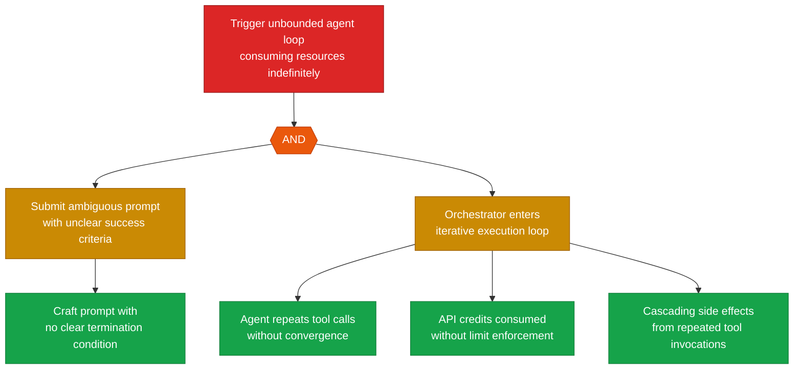

# Attack Tree: AG-1 — Unbounded Agent Loop

**Finding**: AG-1 | **Component**: LLM Agent Orchestrator | **Risk Level**: Critical
**Correlation**: Part of CG-2. See also: E-2.

```mermaid
flowchart TD
    AG1_root["Trigger unbounded agent loop\nconsuming resources indefinitely"]
    AG1_and1{{"AND"}}
    AG1_sub1["Submit ambiguous prompt\nwith unclear success criteria"]
    AG1_sub2["Orchestrator enters\niterative execution loop"]
    AG1_leaf1["Craft prompt with\nno clear termination condition"]
    AG1_leaf2["Agent repeats tool calls\nwithout convergence"]
    AG1_leaf3["API credits consumed\nwithout limit enforcement"]
    AG1_leaf4["Cascading side effects\nfrom repeated tool invocations"]
    AG1_root --> AG1_and1
    AG1_and1 --> AG1_sub1
    AG1_and1 --> AG1_sub2
    AG1_sub1 --> AG1_leaf1
    AG1_sub2 --> AG1_leaf2
    AG1_sub2 --> AG1_leaf3
    AG1_sub2 --> AG1_leaf4
    classDef goal fill:#DC2626,stroke:#991B1B,color:#FFFFFF
    classDef andGate fill:#EA580C,stroke:#C2410C,color:#FFFFFF
    classDef leaf fill:#16A34A,stroke:#15803D,color:#FFFFFF
    classDef sub fill:#CA8A04,stroke:#A16207,color:#FFFFFF
    class AG1_root goal
    class AG1_and1 andGate
    class AG1_sub1,AG1_sub2 sub
    class AG1_leaf1,AG1_leaf2,AG1_leaf3,AG1_leaf4 leaf
```
