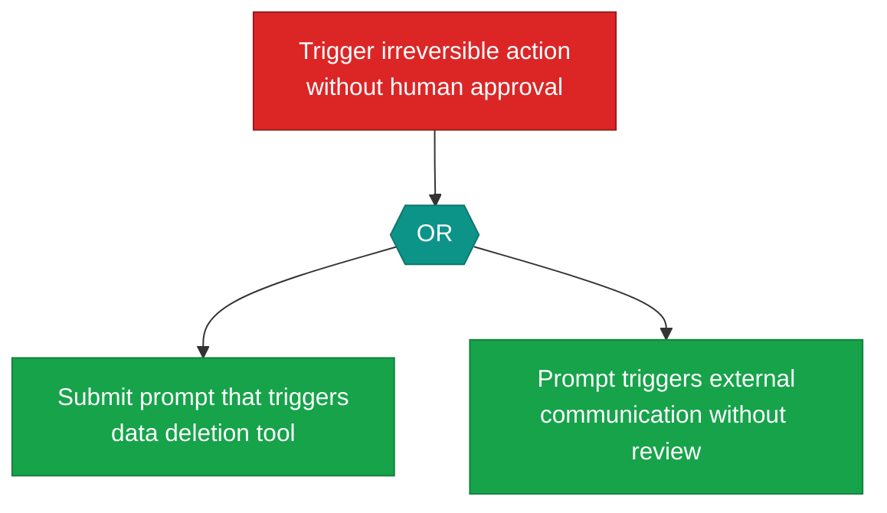

# Attack Tree: AG-2 — Consequential Decisions Without Human Review

**Finding**: AG-2 | **Component**: LLM Agent Orchestrator | **Risk Level**: High
**Correlation**: Part of CG-4. See also: R-3.

```mermaid
flowchart TD
    AG2_root["Trigger irreversible action\nwithout human approval"]
    AG2_or1{{"OR"}}
    AG2_leaf1["Submit prompt that triggers\ndata deletion tool"]
    AG2_leaf2["Prompt triggers external\ncommunication without review"]
    AG2_root --> AG2_or1
    AG2_or1 --> AG2_leaf1
    AG2_or1 --> AG2_leaf2
    classDef goal fill:#DC2626,stroke:#991B1B,color:#FFFFFF
    classDef orGate fill:#0D9488,stroke:#0F766E,color:#FFFFFF
    classDef leaf fill:#16A34A,stroke:#15803D,color:#FFFFFF
    class AG2_root goal
    class AG2_or1 orGate
    class AG2_leaf1,AG2_leaf2 leaf
```
