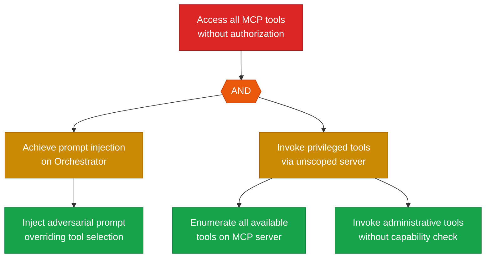

# Attack Tree: AG-3 — Unrestricted Tool Access via Unscoped MCP Server

**Finding**: AG-3 | **Component**: MCP Tool Server | **Risk Level**: Critical

```mermaid
flowchart TD
    AG3_root["Access all MCP tools\nwithout authorization"]
    AG3_and1{{"AND"}}
    AG3_sub1["Achieve prompt injection\non Orchestrator"]
    AG3_sub2["Invoke privileged tools\nvia unscoped server"]
    AG3_leaf1["Inject adversarial prompt\noverriding tool selection"]
    AG3_leaf2["Enumerate all available\ntools on MCP server"]
    AG3_leaf3["Invoke administrative tools\nwithout capability check"]
    AG3_root --> AG3_and1
    AG3_and1 --> AG3_sub1
    AG3_and1 --> AG3_sub2
    AG3_sub1 --> AG3_leaf1
    AG3_sub2 --> AG3_leaf2
    AG3_sub2 --> AG3_leaf3
    classDef goal fill:#DC2626,stroke:#991B1B,color:#FFFFFF
    classDef andGate fill:#EA580C,stroke:#C2410C,color:#FFFFFF
    classDef leaf fill:#16A34A,stroke:#15803D,color:#FFFFFF
    classDef sub fill:#CA8A04,stroke:#A16207,color:#FFFFFF
    class AG3_root goal
    class AG3_and1 andGate
    class AG3_sub1,AG3_sub2 sub
    class AG3_leaf1,AG3_leaf2,AG3_leaf3 leaf
```
