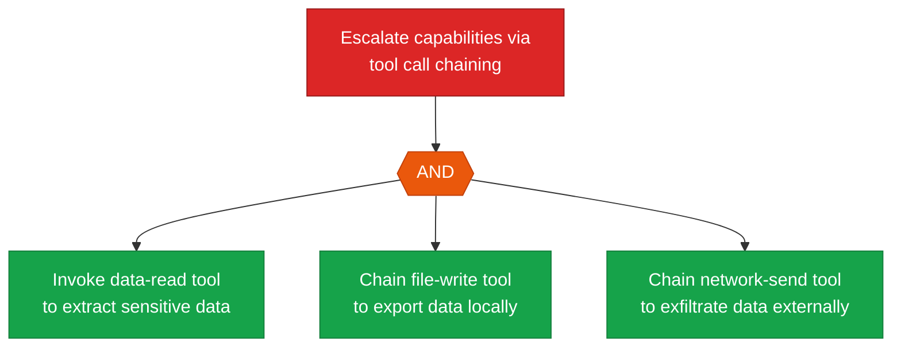

# Attack Tree: AG-4 — Capability Escalation via Tool Chaining

**Finding**: AG-4 | **Component**: MCP Tool Server | **Risk Level**: High
**Correlation**: Part of CG-5. See also: D-3.

```mermaid
flowchart TD
    AG4_root["Escalate capabilities via\ntool call chaining"]
    AG4_and1{{"AND"}}
    AG4_leaf1["Invoke data-read tool\nto extract sensitive data"]
    AG4_leaf2["Chain file-write tool\nto export data locally"]
    AG4_leaf3["Chain network-send tool\nto exfiltrate data externally"]
    AG4_root --> AG4_and1
    AG4_and1 --> AG4_leaf1
    AG4_and1 --> AG4_leaf2
    AG4_and1 --> AG4_leaf3
    classDef goal fill:#DC2626,stroke:#991B1B,color:#FFFFFF
    classDef andGate fill:#EA580C,stroke:#C2410C,color:#FFFFFF
    classDef leaf fill:#16A34A,stroke:#15803D,color:#FFFFFF
    class AG4_root goal
    class AG4_and1 andGate
    class AG4_leaf1,AG4_leaf2,AG4_leaf3 leaf
```
