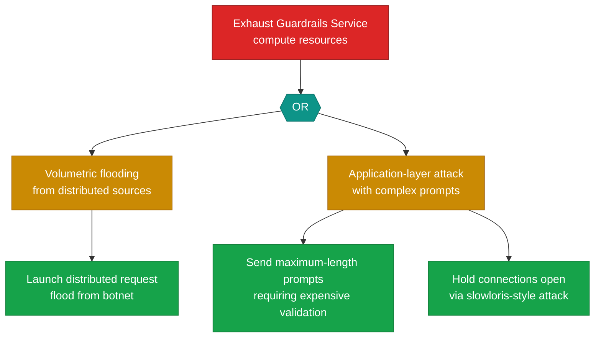

# Attack Tree: D-1 — Entry Point Flooding

**Finding**: D-1 | **Component**: Guardrails Service | **Risk Level**: Critical

```mermaid
flowchart TD
    D1_root["Exhaust Guardrails Service\ncompute resources"]
    D1_or1{{"OR"}}
    D1_sub1["Volumetric flooding\nfrom distributed sources"]
    D1_sub2["Application-layer attack\nwith complex prompts"]
    D1_leaf1["Launch distributed request\nflood from botnet"]
    D1_leaf2["Send maximum-length prompts\nrequiring expensive validation"]
    D1_leaf3["Hold connections open\nvia slowloris-style attack"]
    D1_root --> D1_or1
    D1_or1 --> D1_sub1
    D1_or1 --> D1_sub2
    D1_sub1 --> D1_leaf1
    D1_sub2 --> D1_leaf2
    D1_sub2 --> D1_leaf3
    classDef goal fill:#DC2626,stroke:#991B1B,color:#FFFFFF
    classDef orGate fill:#0D9488,stroke:#0F766E,color:#FFFFFF
    classDef leaf fill:#16A34A,stroke:#15803D,color:#FFFFFF
    classDef sub fill:#CA8A04,stroke:#A16207,color:#FFFFFF
    class D1_root goal
    class D1_or1 orGate
    class D1_sub1,D1_sub2 sub
    class D1_leaf1,D1_leaf2,D1_leaf3 leaf
```
