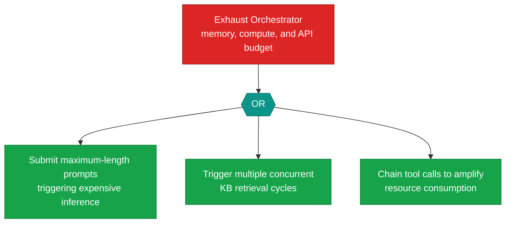

# Attack Tree: D-2 — LLM Resource Exhaustion

**Finding**: D-2 | **Component**: LLM Agent Orchestrator | **Risk Level**: Critical

```mermaid
flowchart TD
    D2_root["Exhaust Orchestrator\nmemory, compute, and API budget"]
    D2_or1{{"OR"}}
    D2_leaf1["Submit maximum-length prompts\ntriggering expensive inference"]
    D2_leaf2["Trigger multiple concurrent\nKB retrieval cycles"]
    D2_leaf3["Chain tool calls to amplify\nresource consumption"]
    D2_root --> D2_or1
    D2_or1 --> D2_leaf1
    D2_or1 --> D2_leaf2
    D2_or1 --> D2_leaf3
    classDef goal fill:#DC2626,stroke:#991B1B,color:#FFFFFF
    classDef orGate fill:#0D9488,stroke:#0F766E,color:#FFFFFF
    classDef leaf fill:#16A34A,stroke:#15803D,color:#FFFFFF
    class D2_root goal
    class D2_or1 orGate
    class D2_leaf1,D2_leaf2,D2_leaf3 leaf
```
