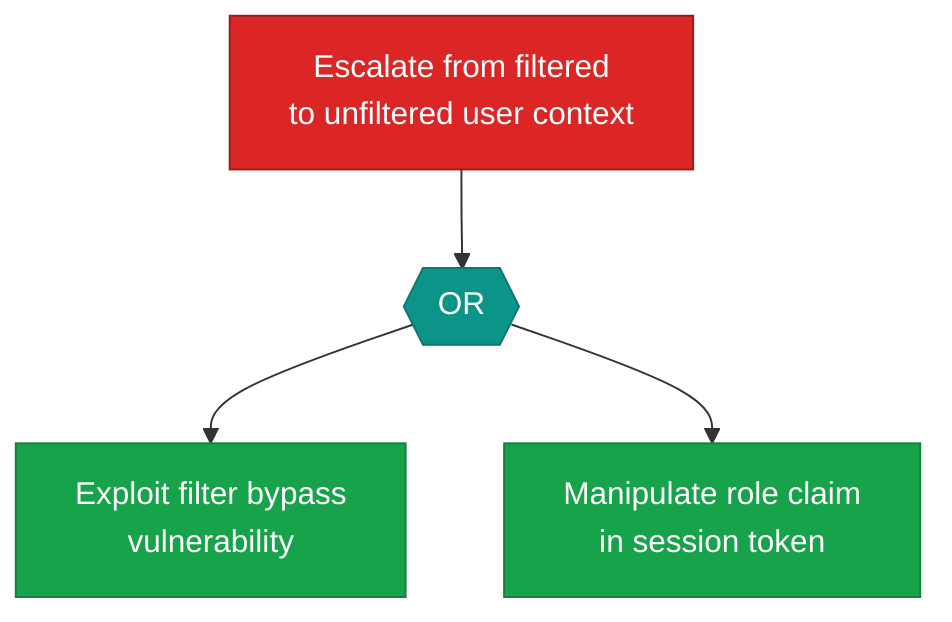

# Attack Tree: E-1 — Guardrails Bypass Privilege Escalation

**Finding**: E-1 | **Component**: Guardrails Service | **Risk Level**: High

```mermaid
flowchart TD
    E1_root["Escalate from filtered\nto unfiltered user context"]
    E1_or1{{"OR"}}
    E1_leaf1["Exploit filter bypass\nvulnerability"]
    E1_leaf2["Manipulate role claim\nin session token"]
    E1_root --> E1_or1
    E1_or1 --> E1_leaf1
    E1_or1 --> E1_leaf2
    classDef goal fill:#DC2626,stroke:#991B1B,color:#FFFFFF
    classDef orGate fill:#0D9488,stroke:#0F766E,color:#FFFFFF
    classDef leaf fill:#16A34A,stroke:#15803D,color:#FFFFFF
    class E1_root goal
    class E1_or1 orGate
    class E1_leaf1,E1_leaf2 leaf
```
