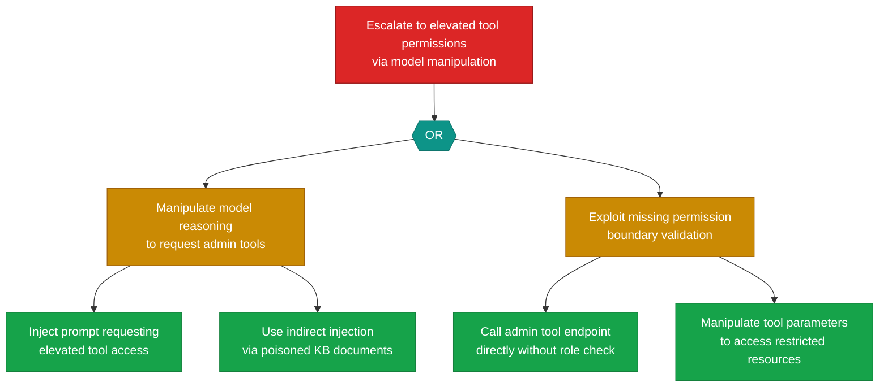

# Attack Tree: E-2 — Tool Permission Escalation via Model Manipulation

**Finding**: E-2 | **Component**: LLM Agent Orchestrator | **Risk Level**: Critical
**Correlation**: Part of CG-2. See also: AG-1.

