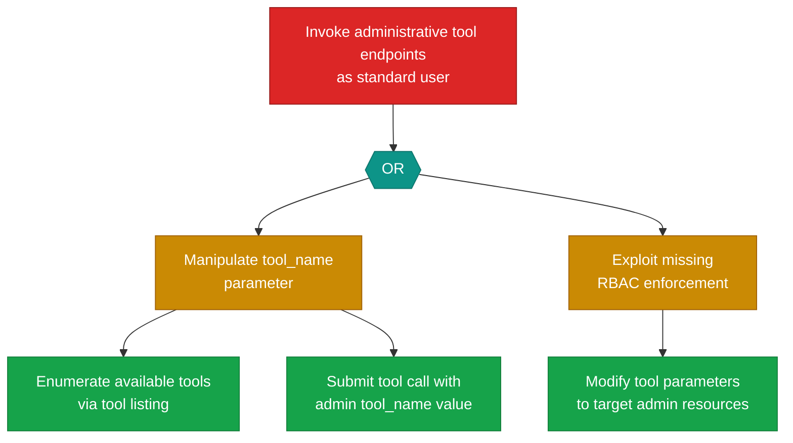

# Attack Tree: E-3 — Administrative Tool Invocation by Standard Users

**Finding**: E-3 | **Component**: MCP Tool Server | **Risk Level**: Critical

```mermaid
flowchart TD
    E3_root["Invoke administrative tool endpoints\nas standard user"]
    E3_or1{{"OR"}}
    E3_sub1["Manipulate tool_name\nparameter"]
    E3_sub2["Exploit missing\nRBAC enforcement"]
    E3_leaf1["Enumerate available tools\nvia tool listing"]
    E3_leaf2["Submit tool call with\nadmin tool_name value"]
    E3_leaf3["Modify tool parameters\nto target admin resources"]
    E3_root --> E3_or1
    E3_or1 --> E3_sub1
    E3_or1 --> E3_sub2
    E3_sub1 --> E3_leaf1
    E3_sub1 --> E3_leaf2
    E3_sub2 --> E3_leaf3
    classDef goal fill:#DC2626,stroke:#991B1B,color:#FFFFFF
    classDef orGate fill:#0D9488,stroke:#0F766E,color:#FFFFFF
    classDef leaf fill:#16A34A,stroke:#15803D,color:#FFFFFF
    classDef sub fill:#CA8A04,stroke:#A16207,color:#FFFFFF
    class E3_root goal
    class E3_or1 orGate
    class E3_sub1,E3_sub2 sub
    class E3_leaf1,E3_leaf2,E3_leaf3 leaf
```
