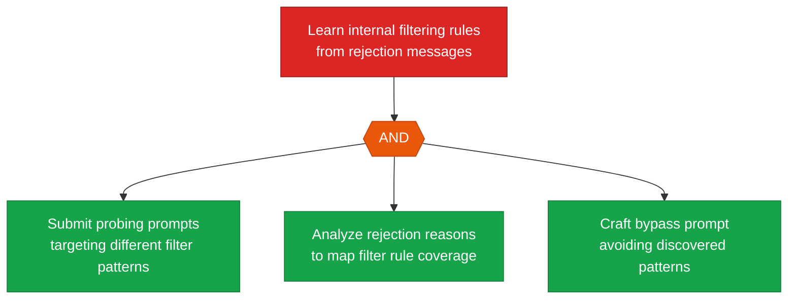

# Attack Tree: I-1 — Filter Rule Disclosure via Rejection Messages

**Finding**: I-1 | **Component**: Guardrails Service | **Risk Level**: High

```mermaid
flowchart TD
    I1_root["Learn internal filtering rules\nfrom rejection messages"]
    I1_and1{{"AND"}}
    I1_leaf1["Submit probing prompts\ntargeting different filter patterns"]
    I1_leaf2["Analyze rejection reasons\nto map filter rule coverage"]
    I1_leaf3["Craft bypass prompt\navoiding discovered patterns"]
    I1_root --> I1_and1
    I1_and1 --> I1_leaf1
    I1_and1 --> I1_leaf2
    I1_and1 --> I1_leaf3
    classDef goal fill:#DC2626,stroke:#991B1B,color:#FFFFFF
    classDef andGate fill:#EA580C,stroke:#C2410C,color:#FFFFFF
    classDef leaf fill:#16A34A,stroke:#15803D,color:#FFFFFF
    class I1_root goal
    class I1_and1 andGate
    class I1_leaf1,I1_leaf2,I1_leaf3 leaf
```
