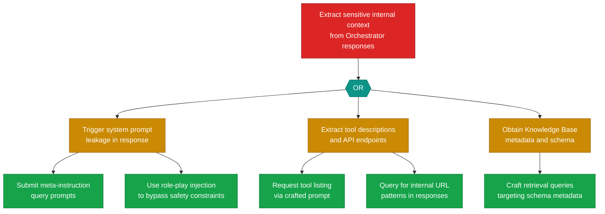

# Attack Tree: I-2 — Internal Context Leakage via Orchestrator Responses

**Finding**: I-2 | **Component**: LLM Agent Orchestrator | **Risk Level**: Critical
**Correlation**: Part of CG-3. See also: LLM-1.

