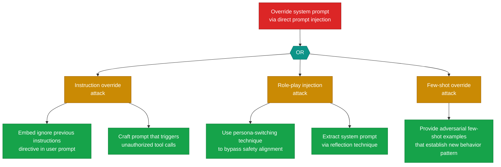

# Attack Tree: LLM-1 — Direct Prompt Injection

**Finding**: LLM-1 | **Component**: LLM Agent Orchestrator | **Risk Level**: Critical
**Correlation**: Part of CG-3. See also: I-2.

```mermaid
flowchart TD
    LLM1_root["Override system prompt\nvia direct prompt injection"]
    LLM1_or1{{"OR"}}
    LLM1_sub1["Instruction override\nattack"]
    LLM1_sub2["Role-play injection\nattack"]
    LLM1_sub3["Few-shot override\nattack"]
    LLM1_leaf1["Embed ignore previous instructions\ndirective in user prompt"]
    LLM1_leaf2["Use persona-switching technique\nto bypass safety alignment"]
    LLM1_leaf3["Provide adversarial few-shot examples\nthat establish new behavior pattern"]
    LLM1_leaf4["Craft prompt that triggers\nunauthorized tool calls"]
    LLM1_leaf5["Extract system prompt\nvia reflection technique"]
    LLM1_root --> LLM1_or1
    LLM1_or1 --> LLM1_sub1
    LLM1_or1 --> LLM1_sub2
    LLM1_or1 --> LLM1_sub3
    LLM1_sub1 --> LLM1_leaf1
    LLM1_sub1 --> LLM1_leaf4
    LLM1_sub2 --> LLM1_leaf2
    LLM1_sub2 --> LLM1_leaf5
    LLM1_sub3 --> LLM1_leaf3
    classDef goal fill:#DC2626,stroke:#991B1B,color:#FFFFFF
    classDef orGate fill:#0D9488,stroke:#0F766E,color:#FFFFFF
    classDef leaf fill:#16A34A,stroke:#15803D,color:#FFFFFF
    classDef sub fill:#CA8A04,stroke:#A16207,color:#FFFFFF
    class LLM1_root goal
    class LLM1_or1 orGate
    class LLM1_sub1,LLM1_sub2,LLM1_sub3 sub
    class LLM1_leaf1,LLM1_leaf2,LLM1_leaf3,LLM1_leaf4,LLM1_leaf5 leaf
```
