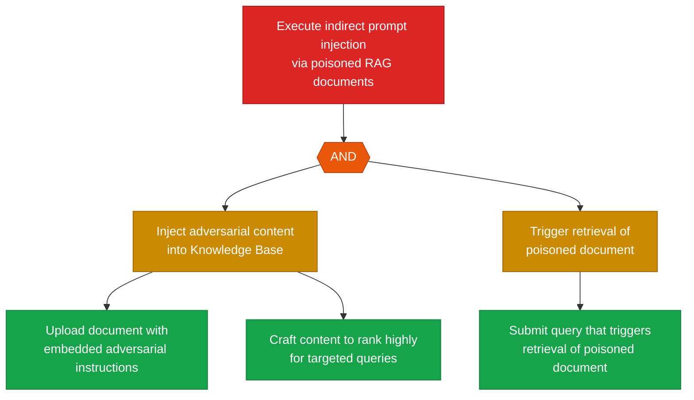

# Attack Tree: LLM-2 — Indirect Prompt Injection via RAG Pipeline

**Finding**: LLM-2 | **Component**: LLM Agent Orchestrator | **Risk Level**: High

```mermaid
flowchart TD
    LLM2_root["Execute indirect prompt injection\nvia poisoned RAG documents"]
    LLM2_and1{{"AND"}}
    LLM2_sub1["Inject adversarial content\ninto Knowledge Base"]
    LLM2_sub2["Trigger retrieval of\npoisoned document"]
    LLM2_leaf1["Upload document with\nembedded adversarial instructions"]
    LLM2_leaf2["Craft content to rank highly\nfor targeted queries"]
    LLM2_leaf3["Submit query that triggers\nretrieval of poisoned document"]
    LLM2_root --> LLM2_and1
    LLM2_and1 --> LLM2_sub1
    LLM2_and1 --> LLM2_sub2
    LLM2_sub1 --> LLM2_leaf1
    LLM2_sub1 --> LLM2_leaf2
    LLM2_sub2 --> LLM2_leaf3
    classDef goal fill:#DC2626,stroke:#991B1B,color:#FFFFFF
    classDef andGate fill:#EA580C,stroke:#C2410C,color:#FFFFFF
    classDef leaf fill:#16A34A,stroke:#15803D,color:#FFFFFF
    classDef sub fill:#CA8A04,stroke:#A16207,color:#FFFFFF
    class LLM2_root goal
    class LLM2_and1 andGate
    class LLM2_sub1,LLM2_sub2 sub
    class LLM2_leaf1,LLM2_leaf2,LLM2_leaf3 leaf
```
