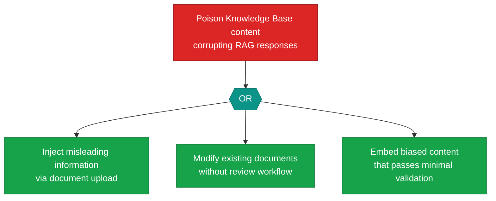

# Attack Tree: LLM-4 — Knowledge Base Content Poisoning

**Finding**: LLM-4 | **Component**: LLM Agent Orchestrator | **Risk Level**: High
**Correlation**: Part of CG-1. See also: T-4.

```mermaid
flowchart TD
    LLM4_root["Poison Knowledge Base content\ncorrupting RAG responses"]
    LLM4_or1{{"OR"}}
    LLM4_leaf1["Inject misleading information\nvia document upload"]
    LLM4_leaf2["Modify existing documents\nwithout review workflow"]
    LLM4_leaf3["Embed biased content\nthat passes minimal validation"]
    LLM4_root --> LLM4_or1
    LLM4_or1 --> LLM4_leaf1
    LLM4_or1 --> LLM4_leaf2
    LLM4_or1 --> LLM4_leaf3
    classDef goal fill:#DC2626,stroke:#991B1B,color:#FFFFFF
    classDef orGate fill:#0D9488,stroke:#0F766E,color:#FFFFFF
    classDef leaf fill:#16A34A,stroke:#15803D,color:#FFFFFF
    class LLM4_root goal
    class LLM4_or1 orGate
    class LLM4_leaf1,LLM4_leaf2,LLM4_leaf3 leaf
```
