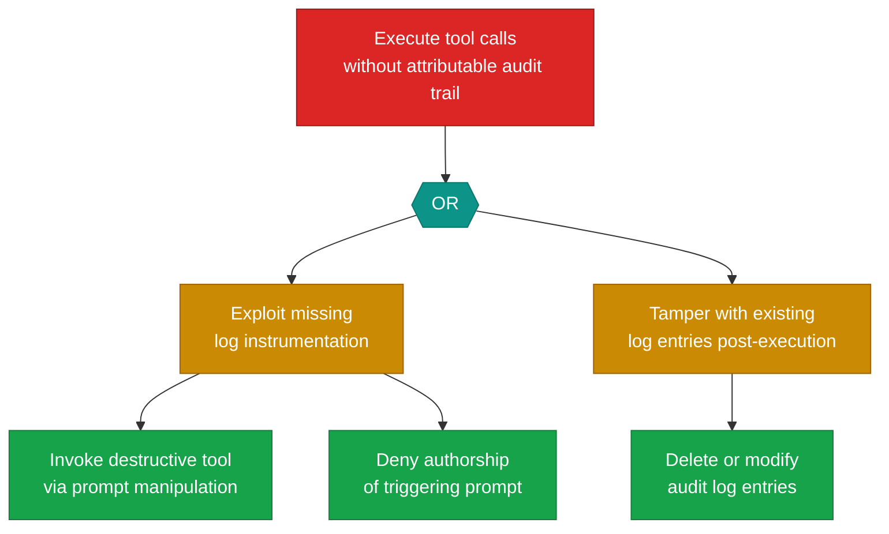

# Attack Tree: R-3 — Tool Dispatch Without Audit Trail

**Finding**: R-3 | **Component**: LLM Agent Orchestrator | **Risk Level**: Critical
**Correlation**: Part of CG-4. See also: AG-2.

```mermaid
flowchart TD
    R3_root["Execute tool calls\nwithout attributable audit trail"]
    R3_or1{{"OR"}}
    R3_sub1["Exploit missing\nlog instrumentation"]
    R3_sub2["Tamper with existing\nlog entries post-execution"]
    R3_leaf1["Invoke destructive tool\nvia prompt manipulation"]
    R3_leaf2["Deny authorship\nof triggering prompt"]
    R3_leaf3["Delete or modify\naudit log entries"]
    R3_root --> R3_or1
    R3_or1 --> R3_sub1
    R3_or1 --> R3_sub2
    R3_sub1 --> R3_leaf1
    R3_sub1 --> R3_leaf2
    R3_sub2 --> R3_leaf3
    classDef goal fill:#DC2626,stroke:#991B1B,color:#FFFFFF
    classDef orGate fill:#0D9488,stroke:#0F766E,color:#FFFFFF
    classDef leaf fill:#16A34A,stroke:#15803D,color:#FFFFFF
    classDef sub fill:#CA8A04,stroke:#A16207,color:#FFFFFF
    class R3_root goal
    class R3_or1 orGate
    class R3_sub1,R3_sub2 sub
    class R3_leaf1,R3_leaf2,R3_leaf3 leaf
```
