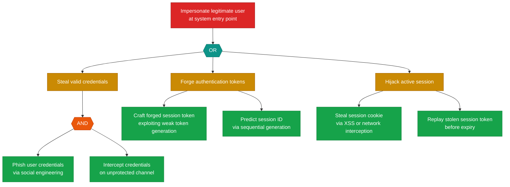

# Attack Tree: S-1 — User Identity Spoofing at Entry Point

**Finding**: S-1 | **Component**: User | **Risk Level**: Critical

```mermaid
flowchart TD
    S1_root["Impersonate legitimate user\nat system entry point"]
    S1_or1{{"OR"}}
    S1_sub1["Steal valid credentials"]
    S1_sub2["Forge authentication tokens"]
    S1_sub3["Hijack active session"]
    S1_and1{{"AND"}}
    S1_leaf1["Phish user credentials\nvia social engineering"]
    S1_leaf2["Intercept credentials\non unprotected channel"]
    S1_leaf3["Craft forged session token\nexploiting weak token generation"]
    S1_leaf4["Predict session ID\nvia sequential generation"]
    S1_leaf5["Steal session cookie\nvia XSS or network interception"]
    S1_leaf6["Replay stolen session token\nbefore expiry"]
    S1_root --> S1_or1
    S1_or1 --> S1_sub1
    S1_or1 --> S1_sub2
    S1_or1 --> S1_sub3
    S1_sub1 --> S1_and1
    S1_and1 --> S1_leaf1
    S1_and1 --> S1_leaf2
    S1_sub2 --> S1_leaf3
    S1_sub2 --> S1_leaf4
    S1_sub3 --> S1_leaf5
    S1_sub3 --> S1_leaf6
    classDef goal fill:#DC2626,stroke:#991B1B,color:#FFFFFF
    classDef andGate fill:#EA580C,stroke:#C2410C,color:#FFFFFF
    classDef orGate fill:#0D9488,stroke:#0F766E,color:#FFFFFF
    classDef leaf fill:#16A34A,stroke:#15803D,color:#FFFFFF
    classDef sub fill:#CA8A04,stroke:#A16207,color:#FFFFFF
    class S1_root goal
    class S1_or1 orGate
    class S1_and1 andGate
    class S1_sub1,S1_sub2,S1_sub3 sub
    class S1_leaf1,S1_leaf2,S1_leaf3,S1_leaf4,S1_leaf5,S1_leaf6 leaf
```
