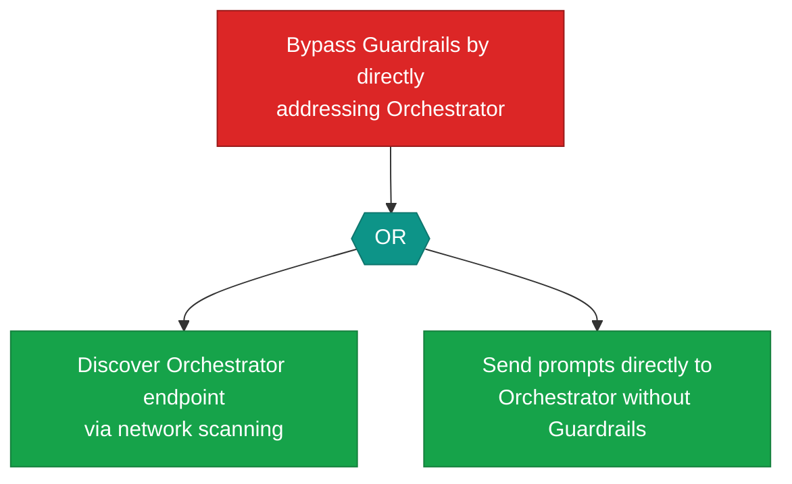

# Attack Tree: S-2 — Guardrails Bypass via Direct Orchestrator Access

**Finding**: S-2 | **Component**: Guardrails Service | **Risk Level**: High

```mermaid
flowchart TD
    S2_root["Bypass Guardrails by directly\naddressing Orchestrator"]
    S2_or1{{"OR"}}
    S2_leaf1["Discover Orchestrator endpoint\nvia network scanning"]
    S2_leaf2["Send prompts directly to\nOrchestrator without Guardrails"]
    S2_root --> S2_or1
    S2_or1 --> S2_leaf1
    S2_or1 --> S2_leaf2
    classDef goal fill:#DC2626,stroke:#991B1B,color:#FFFFFF
    classDef orGate fill:#0D9488,stroke:#0F766E,color:#FFFFFF
    classDef leaf fill:#16A34A,stroke:#15803D,color:#FFFFFF
    class S2_root goal
    class S2_or1 orGate
    class S2_leaf1,S2_leaf2 leaf
```
